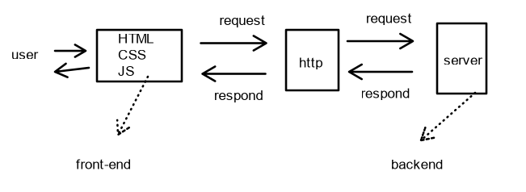
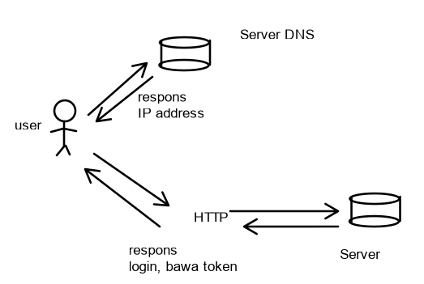
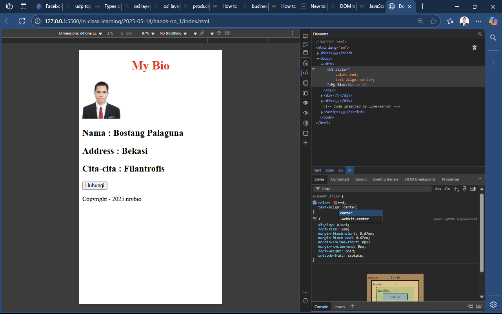
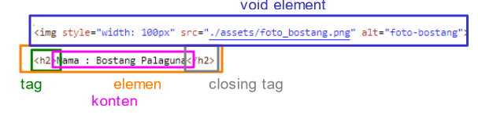
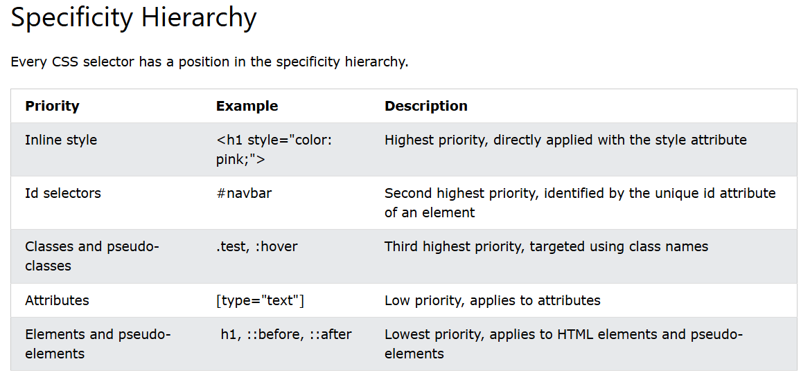
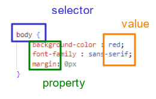

<!-- Dirangkum oleh : Bostang Palaguna -->
<!-- Mei 2025 -->

# Secure coding (DevSecOps)

> fasilitator : Febrian Aditya

## Front-end vs Back-end

### frontend

- dilihat user.
- ui/ux.
- translate design figma ke codingan.

### backend

- logika, proses data
- optimize server
- request/respond data
- DB

_Tech stack_:

- Front end
  - HTML, CSS, Bootstrap, Rreact, Angular, Vue
- Back end
  - docker, django, nodeJS, mongoDB, mySQL, expressjs, laravel, spring, typescript

client-side ➡️ tanggung jawab FE
server-side ➡️ BE.



**analogi** :
customer    ↔️    waiter staff   ↔️    cooking staff      ↔️   operation/purchasing
customer    ↔️   HTML,CSS,JS     ↔️     JS (server-side)  ↔️    database (e.g. mySQL)

➡️ : request
⬅️ : respond

## Struktur Web

jenis web :

1. statis
    konten tetap, tidak berubah
    e.g. landing page sederhana
2. dinamis
    konten berubah bdskan data / interaksi user.
    melibatkan server, database, API
    e.g. website berita.
3. interaktif
    dinamis + interaksi user dgn JS u/ respons input tanpa reload.

Komponen utama:



Browser: interaksi user, request & respons
Server: proses data & logic
DB : data

foldering standard:

```dir
./index.html
./script.js
./style.css
```

Struktur Doc HTML

```html
<!DOCTYPE html>
<html>...</html>
<head>...</head>
<body>..</body>
```

analogi :
    HTML : tulang
    JavaScript : otot
    CSS : kulit

Web developer workflow:

1. planning
2. setup project
3. coding
4. deployment
5. debugging
6. preview & testing


## Secure coding

poin penting HTML:

1. dibaca dari atas ke bawah dan kiri dan kanan
2. self-closing (tag elemen void) ➡️ `` , `<br>`

inspect element dari developer tools browser



>💡**rule of thumb** : dalam 1 html, `<h1>` hanya ada 1. ➡️ untuk meningkatkan search engine optimization



### atribut yang umum

- `id`  ➡️ identifikasi **unik** elemen.
- `class` ➡️ kelompok styling menggunakan css.
- `style` ➡️ styling langsung di elemen.
- `type` ➡️ u/ input tag.
- `src & alt` ➡️ u/ image tag,
- `href, target & rel` ➡️ untuk anchor tag, navigasi tautan, membuat di tab baru

## specificity table



```html
<form action="/action_page.php">
  Username: <input type="text" name="username" required>
  <input type="submit">
</form>
```

## styling css

CSS : _cascading style sheet_

- selector
- property
- value

```css
body {
    background-color : red;
    font-family : sans-serif;
    margin: 0px
}
```

### metode

- **inline**
    di satu elemen (tag pembuka)
- **internal**
    di satu file, di tag head, ada tag style
- **external**

### jenis selektor

- tag selector (`tag{}`)
- class selector (`.class{}`)
- id selector (`#id{}`)



## old-school styling

- old-school
- flexbox
- grid system

### position

- _static_
- _relative_
- _fixed_
- _absolute_
- _sticky_

- **margin** : sisi luar
- **padding** : sisi dalam

### value dan unit

- relative
  - `%` : relatif thd parent element
- absolut
  - `px`
  - `cm`
  - `mm`
  - `in`
  - `pt` (point = 1/72in)

## Bootstrap

_framework_ CSS / aturan siap pakai (class & komponen) u/ bantu developer lebih mudah penataan layout.

cara pakai:

- **LANGKAH 1** : add `cdn bootstrap` di tag `head`
- **LANGKAH 2** : add `cdn popper` di tag `body` sebelum closing tag `body`
- **LANGKAH 3** : coba _copy_ component yg ada di [bootstrap](https://getbootstrap.com/docs/5.3/getting-started/introduction/)

## grid theory

grid pada bootstrap : sistem layout 12 kolom

```struc
<------------------------------- span 12 ------------------------------>
<------------- span 6 ------------><------------- span 6 -------------->
<------- span 4 -------><------- span 4 -------><------- span 4 ------->
...
```

## Referensi Tambahan

- [perbedaan XML dan JSON](https://www.geeksforgeeks.org/difference-between-json-and-xml/)
- [single page application](https://www.geeksforgeeks.org/what-is-single-page-application/)
- [web versioning](https://www.geeksforgeeks.org/web-1-0-web-2-0-and-web-3-0-with-their-difference/)
- [product requirement document](https://www.projectmanager.com/blog/product-requirements-document)
- [business requirement document](https://www.projectmanager.com/blog/business-requirements-document)
- [html element reference](https://developer.mozilla.org/en-US/docs/Web/HTML/Reference/Elements)
- [CSS Flex](https://css-tricks.com/snippets/css/a-guide-to-flexbox/)
- [Bootstrap](https://getbootstrap.com/docs/5.3/getting-started/introduction/)
- [Latihan Flexbox](https://flexboxfroggy.com/)
- [Bootstrap tutorial W3school](https://www.w3schools.com/bootstrap5/bootstrap_colors.php )
- [CSS grid garden](https://cssgridgarden.com/)

---
[🏠Back to Course Lists](https://odp-bni-330.github.io/)
