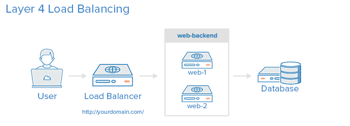

## Haproxy
HAProxy : High Availability Proxy
→ software TCP/HTTP Load Balancer and proxying 
Pada _enterprise_ seperti perbankan, load balancer yang digunakan bukan HAProxy, tetapi yang sudah bermerk seperti CISCO.

Access Control List (ACL)
    test some condition and perform an action (e.g. select a server, or block a request) based on the test result. 

Backend
    - which load balance algorithm to use
    - a list of servers and ports

Frontend
    - a set of IP addresses and a port (e.g. 10.1.1.7:80, *:443, etc.)
    - ACLs
    - `use_backend` rules

Layer 4 (Transport) Load Balancing

