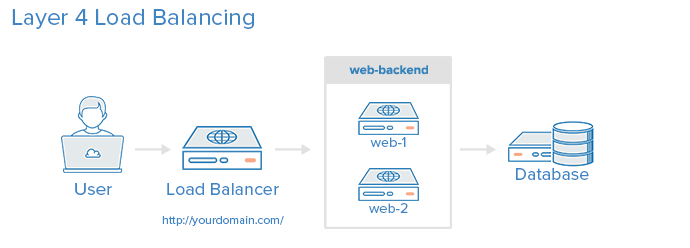
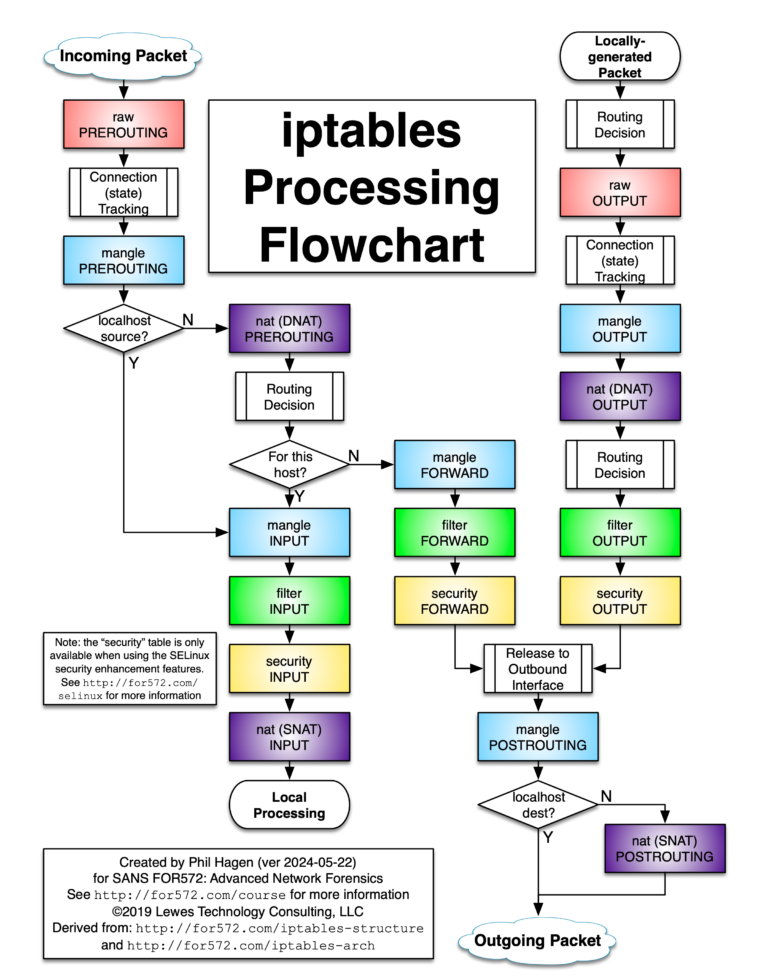
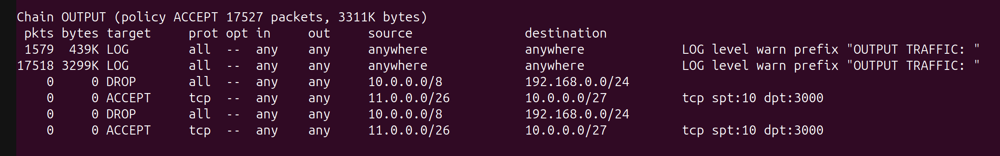
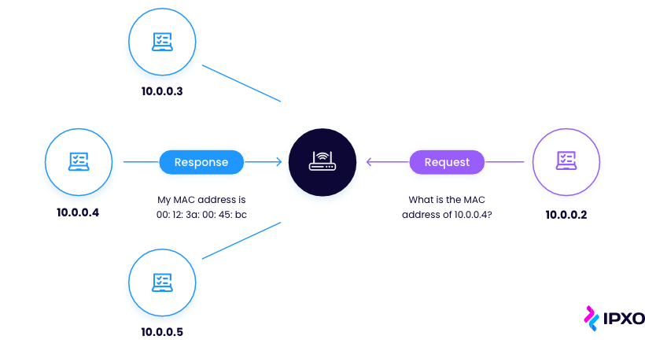
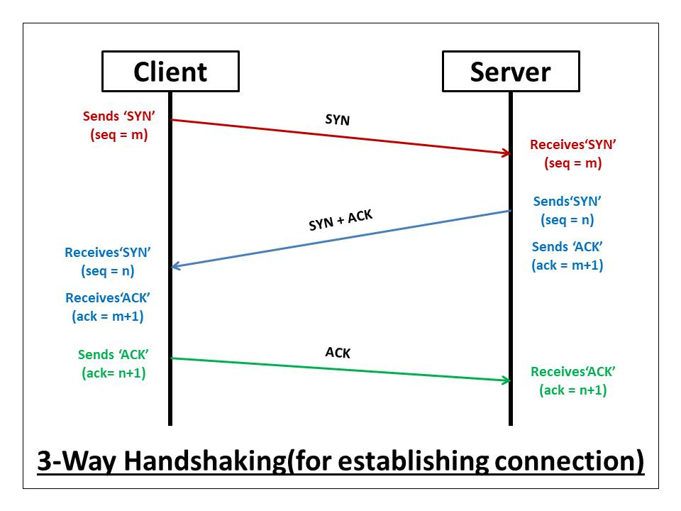
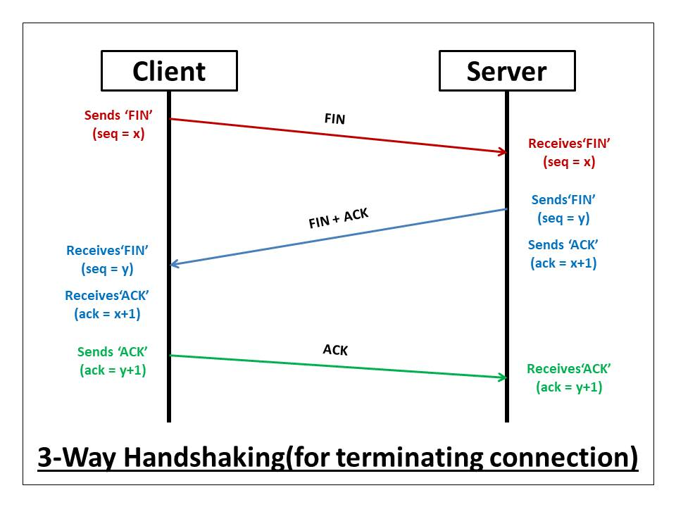
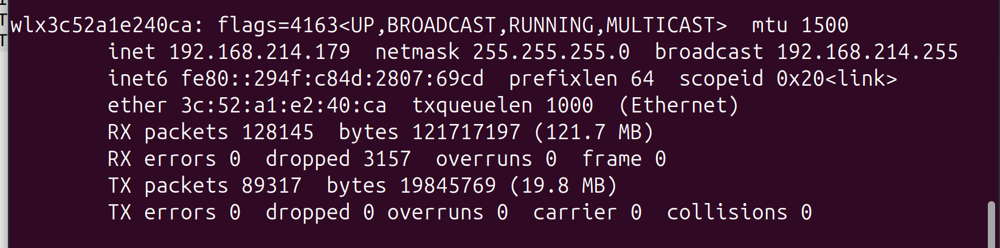
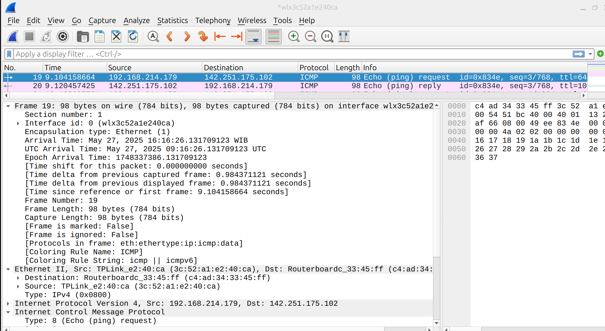
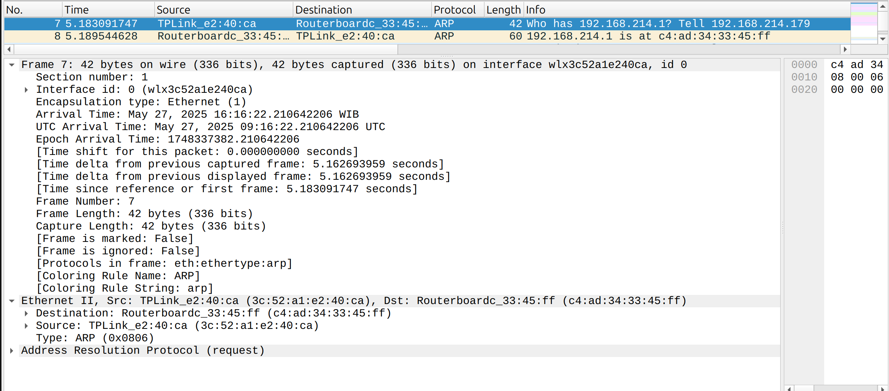
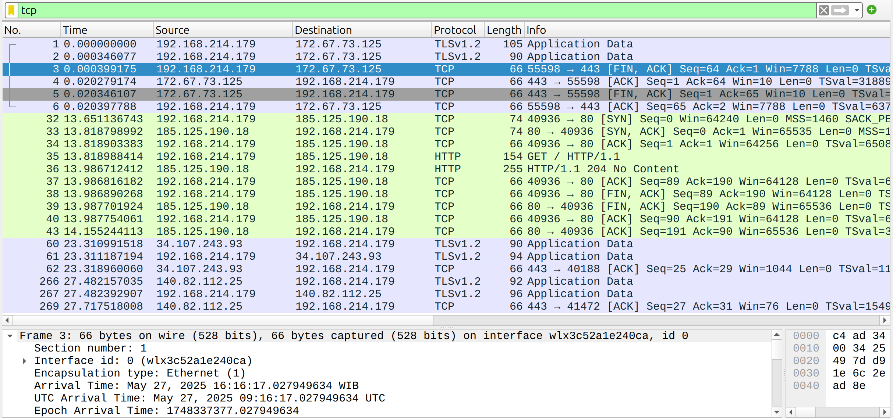

# Security
## Haproxy
HAProxy : High Availability Proxy
→ software TCP/HTTP Load Balancer and proxying 
Pada _enterprise_ seperti perbankan, load balancer yang digunakan bukan HAProxy, tetapi yang sudah bermerk seperti CISCO.

Access Control List (ACL)
    test some condition and perform an action (e.g. select a server, or block a request) based on the test result. 

Backend
    - which load balance algorithm to use
    - a list of servers and ports

Frontend
    - a set of IP addresses and a port (e.g. 10.1.1.7:80, *:443, etc.)
    - ACLs
    - `use_backend` rules


Layer 4 (Transport) Load Balancing



## Firewall Fundamentals

Firewall : sistem keamanan yg kontrol & pantau _network traffic_.

Tipe:
- Network-based vs host-based
    host-based → hanya lindungi satu buah komputer
- stateful vs stateless
    stateful → melacak _return value_

## `iptables`
- Command-line utility di LINUX
- jembatan antara kernel netfilter framework
- mengendalikan _packet filtering_ dan _NAT rules_.
- default firewall di LINUX.

`packet` diberi `target`, masuk dengan `rule`, berupa `chain` atau:
- `ACCEPT`
- `DROP`
- `RETURN`


NAT : network address translation
    -SNAT : source NAT → menyawarkan IP pengirim
    -DNAT : destination NAT → menyawarkan IP penerimas

**SNAT**
- asli:
`10.0.0.0.1` → `192.168.0.0.1`
- wireshark:
`x.x.x.x.x` → `192.168.0.0.1`

**DNAT**
- asli:
`10.0.0.0.1` → `192.168.0.0.1`
- wireshark:
`10.0.0.0.1` → `x.x.x.x.x`

#### `iptables` Tables
- `filter` : _default_.untuk connection tracking. _stateful_
- `nat` : _port forwarding_
- `mangle` : _packet alteration_ : QoS, TTL.
- `raw` : _stateless_

PAT : port address translation → SPAT, DPAT.

#### `iptables` Chain
→ serangkaian aturan yang akan memfilter paket data masuk dan keluar.
- `PREROUTING`
- `INPUT` : paket masuk sistem
- `OUTPUT` : paket dikirim dari sistem
- `FORWARD` : paket melewati sistem
- `POSTROUTING`

### Aturan Sintaks Dasar
```bash
iptables -A <CHAIN> -s <SOURCE> -d <DESTINATION> -j <ACTION>
    # -A : append aturan ke chain OUTPUT (paket keluar dari host)
    # -s : source IP
    # -d : destination IP
    # -j : jump ke target `DROP` : paket akan dibuang diam2.
```
contoh:
```bash
iptables -A OUTPUT -s 10.0.0.0/8 -d 192.168.0.0/24 -j DROP
    # hanya berlaku untuk paket yg berasal dari 10.0.0.0 sampai 10.255.255.255
    # hanya berlaku untuk paket yang menuju 192.168.0.0 sampai 192.168.0.255
# Jika server menjalankan proses dengan IP 10.0.0.5 dan mencoba mengakses IP 192.168.0.100, maka aturan ini akan memblokir akses tersebut.
```


contoh:
```bash
iptables -A INPUT -p tcp --dport 22 -j ACCEPT
```
penjelasan:
- `-A INPUT` : append to `INPUT` chain
- `p tcp` : match TCP packet.
- `--dport 22` : destination port 22 (SSH)
- `-j ACCEPT` : accept packet

## IP tables processing flowchart



`iptables` jika ketemu satu rule, maka akan berhenti, tidak melihat ke bawah lagi. namun `ip route` terus melihat ke bawah. (menemukan _longest prefix length_).

berbeda lagi dengan _CISCO routing table_. Menggunakan _default gateway_ apabila tidak menemukan _prefix length_ terpendek.


# LANGKAH 1 :Install pre-requisities  

```bash
sudo su
docker pull ghcr.io/hendram/bookworm-iptables
```

# LANGKAH 2 : Jalankan Docker images
```bash
docker run -it -d ghcr.io/hendram/bookworm-iptables bash

```

---

```bash
iptables -t nat -nvL
```

melakukan perubahan ToS / mark
```bash
iptables -t mangle -nvL
```

**Task** :
1. setup _rules_ untuk source IP `10.0.0.0/8` ke `192.168.0.0/24` untuk di-`DROP`.
```bash
sudo iptables -A OUTPUT -s 10.0.0.0/8 -d 192.168.0.0/24 -j DROP
```

2. setup _rules_ untuk source IP `11.0.0.3/26` `port 10` ke `10.0.0.8/27` `port 3000` untuk di-`ALLOW`.
```bash
sudo iptables -A OUTPUT -p tcp -s 11.0.0.3/26 --sport 10 -d 10.0.0.8/27 --dport 3000 -j ACCEPT
    # -A OUTPUT : menangani paket yang dikirim dari mesin lokal
    # -p tcp : aturan hanya untuk TCP
    # -s 11.0.0.3/26 : aturan berlaku untuk sumber IP 11.0.0.0 sampai 11.0.0.63
    # --sport 10 : berlaku untuk paket TCP dengan source port = 10
    # -d 10.0.0.8/27 : mencakup IP 10.0.0.8 hingga 10.0.0.39
    # --dport 3000 : port tujuan = 3000
    # -j ACCEPT : jika semua rule terpenuhi, maka paket DIPERBOLEHKAN keluar sistem

```

3. setup _rules_ untuk melakukan log bagi tiap traffic
```bash
sudo iptables -I INPUT -j LOG --log-prefix "INPUT TRAFFIC: " --log-level 4
sudo iptables -I OUTPUT -j LOG --log-prefix "OUTPUT TRAFFIC: " --log-level 4
sudo iptables -I FORWARD -j LOG --log-prefix "FORWARD TRAFFIC: " --log-level 4

# sintaks umum:
    # sudo iptables -I <CHAIN> -j LOG --log-prefix "<TEXT>" --log-level <LEVEL>
        # -I : insert rule
        # <CHAIN> : `INPUT`, `OUTPUT`, `FORWARD`
        # -j LOG : Log paket
        # --log-prefix : tambahan teks di awa llog
        # --log-level : level syslog : 4 = warning
```

4. analisis lewat mana saja traffic tersebut.
```bash
ip route    # untuk memeriksa default-gateway dan interface
sudo ip rule add from 11.0.0.3/32 table 100 # routing policy : arahkan trafic 11.0.0.3/32 agar pakai tabel routing nomor 100
sudo ip route add default via 192.168.214.1 dev wlx3c52a1e240ca table 100 # tambah default route ke routing table 100
    # sintaks : `ip route add default via <gateway-ip> dev <interface> table 100`
    # 192.168.214.1 : default-gateway  -> cek dari `ip route`
    # wlx3c52a1e240ca : interface -> cek dari `ip route`

ip route show table 100                 # Lihat isi routing table 100.
traceroute 10.0.0.8                     # Lihat jalur paket dari host ke 10.0.0.8 
ip route get 10.0.0.8 from 11.0.0.3     # Lihat jalur paket dari 11.0.0.3 ke 10.0.0.8
```

Gunakan `iptables-save` untuk melihat semua aturan saat ini.

Gunakan `iptables -L -v` untuk melihat statistik jumlah paket per aturan.

Log akan masuk ke `/var/log/kern.log` atau `/var/log/syslog` tergantung konfigurasi `rsyslog`.



# Catatan Tambahan

1. Beberapa command network yang mungkin berguna
```bash
ip addr
ip route
ip rule
ifconfig
traceroute [IP_destination]
```

2. penjelasan subnet mask

`/27` → `11111111.11111111.11111111.11100000` = `255.255.255.224`
`224`→`11100000` : 3 bit terakhir untuk host. #host = 2^5 = 32 IP.


subnet block : `10.0.0.32/27`  →  range IP : `10.0.0.32 – 10.0.0.63`

3.
`iptables-save` : ekspor seluruh aturan iptables saat ini dalam bentuk format yang bisa diimpor kembali.

contoh pemakaian:
```bash
sudo iptables-save > /etc/iptables/rules.v4 #simpan rules ke file

sudo iptables-restore < /etc/iptables/rules.v4 #restore rule
```

`iptables -L -v` : tampilkan daftar _rules_ yang aktif dalam format yang _human-readable_.
`-v` : verbose


# Address Resolution Protocol



Switch memiliki `MAC Address Table` yang memuat daftar MAC address devais (PC/router) yang terhubung dengannya.

`Wireshark` bisa digunakan untuk meng-_capture_ MAC address dalam ARP message.

TCP -> berat / untuk koneksi lama karena membutuhkan _three-way handshake_. Misal mengirim 5 _packet_. Apabila _packet_ keempat gagal sampai, maka _packet_ ke-5 akan menolak (tidak memberi _acknowledge_ (ACK)).





Contoh menggunakan wireshark:
1. pada terminal, lakukan : 
```bash
ping google.com
```

2. cek IP

dalam kasus ini : `192.168.214.179`

3. pada wireshark, amati interface `wifi`:
ICMP protocol : ping


ARP protocol : menentukan MAC address



TCP protocol : amati SYN-ACK, FIN-ACK (three way handshake)


menggunakan filter:
```
ip.addr == xxx.xxx.xxx.xxx
```
