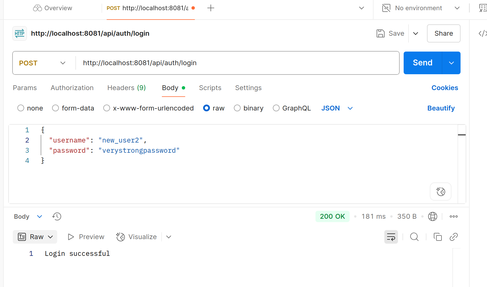

# DevSecOps
## Database Integration API & API Versioning Implementation

Frontend →  Interface
Backend  →  Business Process

Framework pengembangan API: SpringBoot
Database yang digunakan : OracleSQL → banyak digunakan _enterprise_

### Intro to SpringBoot
- open-source
- framework Java
- simplifikasi pengembangan aplikasi yang _production-ready_
- fitur:
    - auto-configuration → _developer_ tidak perlu ribet tahap setup.
    - embedded server → Tomcat / Jetty
    - spring boot starter → pre-configured dependency
    - spring boot CLI
    - spring actuator

### Intro to OracleSQL
komponen dari OracleDB. _enterprise grade_.
- fitur :
    - ACID compliance → memastikan konsistensi & keandalan data.
    - advanced indexing → pencarian yang cepat : B-tree, bitmap, function-based indexes.
    - partitioning → untuk performa _query_ yang lebih baik dibanding dataset lain.
    - concurrency control → menangani banyak user yang akses data bersamaan
    - security features → role-based access, encryption, auditing.

kelebihan : data bisa dipecah-pecah sehingga hemat storage.

perbandingan dengan postgreSQL?
oracle → lebih secure ; postgre → tipe data lebih banyak.
oracle secara branding lebih unggul.

### Database Integration Architecture
**Komponen**:
- Spring Boot REST API
- Oracle SQL Database
- JDBC + Spring Data JPA → ORM, tdk perlu pakai _native query_
- Connection Pooling (HikariCP) → 2 proses bisa jalan parallel.

**Architecture Diagram**:
client → spring Boot Rest API → Service Layer → Repository Interface → JDBC/HikariCP connection → OracleDB


- `@Entity` → Entitas suatu fitur
- `@Repository` → block code untuk urus DB (findBy)
- `@Service` → service logic

#### Query Optimzation Techniques
indexing

#### API Versioning
tanpa harus bikin _engine_ baru.


## Cara install OracleDB di docker (Menggunakan LINUX)

<!-- Cara ini sesat -> image hilang setelah restart -->
<!-- 
- **Langkah 0** : download rpm script 
di [Website resmi Oracle Database XE](https://www.oracle.com/database/technologies/xe-downloads.html)

- **Langkah 1** : clone OracleDB docker image script
```bash
git clone https://github.com/oracle/docker-images.git
cd docker-images/OracleDatabase/SingleInstance/dockerfiles
```

- **Langkah 2** : salin rpm script ke folder sesuai
```bash
cp ~/Downloads/oracle-database-xe-21c-1.0-1.ol8.x86_64.rpm ./21.3.0/
```

- **Langkah 3** : Build docker image
```bash
./buildDockerImage.sh -x -v 21.3.0
```
-->

[Oracle XE Docker Docker image](https://hub.docker.com/r/gvenzl/oracle-xe)

- **Langkah 1** : Pull image docker
```bash
docker pull gvenzl/oracle-xe
```

- **Langkah 2** : Start container
```
docker run --name=oracle-xe -d -p 1521:1521 -e ORACLE_PASSWORD=<your password> gvenzl/oracle-xe
```

- **Langkah 3** :Docker Execute
```bash
docker exec -it oracle-xe sqlplus system/<your password>@localhost:1521/XEPDB1
```

- Menampilkan log dan status container
```bash
docker logs -f oracle-xe-21c
```
> ini akan terus berjalan tanpa henti. Jadi buka tab baru untuk melakukan aktivitas lain.

## (Hands-on 1) Connecting to OracleSQL

> Pre-requisites : sudah install docker dan setup container

- **Langkah (-1)** : jalankan docker 
```bash
docker run -d --name oracle-xe-21c \
  -p 1521:1521 -p 5500:5500 \
  -e ORACLE_PWD=Oracle123 \
  oracle/database:21.3.0-xe
```

- **Langkah 0** : Buka terminal dan aktifkan container yang mengandung OracleDB
```bash
sudo su
docker ps
docker exec -it [nama_images]
```


- **Langkah 1** : Login sebagai admin
```bash
docker exec -it oracle-xe-21c sqlplus system/Oracle123@XEPDB1
```

> ⚠️ Demi alasan _security_, tidak disarankan untuk membuat tabel sebagai admin. Sebaiknya buat user baru lalu beri kredensial.

- **Langkah 2** : Membuat Oracle User 
```sql
-- Membuat Username dan paassword
CREATE USER auth_user IDENTIFIED BY password123;
GRANT CONNECT, RESOURCE TO auth_user;

-- memberikan kewenangan tak terbatas (supaya nanti app bisa POST)
ALTER USER auth_user QUOTA UNLIMITED ON USERS;
```

- **Langkah 3** : Login sebagai user yang baru dibuat 
```bash
docker exec -it oracle-xe-21c sqlplus bostang/password@XEPDB1
```

- **Langkah 4** : Membuat tabel
```sql
-- Membuat tabel
CREATE TABLE users(
    username VARCHAR2(50) PRIMARY KEY,
    password_hash VARCHAR2(255),
    role VARCHAR2(20)
);

-- Verifikasi bahwa tabel sudah ada
SELECT table_name FROM user_tables;
```

## Buat Projek Springboot

Terlampir di : `./handson/connect-oracle-db.zip`

## Testing

> dengan Postman
 
### Hasil Testing:
**Register user baru**


**Register user baru dengan credential existinguser**


**Cek database SQL setelah 2 user register**


**Login dengan Postman (password benar)**


**Login dengan Postman (password salah)**


## Catatan Tambahan:
- memberhentikan DB
```bash
#  syntax : docker stop [nama_image]
docker stop oracle-xe
```
- menyalakan kembali docker (mengandung OracleDB) yang sebelumnya sudah dimatikan.
```bash
docker ps -a            # menampilkan nama docker container (semua, termasuk yang in-active)

# menyalakan kembali docker tersebut
# syntax: docker start [nama_image] 
docker start oracle-xe

# menyalakan kembali servernya
docker exec -it oracle-xe sqlplus bostang/password@localhost:1521/XEPDB1
```