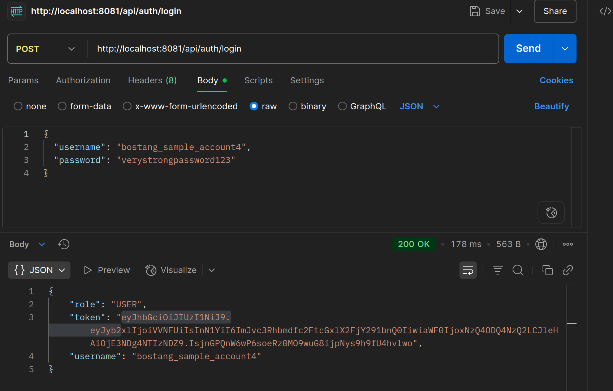

<!-- Dirangkum oleh : Bostang Palaguna -->
<!-- Juni 2025 -->

# API Security Testing

**API** (Application programming interface) : aturan / jembatan antar aplikasi _software_ berkomunikasi.

contoh : 
- Tokopedia pakai API untuk cek status pembayaran.
- Gojek pakai API untuk dapat peta dan informasi harga.

_mengapa API perlu diamankan?_ API bisa memuat data sensitif seperti personal user information, payment detail, private message.


**OWASP API Security Top 10**:
- API1:2023 - Broken Object Level Authorization
- API2:2023 - Broken Authentication
- API2:2023 - Broken Authentication
- API4:2023 - Unrestricted Resource Consumption
- API5:2023 - Broken Function Level Authorization
- API6:2023 - Unrestricted Access to Sensitive Business Flows
- API7:2023 - Server Side Request Forgery
- API8:2023 - Security Misconfiguration
- API9:2023 - Improper Inventory Management
- API10:2023 - Unsafe Consumption of APIs


## API1:2023 : BOLA
- exploit API endpoints that are vulnerable to broken object-level authorization by manipulating the ID of an object that is sent within the request

contoh:
1. `/shops/{shopName}/revenue_data.json`. Using another API endpoint, the attacker can get the list of all hosted shop names. With a simple script to manipulate the names in the list, replacing `{shopName}` in the URL, the attacker gains access to the sales data of thousands of e-commerce stores.

Pencegahan:
- mekanisme otorisasi yang berlandaskan user policy dan hierarchy
- lebih baik menggunakan GUID yang random dan tak terprediksi
- buat test untuk evaluasi kerentanan mekanisme otorisasi.

### Fuzz Testing
tools : 
- JMeter
- OWASP Zap (Zapproxy)

dapat melakukan simulasi seakan-akan yang login satu juta orang secara bersamaan.

**Excessive Data Exposure**
- attacker bisa analisis API response dgn tools seperti browser dev tools, ZAP, dll.
- failure of UU PDP compliance.

**Broken Authentication**
contoh penyerangan:
- brute force
- credential stuffing
    attacker menggunakan tools otomatis untuk mencoba ribuan kombinasi username/password

contoh kesalahan:
- credential yang lemah
- tidak ada _rate-limiting_ terhadap percobaan login
- menunjukkan session token di URL
- MFA tdk ada.

**Injection Attack**


# Demo Fuzz Testing
> 📁 File Projek terkait:
`/handson/connect-oracle-db-token/`
`/handson/zp_fuzz_test/`

**Langkah 0** : Jalankan server dan DB yang dibuat di day-11 (connect-oracle-DB)
```bash
# pindah ke folder project connect-oracle-DB, lalu:
./mvnw spring-boot:run      # menyalakan server

# Nyalakan container dan service OracleDB
docker start oracle-xe

# menyalakan kembali servernya
docker exec -it oracle-xe sqlplus bostang/password@localhost:1521/XEPDB1
```

**Langkah 1** : Atur proxy setting di Postman dan juga OWASP ZAP

contoh setting:
```
spring-boot : port 8080
owasp-zap : port 8081
postman : port 8081
```
```
spring-boot : port 8081
owasp-zap : port 8082
postman : port 8082
```


**Langkah 2** : hit API login dengan postman


lalu amati pada ZAP:


attack Fuzz:


Pada menu alert, OWASP Zap juga memberikan rekomendasi apa yang perlu diperbaiki:


# Challenge : Menambahkan token JWT
> 📁 File Projek terkait:
`/handson/connect-oracle-db-token/` → File saya
`/handson/spring-boot-oracle-db-token/` → File hasil _fork_ dari _repo_ Instruktur

Menggunakan token dan buat endpoint untuk identifikasinya.

- generate
- validate
- extract isi data di dalam token

## Implementasi
ada di : `/handson/connect-oracle-db-to-oracle-token`


## Pengujian
**Langkah 1**: Register


**Langkah 2**: Login


**Langkah 3**: Verifikasi
`/connect-oracle-db-token`


`/spring-boot-oralce-db-token`


# Logging & Monitoring

ELK Stack

- Elasticsearch : search & analytics engine
- Logstash : Log collector & processor
- Kibana : data visualization tool

→ memungkinkan kita untuk :
- mengumpulkan log dari berbagai sumber (API, server, DB)
- simpan & cari log dgn efisien
- visualisasikan log scr/ real time

## Hands-on Logging & Monitoring dengan ELK Search

> 📁 File Projek terkait: `/handson/connect-oracle-db-token-elk`

### Cara Menjalankan Server
1. Pindah ke direktori
2. Jalankan pada terminal:
```bash
./mvnw spring-boot:run
```

### Cara Menghidupkan DB
```bash
docker ps -a            # menampilkan nama docker container (semua, termasuk yang in-active)

# menyalakan kembali docker tersebut
# syntax: docker start [nama_image] 
docker start oracle-xe

# menyalakan kembali servernya
docker exec -it oracle-xe sqlplus bostang/password@localhost:1521/XEPDB1
```

### Cara Monitor Log dengan ELK Stack

### Cara Hubungkan Aplikasi Springboot dengan ELK Stack
**Langkah 1** : Tambah dependency ke `pom.xml`:
```xml
<!-- Logstash Logback Encoder -->
<dependency>
    <groupId>net.logstash.logback</groupId>
    <artifactId>logstash-logback-encoder</artifactId>
    <version>7.4</version>
</dependency>
```

**Langkah 2**: Buat konfigurasi Logback
buat di `/resources/logback-spring.xml`:

```xml
<?xml version="1.0" encoding="UTF-8"?>
<configuration>
    <include resource="org/springframework/boot/logging/logback/defaults.xml"/>
    
    <springProperty scope="context" name="appName" source="spring.application.name"/>
    
    <!-- Console Appender -->
    <appender name="CONSOLE" class="ch.qos.logback.core.ConsoleAppender">
        <encoder>
            <pattern>%d{yyyy-MM-dd HH:mm:ss} [%thread] %-5level %logger{36} - %msg%n</pattern>
        </encoder>
    </appender>
    
    <!-- Logstash Appender -->
    <appender name="LOGSTASH" class="net.logstash.logback.appender.LogstashTcpSocketAppender">
        <destination>localhost:5000</destination> <!-- Ganti dengan alamat Logstash Anda -->
        <encoder class="net.logstash.logback.encoder.LogstashEncoder">
            <customFields>{"appname":"${appName}", "environment":"development"}</customFields>
        </encoder>
    </appender>
    
    <root level="INFO">
        <appender-ref ref="CONSOLE"/>
        <appender-ref ref="LOGSTASH"/>
    </root>
    
    <!-- Log SQL queries -->
    <logger name="org.hibernate.SQL" level="DEBUG"/>
    <logger name="org.hibernate.type.descriptor.sql.BasicBinder" level="TRACE"/>
</configuration>
```

**Langkah 3** : Tambahkan bagian logging di controller
`/controller/AuthController.java`
```java
import org.slf4j.Logger;
import org.slf4j.LoggerFactory;

@RestController
@RequestMapping("/api/auth")
public class AuthController {
    
    /* TAMBAHKAN INI */
    private static final Logger logger = LoggerFactory.getLogger(AuthController.class);
    
    ...

    logger.info("LOGIN_ATTEMPT for user {}", username);
    ...

    logger.warn("Login failed - invalid credentials for username: {}", username);

}
/*** LENGKAPNYA LANGSUNG CEK DI connect-oracle-db-token-elk bagian AuthController.java` ***/
```

### Menghidupkan ELK Stack (jalan di Docker)
**Langkah 1**: Buat `docker-compose-elk.yml`
```yml
version: '3.8'

services:
  elasticsearch:
    image: docker.elastic.co/elasticsearch/elasticsearch:8.12.0
    container_name: elasticsearch
    environment:
      - discovery.type=single-node
      - ES_JAVA_OPTS=-Xms1g -Xmx1g
      - xpack.security.enabled=false
    volumes:
      - es_data:/usr/share/elasticsearch/data
    ports:
      - "9200:9200"
    networks:
      - elk

  logstash:
    image: docker.elastic.co/logstash/logstash:8.12.0
    container_name: logstash
    volumes:
      - ./logstash-config:/usr/share/logstash/pipeline/
    ports:
      - "5000:5000"
    environment:
      - LS_JAVA_OPTS=-Xms512m -Xmx512m
    depends_on:
      - elasticsearch
    networks:
      - elk

  kibana:
    image: docker.elastic.co/kibana/kibana:8.12.0
    container_name: kibana
    ports:
      - "5601:5601"
    depends_on:
      - elasticsearch
    networks:
      - elk

volumes:
  es_data:

networks:
  elk:
    driver: bridge
```

**Langkah 2**: Buat Konfigurasi Logstash
```bash
mkdir logstash-config
```

Isi `logstash-config/logstash.conf`:
```conf
input {
  tcp {
    port => 5000
    codec => json_lines
  }
}

filter {
  # Parsing khusus untuk log login/register
  if [message] =~ "login" {
    grok {
      match => { "message" => ".*Login %{WORD:action} for username: %{USERNAME:username}.*" }
      add_tag => [ "auth_log" ]
    }
  }
  
  if [message] =~ "register" {
    grok {
      match => { "message" => ".*Register %{WORD:action} for username: %{USERNAME:username}.*" }
      add_tag => [ "auth_log" ]
    }
  }
}

output {
  elasticsearch {
    hosts => ["http://elasticsearch:9200"]
    index => "springboot-logs-%{+YYYY.MM.dd}"
  }
  
  # Untuk debugging (opsional)
  stdout {
    codec => rubydebug
  }
}
```

**Langkah 3** : Jalankan ELK stack
```bash
docker-compose -f docker-compose-elk.yml up
```

> Catatan : ketika pertama kali jalan, butuh minimal 2 menit agar ELK bisa berjalan mulus sehingga localhost:5601 dapat diakses

**Langkah 4** : Buat Dashboard Kibana
- **4.1** : Akses `http://localhost:5601`
- **4.2** : Nyalakan aplikasi springboot (pada terminal : `./mvnw spring-boot:run`) 
- **4.2**: Buat Index Pattern 
pattern : `springboot-logs-*` , pilih `@Timestamp`, pilih `Create Index pattern`

- **4.3** : Test kirim request lewat Postman lalu amati log di `http://localhost:5601/app/discover`

**Pengujian** :
`localhost:9200` → Elastic Search
`localhost:5601` → Kibana


#### Catatan Tambahan:
Untuk memberhentikan ELK stack yang jalan di docker:
```bash
docker-compose -f docker-compose-elk.yml down
# atau
docker compose down -f docker-compose-elk.yml
```

---
[🏠Back to Course Lists](https://odp-bni-330.github.io/)
