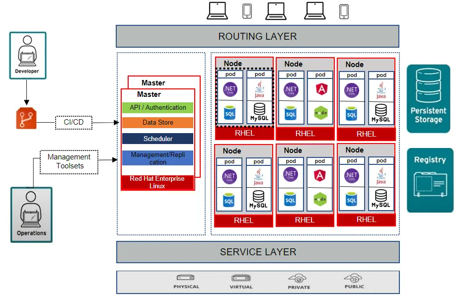

<!-- Dirangkum oleh : Bostang Palaguna -->
<!-- Juni 2025 -->

# Introduction to OpenShift

Platform Kubernetes container kelas _enterprise_.
→ _build_, _deploy_, _manage_ aplikasi dalam kontainer.

- berbasis Kubernetes
- PaaS
- include : RBAC, SCC, TLS
- support : S2I, pipelines, GitOps

S2I : dari repo github bisa di-"paten"kan jadi _image_.

Docker : untuk menampung 1 _container_
Kubernetes : untuk orkestrasi banyak _container_

**Mengapa menggunakan Openshift?**
- aman
    → RBAC, SCC, _image scanning_, _network policies_
- ↑ produktivitas developer
    → CI/CD pipeline, GitOps, S2I, OpenShift Dev Spaces
- tools operasional kelas _enterprise_
    → monitoring & logging; metrics, alert, dashboard; self-healing
- siap dgn hybrid & multi-cloud
    → public cloud, on-premise/private DC, edge computing

**Arsitektur OpenShift Cluster**
komponen:
- control plane / master nodes
    jalankan API server, scheduler, controller manager.
- worker nodes

- ingress router (HAProxy-based)
- authentication & authorization modules



# Hands-on OpenShift

- Akses [Developer SandBox](https://developers.redhat.com/developer-sandbox)
- Buat akun
- Launch Openshift


- Buat resource baru (dari git)


Contoh resources (pod) yang sudah running:


Pengujian kirim request dengan postman :


## Langkah menggunakan OpenShift Client (`oc`) terminal
1. download [openshift client terminal](https://developers.redhat.com/learning/learn:openshift:download-and-install-red-hat-openshift-cli/resource/resources:download-and-install-oc)


2. copy login command dari dashboard openshift virtual sandbox


maka akan diperoleh token yang nantinya akan dimasukkan ke terminal


3. masukkan token pada `oc` terminal yang sudah di-download.
```bash
oc login --token=[TOKEN] --server=https://api.rm1.0a51.p1.openshiftapps.com:6443
```


4. cek versi `oc` dan juga lihat daftar pod yang ada
```bash
# Cek versi openshift client
oc version

# mendapatkan pod yang ada
oc get pods

```

Salah satu fitur dari Kubernetes (yang juga ada di OpenShift) adalah _autoscaling_ yaitu jumlah pod bisa diperbanyak sesuai dengan _load_ yang meningkat.

# Hands-on Openshift (project sebelumnya dengan PostgreSQL)
**Langkah 1** : Buat folder `.yaml` untuk PostgreSQL. Kemudian buat file-filenya.


pindah ke direktori proyek

**Langkah 2** : Apply konfigurasi:
```bash
oc apply -f openshift/postgresql/postgres-pvc.yaml
oc apply -f openshift/postgresql/postgres-deployment.yaml
oc apply -f openshift/postgresql/postgres-service.yaml
oc apply -f openshift/adminer/adminer-deployment.yaml
oc apply -f openshift/adminer/adminer-service.yaml
oc apply -f openshift/adminer/adminer-route.yaml

# memberi perintah ke openshift bahwa DB bisa diakses dari luar
oc expose svc/postgres-db
```

**Langkah 3**: Login ke Pod Adminer
setelah itu, kembali ke OpenShift sandbox (web)

perhatikan bahwa sekarang sudah terdapat pod postgres-db dan adminer


klik link yang ada di `adminer`. Maka akan diarahkan ke login database.

`Server`, `Username`, dan `Password` disesuaikan dari `postgres-deployment.yaml`. `Database` dikosongkan.


tampilan awal setelah login:

---
**Langkah 4** : Buat database `springboot-app-db` dan tabel `users`


**Langkah 5** : Modifikasi aplikasi springboot lalu jalankan
- tambahkan dependency di `pom.xml`

```xml
<dependency>
    <groupId>org.springframework.boot</groupId>
    <artifactId>spring-boot-starter-data-jpa</artifactId>
</dependency>
<dependency>
    <groupId>org.postgresql</groupId>
    <artifactId>postgresql</artifactId>
    <scope>runtime</scope>
</dependency>
```

- modifikasi sourcecode Spring-boot (controller, service, model)

> to-do on June 4th 2025

- clean install
```bash
./mvnw clean install -DskipTests
```

# Catatan Tambahan
## Membuat Projek Git 
**Langkah 1** : Buka terminal dan navigasi ke tempat folder proyek git mau dibuat

**Langkah 2** : Inisiasi repo
```bash
# Inisiasi local repo
git init
# Menambahkan semua file di direktori saat ini ke git repo
git add .

# menambahkan pesan commit (sebelum push)
git commit -m "saya melakukan commit"

# membuat branch main
git branch -M main

# membuat koneksi ke remote repo
git remote add origin https://github.com/user/nama-projek.git

# melakukan push
git push -u origin main
```


## Kubernetes dan Docker


contoh deklarasi k8s pod dengan 2 container (`.yaml` file):
```yaml
apiVersion: v1
kind: Pod
metadata:
    name: Tomcat
spec:
    containers:
####### container 1 #######
    - name: Tomcat
    image: tomcat: 8.0
    ports:
    containerPort: 7500
    imagePullPolicy: Always
###########################
####### container 2 #######
    -name: Database
    Image: mongoDB
    Ports:
    containerPort: 7501
    imagePullPolicy: Always
###########################
```


`kubectl` : kubernetes command line tool.
```bash
# create pod
kubectl create -f [yaml-file]

# run pod
kubectl run [pod-name] --image=[container-image] --restart=Never

# apply pod
kubectl apply -f mypod.yaml

# list pod
kubectl get pods

# delete pod
kubectl delete pod mypod

# view pod log
kubectl logs [pod-name]
```


# Daftar Singkatan
- PaaS : _platform as a service_
- RBAC : _role based access control_
- SCC : _security context constraints_
- TLS : _transport layer security_
- S2I : _source-to-image_

---
[🏠Back to Course Lists](https://odp-bni-330.github.io/)
