# Deployment Fundamentals

> Deployment Concepts, Pods, ReplicaSets, DeploymentConfigs

membangun _pipeline_ / membangun aturan _deployment_

_deployment_ : kirim aplikasi ke _environment_ ter-kontainer-isasi scr/ terotomasi, _scalable_, _resilient_.

**tujuan**:
- aplikasi berjalan sbg container di dalam pod
- _scalability_
- _version management_ : upgrade/rollback.
- integrasi dengan pipeline CI/CD

**siklus hidup**:
- spek aplikasi dalam `.yaml` atau `oc new-app`
- OpenShift schedules
- monitor health & restart pod gagal
- update pods scr bertahap

## pod
unit _deployable_ terkecil dan paling fundamental di OpenShift & Kubernetes.
- merepresentasikan 1 _instance_ dari proses yg berjalan di _cluster_.

**kandungan**:
- ≥1 container
- network namespace
- storage volume
- configuration metadata : label, anotasi

**cara kerja**:
- semua kontainer di dalam 1 pod berbagi 1 _network interface_.
- pods bersifat _ephemeral_ : bisa dibuat, dihapus, dibuat ulang
- di-_manage_ otomatis dgn _controller_ sperti DeploymentConfigs.

**analogi**: ruangan hotel di mana tamu bisa tinggal bersama

`ReplicaSets` : salah satu _controller_ kubernetes u/ atur replikasi otomatis atau jumlah tertentu.

`DeploymentConfigs` 

# Hands-on (Lanjutan kemarin)
**Langkah 0** : Naikkan jumlah pod dari 0 ke 1 untuk `postgres-db` dan `adminer`

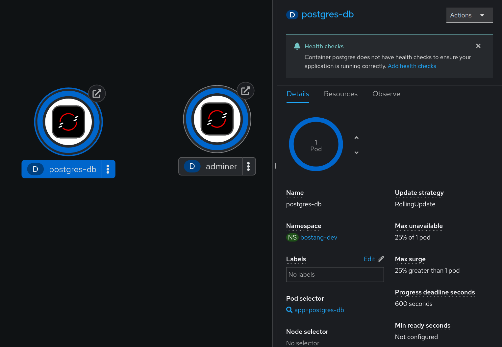

**Langkah 1** : Update sourcecode Spring-boot lalu jalankan

```bash
# Clean install
./mvnw clean install -DskipTests
    # -DskipTests dalam kasus ini wajib karena DB hanya bisa diakses dari dalam OpenShift, sedangkan local belum bisa akses

# Buat ke Package
./mvnw package -DskipTests # bungkus ke .jar
```

**Langkah 2** : Push update Repo
```bash
git status
git add .
git commit -m "menambahkan kode untuk mengintegrasikan postgreSQL dengan Spring-Boot di OpenShift"
git push origin master
```

**langkah 3** : Relaunch service OpenShift
1. Buka openshift dashboard, delete service springboot

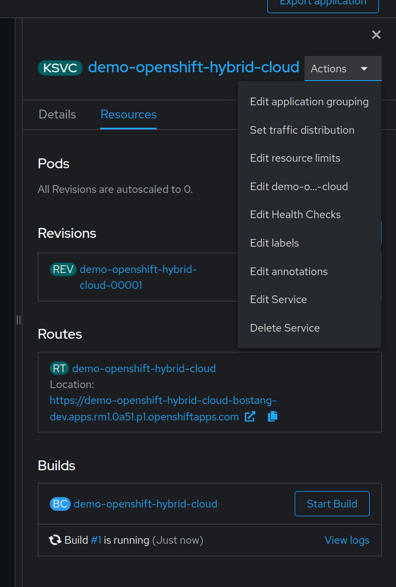

2. `Import from Git` lagi.

3. Tunggu beberapa saat sampai pada resources _ready_ (ditandai dengan pada Topology muncul)

4. Coba testing dengan postman

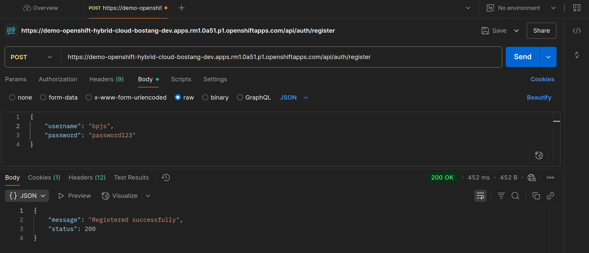

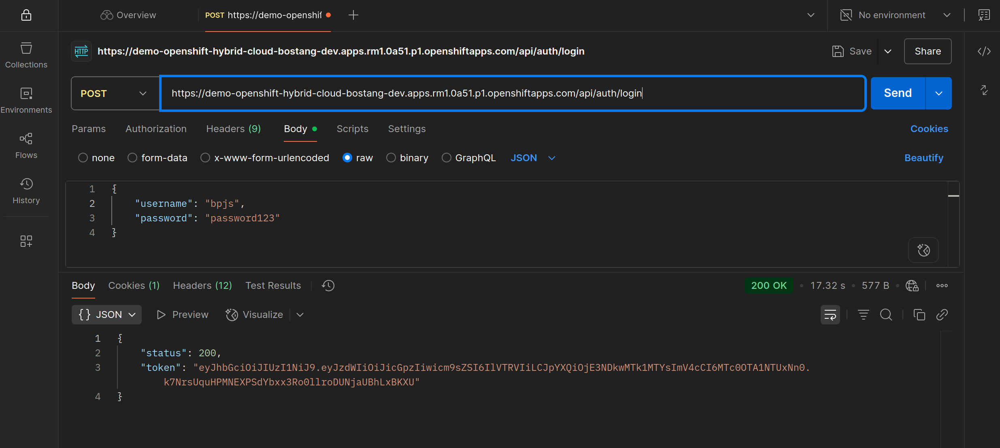

5. Amati pada dashboard DB

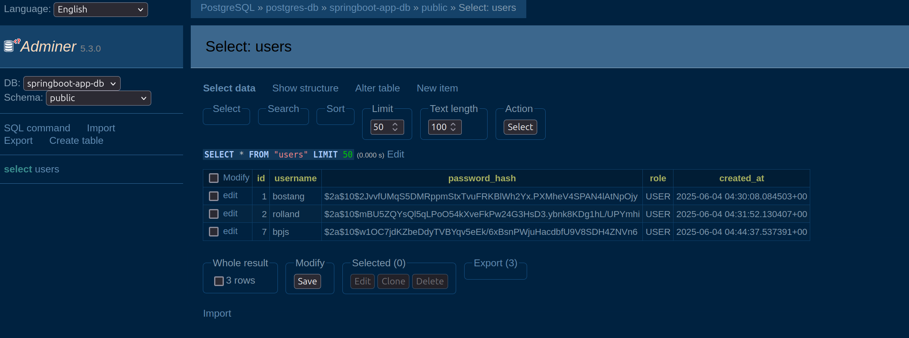


# `ConfigMaps` dan `Secrets`

_Configuration management_ : praktik menyimpang pengaturan aplikasi dan variabel _environment_ di luar kode aplikasi.

contoh `ConfigMap.yaml`:
```yaml
apiVersion: v1
kind: ConfigMap
metadata:
  name: myconfig
  namespace: demo
data:
  APP_MODE: production
  APP_PORT: 8080
```

contoh `secret.yaml`:
```yaml
apiVersion: v1
kind: Secret
metadata:
  name: mysecret
  namespace: demo
  type: Opaque
data:
  DB_USER: YWRtaW4=
  DB_PASS: c2VjdXJlcGFzcw==
```

# Routing & Service Exposure
_service exposure_ : mempersiapkan jalur agar dapat diakses dari luar cluster (publik) -> supaya aplikasi bisa diatur via browser / API client (misal Postman)

mencakup:
- mapping service ke port
- membuat entry point (ingress/route)
- resolve external access melalui DNS / IP

`route.yaml`
```yaml
apiVersion: route.openshift.io/v1
kind: Route
metadata:
  name: myapp-route
spec:
  to:
    kind: Service
    name: myapp
  port:
    targetPort: 8080
  tls:
    termination: edge
```

Ingress : cara native kubernetes untuk expose HTTP services.
    -> butuh _ingress controller_ seperti `NGINX`, `HAProxy`, atau `OpenShiftRouter`.
    -> _support_ _host/path-based routing_
    -> lebih fleksibel dengan anotasi dan _middleware_

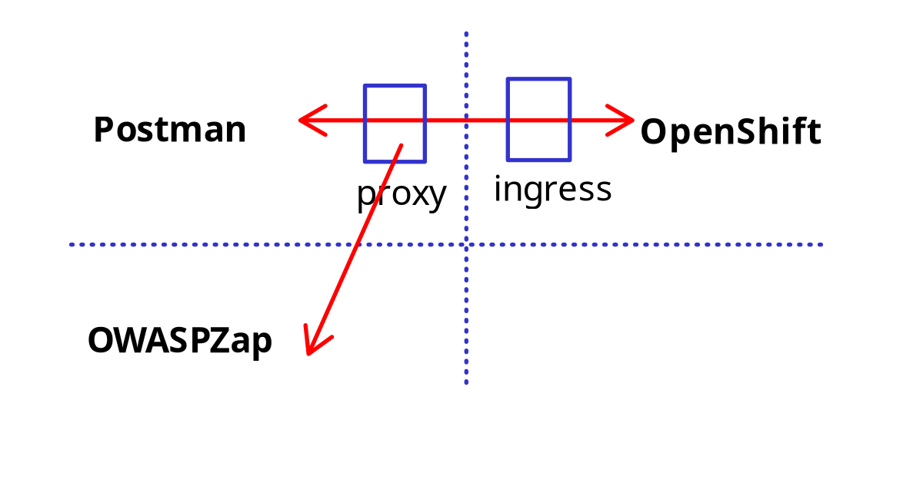

Ingress adalah koneksi yang masuk ke dalam pods, sedangkan Egress adalah koneksi yang keluar dari pods.

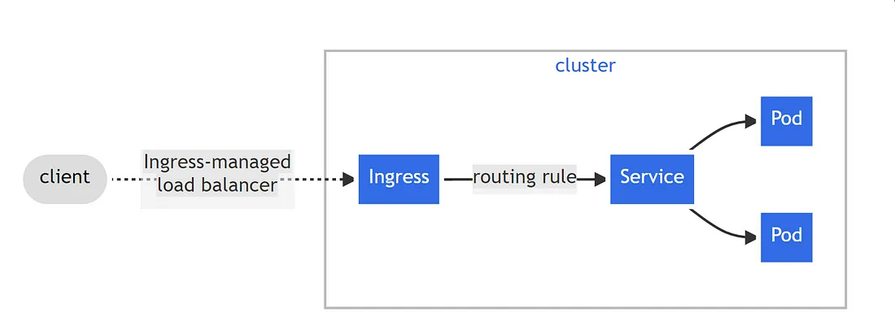


`ingress.yaml`
```yaml
apiVersion: networking.k8s.io/v1
kind: Ingress
metadata:
  name: myapp-ingress
spec:
  rules:
  - host: myapp.example.com
  http:
    paths:
    - paths: /
      pathType: Prefix
      backend:
        service:
          name: myapp
          port:
            number: 8080
```

# Tugas Tambahan
Bagaimana cara menerapkan healthcheck di springboot untuk di-deploy di openshift

**Langkah 1**: Tambahin dependency actuator di pom.xml,
```xml
<dependency>
  <groupId>org.springframework.boot</groupId>
  <artifactId>spring-boot-starter-actuator</artifactId>
</dependency>
```

**Langkah 2**: Tambahin di application.properties,
```config
management.endpoints.web.exposure.include=health,info
management.endpoint.health.probes.enabled=true
management.health.livenessState.enabled=true
management.health.readinessState.enabled=true
```

**Langkah 3**: Buat file yaml baru di dalam folder `/openshift` (`healthcheck.yaml`),
```yaml
livenessProbe:
  httpGet:
    path: /actuator/health/liveness
    port: 8080
  initialDelaySeconds: 15
  periodSeconds: 10
  failureThreshold: 3

readinessProbe:
  httpGet:
    path: /actuator/health/readiness
    port: 8080
  initialDelaySeconds: 5
  periodSeconds: 10
  failureThreshold: 3
```
**Langkah 4**: Test di local
**4.1** : Ubah sementara `application.properties`
```conf
# spring.datasource.url=jdbc:postgresql://postgres-db:5432/springboot-app-db
spring.datasource.url=jdbc:postgresql://localhost:5433/springboot-app-db
```

**4.2** : Port forward ke local
```bash
oc get pods     # untuk lihat postgres-db-???
oc port-forward postgres-db-6d7595f7d7-6m6l7 5433:5432
```
**4.3** : _clean install_, _spring-boot:run_

**4.4** : Kirim _request via_ Postman
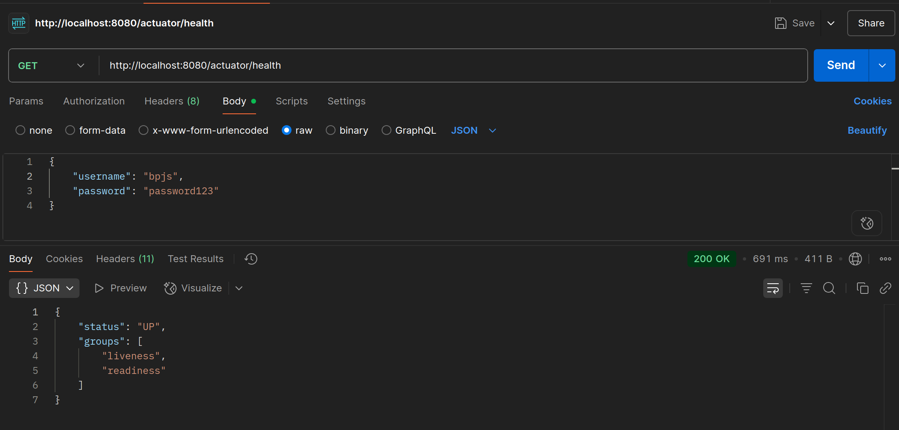

**Langkah 5** : Push update ke github, Hapus service lama, Buat service baru
**5.1** : Kembalikan `application.properties`

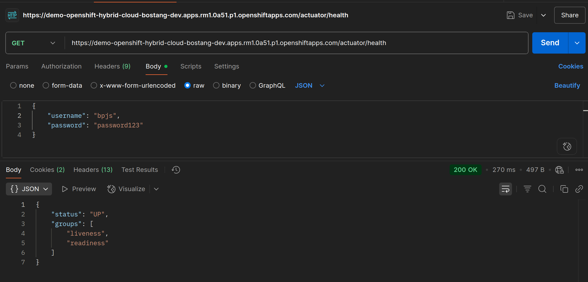


## Cara agar tidak perlu import lewat git berulang-ulang

```bash
oc new-app [link-repo-github] --name=[nama-app] --strategy=docker
oc expose deployment [nama-app] --port=8080 --name=[nama-deployment]
oc expose svc/[nama-deployment]
```

contoh:
```bash
oc new-app https://github.com/bostang/demo-openshift-hybrid-cloud --name=demo-openshift-hybrid-cloud --strategy=docker
oc expose deployment demo-openshift-hybrid-cloud --port=8080 --name=demo-openshift-hybrid-cloud
oc expose svc/demo-openshift-hybrid-cloud
```

maka pada sand-box akan bertambah pod baru :
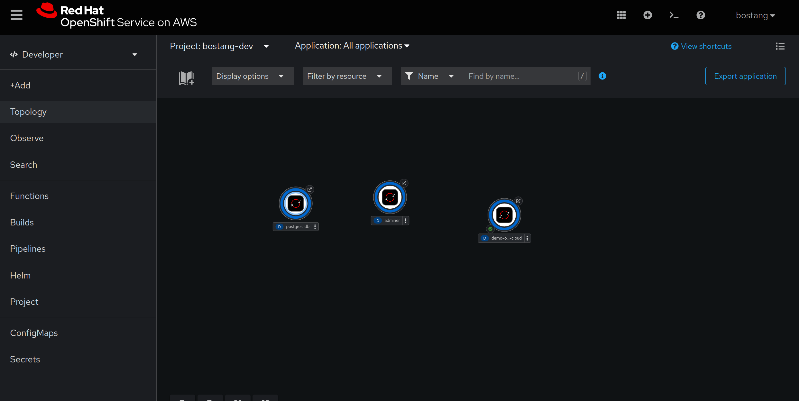

## Menambahkan end-point Health check lewat oc CLI langsung tanpa ubah kode
```bash
oc set probe deployment/[nama-deployment] --readiness --get-url=http://[nama-deployment]:8080/actuator/health --initial-delay-seconds=10 --timeout-seconds=3

oc set probe deployment/[nama-deployment] --liveness --get-url=http://[nama-deployment]:8080/actuator/health --initial-delay-seconds=30 --timeout-seconds=5
```

contoh:
```bash
oc set probe deployment/demo-openshift-hybrid-cloud --readiness --get-url=http://demo-openshift-hybrid-cloud:8080/actuator/health --initial-delay-seconds=10 --timeout-seconds=5

oc set probe deployment/demo-openshift-hybrid-cloud --liveness --get-url=http://demo-openshift-hybrid-cloud:8080/actuator/health --initial-delay-seconds=30 --timeout-seconds=5
```

> Catatan dari DeepSeek :
Penggunaan `demo-openshift-hybrid-cloud:8080` akan mengakibatkan error pada readiness & liveliness check. gunakan `localhost:8080`.
```bash
# Hapus probe yang salah terlebih dahulu
oc set probe deployment/demo-openshift-hybrid-cloud --remove --readiness --liveness

# Set probe yang benar menggunakan localhost
oc set probe deployment/demo-openshift-hybrid-cloud --readiness --get-url=http://localhost:8080/actuator/health --initial-delay-seconds=60 --timeout-seconds=5 --period-seconds=10

oc set probe deployment/demo-openshift-hybrid-cloud --liveness --get-url=http://localhost:8080/actuator/health --initial-delay-seconds=90 --timeout-seconds=5 --period-seconds=10
```


### restart deployment
```bash
oc rollout restart deployment/[nama_deployment]
```
contoh :
```bash
oc rollout restart deployment/demo-openshift-hybrid-cloud
```

# Catatan Tambahan
## Open Shift CLI (command-line) tidak bisa digunakan
login kembali dengan cara akses sandbox open-shift (web) -> pojok kanan atas (profil) lalu `Copy Login Commands`

## Arsitektur OpenShift
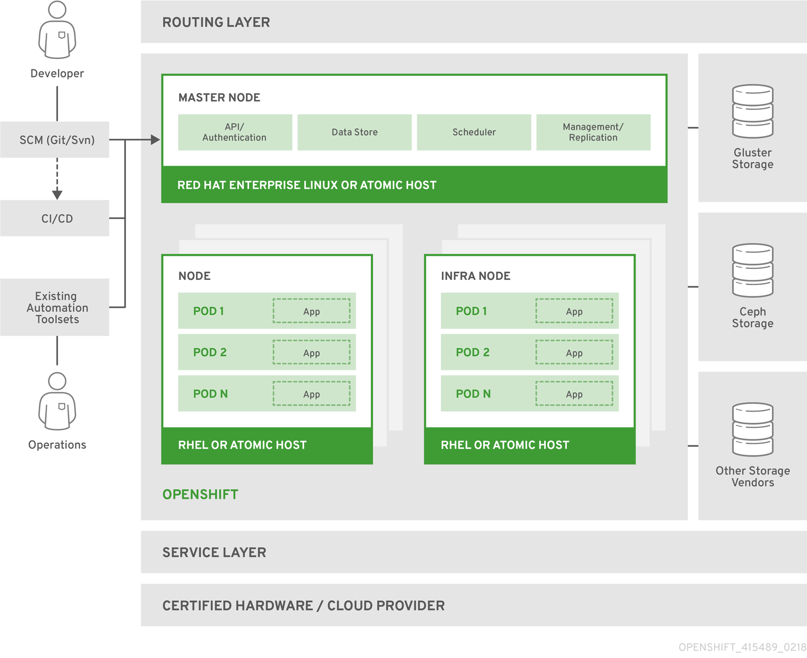
