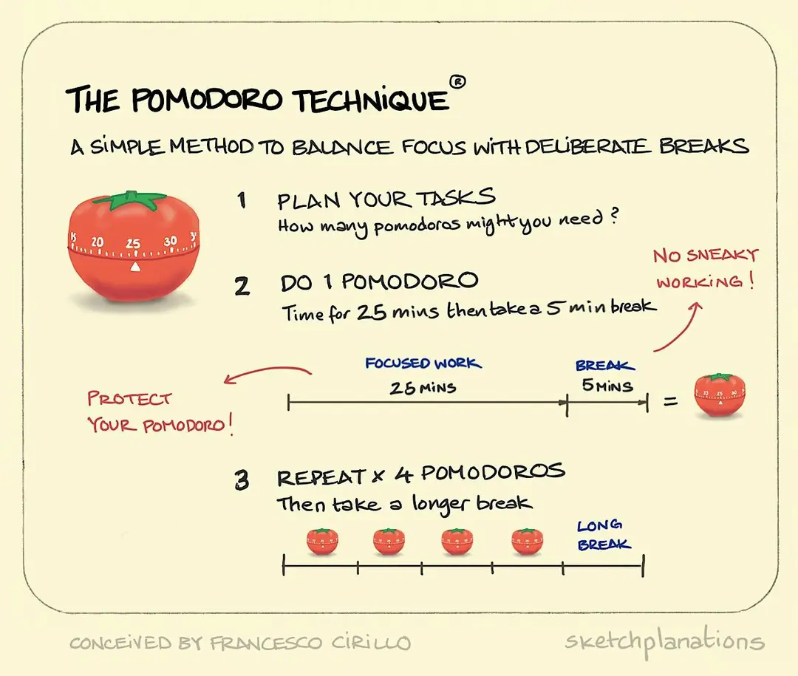
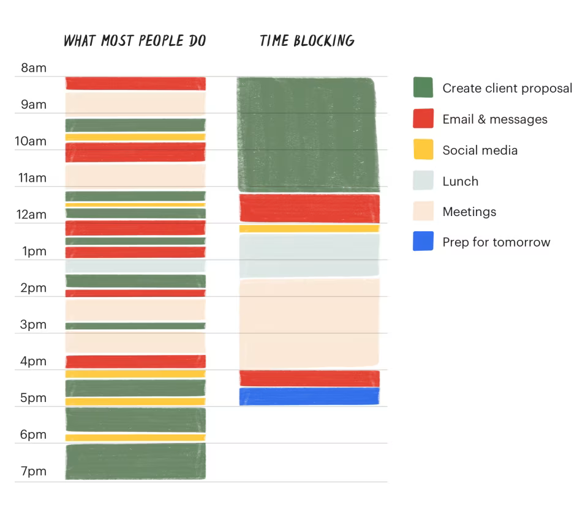

# Soft Skill : Time Management

## Memprioritaskan tugas di Proyek IT

### Eisenhower Metrix

- Urgent & Important -> lakukan sekarang
- Important but not urgent -> schedule
- Urgent but not important -> delegasi
- Neither -> eliminate

### MoSCoW method

- must have
- should have
- could have
- won't have

## Pomodoro Technique

_workflow_ :

- pilih tugas
- atur timer 25 menit (1 pomodoro)
- bekerja secara fokus (tanpa terdistraksi)
- ambil istirahat 5 menit
- setelah 4 pomodoro, istirahat 15 - 30 menit

## Timeblock Technique

Membagiah ari menjadi block-block. Setiap block dialokasikan _task_ atau pekerjaan.
-> membantu mencegah multitasking dan _decision fatique_.

time wasters in IT projects

- constant context switching
