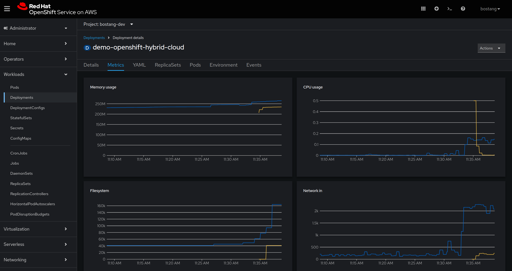
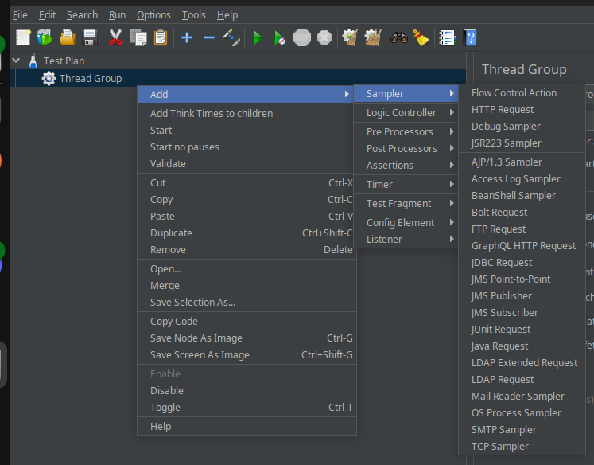

<!-- Dirangkum oleh : Bostang Palaguna -->
<!-- Kontributor :
  - Andrew
  - Jeremy Christoper  -->
<!-- Juni 2025 -->

# Horizontal Pod Autoscaller (HPA)
Scaling concept
HPA configuration
Automated scalability
    


_vertical scaling_ -> untuk melakukan komputasi matematis yang lebih berat seperti DeepLearning.;
_horizontal scaling_ -> untuk melakukan komputasi yang banyak (_concurrent_) misalkan transaksi ketika _high traffic_.

# Hands-on : Horizontal Pod Autoscaller (HPA)

> file : `/handson/demo-openshift-hybrid-cloud.zip`

## Cara 1 : Web-based GUI


Verifikasi HPA sudah diatur :


## Cara 2 : CLI
**2.1** Set Limit resources
```bash
oc set resources deployment java-bni-project-git \
  --requests=cpu=200m,memory=512Mi \
  --limits=cpu=500m,memory=1Gi
```

**2.2** Set HPA
```bash
oc autoscale deployment java-bni-project-git \
  --min=1 --max=5 \
  --cpu-percent=80
```

**2.3** Verifikasi / Cek Detail
```bash
oc get hpa

# lihat detail
oc describe hpa [nama_deployment]
```

# Monitoring & Logging
manfaat :
- deteksi isu secara dini sebelum berdampak pada user
- memahami trend performa dan _bottleneck_ sumnber daya.
- investigasi dan debug kegagalan / perilaku abnormal.

<!-- `Prometheus` , `ElasticSearch stack` -->

OpenShift Monitoring : menggunakan 
  - `Prometheus` : _scrap_ _metrics_ dari `pods` dan `services`
  - `Alertmanager` : kirim _alert_ lewat email, slack
  - `Grafana` : visualisasi dashboard
   untuk kumpulkan dan visualisasi _metrics_ dari nodes, pods, dan aplkasi.

_metrics_:
- CPU & memory usage
- pod restarts
- HTTP request rate & latency

```bash
oc explain pod
oc explain node
oc explain application
oc explain service
```

**Melihat pod metrics**

Dgn web console:
> Observe > Metrics


Dgn CLI :
```bash
oc adm top pods
oc adm top nodes
```

**Baca Log**
Dgn web console:
> Pod > clock "logs"

Dgn CLI :
```bash
oc get pods
oc logs -f [pod-name]     
oc logs deployment/myapp
```

Setelah mengubah _source code_, build lagi.

> Kita tidak perlu hapus service kemudan import ulang.

**Cara build ulang via web console**


**Cara build ulang via CLI**
```bash
# sintaks :
#   oc start-build [nama-built-config] --follow
# cek di `oc get bc` (built-config)
oc start-build demo-openshift-hybrid-cloud --follow
```

setelah selesai build, coba lagi kirim _request_ via postman:


perhatikan bahwa _message_ ada di _response_.

**Cara **
**Langkah 0:: Lihat nama build config**
```bash
oc get bc
```

**Langkah 1: generate secret key**
```bash
# sintaks :
  # oc get bc [nama-build-config] -o jsonpath="{.spec.triggers[?(@.type=='GitHub')].github.secret}"

oc get bc demo-openshift-hybrid-cloud -o jsonpath="{.spec.triggers[?(@.type=='GitHub')].github.secret}"

# maka akan didapat kode `secret`
  # misal : sIIfsy_w38yDk4vR7CUa
  # secret akan dipakai untuk URL Webhook
```

**Langkah 2: lihat URL webhook Github**
```bash
# Lihat URL Webhook Generic & Webhook Github
# sintaks :
  # oc describe bc [nama-build-config]

oc describe bc demo-openshift-hybrid-cloud

# contoh:
  # Webhook GitHub:
	# URL:	https://api.rm1.0a51.p1.openshiftapps.com:6443/apis/build.openshift.io/v1/namespaces/bostang-dev/buildconfigs/demo-openshift-hybrid-cloud/webhooks/<secret>/github

```

**Langkah 3: Add web hook di github**
> Buka repository github > Settings > Webhooks > Add Webhook

> masukkan payload URL, content type: application/json, secret

Namun untuk kasus ini, proses webhook akan selalu gagal (karena OpenShift yang digunakan versi gratis)


# Troubleshooting Deployment
OpenShift Error, Debugging Failed Deployments

Tujuan : Ketika deployment gagal, tahu harus lihat/cek ke mana untuk mengurangi _down time_.

Contoh permasalahan yang sering muncul:
- Image pull error (`ImagePullBackOff`, `ErrImagePuull`)
- `CrashLoopBackOff` : Pod mulai kemudian _crash_ secara berulang
- Container exit codes (misal : code `1`, `137`, `143`)
- Kegagalan Readiness / Liveness Probe
- _Resources_ yang tidak cukup (memory/CPU)


**Tools untuk Troubleshooting**:
- `oc get pods`
- `oc describe pod <name>`
- `oc logs <pod>`
- `oc rollout status deployment/<name>`
- Web console
- Pahami _error message_.

# Hands-on : Pengujian Repeating request

>file : `/handson/demo-openshift-hybrid-cloud.zip`

## Dengan Shell Script
> `continuous_request_api.sh`


Administrator > Workloads > Deployment > Metrics


Administrator > Workloads > Deployment > HorizontalPodAutoscaler


## Testing dengan ApacheJMeter
### Cara Andrew

**Langkah 1** : Tambah **Thread Group**
> Klik kanan `test plan` > add > Threads > Thread Group


atur parameter thread group


**Langkah 2** : Tambah **HTTP Request**

> Klik kanan `test plan` > Add > Sampler > HTTP Request



Atur parameter HTTP Request


**Langkah 3** : Atur Body Data


**Langkah 4** : Atur **HTTP Header**

> Klik kanan `test plan` > Add > Config Element > HTTP Header Manager


Atur http header : `Content-Type` : `application/json`


**Langkah 5** : Tambah **Summary Report** dan **Result Tree**


**Langkah 6** : Jalankan Test
Tekan tomnbol play (hijau) lalu amati _result tree_ dan _summary report_.


Amati pula grafik _resource utilization_ pada OpenShift dan akan diamati meningkat.

<!-- 

Cara Youtube : 
Templates > Building web test plan


-->

# Tugas: Springboot app dengan Kolom paru pada Tabel

> file : `/handson/opensfhit-springboot-app.zip`

Update tabel `user` menjadi:
```
id
username
email_address
is_active
created_at
updated_at
password_hash
role
```

**Langkah 0 : Update Kode Sumber**

**Langkah 1: Buat repository secrets**

> Settings > Secret and Variables > Actions > Repository Secrets

`OC_BUILD_NAME`


`OC_NAMESPACE`


`OC_SERVER`


> **catatan**:
pastikan pada `main.yaml` `repository` sama : `main` atau `master`.

**Langkah 2 : Buat `main.yml`**
buat `main.yml` di :
```
.github/workflows/main.yml
```

**Langkah 3 : Tunggu hingga build selesai**

> Buka Github > Actions > All workflows

**Langkah 5 : Testing dengan Postman**

Testing


# Catatan Tambahan
**Virtualization vs Containerization**


**Versioning**

`X.Y.Z`

`X` : Major fix
`Y` : Minor fix
`Z` : Hotfix

contoh : `1.1.3`

dalam implementasinya di versioning / menandakan _release point_ menggunakan github, pakai `git tag`.

---
[🏠Back to Course Lists](https://odp-bni-330.github.io/)
