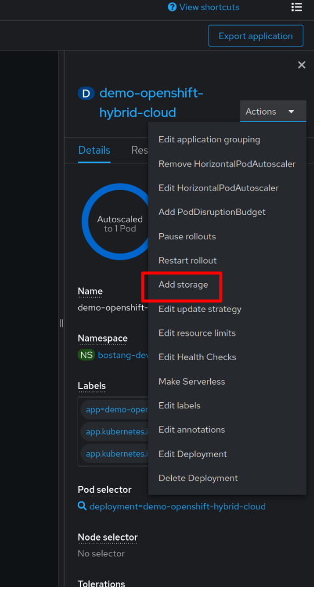
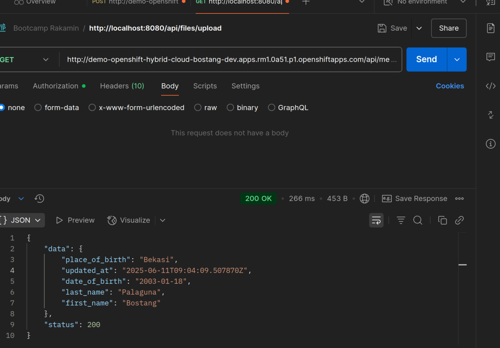

# DevSecOps

## Persistent Storage in OpenShift

mengapa penting? pada OpenShift, container bersifat _ephemeral_ : data disimpan di dalam container akan hilang ketika pod dihapus, crash, atau _rescheduled_. Untuk aplikasi **_stateful_** dengan database, file upload system, atau content management platform, _data persistance_ itu penting.

### Persistent Volume (PV)

potongan _storage_ yang didedikasi pada OpenShift cluster. Berfungsi independen dari pod dan tetap ada bahkan ketika pod dihapus atau di-_rescheduled_.

karakteristik:

- support berbagai_backend_ : `NFS`, `iSCSI`, `Ceph`, `GlusterFS`, `AWS EBS`, `Azure Disk`, dll.

contoh PV YAML:

```yaml
apiVersion: v1
kind: PersistentVolume
metadata:
  name: nfs-pv 
spec:
  capacity:
    storage: 1Gi 
  accessModes:
    - ReadWriteMany 
  persistentVolumeReclaimPolicy: Retain 
  nfs: 
    path: /opt/nfs 
    server: nfs.f22 
    readOnly: false
```

### Persistent Volume Claim (PVC)

→ cara aplikasi meminta storage di OpenShift. (meng-bound PV ke suatu pod)

### (HANDS-ON) Connecting Storage to Applications
>
> file : `./handson/opensfhit-springboot-app`

#### Testing di local

**Langkah 0::: login `oc` dulu di terminal


**Langkah 1**: buat `FileController.java` dan ubah `application.properties`

```conf
## spring.datasource.url=jdbc:postgresql://postgres-db:5432/springboot-app-db ## COMMENT THIS LINE
spring.datasource.url=jdbc:postgresql://localhost:5433/springboot-app-db
```

**Langkah 2**: port forwarding

```bash
oc get pods
oc port-forward <pos-postgres-name> 5433:5432
    ## catatan : port pertama 5433 karena 5432 (di komputer saya sudah ada local postgresql yang by default berjalan di port 5432)
    ## oc port-forward postgres-db-595f97876-bbvf2 5433:5432
```

**Langkah 3**: testing dengan postman
end-point : `http://localhost:8080/api/files/upload`
body: tipe `form-data` lalu pilih file local


#### Up ke OpenShift

**Langkah 1**. Buat Persistent storage di OpenShift


**Langkah 2**. Hubungkan persistent volume dengan pod aplikasi springboot

**Cara 1** : CLI

```bash
oc set volume deployment/demo-openshift-hybrid-cloud --add \
    --name=upload-volume \
    --type=pvc \
    --claim-name=pvc-upload \
    --mount-path=/app/uploads  ## <-- Sesuaikan dengan kebutuhan aplikasi Anda!
```


**Cara 2** : Web Console




Catatan : pastikan pada application properties, `files.upload-dir`

```conf
file.upload-dir=/app/uploads
```

dan pada `FileController.java` direktori tempat file akan disimpan pas:

```java
@Value("${file.upload-dir}")
```

**Langkah 3**. push kode ke github

jangan lupa ubah `OC_TOKEN` pada `Repository secrets` agar kode Github terbaru bisa tersinkron dengan Openshift.

tunggu hingga github action success :


pastikan pada OpenShift juga build sudah yang terbaru


**Langkah 4**. testing dengan Postman
Testing Post :


Testing Get :


## CI/CD di OpenShift

_continous integration / continous deployment_.
DevOps -> bertanggung jawab untuk membangun _pipeline_ untuk CI/CD.

mengapa CI/CD penting? otomasi proses _building_, _testing_, dan _delivering_ aplikasi hingga produksi.

manual steps pada workflow deployment tradisional rentan delay, inkonsistensi, _human error_.

### Menggunakan Tekton pipeline

`Tekton` : salah satu engine di Openshift untuk jalankan _pipeline_ CI/CD kubernetes.

konsep kunci:

- `Task`
- `Pipeline`
- `PipelineRun`
- `Workspace`
- `PipelineResource`

### Otomasi Deployment Aplikasi

Deployment menggunakan `Jenkins`

**Langkah 1**. buat pod Jenkins di Openshift

```bash
oc new-app jenkins-ephemeral
```

maka pada bagian Topology akan muncul pod baru : `jenkins`

**Langkah 2**. buat `Jenkinsfile` di direktori project

```bash
pipeline{
    agent any

    environment{
        PROJECT_NAME = "bostang-dev"
        BUILD_NAME = "demo-openshift-hybrid-cloud"
    }

    stages{
        stage('Trigger Build in OpenShift'){
            steps{
                sh "oc start-build ${BUILD_NAME} --from-dir=. --follow -n ${PROJECT_NAME}"
            }
        }

        stage('Deploy to OpenShift'){
            steps{
                sh "oc rollout restart deployment/${BUILD_NAME} -n ${PROJECT_NAME}"
            }
        }
    }

    post{
        sucess {
            echo '✅ Build & deploy behasil via OpenShift BuildConfig'
        }
        failure{
            echo '❌ Gagal menjalankan pipeline'
        }
    }
}
```


**Langkah 3**. push kode setelah ada `Jenkinsfile` ke Github, lalu jalankan pipeline

```bash
## sintaks :
    ## oc new-build --name={nama_project} --strategy=pipeline --code={url_github}
oc new-build --name=demo-openshift-hybrid-cloud-pipeline --strategy=pipeline --code=https://github.com/bostang/demo-openshift-hybrid-cloud
```


Catatan : apabila ada yang diubah di `Jenkinsfile` maka bisa lakukan kembali build dengan:

```bash
## sintaks:
    ## oc start-build {nama_project}
oc start-build demo-openshift-hybrid-cloud-pipeline
```

maka pada dashboard jenkins bisa dilihat build yang success :


dan pada openshift bagian Builds juga dapat diamati:


## (TUGAS) Auto-trigger Jenkins dari Github commit

> file : `/handson/openshift-springboot-app`

**Langkah 1** : buat table `profiles`


**Langkah 2** : buat endpoint API untuk `post` _update profile_ dan `get` `view_profile_

**Langkah 3** : konek Github ke Jenkins

Pengujian di lokal:


Pengujian setelah deploy di OpenShift:




## Security & Role-Based Access Control (RBAC)

dalam _multi-tenant container platform_ seperti OpenShift, penting untuk me-manage siapa yang bisa melakukan apa terhadap cluster dan project.

alasan kunci:

- _secure by design_ : hanya orang ter-otorisasi yang bisa akses / modif resources.
- cegah miskonfigurasi

contoh built-in roles:

- `admin` : full control di setiap resources kecuali RBAC configs
- `edit` : CRUD resources
- `view` : hanya lihat resources dan konfigurasinya
- `cluster-admin` : akses penuh ke resources
- `system developer`

```bash
## Beri akses
oc adm policy add-role-to-user view john -n my-project

## Hapus akses
oc adm policy remove-role-from-user edit alice -n my-project
```

contoh `role` di Banking (CORE) :

- `maker`
- `checker`
- `signer`
- `releaser`

prinsip : _principle of least privilege_

## OpenShift Best Practices

### Optimizing deployment & Resource Management

mengapa? memastikan aplikasi yang di-deploy dapat berjalan dan dimaintain secara aman, stabil, dan efisien.

dalam hal kolaborasi, _best practice_ bantu buat struktur dan konsistensi dalam setiap proyek.

manfaat:

- deployment yang lebih cepat dan aman
    → menghindari miskonfigruasi
- efisiensi _resource_ yang meningkat
    → misal CPU & memory utilization yang tidak tersia-sia / _bottleneck_.
- security posture yang menguat
- maintenance & torubleshooting lebih sederhana
- skalabilitas dan kolaborasi

**Teknik Deployment Optimization**:

- `DeploymentConfig` (Openshift) vs `Deployment` (K8s) : rolling updates, rollback strategies.
- Implementasi _health check_
- aktifkan _Autoscaling_
- otomasi dengan `ImageStream` trigger (`ImageChangeTriggers`)
- gunakan `Label` & `Annotations`
    → contoh : `tier=backend` , `env=prod`
