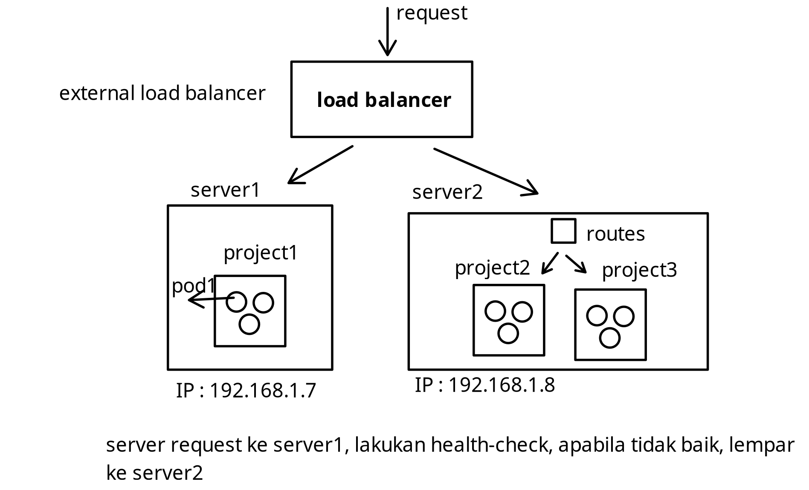
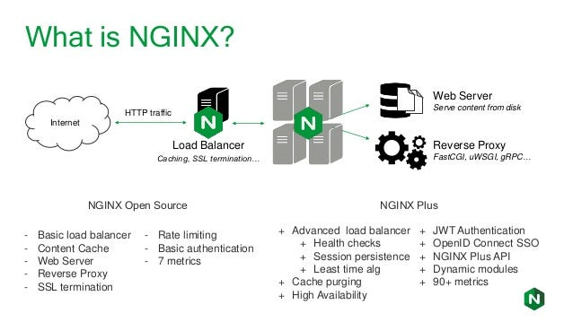
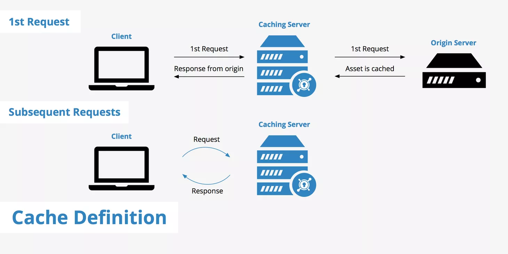
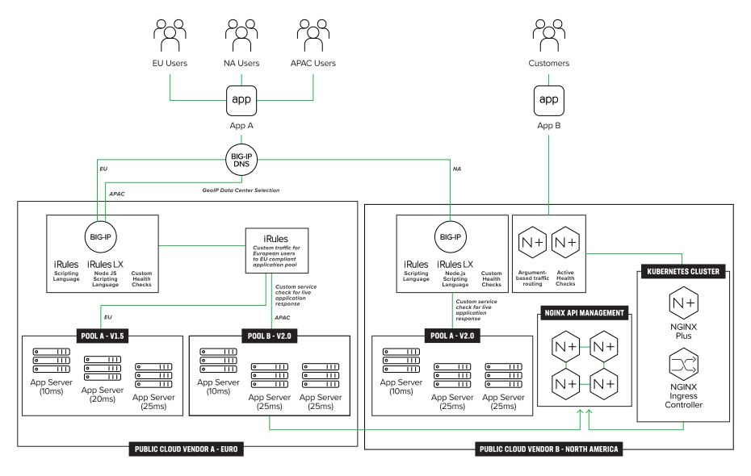
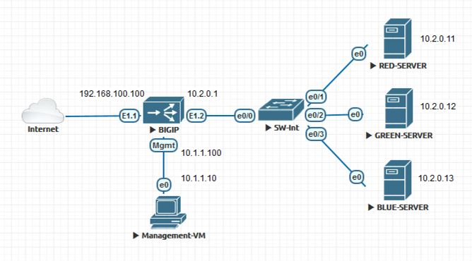

<!-- Dirangkum oleh : Bostang Palaguna -->
<!-- Juni 2025 -->

# DevSecOps

## Load Balancing in OpenShift

mekanisme menyeimbangan trafik.
Dalam hal _cloud-native environment_ seperti OpenShift, memastikan tidak ada satu `pod` atau `node` yang mengalami _bottleneck_.

**manfaat**:

- distribusi trafik yang merata
- _responsiveness_ ↑
- _availability_ ↑
    secara otomatis _reroute_ traffik ke `pod` yang sehat.
- _scalability_ ↑
    horizontal scaling
- _security & control_ ↑

### OpenShift Load Balancer

**komponen** :

- Kubernetes service
  - `ClusterIP`
  - `NodePort`
  - `LoadBalancer`
- OpenShift routes
  - hostname-based routing & terminasi TLS.
- OpenShift Router (HAProxy)
  - monitor route resources dan bertindak sebagai **reverse proxy** / **load balancer** untuk trafik dari luar

**Flow Trafik di OpenShift**:

- _request_ masuk dari klien luar ke hostname yang didefinisikan DNS
- _request_ di-route melalui HAProxy
- router evaluasi ke rute
- meneruskan _request_ ke service yang bersangkutan
- _service_ melakukan _load balancing_ traffic ke `backend pod` yang sehat.

**kapabilitas**:

- `path-based routing`, `customer header`
- `health check`, update routing table secara dinamis
- `TLS termination` dan `sticky session`.

### HAProxy

High availablity Proxy → load balancer di OpenShift

- bertindak sebagai **reverse proxy** untuk routing request ke backend pod
- handle `TLS/SSL termination`
- `health check`
- layer 7 (HTTP) routing

**Fitur** :

- sticky session : maintain sesi user pada pod yg sama dgn _cookie_
- SSL termiantion : terminates encrypted traffic di router, simplifikasi backend services
- Timeout & Rate limit : cegah koneksi yang pajang / abusive dgn _advanced policies_
- Dynamic Configuration : sinkronisasi otomatis dgn OpenShift API utk update langsung.

**Mekanisme konfigurasi**:

- melalui `Route definition` di OpenShift
- anotasi Route (contoh : `haproxy.router.openshift.io/timeout`)
- Router Pod (jalankan HAProxy) biasanya di-deploy sbg bagian dari `openshift-ingress controller`.

contoh yaml:

```yaml
apiVersion : route.openshift.io/v1
kind: Route
metadata:
  name: myapp
spec:
  to:
    kind: Service
    name: myapp-service
  port:
    targetPort: 8080
  tls:
    termination: edge
```



## High Availability Deployment

dalam dunia digital sekarang, customer mengharapkan akses tak terinterupsi ke aplikasi & layanan.
_downtime_ hitungan menit dapat berdampak ke _revenue loss_, _reduced user satisfaction_, dan kerusakan reputasi brand.

**goals**:

- downtime ↓
- redundancy dan failover
- scale responsively
- dukung kontinuitas bisnis
- kepercayaan operational ↑

### High Availability Concepts

`uptime` ↑
`disruption` ↓

**komponen HA OpenShift**:

- replika `pod`
- `control plane` dan `worker node` yang _redundant_.
- `service load balancing`

### Configuring `ReplicaSets`

controller kubernetes yang dipakai di OpenShift untuk mengatur agar sejumlah pod tertentu tetap nyala kapanpun.

Ketika suatu pod mengalami crash, dihapus atau tidak responsif, maka `ReplicaSet` akan mendeteksi perubahan dan menggantikan pod secara otomatis.

**Konsep Inti**:

- `Replicas`
- `Selectors`
- `Tempalets`

**Fungsi Kunci**:

- `Self-healing`
- `Scaling`
- `Integration with Deployment`

contoh yaml:

```yaml
apiVersion: apps/v1
kind: ReplicaSet
metadata:
  name: myapp-rs
spec:
  ...
```

**Best Practices**:

- atur `ReplicaCount` > 1
- implementasi aturan `Pod Anti-Affinity`  → batas maksimum CPU
- Menggunakan liveness & readiness probes : gantikan unhealthy pods
- deploy melalui `Deployment/DeploymentConfig` → support _rolling_ update & strategi _rollback_
- integrasi `PersistentStorage`

- nyalakan `HorizontalPodAutoScaling` (`HPA`)
- gunakan desain aplikasi _stateless_ sebisa mungkin → lebih mudah discale & recover
- gunakan cluster monitoring tools : lacak uptime, pemakaian resource, dan trigger allert untuk respons proaktif.

testing & validasi:

- simulasi kegagalan `pod` dan `node` untuk validasi _recovery_
- gunakan `oc debug` dan `oc describe` untuk investigasi isu potensial di deployment behavior
- monitor log dengan `oc logs`

## Disaster Recovery Plan

**Disaster dalam IT**:

- penghapusan secara tidak sengaja resources
- miskonfigurasi
- system crashes
- kegagalan hardware
- serangan ransomware
- human error

**Key goals** :

- Memastikan kontinuitas bisnis
- Jaga data kritikal & App states
  - konfigurasi `SafeGuard`
  - `secrets`
  - persistent data
- aktifkan Fast Recovery
- sediakan lingkungan terkendali untuk testing → lakukan simulasi untuk verifikasi resiliensi sistem

Apa yang harus dibackup:

- `Etcd database` : critical cluster state (configuration, secrets, workloads)
- `Persistent Volume` (`PV`) : data user dan aplikasi : logs, files, database
- Objek `kubernetes` : `Deployments`, `ConfigMaps`, `PVC`, `secrets`, `routes`.

**Best Practices**:

- jadwalkan backup rutin
- encrypt & secure
- off-site storage
- monitor & alert
- lakukan _recovery drills_

### Backup & Restore Strategies, Recovery, Simulation

#### Backup di OpenShift

integrasi dengan tools luar seperti:

- `Velero` → tools untuk backup atau migrasi
- `OADP (OpenShift API for Data Protection)`
- `Cloud Provider Snapshots`

### Restore Strategy

- restore `etcd` atau konfigurasi cluster → `etcd snapshots`
- buat ulang `namespace` dan `permissions`
- reapply `kubernetes resources`
- restore `persistent volume`
- validasi layanan
- uji konsistensi data

**Tools** :

- `velero` restore commands  (`velero restore create --from-backup myapp-backup`)
- customer restore hooks
- `OADP Operator`

Konsiderasi:

- parsial vs full : berdasarkan skop _failure_
- restore testing : selalu uji di environment non-production
- _document everything_

**Langkah Simulasi DRP** :

- pilih aplikasi
- full backup : dengan ==`Velero` / `OADP`==
- simulasikan resources terhapus / corrupt : hapus `namespace` atau komponen aplikasi corrupt
- lakukan restore dan amati pembuatan ulang resource.
- lakukan pengujian end-to-end : verifikasi _service availability_, _user login_, _database read/write_, dll.

**Recovery Metrics** :

- Recovery Time Objective (==RTO==) : jumlah waktu maksimum sistem boleh down
- Recovery Point Objective (==RPO==) : jumlah data maksimum uyang bisa hilang semenjak last backup

**best practice simulasi** :

- gunakan cluster non-production / test u/ recovery drill
- buat playbook terstandard u/ skenario test yang berulang
- lakukan simulasi setiap setelah perubahan major pada platform

## Technical Documentation Best Practices

esensial untuk memastikan _knowledge transfer_, onboarding, collaboration, dan maintainabilitas sistem.

### Importance of Documentation

Membantu developer, operator, dan stakeholder memahami cara kerja sistem, cara memakai, dan _troubleshooting_ isu.

**Manfaat** :

- Knowledge sharing
- Faster onboarding
- Efficient troubleshooting
- Process consistency
- Compliance & Auditing

### Tipe Dokumentasi Teknikal

- **System Architecture diagram** : visualisasi komponen high level & hubungannya
- **API Documentation** : endpoints, request/response format, contoh penggunaan
- **User guides** : instruksi untuk pengguna akhir u/ interaksi dgn sistem/aplikasi
- **Developer Docs** : setup guide, detail konfigurasi, development standard
- **Runbooks & Playbooks** : prosedur operasional utk task yg common atau insiden
- **Release notes & Changelogs** : merangkum update, fitur baru, bug fixes.

### Elemen dari Dokumentasi

- Title & Purpose
- Versioning & Date
- Table of Contents
- Step-by-step instructions
- Diagram & Visual Aids
- Common Errors & fixes
- Glossary or Definitions

### Structuring Effective Technical Docs

**Best Practices**:

- gunakan **Heading** dan **Subheading** untuk mengelompokkan konten secara logical
- gunakan bahasa yang luas
- pecah topik kompleks menjadi bagian yang dapat lebih dicerna
- ikuti format yang konsisten di seluruh dokumentasi
- hubungkan ke dokumen terkait atau referensi eksternal
- sertakan contoh dan _edge cases_
- tambahkan _search and index features_ jika menggunakan platform dokumentasi

## (HANDS-ON) Dokumentasi

menggunakan Confluence

[Kelompok 1](https://fahranul.atlassian.net/wiki/external/NjQ1ZjEyNDIzYTc3NGViYTg3Mjk3NGY4OWI0MjdkMTI)
[Kelompok 2](https://qanitafiq4.atlassian.net/wiki/x/OAAE)
[Kelompok 3](https://suryamiharja96.atlassian.net/wiki/external/YTRhMzk1NDJlYjgzNGVkOGI3MmJmNjJhY2FhMGU3ODc)
[Kelompok 4](https://4mbiz4miz.atlassian.net/wiki/x/aoAC)

## Catatan Tambahan

### `nginx`

==web server== but commonly used as a reverse proxy

==reverse proxy==, ==HTTP load balancer==, media streaming, and email proxy for IAMP, POP3, and SMTP



### Cache

metode untuk menyimpan informasi sehingga nanti bisa diakses dengan lebih cepat.



### Hardware load balancer



F5

