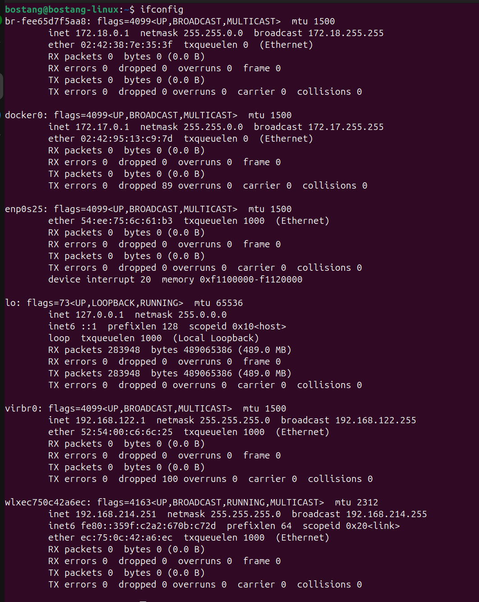
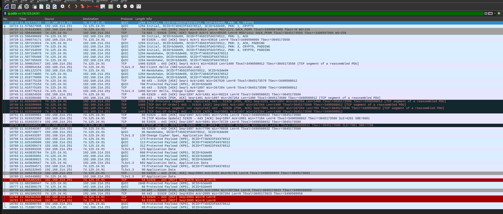
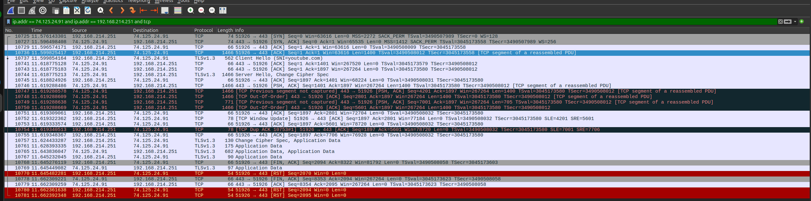
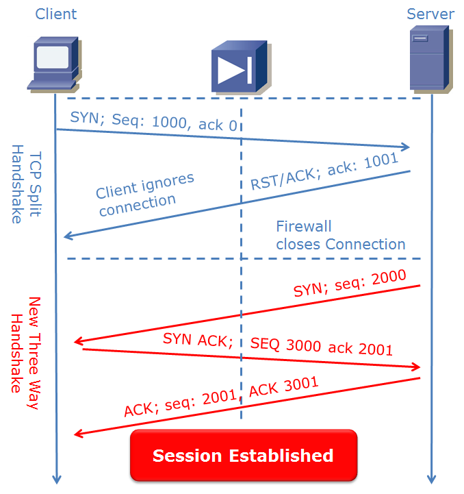

# Networking

## Load Balancer Fundamental

### Fungsi Load Balancer
membagi traffic jaringan ke beberapa server berdasarkan kebutuhan network.

contoh:
- router ke beberapa ISP (setting mikrotik / CISCO)
- traffic pada service (HTTP request)

hardware load balancer
- F5
software load balancer
- Nginx
- HAProxy

Algoritma Load Balancing:
1. Round Robin → permintaan berurutan
2. Sticky Round-Robin 
3. Weighted Round-Robin → bobot diberikan ke server bdskan kapasitas
4. IP/URL Hash → client yang sama selalu mengarah ke server yang sama bdskan IP 
5. Least Connection → koneksi aktif paling sedikit
6. Least (Response) Time → waktu respons tercepat

### Layer 4 vs Layer 7 Load Balancing
Layer 4 → transport (UDP, TCP) → berdasarkan IP/port dasar
→ lebih cepat karena baca header pada jaringan dasar

Layer 7 → application (HTTP, HTTPS, DNS, IMAP, SMTP, FTP) → berdasarkan URL, header HTTP, cookie
→ lebih cerdas : bisa menghentikan SSL

## (Hands-on) NGINX
web server yang bisa reverse proxy / load balancer.

> paduan lengkap di `./load-balancer-simulation/README.md`

---

## TCP/IP Analysis with Wireshark

### Paket Jaringan pada Lalu Lintas
`Wireshark` menangkap paket pada jaringan yang berjalan dan menganalisis.
→ bantu identifikasi kendala jaringan dan keamanan.

wireshark capture traffic dari _interface_ perangkat yang digunakan:
- network interface
- wireshark interpreter
- router/modem
- internet
- server

### Filtering dan Decoding Paket Jaringan
- Capture Filters
    - `host 192.168.1.1`
    - `port 80`

- Display Filters
    - `ip.addr == 192.168.1.1`,
    - `http`,
    - `tcp.flags.syn==1`

## (Hands-on) Capture dan Analisis Paket Wireshark

`ifconfig` untuk lihat ip address kita.




setelah akses youtube.com


menambahkan filter



contoh ping ke `44.228.249.3` (`http://testhtml5.vulnweb.com`) dengan di awal sudah menambahkan capture filter :
`port 80 and host 192.168.214.251 and host 44.228.249.3`

lalu coba pada terminal
```bash
curl -v http://testhtml5.vulnweb.com
```
atau akses via browser.

lalu terapkan display filter `http`.

## Network Troubleshooting
langkah analisis permasalahan yg sistematis pada jaringan komputer sehingga pemecahan masalah lebih cepat, menjadi lesson learned, dan kurangi spekulasi.

### Teknik Troubleshooting Jaringan
- Step 1 : Definisikan masalah 
- Step 2 : Kumpulkan informasi 
- Step 3 : Identifikasi kemungkinan penyebab 
- Step 4 : Rumuskan hipotesis 
- Step 5 : Uji hipotesis 
- Step 6 : Terapkan solusi 
- Step 7 : Verifikasi & dokumentasi 

### Tangani Permasalahan Konektivitas Jaringan

Alur troubleshooting (Bottom up OSI layer)
1. Lapisan Fisik (L1) : periksa kabel, lampu indikator, daya
2. konfigurasi IP : `ifconfig` → alamat IP, subnet mask, default gateway
3. Ping default gateway : `ping [IP_router]`, uji konektivitas lokal
4. Ping IP publik : `ping 8.8.8.8`, uji akses internet tanpa DNS
5. periksa DNS : `https://www.nslookup.io/`, uji resolusi nama
6. firewall : periksa aturan firewall lokal/jaringan.

## (Hands-on) Debugging jaringan

kasus : tidak dapat jangkau server

1. Uji Jangkauan Dasar
```bash
ping [IP_server]
```

2. Analisis Jalur
```bash
traceroute [IP_server]
```

3. Koneksi lokal
```bash
netstat -an
```

4. analisis dengan wireshark


ping https://nusa-a-movies-app.vercel.app

capture filter : `host [ip_address] and port 80` 
display filter : `tcp.flags.ack == 1 and tcp.flags.syn == 1`

