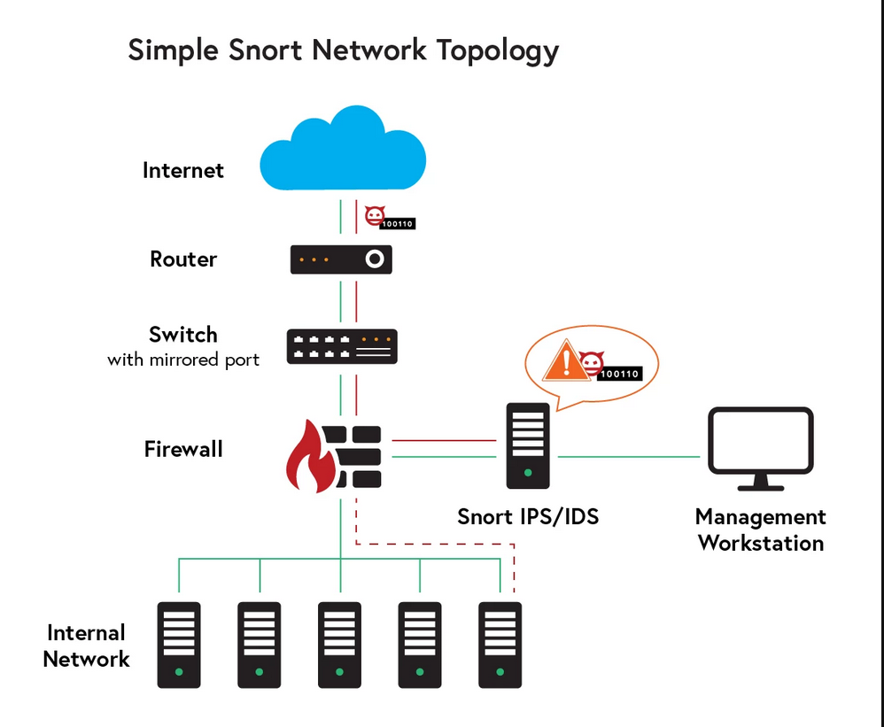

# Security

> pemateri : Kelvin Desman

prerequisites:

- LINUX OS (e.g. Ubuntu) / VM running LINUX

## OS Firewall

Analogi Bangunan:

- Komputer ↔ bangunan
- Server ↔ lantai tertentu
- website ↔ ruangan tertentu
- OS firewall ↔ sistem keamanan utama di gedung
- WAF (web application firewall) ↔ petugas keamanan khusus untuk mengamankan ruangan tertentu
- Port ↔ pintu masuk

| **Service** | **Port Number** | **TCP/UDP** |
|-------------|-----------------|-------------|
| FTP         | 20,21           | TCP         |
| SSH         | 22              | TCP         |
| SMTP        | 26              | UDP         |
| Telnet      | 23              | TCP         |
| HTTP        | 80              | TCP         |
| HTTPS       | 443             | TCP         |

## (HANDS-ON) `ufw`

**Langkah 1** : Set Aturan firewall

```bash
sudo su                         # akses terminal sebagai root
ufw enable                      # aktifkan ubuntu  firewall
ufw default deny incoming       # blok semua incoming traffic
ufw default allow outgoing      # Izinkan outcoming traffic
ufw allow 22                    # allow SSH
ufw allow 80                    # allow HTTP
ufw status verbose              # tampilkan status firewall

ufw default deny outgoing
ufw deny 443                    # tolak HTTPS
ufw deny 8080
```

**Langkah 2** : Cek dengan `ping` atau `curl`

atau akses lewat browser

**Langkah 3** : Kembalikan ke aturan awal

```bash
ufw reset
```

## Web Application Firewall

- OS Firewall hanya terbatas untuk blok port / ip address
- WAF memahami HTTP/HTTPS
- WAF bantu untuk cegagk OWASP top 10 security risks
- **ISO27001** mengharuskan kepatuhan WAF


terminologi:

- **SQL injection** → malicious database command melalui _input field_
- **Cross-site scripting (XSS)** → script ke website (e.g. stealing session cookies)
- **Broken Authentication/access cotrol** → kecacatan dalam system login / user permission
- **sensitive data exposure** → data sensitif seperti nomor kartu kredit / informasi personal

WAF menggunakan regular expression untuk rules.

## (HANDS-ON) Demo Cross-Site Scripting Sederhana

> file : /handson/simple-web-app

**Langkah 1** : setup up web server sederhana

**1.1** : Buat `docker-compose.yml`

```yaml
version: '3.8'

services:
  app:
    image: yeasy/simple-web
    ports:
      - "8081:80"
    #   8080 sudah dipakai jenkins di local computer saya
    expose:
      - "80"
```

**1.2** : build docker container

```bash
docker compose up -d --build
```

**Langkah 2** : Akses via browser

buka di browser : `localhost:8081`

<!-- atau localhost:8080 -->

**Langkah 3** : Coba lakukan serangan XSS

**Melalui terminal**:

```bash
# lakukan pada terminal
curl -i "http://localhost:8081/?q=<script>alert(1)</script>"
```

**Melalui browser**:

```url
http://localhost:8081/?q=<script>alert(1)</script>
```

hasil:


> Catatan : pada browser sekarang tidak muncul pop-up karena sudah keamananya

## (HANDS-ON) `nginx` + WAF

> file : /handson/waf-firewall

**Langkah 1** : Buat file konfigurasi

struktur file:

```structure
└── docker-compose.yml
└── Dockerfile
└── nginx.conf
```

`docker-compose.yml`:

```yml
version: '3.8'

services:
  app:
    image: yeasy/simple-web
    ports:
      - "8082:80"       # jalan di port 8082
    expose:
      - "80"
```

`Dockerfile` :

```Dockerfile
FROM owasp/modsecurity-crs:nginx

ENV BACKEND http://app:80

COPY nginx.conf /etc/nginx/templates/conf.d/default.conf.template
```

`nginx.conf` :

```conf
server{
    listen 8080;    # biarkan tetap 8080 meski app running di 8082
    server_name _;

    # WAF is enabled by default
    # Proxy to backend
    location  /{
        proxy_pass ${BACKEND};
        proxy_set_header Host $host;
        proxy_set_header X-Real-IP $remote_addr;
        proxy_set_header X-Forwarded-For $proxy_add_x_forwarded_for;
        proxy_http_version 1.1;
        proxy_set_header Connection "";
    }
}
```

**Langkah 2** : build docker container

```bash
docker compose up -d --build
```

**Langkah 3** : Coba lakukan serangan XSS

- Melalui terminal:

```bash
# lakukan pada terminal
curl -i "http://localhost:8082/?q=<script>alert(1)</script>"
curl -i "http://localhost:8082/?id=1' OR '1'='1"
curl -i "http://localhost:8082/?cmd=ls%20/etc"
curl -i "http://localhost:8082/?file=../../etc/passwd"
curl -i -H "User-Agent: <script>alert(1)</script>" http://localhost:8080/
```

- Melalui browser:

```url
http://localhost:8082/?q=<script>alert(1)</script>
```

Perhatikan bahwa pada log terdeteksi ada percobaan untuk akses mencurigakan


**Pengujian**:

- Melalui Web Browser:


- Melalui Curl :


## Intrusion Detection & Prevention

- IDS:
Analogi : kamera pengawas & alarm di rumah → deteksi aktivias mencurigakan. lalu beri itifikasi ke administrator



- IPS:
Analogi: satpam yang berjaga di pos keamanan

Tools : `snort` , `Suricata`

## Suricata

- IDS/IPS opensource yg dikembangkan OISF.
- Mampu analisis lalu lintas jaringan _real-time_ dgn signature & analisis protokol.
- dukung:
  - multi-threading, PCAP (perekaman paket penuh)
  - decoding protocol lanjut (HTTP, TLS, DNS)
  - integrasi dgn sistem log : EVE JSON u/ SIEM.

## (HANDS-ON) Suricata

> file : /handson/ids-ips-example

### Cara Instan

Pull dari [Github](https://github.com/vousmeevoyez/rakamin-hands-on/tree/main/ids-ips-example)

### Cara step-by-step

**Langkah 1** : download file PCAP

```bash
wget https://github.com/vousmeevoyez/rakamin-hands-on/blob/main/ids-ips-example/pcaps/sample.pcap
```

**Langkah 2** : Buat struktur projek

```tree
.
├── docker-compose.yml
├── logs
├── pcaps
│   └── sample.pcap
├── rules
│   └── local.rules
└── suricata.yaml
```

**Langkah 3** : buat container

```bash
docker-compose up -d --build
```

**Langkah 4** : Cek dan Analisis `/logs/eve.json`

Menggunakan online tools seperti [virustotal.com](https://www.virustotal.com/gui/url/2df9c5a2e0f46673d4d2154b634445f4f1c916a26c91e475e8fbab27c747ef88) diperoleh hasil:


## Zero Trust Security Model

<!-- - Tidak boleh percaya baik dari dalam maupun luar
- Setiap akses harus diverifikasi secara ketat
- prinsip hak akses paling rendah (_principle of least privilege_)
- Selalu asumsikan pelanggaran -->

**Pilar Utama**:

- _Verify explicitly_ → MFA (_multi-factor authentication_), SSO (_single sign on_ ), IAM (_identity access management_)
- _Least privilege access_ → RBAC, JIT (_just in time_)
- _assume breach_ → micro-segmentation , SIEM (_security information & event management_), anomaly detection
- _microsegmentation_ : membagi jaringan menjadi segmen-segmen kecil dengan kebijakan keamanan masing-masing
- _automation & orchestration_ : keamanan yg terintegrasi dgn respons insiden


## keycloak

`keycloak` : open-source IAM, SSO, otentikasi, RBAC, integrasi dgn LDAP

**fitur** :

- Single Sign-On (SSO)
- Identity Brokering and Social Login
- User Federation: Connects to existing user databases for streamlined user management.
- Centralized Management: Manages user identities and permissions from a single interface.
- Standard Protocols : OAuth 2.0, OpenID Connect, and SAML 2.0


alternatif `keycloak`:

- `Auth0`
- `Okta`
- `AWS Cognito`
- `FUsionAuth`
- `ORY Kratos`
- `Authelia`

## (HANDSON) Identitiy Access Management dengan `keycloak`

> file : /handson/keycloack-example

**Langkah 1** : Buat struktur proyek sebagai berikut

```tree
.
├── docker-compose.yaml
└── realm-export.json
```

**Langkah 2** : Buat dan docker container

```bash
docker compose up -d --build
```

tunggu sampai inisiasi selesai (amati di log Docker container)


**Langkah 3** : Akses Dashboard admin Keycloack

`localhost:8080`

**Langkah 4** : Coba akses login melalui Postman


Maka akan di-redirect ke login menu


maka kita akan mendapatkan `access token` dan juga `refresh token` yang menjadi `session` untuk aplikasi


## SIEM (Security Information & Event Management)

### Security Logging

merekam aktivitas yg terjadi di sistem:

- upaya login
- akses ke file
- perintah yg dieksekusi
- lalu lintas jaringan

Peran SIEM:

- kumpulkan log dari bbg sumber (server, firewall, aplikasi, etc.)
- normalisasi log agar format seragam
- analisis log u/ cari pola / anomali yg menunjukkan adanya serangan
- simpan log u/ jangka waktu tertentu u/ forensik

Tools : **ELK**

- **ElasticSearch** : search engine u/ simpan & cari data scr/ cepat
- **Logstash** : u/ kumpul, proses, transformasi log sebelum dikirim ke elasticsearch
- **Kibana** : antarmuka visual u/ data di elasticsearch; u/ buat dashboard, grafik, eksplorasi data log.


Alternatif ELK :

- Grafana + Loki + Promtail
- Graylog
- OpenSearch + OpenSearch
- Fluentd + Elasticsearch + Kibana/Grafana
- Splunk

## (HANDS-ON) ELK

> file : /handson/elk-example

**Langkah 1** : Buat struktur file

```tree
.
├── app-logs
├── docker-compose.yaml
├── filebeat.yml
└── logstash.conf
```

**Langkah 2** : Buat dan Jalankan Docker

```bash
docker-compose up -d --build
```

**Langkah 3** : Buat Index pattern

akses:

```url
http://localhost:5601/app/management/data/index_management/indices
```

tekan create index


**Langkah 4** : Lihat data log

akses:

```url
http://localhost:5601/app/discover#/
```


**Langkah 5** : ubah permisi kepada `filebeat.yml` lalu ulangi docker filebeat

```bash
# CEK LOG FILEBEAT:
# sudo docker logs elk-example-logstash-1
# akan diamati : 
# Exiting: error loading config file: config file ("filebeat.yml") can only be writable by the owner but the permissions are "-rw-rw-r--" (to fix the permissions use: 'chmod go-w /usr/share/filebeat/filebeat.yml')

# ubah permission
chmod go-w filebeat.yml

# restart docker filebeat
docker-compose restart filebeat
```

maka pada view langsung akan masuk :


**Langkah 7** : Buat Dashboard

akses:

```url
http://localhost:5601/app/dashboards#/
```


### Incident Response

## Catatan Tambahan

### `ufw`

`Netfilter` untuk menentukan "nasib" network traffic yang masuk ke server.

`ufw` - Uncomplicated Firewall

menyediakan cara yang user-friendly untuk buat IPv4/IPv6 host-based firewall.

```bash
# akses terminal sebagai root
sudo su

# mengaktifkan firewall
ufw enable

# lihat status firewall yang aktif
ufw status
ufw status verbose      # informasi lebih lengkap
ufw status numbered     # aturan dengan list

ufw show raw            # lihat lebih lengkap lagi

# menonaktifkan firewall
ufw disable

### ALLOW RULES ###
# Sintaks:
    # ufw allow <port>/<optional: protocol>

# membuka port 22 (TCP & UDP)
ufw allow 22

# membuka port 22 (TCP)
ufw allow 53/tcp

# membuka port 22 (UDP)
ufw allow 53/udp

### ALLOW RULES ###
# Sintaks :
    # ufw deny <port>/<optional: protocol>
# menutup port 22
ufw deny 22

# buka port 80 dan taruh di rule nomor 1
ufw insert 1 allow 80

# lihat status firewall (numbered) 
ufw status numbered

# hapus rule
ufw delete deny 22
ufw delete 3         # hapus aturan nomor 3 (output ufw status numbered)

iptables --list

# izinkan akses SSH dari 192.168.0.2 ke IP address apapun di host ini
ufw allow proto tcp from 192.168.0.2 to any port 22

# izinkan akses SSH dari semua subnet
ufw allow proto tcp from 192.168.0.0/24 to any port 22

# output hasil aturan tetapi tidak menerapkan
ufw --dry-run allow http

# output aplikasi yg memiliki profile terinstall pada /etc/ufw/applications.d/
ufw app list

# izinkan aplikasi Apache (salah satu dari output ufw app list)
ufw allow Apache

# sintaks yang diperluas
ufw allow from 192.168.0.0/24 to any app Apache

# lihat detail aturan (port, protokol) yg diterapkan pada aplikasi
ufw app info Apache


### BERDASARKAN SERVICE ###
# lihat daftar services
less /etc/services

# izinkan/tolak berdasarkan service
# sintaks:
    # ufw allow <service name>
# izinkan ssh
ufw allow ssh

### Logging ###

# aktifkan logging
ufw logging on

# lihat log
less /var/log/ufw.log

# contoh advanced
# sintaks :
    # sudo ufw allow from <target> to <destination> port <port number> proto <protocol name>
# izinkan IP address 192.168.0.4 akses port 22 untuk semua protokol
ufw allow from 192.168.0.4 to any port 22

# hapus semua rule
ufw reset
```

[Referensi 1](https://documentation.ubuntu.com/server/how-to/security/firewalls/index.html)

### ssh

#### Local Port Forwarding

contoh : Accessing an online server's database (MySQL, Postgres, Redis, etc.) using a fancy UI tool from your laptop.

```bash
ssh -L [local_addr:]local_port:remote_addr:remote_port [user@]sshd_addr
```


#### Remote Port Forwarding

contoh : Expose a local service to the outside world, e.g. exposing a dev service from your laptop to the public Internet for a demo.

```bash
ssh -R [remote_addr:]remote_port:local_addr:local_port [user@]gateway_addr
```


### RegEx

### xss

### OAuth2.0

OAuth 2.0 adalah protokol otorisasi (authorization protocol), bukan otentikasi (authentication). Artinya:

OAuth 2.0 memberikan izin kepada aplikasi pihak ketiga untuk mengakses sebagian informasi milik pengguna tanpa harus memberikan username dan password secara langsung.

Contoh:

Kamu ingin login ke aplikasi pakai akun Google (tanpa kasih password Google ke aplikasi itu). Maka, aplikasi itu pakai OAuth 2.0 untuk minta izin ke Google atas nama kamu.

#### Alur Dasar OAuth 2.0 (Authorization Code Flow)

- User Login → Authorization Request
Aplikasi (client) mengarahkan pengguna ke server otorisasi (contoh: Keycloak, Google, GitHub) untuk login dan memberikan izin akses.

- User Approves
Jika user setuju, server otorisasi akan mengembalikan authorization code ke aplikasi.

- Authorization Code → Access Token
Aplikasi menukar authorization code dengan access token ke server otorisasi.

- Access Token → API Access
Access token ini digunakan untuk mengakses API (misal: data user, email) sesuai scope/izin yang diberikan.

#### Istilah

| **Istilah**        | **Fungsi**                                         |
|:------------------:|:--------------------------------------------------:|
| access_token       | Untuk akses API mewakili user                      |
| refresh_token      | Untuk memperpanjang access_token tanpa login ulang |
| id_token           | Berisi info user (nama, email, dsb)                |
| authorization_code | Token sementara sebelum ditukar ke access_token    |
| client_id          | ID aplikasi di server OAuth                        |
| scope              | Jenis izin yang diminta aplikasi                   |

#### Diagram alur

```graph
+--------+                               +-------------------+
|        |                               |                   |
|  User  |                               | Authorization     |
|        |                               |   Server (Keycloak|
+--------+                               |    / Google / dsb)|
     |                                     +-------------------+
     |                                         |
     | 1. User Login & Grant Access            |
     |---------------------------------------->|
     |                                         |
     | 2. Redirect back with Authorization Code|
     |<----------------------------------------|
     |                                         |
     |         (Front-end / Postman)           |
     |          |                              |
     | 3. Send code + client_secret to get     |
     |    Access Token                         |
     |---------------------------------------->|
     |                                         |
     | 4. Receive Access Token (+ID token)     |
     |<----------------------------------------|
     |                                         |
     | 5. Use Access Token to call protected   |
     |    resource (API)                       |
     |---------------------------------------->|
     |                                         |
     |       Resource Server (API)             |
     |                                         |
     | 6. Data returned                        |
     |<----------------------------------------|
```
