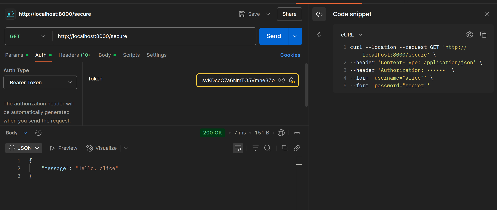
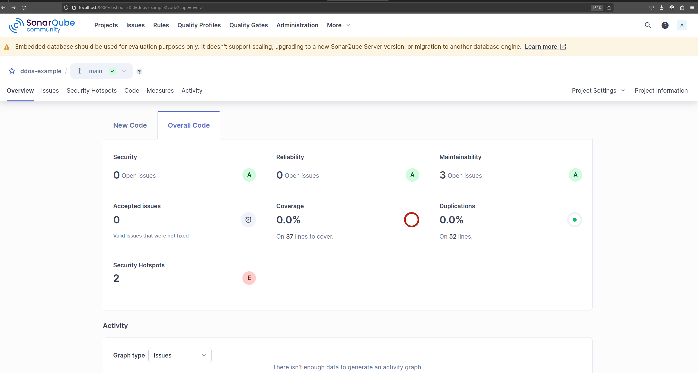

# Security

## Security Network Architecture

### Best Practices

1. gunakan `princple of least privilege`

2. gunakan `firewall` dan `IDS/IPS`

3. enkripsi data in-transit & storage

4. gunakan `VPN` untuk akses jarak jauh

5. pemantauan dan logging

6. update & patch rutin

### Segmentasi Jaringan

#### Segmentasi Tradisional (VLAN)

jaringan dibagi berdasarkan fungsi:

- `user` VLAN : komputer karyawan
- `app` VLAN : server app
- `DB` VLAN : server DB
- `web` VLAN/DMZ : server publik

tiap bagian diisolasi dgn `firewall` dan `switch`.


Kelebihan:

- mudah diterapkan
- biaya relatif rendah
- isolasi antar fungsi ok

kekurangan:

- kurang fleksibel
- keamanan terbatas : satu VLAN terinfeksi, seluruh segmen terdampak
- kurang cocok u/ cloud

#### Mikrosegmentasi

- menggunakan VM (virtual machine)
- setiap fungsi (`web`,`app`,`DB`)dipisah di level VM
- akses antar VM
- cocok u/ cloud & data center modern


kelebihan:

- keamanan tinggi
- fleksibel
- cocok u/ cloud

kekurangan:

- implementasi kompleks
- biaya lebih tinggi
- butuh skill teknis lebih

## Cloud Micro Segmentation


Terminologi:

- Internet
- AWS account
- VPC
- subnet
- route table
- server/services
- security group
- internet gateway
- NAT gateway


### Virtual Private Cloud (VPC)

### (HANDS-ON) Arsitektur VPC AWS dengan Brainboard

> file : `handson/brainboard_aws_vpc`

Langkah 1 : Akses [brainboard.co](https://app.brainboard.co/)

dari luar ke dalam

instances:

- `region`
- `vpc`
- `subnet`
- `Security Group`
- `RDS cluster`
- `DB Subnet Group`
- `Internet Gateway`
- `Route`
- `t2`
- `route table association`


konfigurasi masing-masing blok dengan klik kanan > `edit configuration`


output dari diagram ini adalah kode yang dapat digunakan pada `Terraform` untuk kemudian di-deploy di cloud services seperti AWS.

```java
resource "aws_vpc" "main" {
  tags       = merge(var.tags, {})
  cidr_block = "10.0.0.0/24"
}

resource "aws_subnet" "public" {
  vpc_id = aws_vpc.main.id
  tags   = merge(var.tags, {})
}

...
```

## Secure API Communication

### OAuth

standard terbuka untuk **otorisasi** (bukan otentikasi). `app` bisa dapat izin u/ akses data dari layanan lain tanpa harus minta `username` dan `password` scr langsung.

contoh : login ke app menggunakan Google dan Facebook.

menggunakan sistem token.


### JSON Web Token

Struktur JWT :


Mekanisme JWT:


### (HANDSON) API Security

**Langkah 1** : Buat projek

```tree
jwt-example
├── docker-compose.yml
├── Dockerfile
└── main.py
```

**Langkah 2** : Buat dan Jalankan container docker

```bash
docker compose up -d --build
```

**Langkah 3** : Test API dengan python




## DDoS

Distributed denial of services
membanjiri target (server/API) dgn trafik agar tidak bisa melayani permintaan say.

jenis:

- volumetric (UDP flood, ICMP flood)
  - membanjiri bandwidth server / infra ; koneksi lambat; jaringan penuh
  - UDP flood : kirim banyak paket UDP acak ke port acak
  - ICMP flood : banjiri dgn request echo
- protocol attack (SYN flood)
  - eksploitasi kelemahan lapisan protokol jaringan
  - SYN flood : kirim banyak paket SYN tanpa selesaikan 3 way handshake
  - efek : server tdk bisa terima request baru
- application layer (HTTP get flood)
  - tiru traifk pengguna sah u/ bebani aplikasi
  - HTTP GET flood : ribuatn `GET/` ke server
  - server sibuk proses request, jadi lambat atau crash.

Mitigasi :

- rate limiting


- algoritma:
  - tocketn bucket algorithm


  - leaky bucket algorithm


### (HANDSON) DDoS Example

**Langkah 1** : Buat struktur projek

```tree
.
├── app
│   ├── app.py
│   └── Dockerfile
├── docker-compose.yml
└── nginx
    └── default.conf
```

**Langkah 2** : Buat dan Jalankan Docker

```bash
docker compose up -d --build
```

**Langkah 3** : Coba akses aplikasi / lakukan Load testing

metode :

- manual access lewat web lalu restart berulang
- script shell untuk request berulang (menggunakan curl)
- JMeter
- Owasp ZAP

#### Tutorial Melakukan Port Forwarding

**Langkah 1** : Pada VScode, buka terminal,


**Langkah 2** : Pilih `Port`


**Langkah 3** : Buka linknya


### Secure Coding

- SQL Injection : input lngsng masuk ke DB tanpa disaring
- XSS : memasukkan script ke input pengguna
- Buffer Overflow : data melebihi kapasitas memori

#### Code vulnerabilities + Mitigasi

##### Harcoded secrets

- API key, password, token

```python
AWS_SECRET_KEY = "AKAIO94230FSAL4EXAMPLE" # ⚠️ tersimpan di sourcecode
```

- Mitigasi:
  - gunakan _environment variable_ (file `.env`) u/ simpan _secrets_
  - akses dgn library `os.getenv()`
  - tambahkan `.env` ke `.gitignore`
  - gunakan secret manager (AWS secret manager, HashiCorp Vault, dsb.)

##### Improper input validation / injection

```python
user_input = input("Masukkan id: ")
query = f"SELECT * FROM users WHERE id = {user_input}"
cursor.execute(query)   # ⚠️langsung eval() tanpa sanitasi
```

- mitigasi
  - parameterized queries / ORM (SQLAlchemy, Django ORM)
  - hindari fungsi-fungsi tidak aman seperti `eval()`, `exec()`
  - validasi & sanitasi input (_whitelist approach_)

##### Broken access control

- tidak ada pengecekan otorisasi, akses objek langsung lewat ID, validasi hanya di sisi client.

```python
@app.route("/admin/data")
def admin_data():
  return get_all_user_data()  # ⚠️tidak ada pengecekan apakah admin
```

- mitigasi:
  - RBAC di backend
  - hindari logika akses hanya di frontend
  - uji keamanan endpoint (dgn postman tanpa login)

##### outdated/vulnerable dependencies

```python
flask==0.12   # ⚠️ versi yg rentan thdp bbrp CVE (common vulnerabilities & exposures)
```

- mitigasi :
  - tool software composition analysis (SCA)
  - update dependensi scr berkala
  - `dependabot` dan `renovate`

### (HANDSON) SonarQube

alternatif metode:

- SonarQube
- sonarqube.io (cloud) -> melalui web
- sonar-scanner (CLI)

**Langkah 1** : Siapkan kode untuk dilakukan scanning

misalkan kita pakai `/handson/ddos_example`

**Langkah 2** : jalankan sonarQube pada komputer

2.1 akses `localhost:9000` lalu login dengan kredensial `username` : `admin` dan `password` : `admin`. Setelah itu ubah `password` default.

2.2 Pada terminal pindah ke direktori proyek lalu lakukan scanning

```bash
sonar-scanner \
  -Dsonar.projectKey=ddos-example \
  -Dsonar.sources=. \
  -Dsonar.host.url=http://localhost:9000 \
  -Dsonar.token=xxxxxxxxxxxxxxxxxxxxxxxxxxxxxxxxxxxx
```
<!-- sonar.token=sqp_12aa0fc6af012cadf7176e92ea911bfd350d9afb -->

**Langkah 3**: Lihat hasil scanning pada Dashboard sonarqube

```url
http://localhost:9000/dashboard
```



## Catatan Tambahan

### Instalasi SonarQube

**Langkah 1** : Download [SonarQube](https://www.sonarsource.com/products/sonarqube/downloads/success-download-community-edition/)

**Langkah 2** : Ekstrak zip dan pindahkan ke lokasi standard (LINUX)

```bash
unzip sonarqube-25.6.0.109173.zip
mv sonarqube-25.6.0.109173 /opt/sonarqube
```

**Langkah 3** : Konfigurasi

```bash
nano /opt/sonarqube/conf/sonar-properties
```

uncomment:

```conf
# Uncomment dan sesuai kebutuhan
sonar.web.host=0.0.0.0
sonar.web.port=9000
```

```bash
sudo nano /etc/systemd/system/sonarqube.service
```

```conf
[Unit]
Description=SonarQube Service
After=network.target

[Service]
Type=simple
User=sonarqube
Group=sonarqube
Restart=always
ExecStart=/opt/sonarqube/bin/linux-x86-64/sonar.sh console

[Install]
WantedBy=multi-user.target
```

### Instalasi sonar-scanner

**Langkah 1** : download zip [sonar-scanner](https://docs.sonarsource.com/sonarqube-server/10.8/analyzing-source-code/scanners/sonarscanner/)

**Langkah 2** : tambahkan sonar-scanner ke path

```bash
unzip sonar-scanner-cli-7.1.0.4889-linux-x64.zip                  # unzip folder
mv sonar-scanner-cli-7.1.0.4889-linux-x64 /opt/sonar-scanner      # pindahkan ke direktori standard
echo 'export PATH=$PATH:/opt/sonar-scanner/bin' >> $HOME/.bashrc  # tambahkan ke path
source $HOME/.bashrc
```
