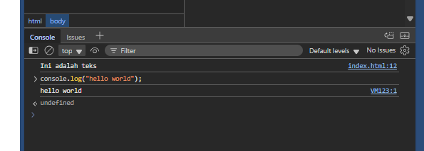
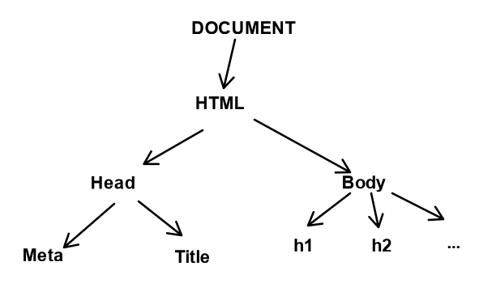

# Introduction to JavaScript

javascript awalnya adalah bahasa pemrograman front-end dan lihat di console browser.

cara menjalankan javascript di terminal:
```
node <nama_file>.js
```

cara menggunakan JS:
- tag `<script>`

`<script>` ditaruh sebelum body agar running terlebih dahulu.

kita bisa menguji JS di console inspect element.


javascript _statement_

## Variabel

rule of thumb penamaan variabel:
1. penamaan variabel harus deskriptif

hoisting -> declare di bawah, pemanggilan di atas.


scope:
1. block scope
2. universal scope

| **Karakteristik** | **Var** | **Let** | **Const** |
|------------------:|--------:|---------|-----------|
|             Scope |  global | local   | local     |
|         re-assign |       ✅ |       ✅ | ❌         |
|        re-declare |       ✅ | ❌       | ❌         |
| hoisting          |       ✅ | ❌       | ❌         |


- re-assign
- re-declare
```js
var age = 17
var age = 18
console.log(age)
```
- hoisting


`x = 3` -> _automatically_ sama dengan `var x = 3`

### Tipe data
1. Primitif
    - string
    - number
    - boolean
    - null
    - undefined
2. Kompleks

# Function

manfaat _function declaration_:
1. DRY (don't repeat yourself)
2. kode lebih rapih
3. reusable


# Callback

sebuah fungsi yang menjadi parameter fungsi

**Callback hell**
➡️callback di dalam callback
➡️sampai kode bertingkat seperti piramida.


contoh login fitur:
1. cek username dan password
2. cek role
3. ketika role admin, masuk ke dashboard admin. ketika user biasa, maka masuk ke halaman belanja.


# DOM



# Event listener
➡️ seperti 'sensor' yang siap siaga memperhatikan elemen tertentu misal tombol, input, gambar