<!-- Dirangkum oleh : Bostang Palaguna -->
<!-- Juni 2025 -->

# Cloud Security Best Practices

> pemateri : Muhammad Al Fikri, S.Tr.MP., M.T., CISA, CEH (Cybersecurity Analyst, Cyber Intelligence, Penata Layanan Operasional Pusat Sistem Informasi & Teknologi Keuangan, Kemenkeu ; lulus BSSN )

<!-- https://www.linkedin.com/in/muhammad-al-fikri-9b7b21106/ -->

## Pengenalan & Risiko Keamanan di CLoud

### On-premise vs Cloud

**Aspek pertimbangan**:

- **scalability**
  - biaya
  - fleksibilitas
  - pemeliharaan
- **storage server**
  - ukuran
  - power
  - pemeliharaan
- **security**
  - kompleksitas
  - data recovery
- **maintenance**
  - biaya & kompleksitas

### service model

- IaaS
  - AWS EC2, Google Compute Engine
- PaaS
  - Google App Engine, Heroku
- SaaS
  - Gmail, Office365

### Risiko keamanan Cloud Implementation

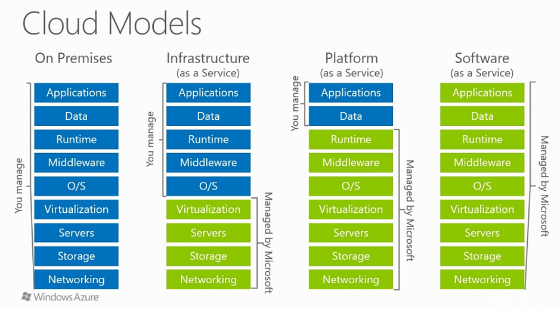

1. Misconfiguration

    - cloud sifatnya self service, highly customisable
    - `S3 bucket` : public read?
    - `mongoDB` : default authentication
    - human capital issue, tidak paham pengaturan

2. Kebocoran data

3. Lemahnya Identitiy & Access Management

    - **IAM**
    - semua user diberikan role admin (tidak diterapkan _principle of least privilege_)
    - tidak menerapkan **MFA**

4. Account Hijacking

    - password lemah, _phishing_, token / API key bocor

5. Insider Threats

    - karyawan / admin yg salahgunakan akses
    - remote access
    - tidak semua aktivitas user dicatat karena logging / audit tdk aktif.

### deployment model

- public cloud
- private cloud
- hybrid cloud

## Cloud Security Framework

- [Guidelines on Security and Privacy in Public Cloud Computing](https://www.nist.gov/publications/guidelines-security-and-privacy-public-cloud-computing)

- [Cloud Controls Matrix (CCM)](https://cloudsecurityalliance.org/research/cloud-controls-matrix)

2 jenis enskripsi:

- simetrik

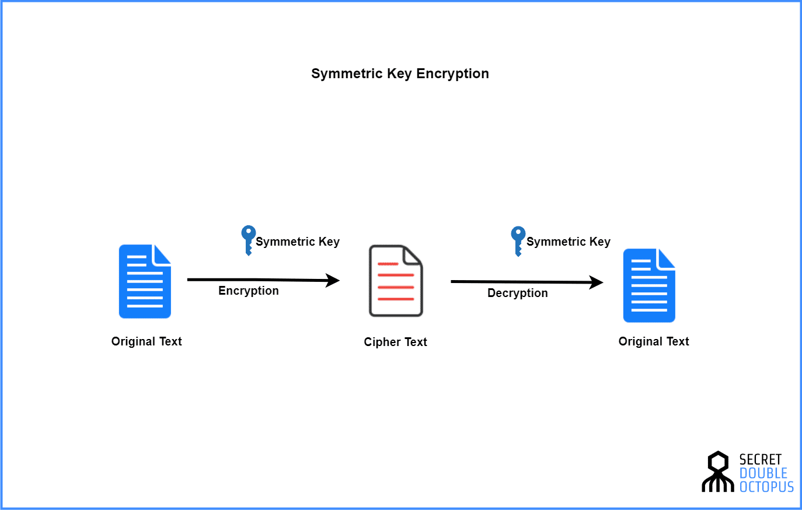

tools :

- [devglan](https://www.devglan.com/online-tools/aes-encryption-decryption)
- [em178](https://emn178.github.io/online-tools/aes/encrypt/)

- asimetrik

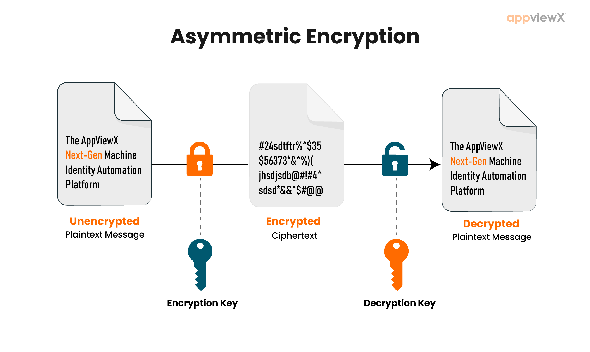

Salah satu contoh algoritma dibalik enkripsi asimetrik adalah [RSA](https://www.geeksforgeeks.org/computer-networks/rsa-algorithm-cryptography/)

## (HANDSON) Implementasi Cloud Security menggunakan AWS

**Langkah 0** : Buat sebuah S3 storage

`S3`

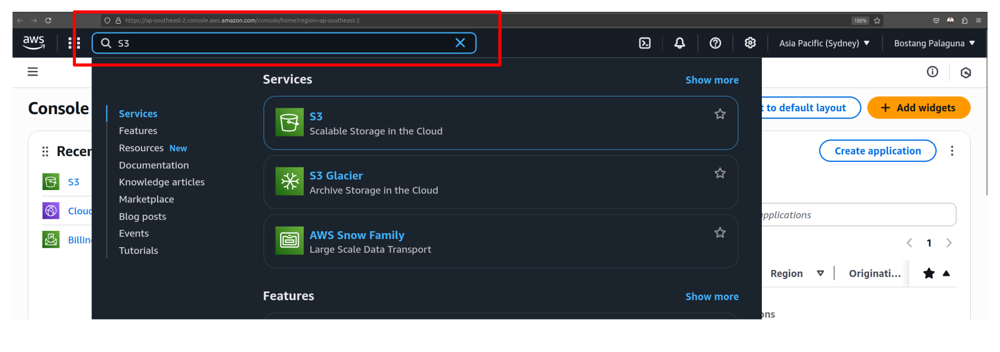

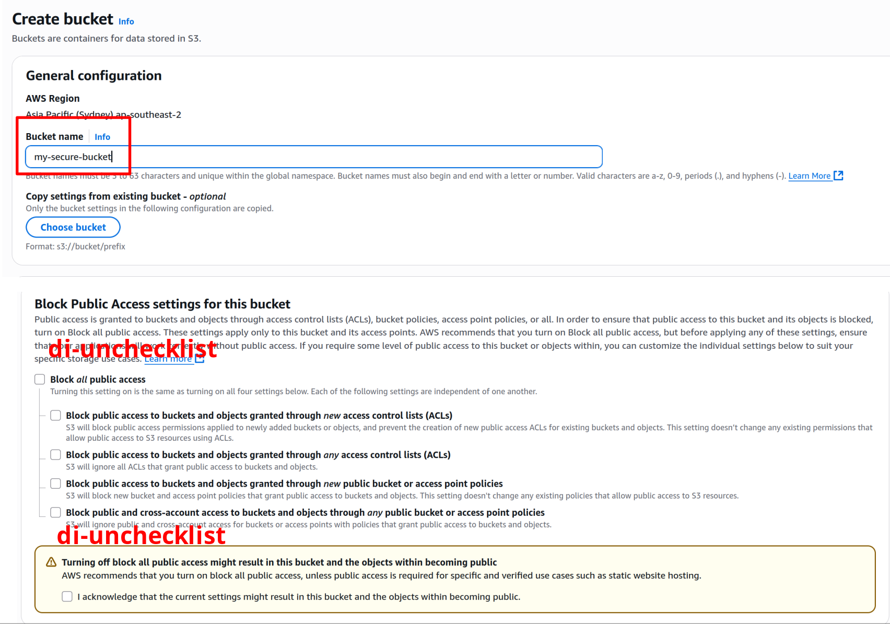

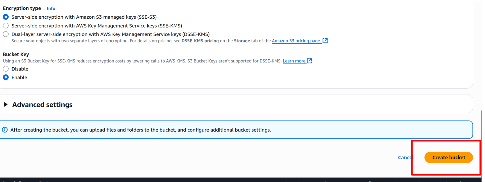

**Langkah 1** : Buat User admin

`IAM`

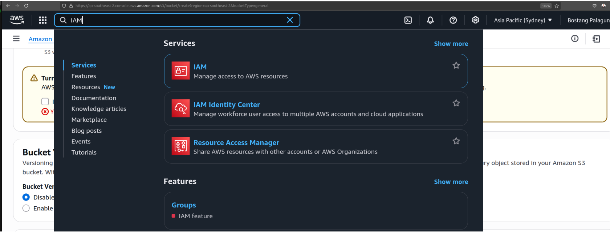

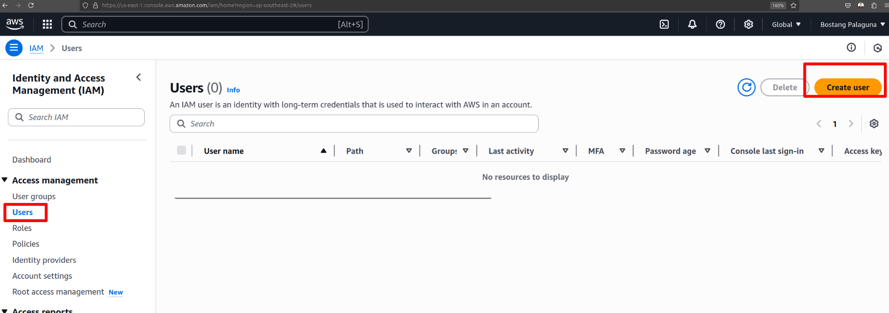

policy:

- AWSKeyManagementServiceCustomKey
- AWSKeyManagementServiceMultiRegion
- AWSKeyManagementServicePowerUser

**Langkah 2** : Buat User leaked_user

- S3ReadMe
- ChangePassword

**Langkah 3** : Login ketiga akun (root, admin, leaked_user) di 3 browser berbeda

catat juga AccountID

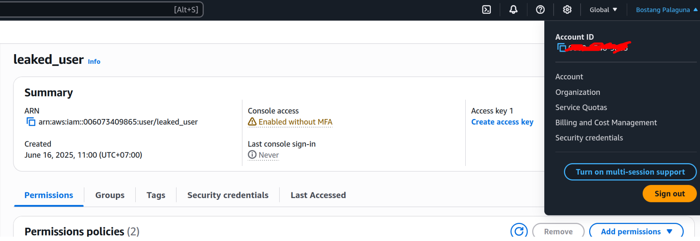

**Langkah 4** : Upload sample file (unecnrypted) menggunakan akun admin

pindah ke `S3` → pilih storage yang telah dibuat sebelumnya → lalu tekan `add files`

**Langkah 5** : Ubah pengaturan enkripsi S3 bucket

`S3` → Permission

**Langkah 6** : Key management service

buat key baru :

KMS → Customer Managed Keys → Create key

Key type: Symmetric

lalu tambahkan ke admin (untuk langkah 3 : Define key administrative permissions, define key usage permissions)

tambahkan konfigurasi S3 agar menggunakan SSE-KMS :

S3 → pilih bucket → Properties → Default Encryption → SSE-KMS

**Langkah 7** : coba upload file melalui user

**Langkah 8** : Coba download file menggunakan leaked_user

maka akan muncul pesan error karena key.

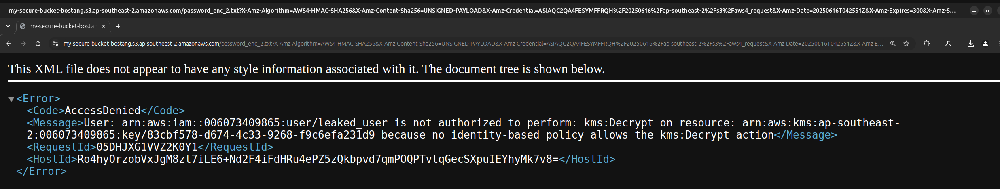

**Langkah 9** : Audit dan Monitoring

`CloudTrail`

## Penetration Testing Basic

### Konsep Dasar PenTest

Fokus/Perhatian testing bergeser ke kiri (awal) dari SDLC

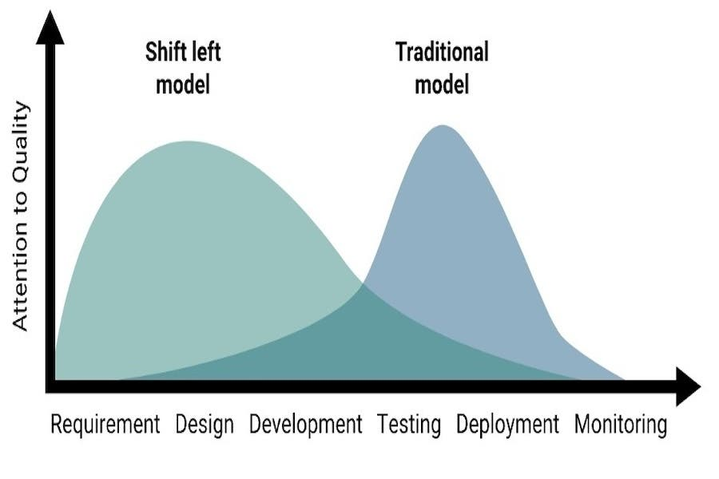


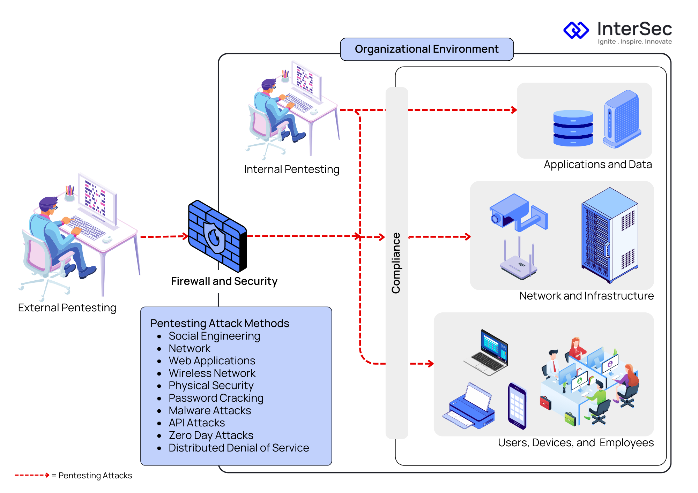

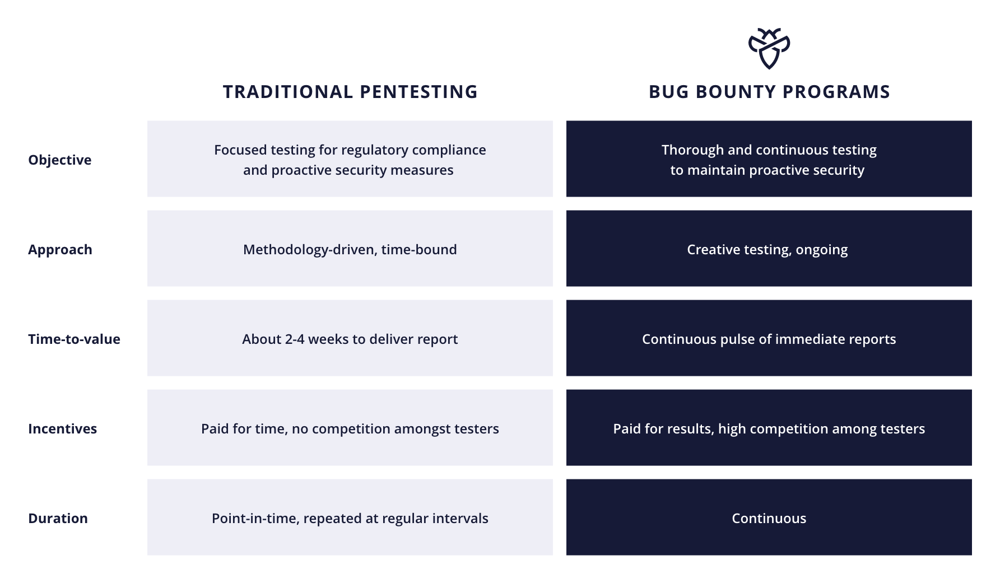

### Tools umum Ethical Hacking

- Wireshark
- NMAP
- Burpsuite
- OWASPZap
- Air crack-ng
- JohnRipper
- SQLMap
- Metasploit
- Hydra

- Kali Linux

### Cookie & Session

Cookie : menyimpan informasi login dan memungkinkan penyediaan konten personal -> menyimpan session id yang perlu aktif

Session : mekanisme pertahankan info pada sebuah halaman website

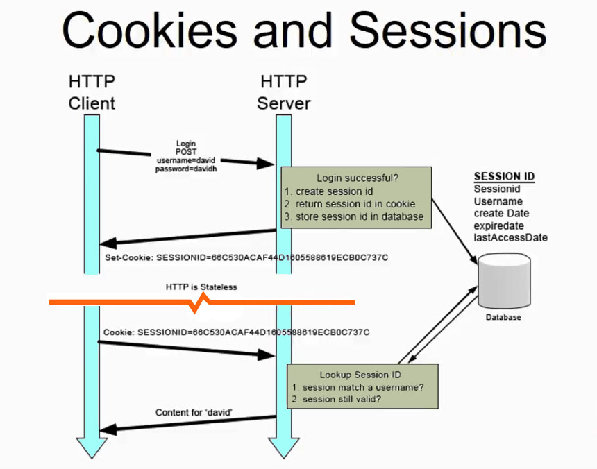

### Same Origin Policy

kebijakan yang memahami website berbeda u/ saling read & write. periksa 3 hal : protokol, host, port

bdskan SOP, browser blok cross origin read&write.

### (HANDS ON) : SQL Injection

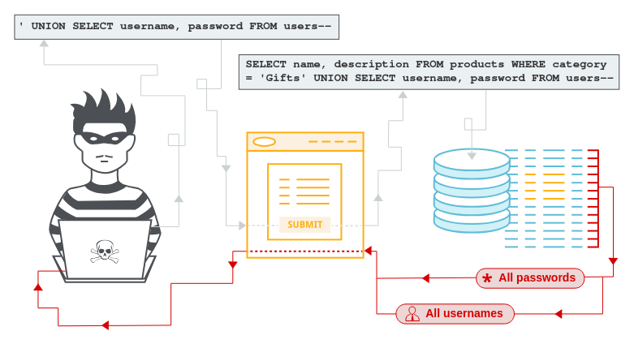

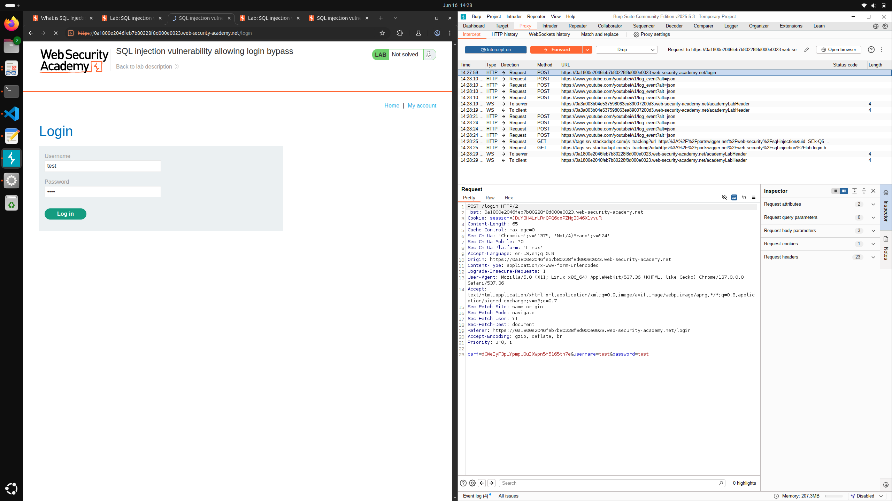

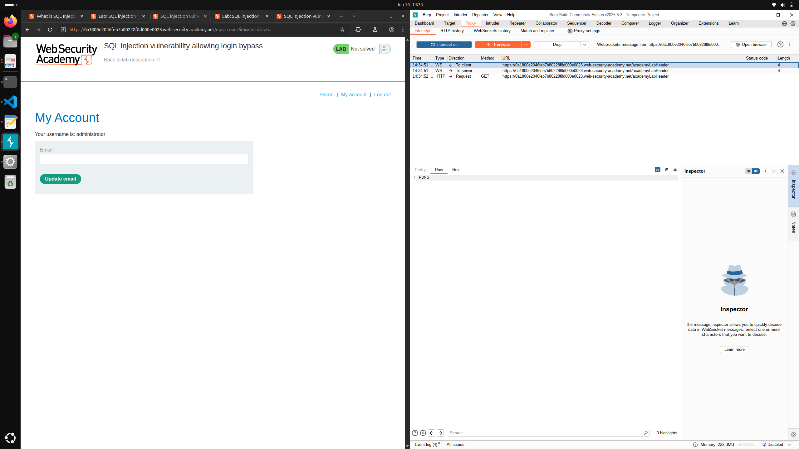

nyalakan intercept.

pada login masukkan : `user` : `test` , `password:` :`' OR 1==1 --`

tekan `forward` berulang kali.

## (HANDS ON) : XSS

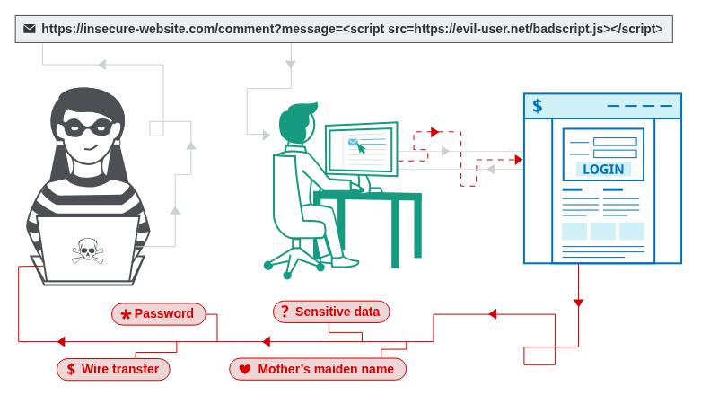

it allows an attacker to circumvent the same origin policy, which is designed to segregate different websites from each other. Cross-site scripting vulnerabilities normally allow an attacker to masquerade as a victim user, to carry out any actions that the user is able to perform, and to access any of the user's data.

ketika ada search bar, coba masukkan script.

`<script>alert(1)</script>`

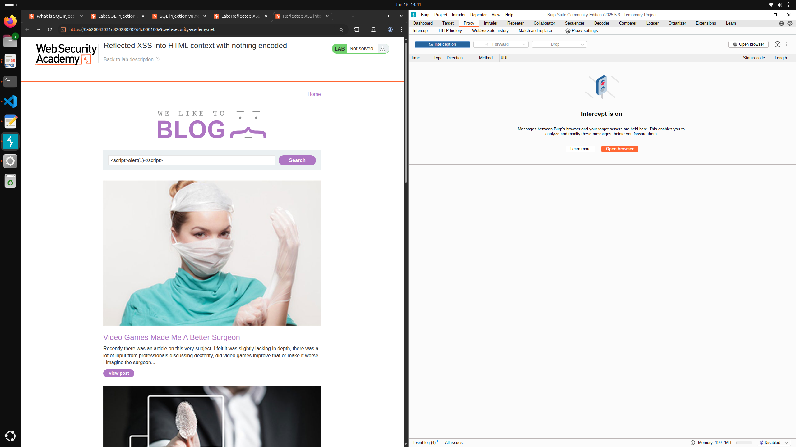

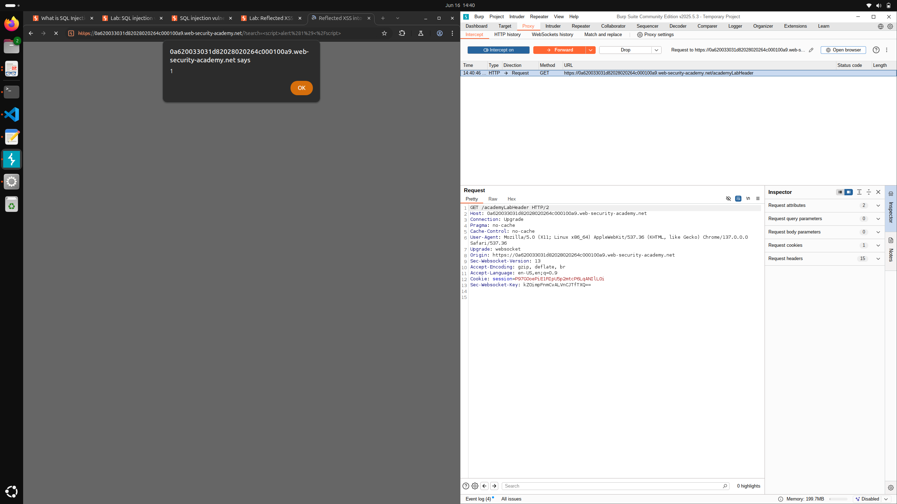

Google Dorking

`filetype:pdf [apa yang dicari]`

pada google search bar: `site:go.id inurl:index.php?id='`

coba pada situs yang mengembalikan error. kemungkinan besar bisa dilakukan XSS.

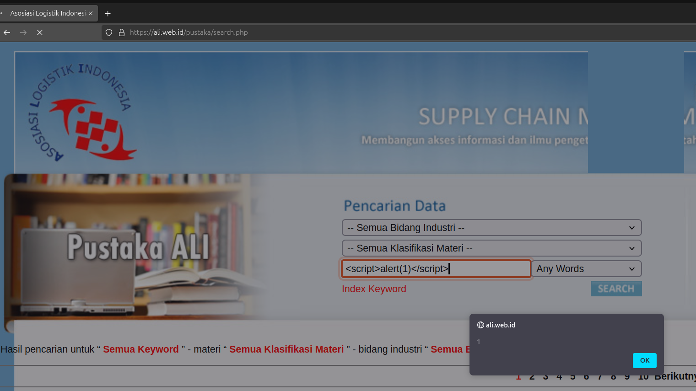

kalau mau melakukan pada banyak website sekaligus : web scraping dengan python.

## (HANDSON) NESSUS

mengapa perlu melakukan scanning menggunakan beberapa tools? untuk menghindari false positive

## Threat Hunting & Incident Reponse

cyber threat hunting :  Hypothesis > Investigation > Validation > Response & Resolution

### Teknik Dasar

- IOC (Indicator of Compromise)

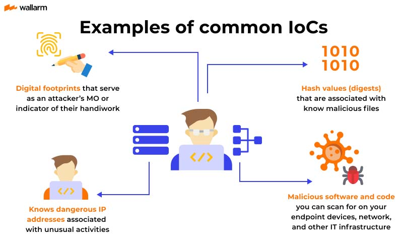

- TTP (Tactics, Techniques, and Procedures)
- Behavioral Analysis

### Tools u/ Threat Hunting

Splunk
ELKStack

### Incident Response

### (HANDS ON) Analisis Log

clue :

- Gunakan kata-kata kunci yang dicari oleh hacker dalam meretas
- Upaya untuk web defacemen

command yang digunakan

```bash
grep -n -i -E "'OR '1'='1|UNION SELECT|DROP TABLE|SELECT \* FROM|<\s*script|alert\(|eval\(|; rm -rf|\|\ cat /etc/passwd|\$(whoami)|\.\./|/etc/passwd|/etc/shadow|Failed password|invalid user|authentication failure|bash -i|nc -lvp|wget http://|curl http://|wp-admin|phpmyadmin|admin\.php|/\.git/" Log11.log Log12.log Log13.log
```

indiksai 1. Upaya path traversal

dan pengaksesan Konfigurasi Sensitif -> indikasi pencarian kredensial database

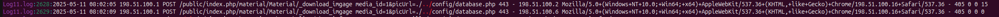

indikasi 2. Brute Force / Enumeration phpMyAdmin

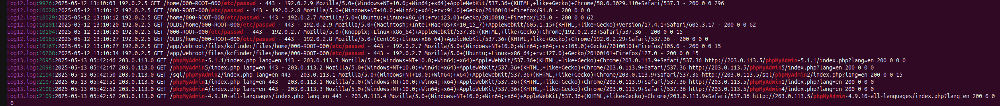

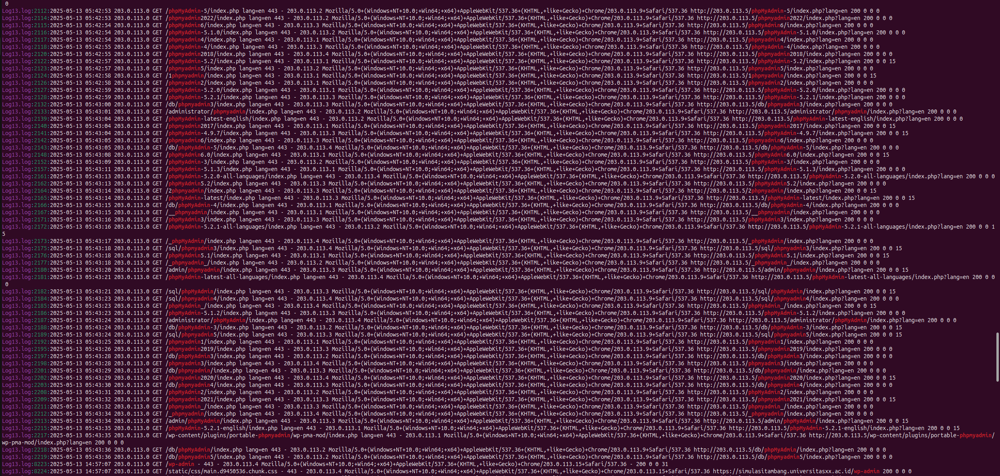

```bash
grep -i -n -E "POST /wp-content/|upload" Log11.log Log12.log Log13.log
```

Attacker mencoba mengunggah file jahat melalui endpoint ini

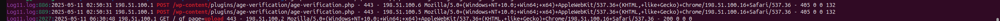

Attacker mencoba berbagai varian path upload

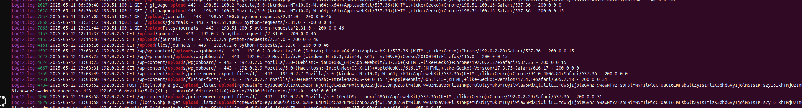

```directory
/upload/journals  
/uploads/journals  
/uploadFiles/journals  
/wp-content/uploads/wpjobboard/  
/wp-content/uploads/prime-mover-export-files/1/  
```

Eksploitasi Form Upload (XSS/RCE)

Ditemukan request dengan parameter berbahaya:

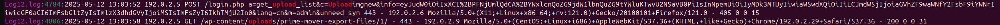

Mungkin upaya remote code execution melalui unggahan gambar yang dimanipulasi.

Banyak request mengembalikan status 200, artinya attacker mungkin berhasil mengaksesfile:

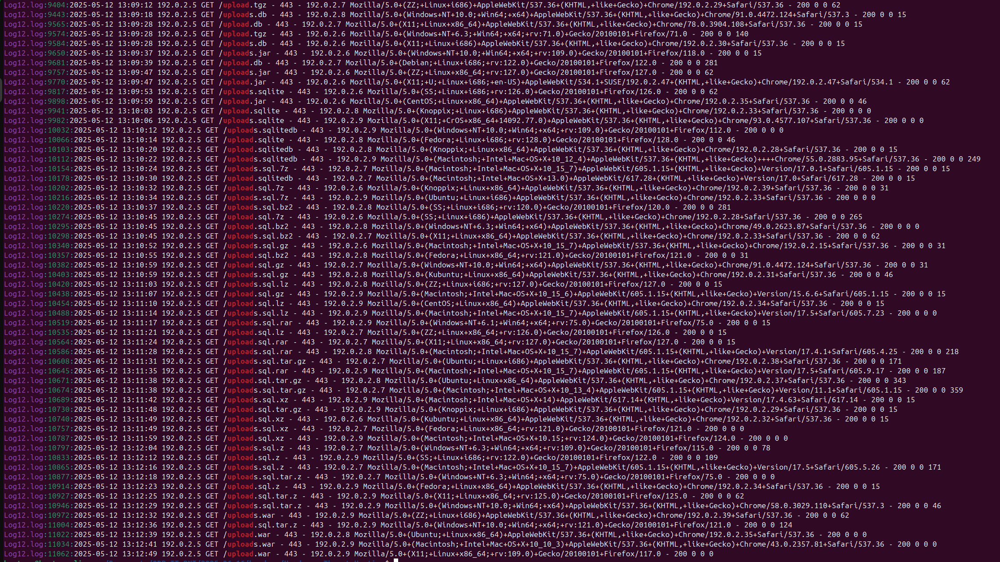

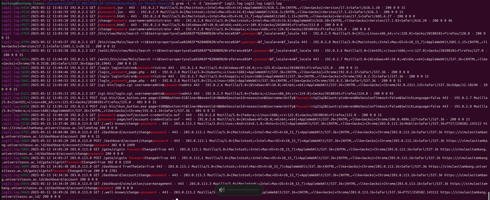

## Catatan Tambahan

[Password Monster](https://www.passwordmonster.com) : tools untuk mengecek kompleksitas password

[Have I Been Pwned](https://haveibeenpwned.com/) : tools untuk mengecek kebocoran data kita

[CekDPT](cekdptonline.kpu.go.id) : tools untuk cek data diri based on NIK

[nslookup](https://www.nslookup.io/) : untuk melihat IP dari suatu website

[Att&ck Mitre](https://attack.mitre.org/) : repostiory ilmu attacking

[exploit-DB](https://www.exploit-db.com/google-hacking-database) :

<!-- ### Etilasi
Elisitasi adalah proses menggali atau memunculkan informasi, opini, fakta, dan sebagainya dari seseorang, baik secara sadar maupun tidak sadar. Ini adalah teknik yang sering digunakan dalam intelijen, tetapi juga dalam berbagai bidang lain seperti konseling, pendidikan, dan pengembangan perangkat lunak.  -->

<!-- ### OSINT

Open Source Intelligence (OSINT) in cybersecurity involves gathering and analyzing publicly available information to assess threats, identify vulnerabilities, and improve security posture. -->

---
[🏠Back to Course Lists](https://odp-bni-330.github.io/)