<!-- Dirangkum oleh : Bostang Palaguna -->
<!-- Juni 2025 -->

# Database

## SQL Fundamental (Part 1)

### Intro to DB

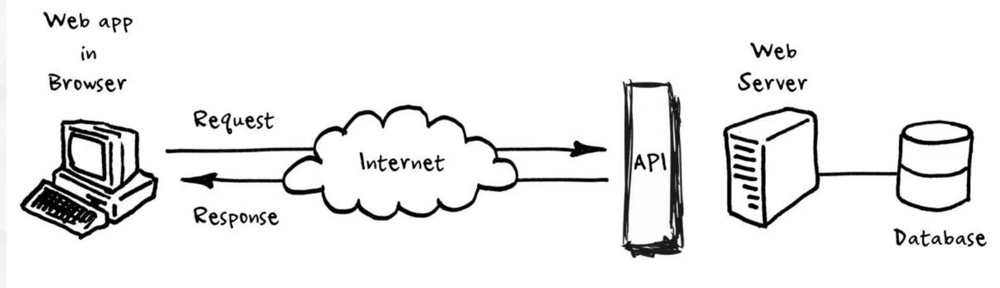

analogi :

Application : customer
Front-end : waiter
Backend : kitchen
Database : kulkas

kulkas bisa menyimpan satu jenis makanan (ada beberapa kulkas) atau banyak makanan (dalam 1 kulkas)

database berfungsi sebagai _wadah utama_ untuk menyimpan _data mentah_ agar dapat diolah mejadi informasi yang berguna.

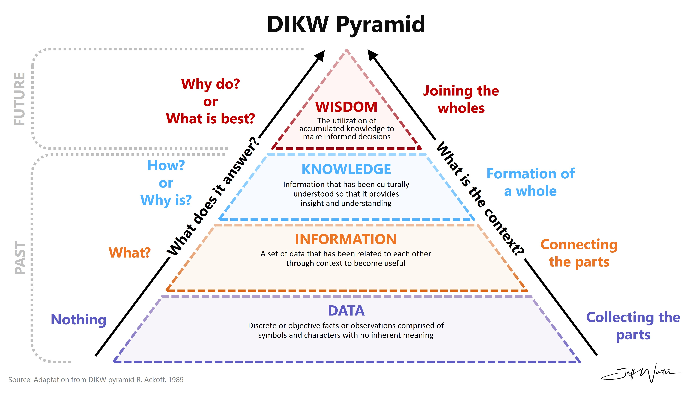

### Intro to RDBMS

Relational Database Management System

menggunakan model relasi tabel : saling berhubungan adanya primary key dan foreign key.

primary key : bersifat unik dan merepresentasikan data tersebut.

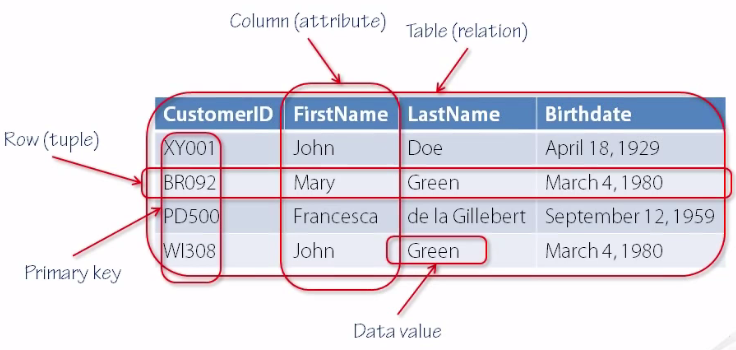

1 baris data : _record_

contoh : pada KTP terdapat NIK.

model dengan _composite primary key_

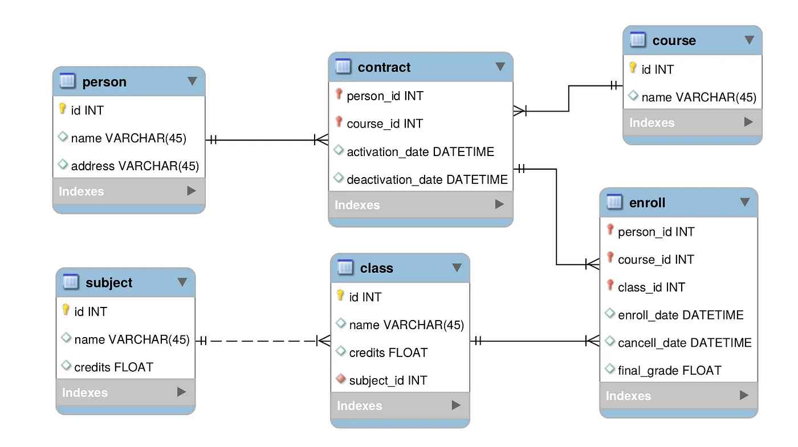

### Konsep SQL

Perintah yang digunakan u/ komunikasi dgn DB

- DDL - Data definition language
    u/ definisi, unbah, hapus struktur DB seperti table, indeks, skema.
    `CREATE`,`DROP`,`ALTER`,`TRUNCATE`
- DQL - Data Query language
    u/ ambila data dari DB
    `SELECT`
- DML - Data Manipulation Language
    u/ manipulasi data yg ada di basis data
    `INSERT`, `UPDATE`, `DELETE`, `CALL`, `EXPLAIN CALL`, `LOCK`
- DCL - Data control language
    u/ kontrol akses ke data dalam DB (beri/cabut izin)
    `GRANT`, `REVOKE`
- TCL - Transaction Control language
    u/ tangani transaksi dlm DB
    `COMMIT`, `SAVEPOINT`, `ROLLBACK` `SET Transaction` `SET Constraint`

### (HANDS-ON) SQL Dasar

**Langkah 0** : buka terminal

```bash
# terhubung ke postgreSQL dengan user 'postgres' (admin)
psql -U postgres

# membuat database baru bernama bostang
createdb -U postgres bostang

psql -U bostang # konek sbg bostang

# menampilkan list database
\l 

# buat database
CREATE DATABASE nama_database

# terhubung (konek) ke database
\c nama_database

# menampilkan daftar tabel di dalam database
\d 
```

### (HANDS-ON) Study Case

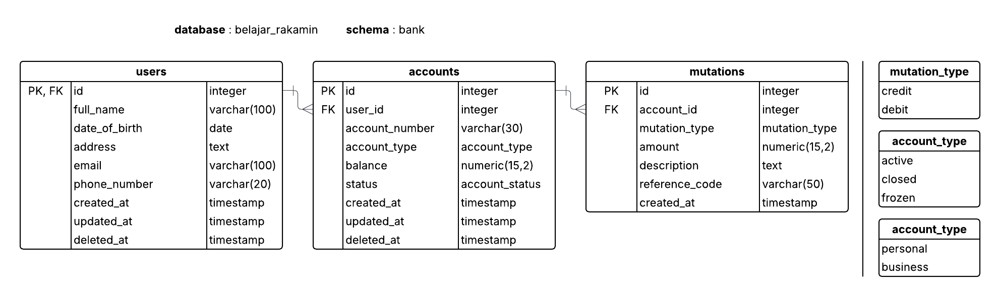

#### Kasus

seorang DB engineer, bekerja di bank digital. setiap nasabah (`users`) bisa memiliki satu/lebih rekening bank (`accounts`). Setiap rekening punya riwayat saldo (`balance`) dan riwayat mutasi transaksi (`mutations`).

#### Langkah

> catatan : ini dapat dilakukan juga menggunakan psql (command line), pgAdmin, atau VSCode (extension postgreSQL)

**Langkah 1** : Konek ke DB PostgreSQL menggunakan DBeaver

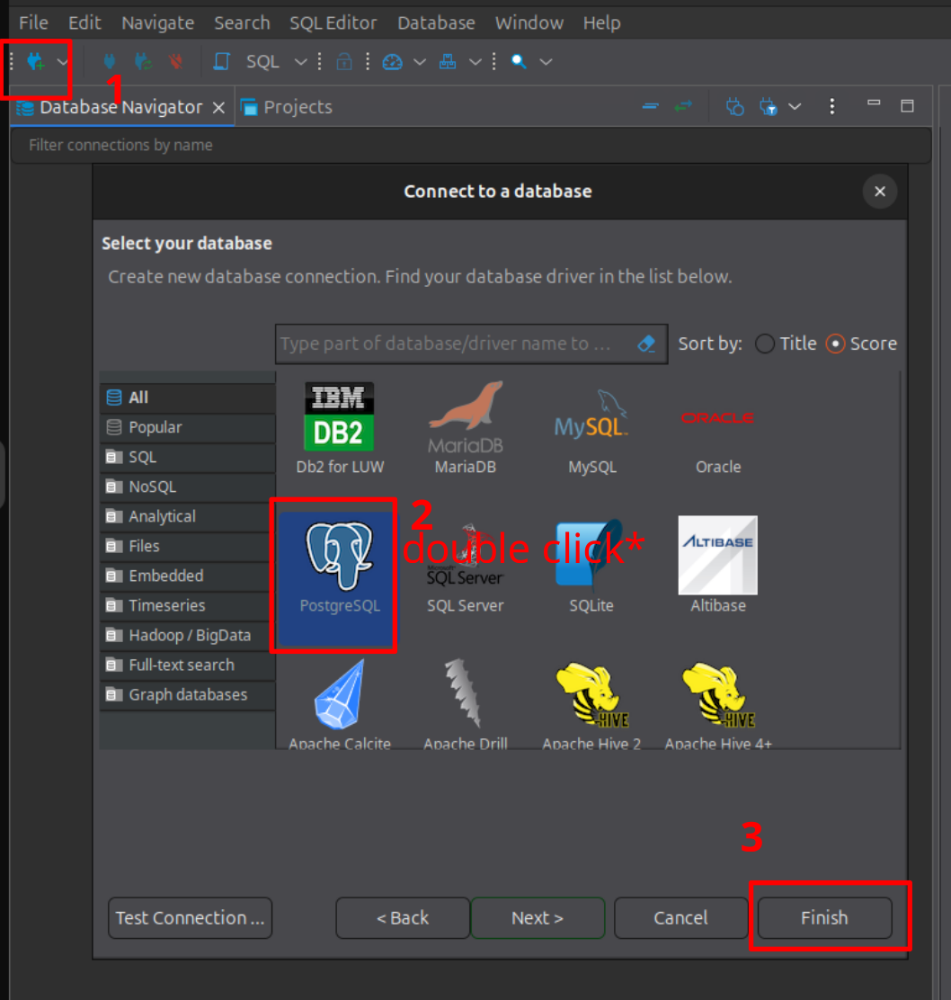

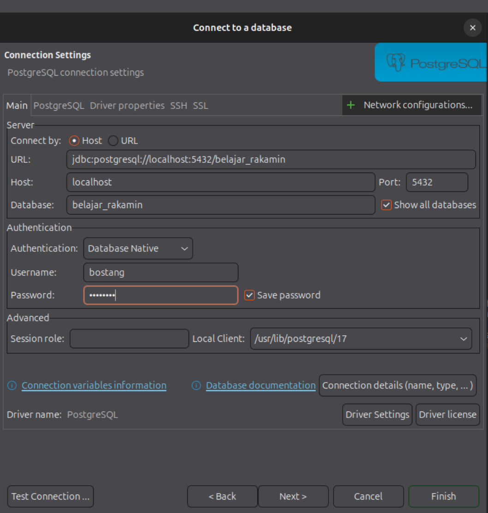

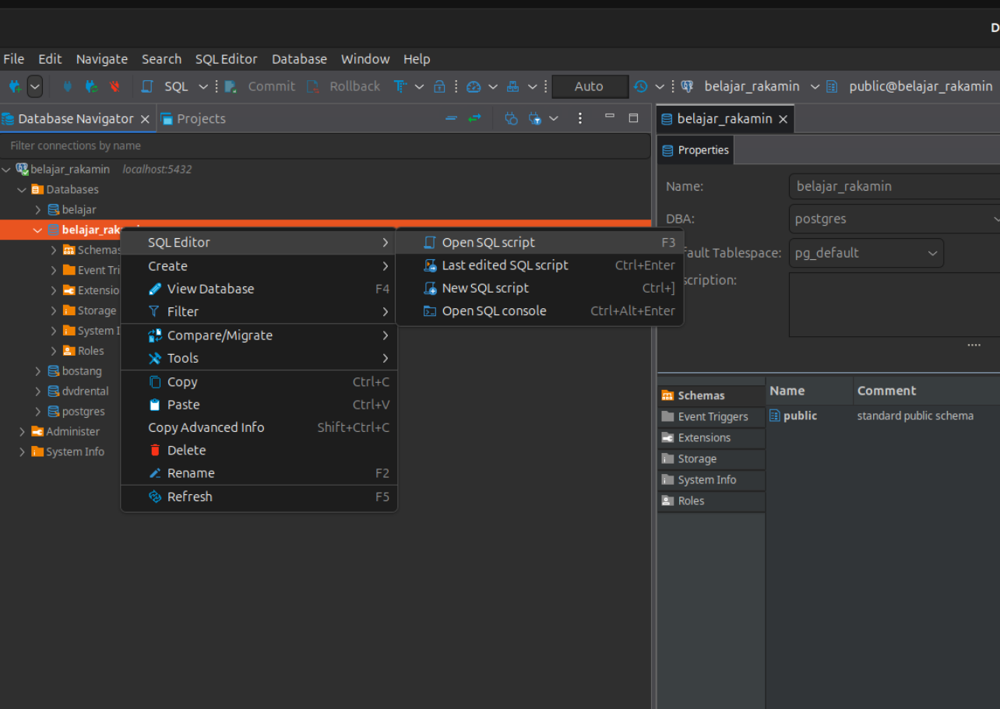

**Langkah 2** : Buat Tabel users

```sql
CREATE TABLE users (
    id SERIAL PRIMARY KEY,          -- SERIAL : fitur auto incremenet ; atur sbg PRIMARY KEY
    full_name VARCHAR(50) NOT NULL,     -- NOT NULL : tidak boleh kosong
    date_of_birth DATE NOT NULL,
    address TEXT,
    email VARCHAR(50) UNIQUE,           -- UNIQUE : harus unik
    phone_number VARCHAR(20),
    created_at TIMESTAMP DEFAULT CURRENT_TIMESTAMP,
    updated_at TIMESTAMP DEFAULT CURRENT_TIMESTAMP,
    deleted_at TIMESTAMP            -- untuk soft delete (apabila ada nilainya, sudah terhapus)
);
```

**Langkah 3** : Buat Tabel accounts

```sql
CREATE TYPE account_type AS ENUM ('personal','business');

CREATE TYPE account_status AS ENUM ('active','frozen','closed');

CREATE TABLE accounts (
    id SERIAL PRIMARY KEY,
    user_id INTEGER NOT NULL REFERENCES users(id) ON DELETE CASCADE,
    account_number VARCHAR(30) UNIQUE NOT NULL,
    account_type account_type DEFAULT 'personal',
    balance NUMERIC(15, 2) DEFAULT 0.00,            -- maksimal 15 digit, 2 angka di belakang koma (precision)
    account_status DEFAULT 'active',
    created_at TIMESTAMP DEFAULT CURRENT_TIMESTAMP,
    updated_at TIMESTAMP DEFAEULT CURRENT_TIMESTAMP,
    deleted_at TIMESTAMP
);
```

**Langkah 4** : Buat tabel mutations

```sql
CREATE TYPE mutation_type AS ENUM ('credit','debit');

CREATE TABLE mutations (
    id SERIAL PRIMARY KEY,
    account_id INTEGER NOT NULL REFERENCES accounts(id) ON DELETE CASCADE,
    mutation_type mutation_type NOT NULL,   -- ENUM : 'credit' / 'debit'
    amount NUMERIC(15,2) NOT NULL CHECK (amount > 0),
    description TEXT,
    reference_code VARCHAR(50),
    created_at TIMESTAMP DEFAULT CURRENT_TIMESTAMP
);
```

**Langkah 5** : Memasukkan data ke tabel

```bash
INSERT INTO users (full_name, date_of_birth, address, email, phone_number)
VALUES
('Abdul Kharim','1990-02-15','Jakarta','AbdulKar013@gmail.com','089321252343');

# menampilkan users ynag ada
SELECT * FROM users;
```

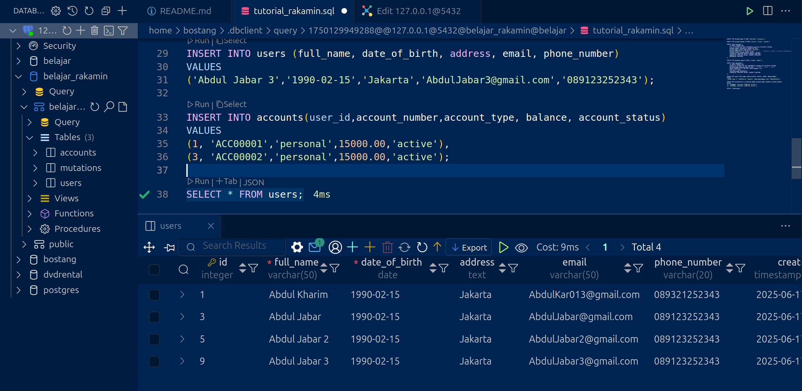

**Langkah 6** : Menambah elemen ke tabel accounts

```sql
INSERT INTO accounts(user_id,account_number,account_type, balance, account_status)
VALUES
(1, 'ACC00001','personal',15000.00,'active'),
(1, 'ACC00002','personal',15000.00,'active'),
(1, 'ACC00003','personal',15000.00,'active');
```

**Langkah 7** : Menghapus elemen dari tabel

```sql
DELETE FROM accounts WHERE users_id = 'ACC00002';
```

**Langkah 8** : Update elemen

```sql
UPDATE users
SET
    full_name = 'Abdul Jabar Baru',
    address = 'Bekasi',
WHERE id=5;
```

### SQL Commands

#### Filtering

```sql
-- query semua user dengan ada kata 'Ki' pada full_name
SELECT * FROM users WHERE full_name LIKE '%Ki%';

-- tanggal lahir lebih tua dari date_of_birth
SELECT * FROM users WHERE date_of_birth < '2002-04-19';

--tanggal lahir antar rentang tertentu
SELECT * FROM users WHERE date_of_birth BETWEEN '2002-04-19' AND '2002-05-19';

-- tahun lahir kurang dari 2000
SELECT * FROM users WHERE extract(year FROM date) < 2000; 
```

#### Group By

```sql
-- menampilkan jumlah akun debit dan kredit
SELECT
    mutation_type,
    COUNT(*) AS mutation_count
FROM mutations
GROUP BY mutation_type;
```

```sql
SELECT
    status,
    COUNT(*)
FROM accounts
GROUP BY status;
```

#### Having

```sql
SELECT
    account_id,
    COUNT(*) AS total_numbers
FROM mutations AS m -- sama saja dengan 'mutations m'
GROUP BY account_id
HAVING COUNT(*) > 1; -- disandingkan dengan agregat ; apabila menggunankan WHERE : error
-- `HAVING` : saring setelah data dikelompokkan
-- `WHERE : sebelum data dikelompokkan`
```

> WHERE and HAVING clauses both filter data, but they work at different stages of the query execution and apply to different levels of data. WHERE filters individual rows before any grouping or aggregation, while HAVING filters groups of rows after they've been grouped or aggregated

#### Join

menggabungkan tabel

`LEFT JOIN`
`RIGHT JOIN`
`FULL JOIN`
`INNER JOIN`

```sql
SELECT
    users.full_name,
    account.account_number
FROM users                          -- tabel kiri
INNER JOIN accounts                 -- tabel kanan
ON users.id = accounts.user_id;
```

```sql
SELECT
    u.id,
    u.full_name,
    a.account_number
FROM users AS u
LEFT JOIN accounts AS a
ON u.id = a.user_id
ORDER BY u.id DESC
LIMIT 10;
```

Melakukan join dua kali (tabel perantara)

Menampilkan setiap akun punya total mutasi berapa

```sql
SELECT
    u.id,
    u.full_name,
    SUM(m.amount)
FROM users AS u
FULL OUTER JOIN accounts AS a
    ON u.id = a.user_id
FULL OUTER JOIN mutations AS m
    ON a.id = m.account_id
GROUP BY u.id
ORDER BY u.id DESC
LIMIT 20;
```

Menampilkan 10 akun dengan account number tak kosong (terurut dari id user yang terbesar)

```sql
SELECT *
FROM users AS u
LEFT JOIN accounts AS a
    ON u.id = a.user_id
WHERE a.account_number IS NULL
ORDER BY u.id DESC
limit 10;
```

#### Aggregation

-> merangkum sekelompok data menjadi satu nilai

- `COUNT()` : jumlah baris
- `SUM()`   : total penjumlahan
- `AVG()`   : rata-rata
- `MAX()`   : nilai maksimal
- `MIN()`   : nilai minimal

Nominal mutasi terbesar, terkecil, rata-rata dari 10 id pertama

```sql
SELECT
    MAX(m.amount) AS max_mutation,
    MIN(m.amount) AS min_mutation,
    AVG(m.amount) AS avg_mutation
FROM mutations AS m
WHERE m.id BETWEEN 1 AND 10;
```

Hitung setiap account punya total jumlah mutasi berapa

```sql
SELECT
    a.id,
    a.account_number,
    SUM(m.amount) AS sum_mutation
FROM accounts AS a
INNER JOIN mutations AS m
    ON a.user_id = m.account_id
GROUP BY a.id
LIMIT 10;
```

Menghitung jumlah mutasi yang dimiliki suatu akun

```sql
SELECT
    a.id,
    a.account_number,
    COUNT(m.amount) AS count_of_mutation
FROM accounts AS a
INNER JOIN mutations AS m
    ON a.user_id = m.account_id
GROUP BY a.id
ORDER BY count_of_mutation DESC
LIMIT 10;
```

Menampilkan akun dengan total nominal mutasi yang kurang dari 1000

```sql
SELECT
    a.id,
    SUM(m.amount) AS total_mutation
FROM account AS a
INNER JOIN mutations AS m
    ON a.id = m.account_id
WHERE total_mutation < 1000;
```

menampilkan lima users dengan jumlah total balance terbanyak tetapi kurang dari 2jt

```sql
SELECT
    u.id,
    SUM(a.balance) AS total_balance
FROM users AS u
INNER JOIN accounts AS a
    ON u.id = a.user_id
GROUP BY u.id
HAVING SUM(a.balance) < 2000000
ORDER BY total_balance DESC
LIMIT 5;
```

#### Indexing & Optimization

Cara kerja query : sekuensial ke kanan lalu ke bawah

Index : struktur data tambahan u/ percepat pencarian.

```sql
-- Membuat index
CREATE INDEX idx_users_email ON users(email);

```

Menggunakan query planner

```sql
EXPLAIN ANALYZE
SELECT * 
FROM mutations AS m
WHERE
    m.account_id = 4;
```

Menampilkan index yang sudah ada:

```sql
SELECT *
FROM pg_indexes
WHERE tablename = 'mutations'
```

Menghapus index

```sql
DROP INDEX [nama_index]
```

tanpa indeks:
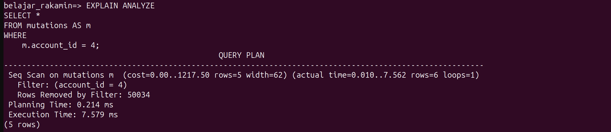

membuat indeks:

```sql
CREATE INDEX idx_account_id_in_mutations
ON mutations(account_id)
```

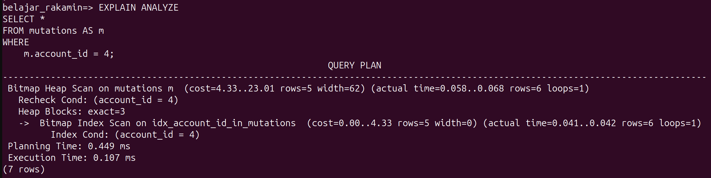

Salah satu algoritma yang digunakan : [BTree](https://www.cs.usfca.edu/~galles/visualization/BTree.html):

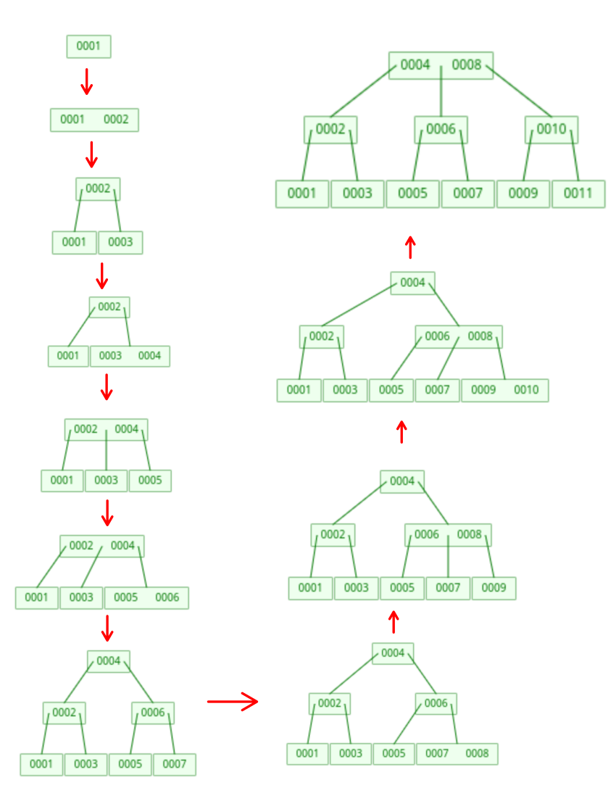

## Catatan Tambahan

### Cara atur butuh prompt password / tidak

```bash
# akses file konfigurasi untuk Client Authentication
sudo vim /etc/postgresql/17/main/pg_hba.conf
```

lakukan perubahan permission local dari :

```conf
# "local" is for Unix domain socket connections only
local   all             all                                     trust
```

menjadi :

```conf
# "local" is for Unix domain socket connections only
local   all             all                                     scram-sha-256
```

### Cara ubah password dari suatu user

```bash
sudo -u postgres psql -c "ALTER USER nama_user WITH PASSWORD 'password-baru-yang-kuat';"
```

### Cara beri permission untuk buat tabel

```bash
# sintaks:
    # GRANT CREATE ON DATABASE database_name TO username;
sudo -u postgres psql -c "ALTER USER nama_user WITH PASSWORD 'password-baru-yang-kuat';"
```

```bash
# buat database belajar_rakamin
sudo -u postgres psql -c "CREATE DATABASE belajar_rakamin;"
```

```bash
# beri izin untuk buat tabel pada database belajar_rakamin ke user : bostang
sudo -u postgres psql -c "GRANT CREATE ON DATABASE belajar_rakamin TO bostang;"
```

> catatan : setiap ada perubahan hak akses, seringkali dibutuhkan PC untuk reboot

### Schema

```bash
# buat skema
CREATE SCHEMA [nama_skema];

# beri kewenangan untuk user
GRANT ALL PRIVILEGES ON SCHEMA [nama_skema] TO [user];

# beri kewenangan untuk query
GRANT SELECT ON ALL TABLES IN SCHEMA [nama_skema] TO [user];


# menampilkan schema yang ada 
\dn 

# mengatur schema yang dipakai
SET search_path TO [nama_skema];

# melihat skema sekarang
SELECT CURRENT_SCHEMA();

```

```sql
-- remove all data from the animals table quickly ; index reset 
TRUNCATE TABLE table_name;

-- remove all data from the animals table quickly ; index tidak di-reset
DROP TABLE table_name;
```

### Cara konversi balik dari PostgreSQL Dump ke Command

pg_restore, when run without a database name, outputs a text dump to stdout; you can send that elsewhere with -f or with I/O redirection.

```bash
pg_restore -f mydatabase.sql mydatabase.dump 
```

Note that you must ensure there's no `PGDATABASE` environment variable set, or it'll try to connect to that database.

### Cara menjalankan file sql

**Langkah 1** : Pindah ke direktori tempat terdapat file .sql

**Langkah 2** : Masuk ke postgresql (CLI)

```bash
psql -U postgres # sebagai superadmin
```

```sql
-- sintax : 
    -- \i [nama_file_sql].sql
\i bank.sql
```

---
[🏠Back to Course Lists](https://odp-bni-330.github.io/)
