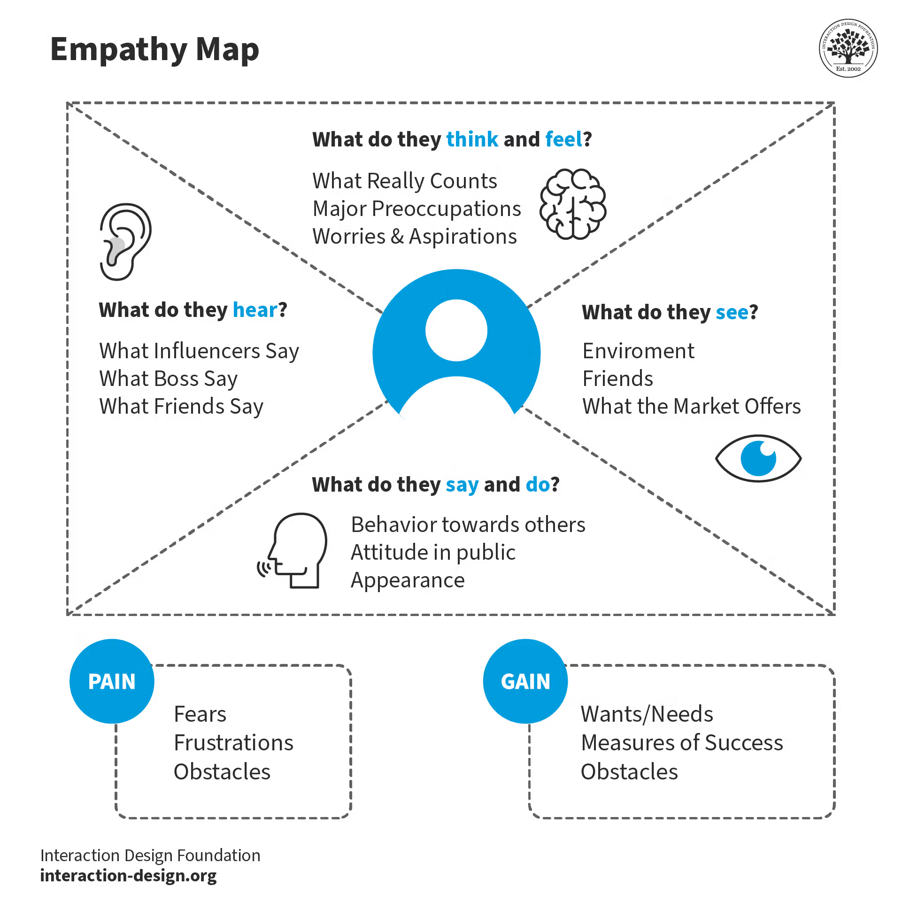

# Soft Skill

## Empathy Map

- Sympathy
- Empathy
- Compassion

## Active Listening

There are five key elements of active listening. They all help you ensure that you hear the other
person, and that the other person knows you are listening to what they say.

1. Pay attention.
    - Give the speaker your undivided attention, and acknowledge the message. Recognize that non-
    - verbal communication also "speaks" loudly.
    - Look at the speaker directly.
    - Put aside distracting thoughts. Don't mentally prepare a rebuttal!
    - Avoid being distracted by environmental factors.
    - "Listen" to the speaker's body language.
    - Refrain from side conversations when listening in a group setting.
2. Show that you are listening.
    - Use your own body language and gestures to convey your attention.
    - Nod occasionally.
    - Smile and use other facial expressions.
    - Note your posture and make sure it is open and inviting.
    - Encourage the speaker to continue with small verbal comments like “Yes” and “Aha”.
3. Provide feedback.
    - Our personal filters, assumptions, judgments, and beliefs can distort what we hear. As a listener,
    - your role is to understand what is being said. This may require you to reflect what is being said and ask questions.
    - Reflect what has been said by paraphrasing. "What I'm hearing is" and "Sounds like you are saying" are great ways to reflect back.
    - Ask questions to clarify certain points. "What do you mean when you say", "Is this what you mean?"
    - Summarize the speaker's comments periodically.
4. Defer judgment.
    - Interrupting is a waste of time. It frustrates the speaker and limits full understanding of the message.
    - Allow the speaker to finish.
    - Don't interrupt with counter arguments.
5. Respond Appropriately.
    - Active listening is a model for respect and understanding. You are gaining information and perspective. You add nothing by attacking the speaker or otherwise putting him or her down.
    - Be candid, open, and honest in your response.
    - Assert your opinions respectfully.
    - Treat the other person as s/he would want to be treated.
