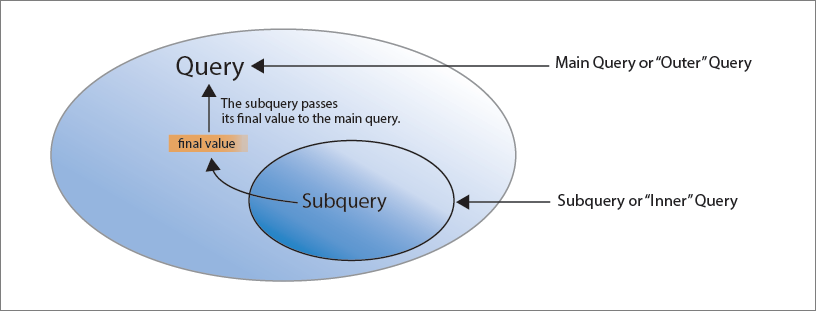
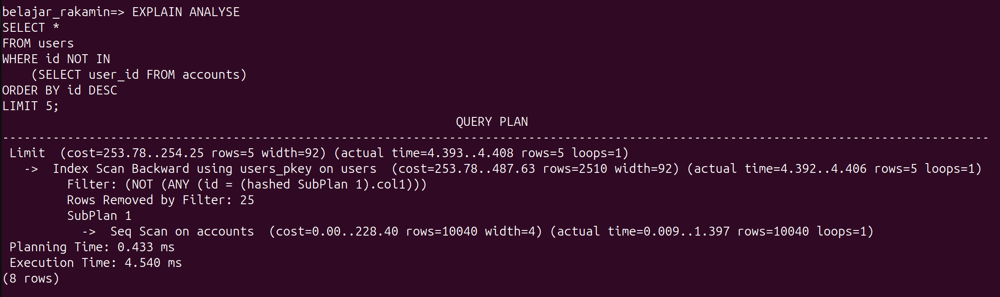
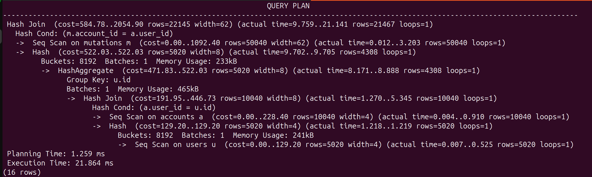
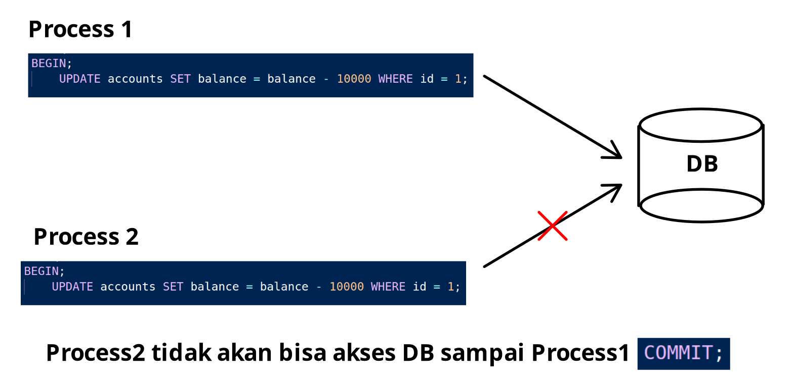
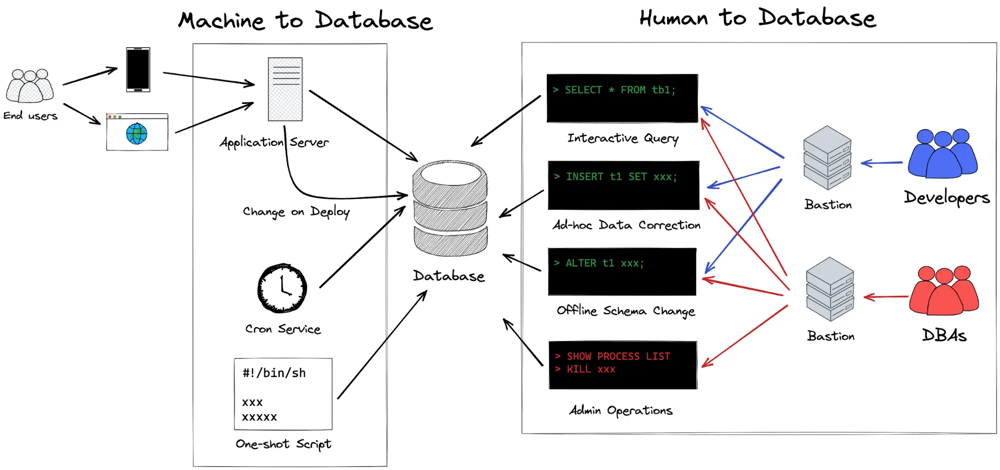

<!-- Dirangkum oleh : Bostang Palaguna -->
<!-- Juni 2025 -->

# Database

## Advanced SQL Queries

### Sub-Query



- scalar subquery
  - kembalikan satu baris
  - `SELECT`, `WHERE`, `HAVING`

```sql
SELECT
    account_number,
    balance,
    (SELECT AVG(BALANCE) FROM accounts) AS avg_balance
FROM accounts;
```

- row subquery
  - 1 baris
  - `WHERE (col1, col2) = (...)`

```sql
SELECT
    full_name,
    email
FROM users
WHERE (full_name, email) = (
    SELECT full_name, email FROM useres WHERE id = 3
);
```

- column subquery
  - 1 kolom, banyak baris
  - `IN`, `ANY`, `ALL`

```sql
SELECT *
FROM users
WHERE id IN (
    SELECT user_id FROM accounts
);
```

- table subquery
  - banyak baris & kolom
  - `FROM`

```sql
SELECT *
FROM (
    SELECT user_id, COUNT(*) as total_accounts
    FROM accounts
    GROUP BY user_id
) AS user_accounts
WHERE total_accounts > 1;
```

- correlated subquerry

yang paling sering dipakai

```sql
SELECT a.account_number,
    (SELECT COUNT(*) FROM mutations AS m
    WHERE m.account_id = a.id)
FROM accounts AS a;
```

- nested subquery

```sql
SELECT * FROM accounts
WHERE user_id = (
    SELECT id FROM accounts
    WHERE user_id = (
        ...
    )
)
```

Index tidak akan digunakan di sub-query


```sql
EXPLAIN ANALYZE
SELECT *
FROM mutations AS m
WHERE m.account_id IN(
    SELECT a.id FROM accounts AS a
    LEFT JOIN users AS u
        ON a.user_id = u.id
    WHERE a.user_id IS NOT NULL
);
```



Namun kalau di join, kena

### Window Function

`RANK`, `DENSE RANK`, `NTILE`

fitur SQL yang memungkinkan hitung nilai agregat (`SUM`,`AVG`,`COUNT`,dll.) tanpa kelompokkan baris (`GROUP BY`).

- setiap baris data bisa melihat kelompok datanya sendiri

⭐struktur query⭐:

```sql
function() OVER(
    PARTITION BY kolom_1
    ORDER BY kolom_2
)
```

Jenis window `function()`:

- `RANK`

```sql
SELECT
    id,
    account_number,
    balance,
    RANK() OVER(
        ORDER BY balance DESC
    ) AS rank_balance
FROM accounts;
```

- `NTILE`

mengelompokkan data menjadi n kelompok dengan jumlah hampir sama

```sql
SELECT
    id,
    account_number,
    balance,
    NTILE(4) OVER (
        ORDER BY balance DESC
    ) AS quartile
FROM accounts;
```

perbedaan dengan `GROUP BY` :

`GROUP BY`:

- hanya 1 baris per grup
- hitung total tiap grup
- tdk bisa lihat detail

WINDOW FUNCTIONS:

- bisa hitung total tapi tampil semua data

Kapan window function terpakai?

- mau tahu ranking
- mau tahu total tapi tetap lihat detail baris
- mau tahu akun di kuartil mana

#### Studi kasus : sistem bank

peringkat saldo tertinggi

membagi akun menjadi 4 kelompok besar (kuartil)

saldo rata-rata akun

## SQL Execution Plan

### Execuction Plan

rencana pengiriman data yg dipilih database u/ eksekusi query secepat dan sehemat mungkin.

execution plan : hasil dari proses query planner

strategi bdskan:

- index yg tersedia
- jumlah data (cardinality)
- statistik internal (ANALYZE)
- join type (nested loop, hash join, merge join)
- filter & conditon cost

`EXPLAIN` , `EXPLAIN ANALYZER`

### Query Bottlenack

ketika query lambat, cari tahu bagian mana yg memakan waktu paling lama.

indikator teknis:

- seq scan
- index scan / index only scan
- bitmap heap scan
- rows
- cost : estimasi biaya eksekusi (`startup.cost .. total cost`)
- execution time

menguasai execution plan bkan hanya untuk DBA (DB admin). optimasi bkn sekadar tambah index.

## Transaction & Concurrency Control

### Transaction

Serangkaian operasi sbg 1 kesatuan kerja ke dlm DB.

contoh : A kirim uang ke B. saat tekan tombol `send`, app kirim perintah ke DB bank -> terjadi transaksi DB.

Proses:

- mengurangi saldo A
- memasukkan mutasi A
- menambahkan saldo B
- memasukkan mutasi B

kapan?

- insert ke banyak tabel terkait
- transfer saldo, pemesanan, pengurangan stok
- operasi update kompleks

### ACID properties

- **Atomicity** : dijalankan sepenuhnya / tdk sama sekali
- **Consistency** : jaga integritas DB
  - contoh : deklarasi nominal uang sbg string
- **Isolation** : tdk saling mengganggu
- **Durability** : setelah commit, perubahan tdk hilang meskipun crash

Sintaks/Template Transaction

```sql
DO $$
DECLARE
-- deklarasi variabel
  sender_acc VARCHAR := 'ACC10001';
BEGIN
  BEGIN
    -- operasi transaksi
    
  EXCEPTION WHEN OTHERS THEN
    RAISE NOTICE '❌ Terjadi error, transaksi dibatalkan: %', SQLERRM;
    -- rollback otomatis dalam DO block
  END;
END $$;
```

#### (HANDSON) Transaction

Transfer saldo dari akun `ACC10001` ke `AC10002` sesbesar `10000`

```sql
DO $$
DECLARE
  sender_acc VARCHAR := 'ACC10001';
  receiver_acc VARCHAR := 'ACC10002';
  transfer_amount NUMERIC := 100000;
  updated_rows INT;
BEGIN
  BEGIN
    RAISE NOTICE 'Mulai transfer dari % ke %', sender_acc, receiver_acc;

    -- Kurangi saldo pengirim
    UPDATE accounts
    SET balance = balance - transfer_amount
    WHERE account_number = sender_acc;
    GET DIAGNOSTICS updated_rows = ROW_COUNT;
    IF updated_rows = 0 THEN
      RAISE EXCEPTION 'Akun pengirim tidak ditemukan!';
    END IF;
    RAISE NOTICE 'Saldo pengirim dikurangi.';

    -- Tambah saldo penerima
    UPDATE accounts
    SET balance = balance + transfer_amount
    WHERE account_number = receiver_acc;
    GET DIAGNOSTICS updated_rows = ROW_COUNT;
    IF updated_rows = 0 THEN
      RAISE EXCEPTION 'Akun penerima tidak ditemukan!';
    END IF;
    RAISE NOTICE 'Saldo penerima ditambahkan.';

    RAISE NOTICE '✅ Transfer berhasil.';
    
  EXCEPTION WHEN OTHERS THEN
    RAISE NOTICE '❌ Terjadi error, transaksi dibatalkan: %', SQLERRM;
    -- rollback otomatis dalam DO block
  END;
END $$;
```

### Locking

Analogi : DB adalah perpustakaan. Ketika seseorang meminjam buku, org lain tdk boleh pinjam sampai buku dikembalikan.

di DB : saat suatu proses/transaksi membaca/menulis data, data dikunci agar tdk diubah oleh proses lain sampai selesai.

jenis locking database:

- shared lock
  - `SELECT` : bisa dibaca banyak org, tetapi tdk bisa diubah
- exclusive lock
  - `UPDATE`, `DELETE` : hanya satu yg boleh akses/ubah

#### (HANDSON) DB Locking

Ada 2 proses yg berjalan hampir bersamaan utk mengakses id yang sama.

- Terminal 1

```sql
BEGIN;
    UPDATE accounts SET balance = balance - 10000 WHERE id = 1;

-- tunggu dulu
COMMIT;
```

- Terminal 2

```sql
BEGIN;
    UPDATE accounts SET balance = balance - 10000 WHERE id = 1;

-- tunggu dulu
COMMIT;
```



```sql

```

## Security

### Privilege

Privilege & Role management : cara DB kontrol siapa yg boleh lakukan apa.



Privilege :

`SELECT`
`INSERT`
`UPDATE`
`DELETE`
`CREATE`
`EXECUTE`

contoh implementasi:

#### Membuat Role dan Users

```sql
-- Buat role baru : readonly
CREATE ROLE readonly;

-- Beri hanya akses baca
GRANT SELECT ON ALL TABLES IN SCHEMA bank TO readonly;

-- Buat user dan berikan role
CREATE USER rakamin_user WITH PASSWORD '123456';
GRANT readonly TO rakamin_user;
```

Coba update saldo sebagai user rakamin_user

```sql
-- Beri akses update data (ke seluruh tabel di skema bank)
GRANT UPDATE ON ALL TABLES IN SCHEMA bank TO readonly;

-- update saldo
UPDATE accounts
    SET balance = balance - 10000
      WHERE account_number = 'ACC10001';

-- cek saldo
SELECT
  account_number,
  balance
FROM accounts
WHERE
  account_number = 'ACC10001';
```

#### Grant Permissions

```sql
-- Beri akses update data (ke tabel accounts saja) 
GRANT INSERT ON accounts TO readonly;
GRANT UPDATE ON accounts_id_seq TO readonly;

-- insert account baru
INSERT INTO accounts(user_id,account_number,account_type, balance, status)
VALUES
  (1, 'ACC99999','personal',15000.00,'active');

-- cek saldo
SELECT
  account_number,
  balance
FROM accounts
WHERE
  account_number = 'ACC10001';
```

```sql
-- beri permission untuk update tabel mutations
GRANT INSERT ON mutations TO readonly;
GRANT UPDATE ON mutations_id_seq TO readonly;

INSERT INTO mutations(account_id, mutation_type, amount, description, reference_code)
VALUES
  (4, 'credit', 5_000_000, 'coba', '1102020');    -- cara agar lebih terbaca menulis 5000000
```

```sql
-- beri permission untuk update tabel users
GRANT INSERT ON users TO readonly;
GRANT UPDATE ON users_id_seq TO readonly;

INSERT INTO users(email, full_name, phone_number, address, date_of_birth)
VALUES
  ('kkk@gmail.com','kokok','081234512','Kediri', '2003-04-27');
```

menghapus permission

```sql
REVOKE INSERT ON users FROM readonly;
REVOKE UPDATE ON users_id_seq FROM readonly;
```

## Catatan Tambahan

- CTE vs View vs Materialized View vs Temporary Table

| Feature          | CTE          | View            | Materialized View   | Temporary Table  |
| ---------------- | ------------ | --------------- | ------------------- | ---------------- |
| Persisted in DB? | ❌ No         | ✅ Metadata only | ✅ Data stored       | ❌ Session only   |
| Stores Data?     | ❌ No         | ❌ No            | ✅ Yes               | ✅ Yes            |
| Refresh Needed?  | ❌ No         | ❌ No            | ✅ Yes (manual/auto) | ❌ No (auto-drop) |
| Indexable?       | ❌ No         | ❌ No            | ✅ Yes               | ✅ Yes            |
| Scope            | Single query | All queries     | All queries         | Current session  |

### Beri akses select & update ke user

```sql
ALTER DEFAULT PRIVILEGES IN SCHEMA bank
GRANT SELECT, UPDATE ON TABLES TO bostang;

GRANT USAGE ON SCHEMA bank TO readonly;

-- Kalau nanti ada tabel baru:
ALTER DEFAULT PRIVILEGES IN SCHEMA bank
GRANT SELECT ON TABLES TO readonly;

```

### Melihat tabel dan skema serta ownernya

```sql
SELECT *
  FROM pg_tables;
```

### Melihat tabel permissions

```sql
-- catatan :
SELECT *
  FROM information_schema.role_table_grants;
  -- bisa tambahkan filter seperti : WHERE table_schema = 'bank';
```

## Bacaan Lanjutan

- [Data pipeline](https://dataengineering.wiki/Concepts/Data+Pipeline)

---
[🏠Back to Course Lists](https://odp-bni-330.github.io/)