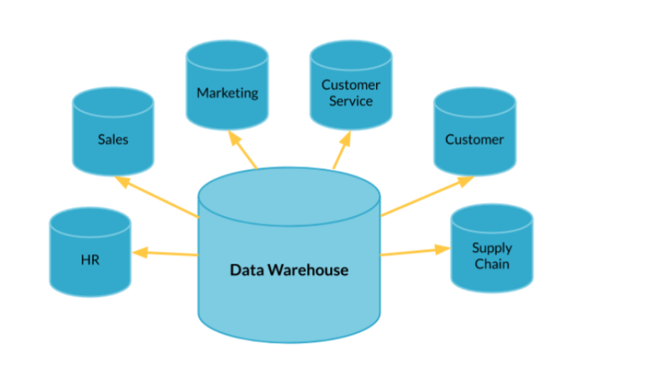
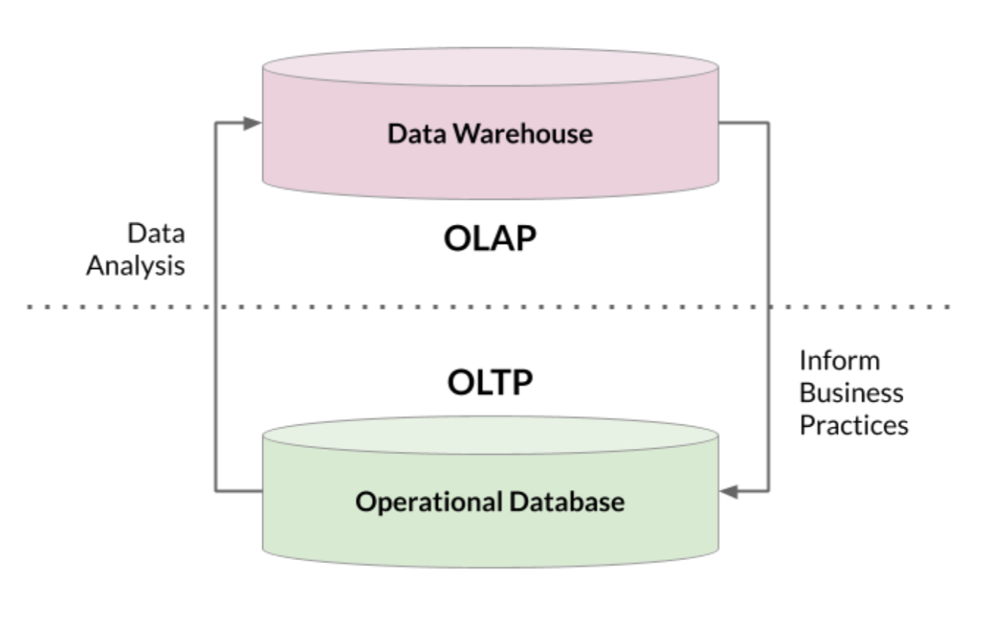
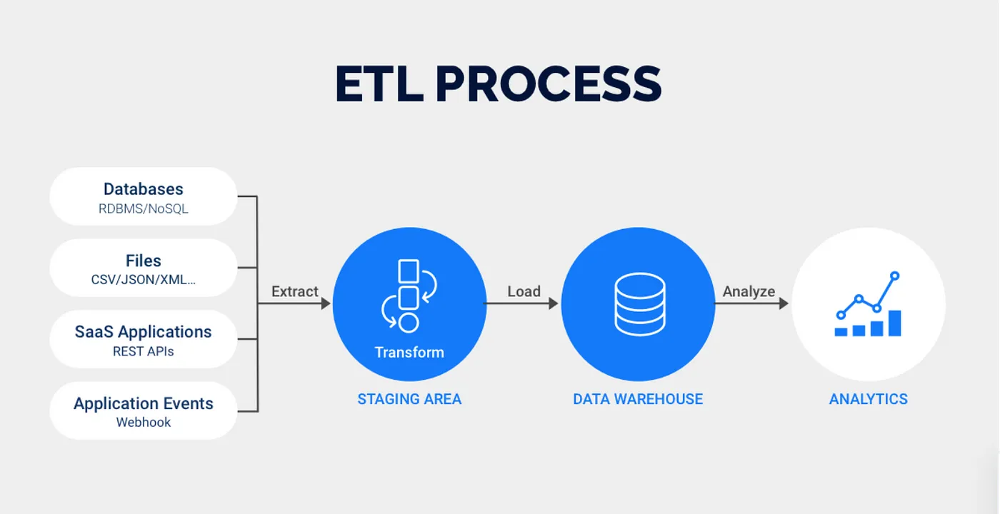
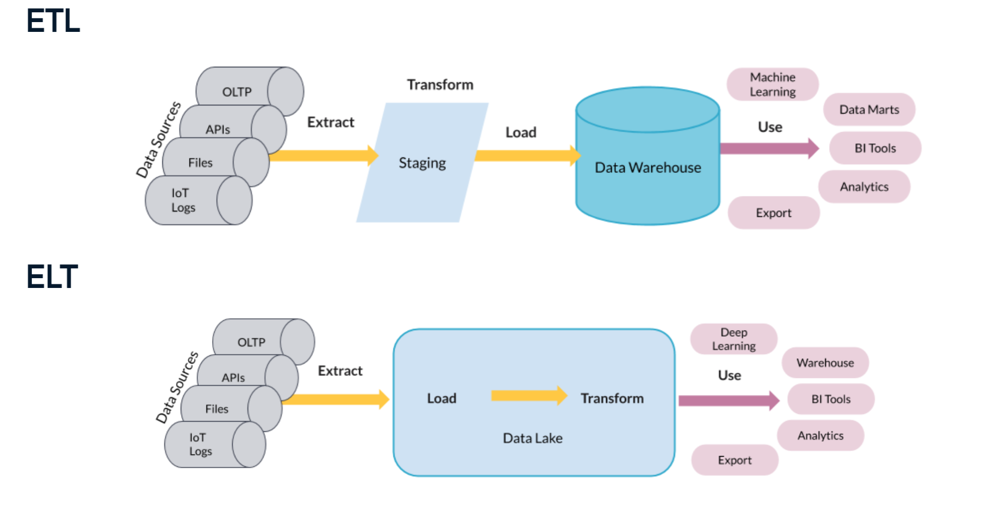
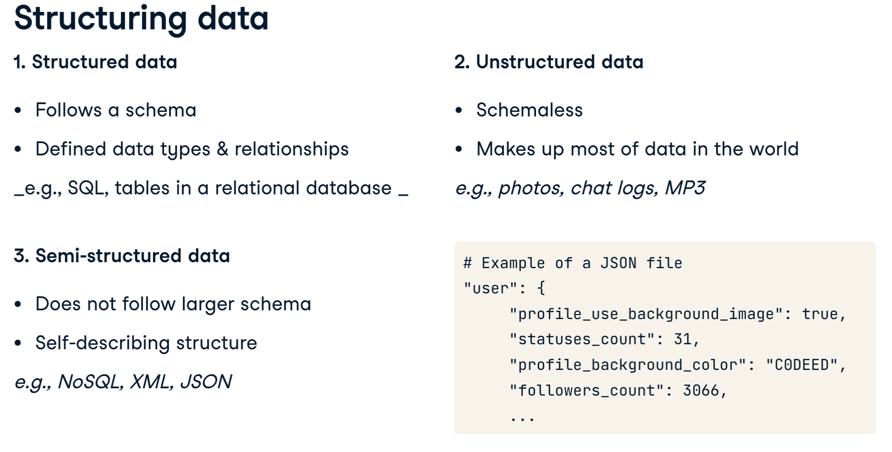
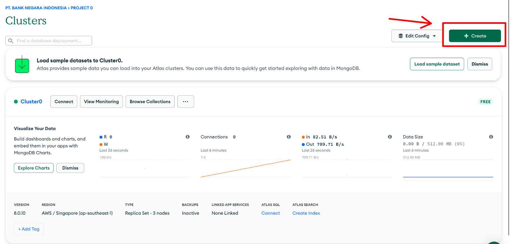
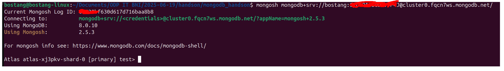
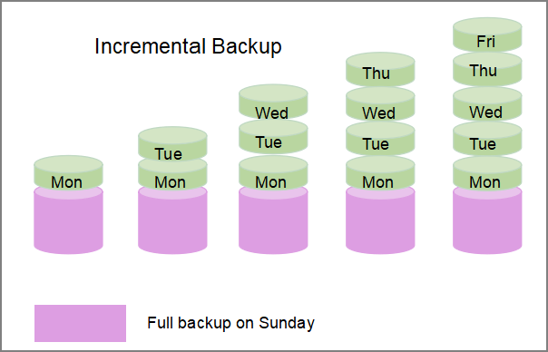
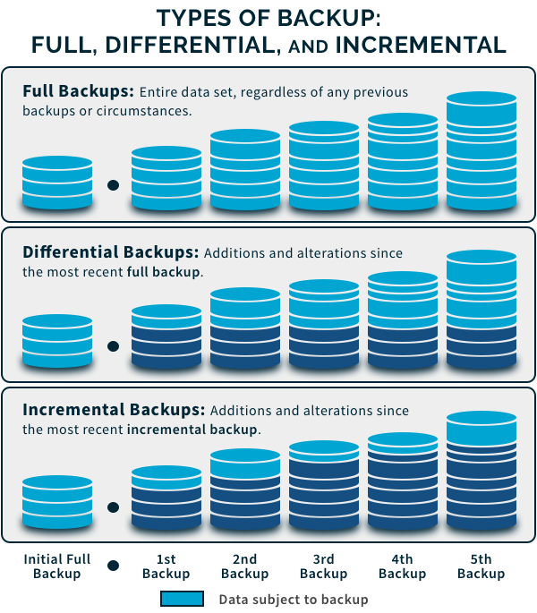

# Database

## Data Warehousing & ETL Basics

### Data Warhouse

Kumpulkan semua data transaksi di tempat khusus, susun secara rapih, lalu analisis -> Data Warehouse.

Analogi : Proses keluar/masuk barang di gundang tidak akan secepat di kasir (operasional).

definisi : Tempat menyimpan data dari bbg sistem u/ keperluan laporan, analisis, pengambilan keputusan.

data di Data warehouse bukanlah data yang real time



Tujuan:

- simpan data historis
- dukung keputusan bisnis
- satukan data dari bbg sistem

Ciri-ciri :

- subject oriented
  - fokus pada entitas bisnis
- integrated
  - gabungan dari bbg sistem
- non-volatile
  - hanya bisa dibaca, tdk ditimpa
- time-variant
  - simpan data historis

Data warehouse terdiri dari 2 bentuk:

- Fact table (kuantiatif) (numeric)

- Dimensional Table (categorical) (Deskriptif)

istilah :

- Housekeeping : the routine tasks performed to maintain database health, improve performance, and ensure data integrity

### OLTP & OLAP

- Online Transaction Processing (OLTP)
  - untuk operasional sehari-hari
  - u/ simpan & proses transaksi harian scr cepat & akurat
  - dipakai di operational database
  - operasi dominan : `INSERT`, `UPDATE`, `DELETE`
  - data yg diakses : sedikit & spesifik
  - contoh : sistem kasir, absensi, mobile banking

- Online Analytical Processing (OLAP)
  - untuk analisis & pengambilan keputusan
  - u/ analisis data besar & kompleks u/ ambil keputusan
  - dipakai di data warehouse
  - operasi dominan : `SELECT`, `GROUP BY`, `JOIN`
  - data yg diakses : banyak & agregat
  - contoh : dashboard penjualan, laporan keuangan



### ETL

Extract, Transform, Load
-> proses yang terjadi di dalam data warehouse.

- Extract : mengmabil data dari bbg/ sumber (DB, file CSV, API, dll.)
- Transform : Bersihkan, rapihkan, olah data
-> menggunakan python, scripting, dsb.

- Load : masukkan data ke data warehouse u/ analisis





mengapa ETL penting?

- memastikan data siap dianalsis, tdk kotor, tdk duplikat
- hemat waktu analisis & decision maker
- data dari bbg sistem bisa digabungkan jadi **insight bisnis**

#### (HANDSON) ETL menggunakan Python

simplifikasi : Data dari OLAP sudah diexport ke dalam bentuk csv dan siap pakai.

## Database NoSQL

### Konsep Big Data

Big data : data yang :

- volume : jml data sngt besar
- velocity : real time
- variety : format beragam

solusi : NoSQL (Not only SQL)

### NoSQL

cocok u/ jenis db non-relasional yg:

- tdk terstruktur
- skema fleksibel
- skalabilitas tinggi

Karakteristik:

- schema-less
  - struktur data fleksibel
- horizontal scaling
  - bisa diperluas dgn tambah server (node)
- high performance
  - oprasi read/write sgt cepat, cocok u/ aplikasi real time
- flexible data model
  - dukung banyak tipe : document, key-value, column, graph
- big data ready
  - u/ tangani data besar dan tdk terstruktur (log, sensor, stream)
- distributed architecture
  - data tersebar ke banyak server, tingkatkan ketersediaan & toleransi kegagalan
- developer friendly
  - cocok u/ iterasi cepat & agile

Mengapa RDBMS tidak cukup :

- rigid (skema tetap)
- sulit tangani data tdk terstruktur
- kurang efisien u/ horizontal scaling

contoh bentuk data di MongoDB : `JSON`



#### MongoDB

| **MongoDB** | **SQL (relasional)** | **Penjelasan**                 |
|-------------|----------------------|--------------------------------|
| Database    | Database             | kumpulan collection            |
| Collection  | Table                | kumpulan dokmen sejenis        |
| Document    | Row (baris)          | entitas data dalam format JSON |
| Field       | Column               | Atribut / Properti dokumen     |
| ObjectId    | Primary Key (Id)     | ID unik otomatis oleh MongoDB  |
| index       | index                | untuk percepat pencarian data  |

```js
{
    "_id" : ObjectId("..."),
    "name" : "Alice",
    "age" : 30,
    "address" : {
        "street" : "Jl. Merdeka",
        "city" : "Jakarta"
    },
    "hobbies" : ["reading", "cycling"]
}
```

#### (HANDSON) MongoDB

**Langkah 0** : Persiapan

- Buat akun [Mongo Atlas](https://www.mongodb.com/lp/cloud/atlas/try4-reg)
- download [Mongo Compass](https://www.mongodb.com/try/download/compass)
- download [Mongo Shell](https://www.mongodb.com/try/download/shell)

**Langkah 1** : Buat cluster di MongoDB

Pilih menu `Create cluster`



**Langkah 2** : Buat koneksi ke DB



```bash
# cek versi mongo shell terinstall
mongosh --version

# konek ke DB
mongosh mongodb+srv://bostang:<db_password>@cluster0.fqcn7ws.mongodb.net/
    # link yang didapat setelah buat cluster
```

```js
/**** melihat daftar database ****/
show dbs

/**** membuat database ****/
//  sintaks :
    //  use [nama_database]
use dbbaru

/**** memasukkan objek ke database ****/
// memasukkan satu objek
db.book.insertOne({         // otomatis buat collection baru bernama book
    title: "Kisah Penghuni Neraka",
    price: 1000
})

// memasukkan banyak objek
db.book.insertMany([
    { title: "Surga yang tak dirinkuan", price: 15000},
    { title: "Cinta dalam diam", price: 2000, author : "Anonymous"},
    { title: "Langit ke-7", price: 2000}
])

/**** menampilkan data di DB ****/
db.book.find()

// mencari dengan id tertentu
db.book.find({_id: ObjectId('68538d4830d617d716baa8bc')})

// output:
// [
//   {
//     _id: ObjectId('68538d4830d617d716baa8bc'),
//     title: 'Langit ke-7',
//     price: 2000
//   }
// ]

/**** update data di DB ****/

// update satu data
db.book.updateOne(
    {_id : ObjectId('68538d4830d617d716baa8bc')},
    {
        $set: {
            title : 'Langit ke-8',
            price : 13000
        }
    }
    // , { upsert : true }          // uncomment this u/ mode upsert
)

// 'upsert' is a blend of 'update' and 'insert'

// update atau insert
db.book.updateOne(
    {_id : 999},
    {
        $set: {
            title : 'Langit ke-19',
            price : 1300000000000
        }
    }
    , { upsert : true }          // uncomment this u/ mode upsert
)

/**** hapus data di DB ****/
db.book.deleteOne({
    _id : 999
})

// mencari dengan properti tertentu
// OR
db.book.find({
    $or : [
        {author: "Anonymous_"},
        {price: 1000}
    ]    
})

// AND
db.book.find({
    author: "Anonymous_",
    price: 1000
})

// SORT
db.book.find().sort({title: -1})    // descending

// melakuan perbandingan
db.book.find({
    price : {$gte: 13000}       // buku dengan harga >= 13000
})

db.book.find({
    price: {$in : [1000, 13000, 15000]} // buku dengan harga 1000, 13000, atau 15000
})

// menjalankan command
// mendapatkan jumlah price berbeda
db.runCommand({distinct: "book", key: "price"})
```

## Database Backup

Backup = membuat salinan data u/ cegah kehilangan data karena serror, serangan, atau bencana.

Jenis Backup:

- Full
  - seluruh database
  - mudah direstore
  - ukuran besar, lama
- Incremental
  - data yg berubah terakhir
  - hemat ruang
  - restore butuh urutan file
- Differential
  - data berubah sejak **full backup** terakhir
  - lebih cepat dari incremental
  - membesar seiring waktu

> Cadangan inkremental hanya mencadangkan data yang berubah sejak cadangan terakhir (baik itu cadangan penuh, inkremental, atau diferensial), sementara cadangan diferensial mencadangkan semua data yang berubah sejak cadangan penuh terakhir.





Apa yang perlu dibackup?

- database utama (data & skema)
- konfigurasi sistem (`postgresql.conf` , `mongod.conf`)
- user roles & perimssion (SQL)
- logs (diperlukan u/ audit)

Tools Backup:

- postgresql
  - `pg_dump`
  - `pg_basebackup`
- MongoDB
  - `mongodump`

Tools Restore:

- postgresql
  - `psql`
  - `pg_restore`
- mongoDB
  - `mongorestore`

### Disaster Recovery Plan (DRP)

Strategi & Porosedur u/ memastikan pemulihan sistem & data setelah kegagalan sistem, bencana alam, serangan siber, atau kehilangan data besar lain.

tujuan DRP:

- minimalkan downtime
- pulihkan layanan secepat mungkin
- lindungi data penting
- kurangi kerugian bisnis

konsep kunci:

- RTO (recovery time objective)
  - sbrp cepat sistem harus pulih

- RPO (recovery point objective)
  - sbrp bnyk data yg blh hilang

Strategi Backup:

- aturan 3-2-1
  - 3 salinan di 2 lokasi berbeda, 1 luar lokasi
- otomasi backup
  - script + cronjob / scheduler
- enkripsi backup
  - tdk bocor saat dicuri
- monitoring backup
  - log & notifikasi jika backup gagal
- uji coba restore
  - cak backup valid

Komponen utama DRP :

- dokumen prosedur
- backup data
- redundansi
- emergency contact
- testing & simulasi

#### (HANDSON) Dump & Restore

contoh fasilitator:

```bash
# Dump
pg_dump -U postgres -h localhost -F c -f barulagibank_$(date +"%d%b%Y").backup barulagibank

# Restore
# PGPASSWORD=
pg_restore -U postgres -h localhost -d barulagibank -c barulagibank_12Jun2025.backup
```

##### Dump

syntax dasar:

```bash
# FULL DATABASE BACKUP
# sintaks:
    # pg_dump -U [nama_user] -F c -d [nama_database] -f [nama_file_output].dump
pg_dump -U postgres -F c -d belajar_rakamin -f belajar_rakamin.dump

# BACKUP SKEMA TERTENTU
# sintaks:
    # pg_dump -U [nama_user] -F c -n [nama_skema] -d [nama_database] -f [nama_file_output].dump
pg_dump -U postgres -F c -n bank -d belajar_rakamin -f bank_schema.dump

# BACKUP TABEL TERTENTU
# sintaks:
    # pg_dump -U [nama_user] -F c -t [nama_skema].[nama_tabel] -d [nama_database] -f [nama_file_output].dump
pg_dump -U postgres -F c -t bank.users -d belajar_rakamin -f users_table.dump
```

##### Restore

```bash
#### Restore ke database kosong atau baru ####
# buat database kosong
createdb -U postgres belajar_rakamin_restore

# restore
pg_restore -U postgres -d belajar_rakamin_restore belajar_rakamin.dump


#### restore hanya skema / tabel tertentu ####
createdb -U postgres belajar_rakamin_restore_2
pg_restore -U postgres -d belajar_rakamin_restore_2 -t bank.users users_table.dump

```

## Catatan Tambahan

```js
// membuat db baru
use [nama_db]

// menmapilkan db yang tersedia
show dbs

// membuat collection
db.createCollection("[nama_collection]") 

// memasukkan documents ke DB
db.posts.insertOne({"title": "Post 1"})

db.posts.insertOne({
  title: "Post Title 1",
  body: "Body of post.",
  category: "News",
  likes: 1,
  tags: ["news", "events"],
  date: Date()
})

// insert banuyak elemen
db.posts.insertMany([  
  {
    title: "Post Title 2",
    body: "Body of post.",
    category: "Event",
    likes: 2,
    tags: ["news", "events"],
    date: Date()
  },
  {
    title: "Post Title 3",
    body: "Body of post.",
    category: "Technology",
    likes: 3,
    tags: ["news", "events"],
    date: Date()
  },
  {
    title: "Post Title 4",
    body: "Body of post.",
    category: "Event",
    likes: 4,
    tags: ["news", "events"],
    date: Date()
  }
])

// select elemen dari collection
db.posts.find()
db.posts.findOne()

// filter data
db.posts.find( {category: "News"} )

// update data
db.posts.updateOne( { title: "Post Title 1" }, { $set: { likes: 2 } } ) 
db.posts.updateMany({}, { $inc: { likes: 1 } }) // update banyak element

// hapus data
db.posts.deleteOne({ title: "Post Title 5" })
db.posts.deleteMany({ category: "Technology" }) // delete banyak element
```
