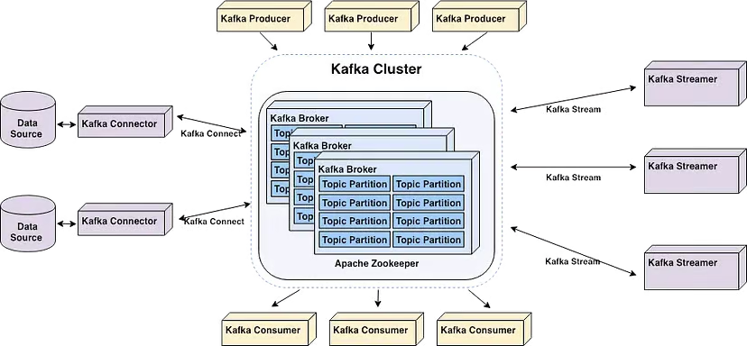
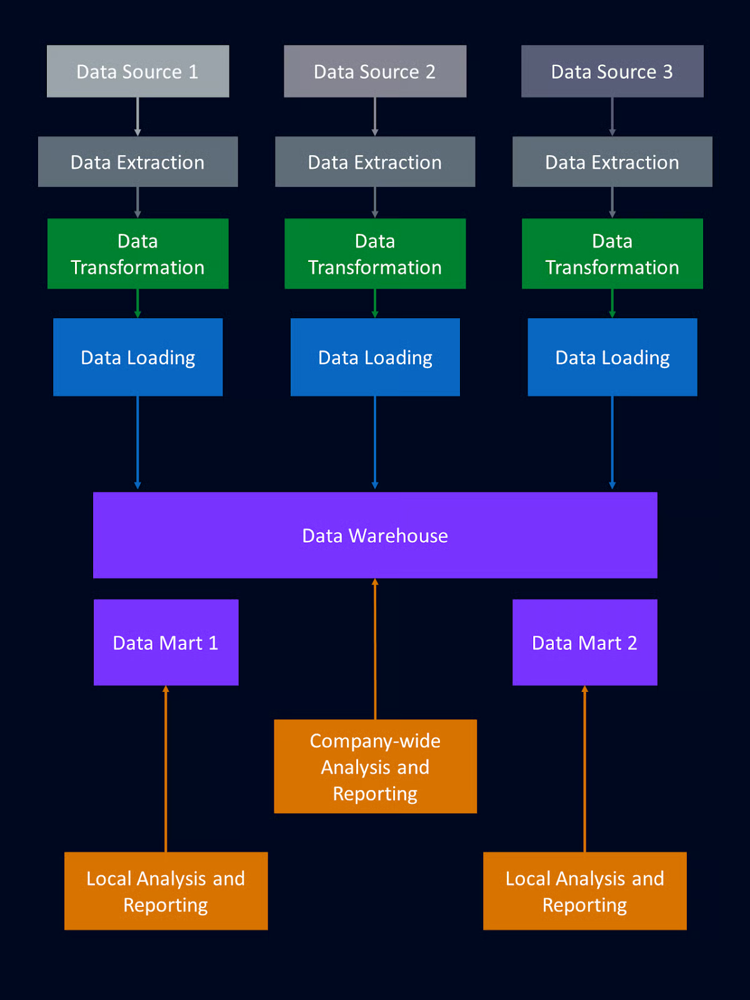
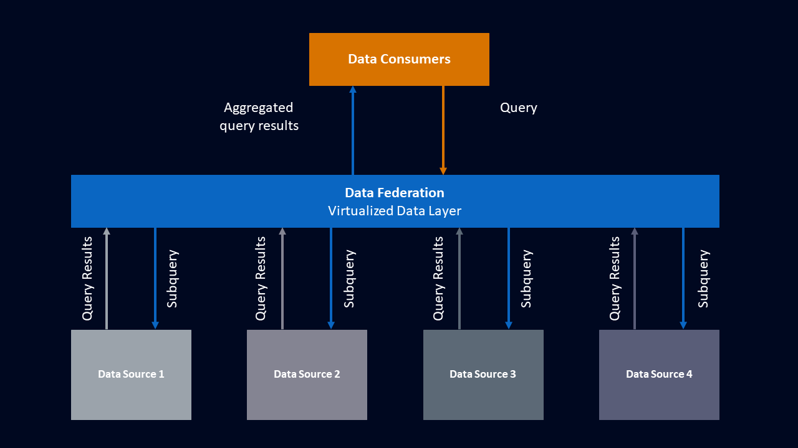
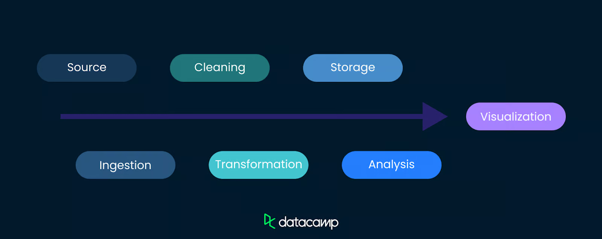
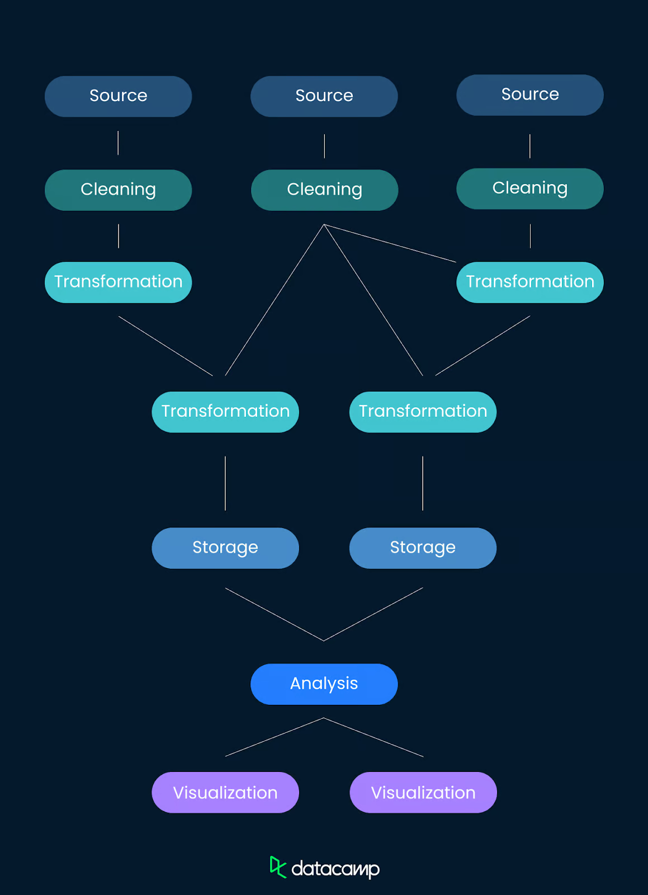
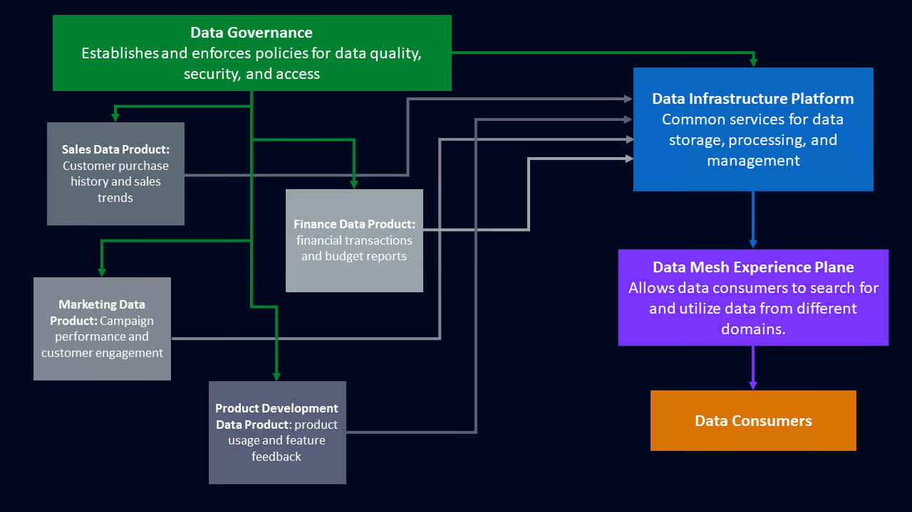
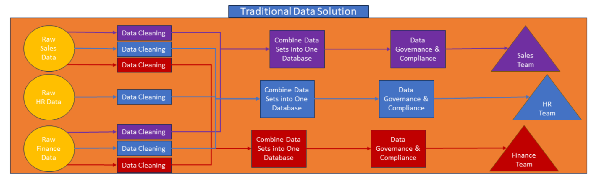
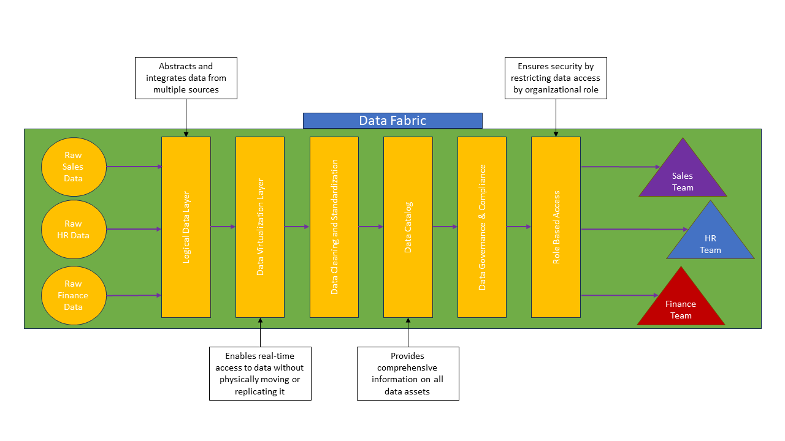
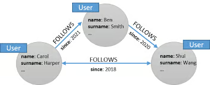

# Catatan Tambahan

## Replication vs Sharding vs Partitioning vs DB Federation

- replication
  - membuat salinan dari DB yg sama
  - tujuan :
    - fault tolerance
    - read performance
    - avoid data loss
  - contoh :
    - website e-commerce dgn db utama (hot storage) & replika (cold storage) u/ handle product search secara efisien
- partitioning
  - membagi DB ke lebih kecil bdskan kriteria tertentu (misal : tanggal, region)
  - tujuan:
    - meningkatkan performa query
    - manage dataset besar dgn efisien
  - contoh:
    - log management system simpan log bdskan bulan
- sharding
  - distribusi scr horizontal dgn pecah tabel besar ke tabel lebih kecil yg independen di bbrp db.
  - tujuan:
    - cegah bottleneck dgn distribusi operasi write
    - tingkatkan skalabilitas
  - contoh:
    - DB customer dengan nama akhir A-G,H-P, Q-Z di DB berbeda
- DB federation
  - beberapa DB independen berfungsi sbg 1 DB logical
  - tujuan:
    - berguna saat DB yg berbeda memiliki fungsi berbeda (user management, order processing)
    - kurangi kompleksitas dgn menjaga DB terpisah yg terspesialisasi
  - contoh:
    - perusahaan asuransi memisahkan DB customer dgn DB order

[referensi](https://noncodersuccess.medium.com/replication-vs-partitioning-vs-sharding-vs-database-federation-96d7c7db8b1e)

## Cassandra (Column Family DB)

- Database NoSQL yang menyimpan data dalam bentuk column-family (mirip tabel pada RDBMS, tetapi lebih fleksibel).
- Distributed & Highly Available: Data direplikasi di beberapa node.
- Tidak memiliki single point of failure (tidak seperti master-slave pada MySQL).
- Skalabilitas horizontal: Menambah node untuk meningkatkan kapasitas.
- Optimized for write-heavy workloads (contoh: IoT, logging, transaksi real-time).

Istilah :

- **Keyspace** ≈ Database di SQL (tempat kumpulan tabel).
- **Table** (Column Family) ≈ Tabel di SQL, tetapi lebih fleksibel.
- **Partition Key** → Menentukan di node mana data disimpan.
- **Clustering Key** → Mengurutkan data dalam partisi.
- **Replication Factor** → Jumlah replikasi data di cluster.

```bash
# Jalankan Cassandra Container
docker run --name mycassandra -p 9042:9042 -d cassandra:latest

# Periksa Status Container
docker logs mycassandra

# Akses Cassandra lewat cqlsh
docker exec -it mycassandra cqlsh
```

```sql
-- Cek Cluster Info
DESCRIBE CLUSTER;

--  Buat Keyspace
CREATE KEYSPACE belajar 
WITH replication = {
  'class': 'SimpleStrategy',
  'replication_factor': 1
};

-- Gunakan Keysapce
USE belajar;

-- Buat Tabel
CREATE TABLE users (
  user_id UUID PRIMARY KEY,
  name TEXT,
  email TEXT,
  age INT
);

CREATE TABLE products (
  product_id UUID PRIMARY KEY,
  name TEXT,
  price DECIMAL,
  category TEXT,
  stock INT
);

-- CRUD operation
-- Insert
INSERT INTO users (user_id, name, email, age) 
VALUES (uuid(), 'Alice', 'alice@example.com', 25);

INSERT INTO users (user_id, name, email, age) 
VALUES (uuid(), 'Bob', 'bob@example.com', 30);

INSERT INTO products (product_id, name, price, category, stock) 
VALUES (uuid(), 'Laptop', 1000.00, 'Electronics', 10);

INSERT INTO products (product_id, name, price, category, stock) 
VALUES (uuid(), 'Smartphone', 500.00, 'Electronics', 20);

-- Select
SELECT * FROM users;
SELECT * FROM products WHERE price > 300 ALLOW FILTERING;

-- Update
UPDATE users SET age = 26 
WHERE user_id = [uuid-Alice];

-- Delete
DELETE FROM users 
WHERE user_id = [uuid-Bob];
```

## Kafka

Apache Kafka enables users to analyze data in real time, store records in the order they were created, and publish and subscribe to them.



key terms:

- Brokers
  - servers in the cluster that store data and serve clients.
- Topics
  - feeds to which records are published
- Producers
  - client applications that publish (write) events
- Consumers
  - applications that read and process events from Kafka topics
- Streams
  - client library to create microservices and applications

## [Data Warehouse](https://www.datacamp.com/blog/data-warehouse)

centralized repository that stores structured and semi-structured data from multiple sources, optimized for analysis and reporting to support business intelligence.



## [Data Federation](https://www.datacamp.com/blog/data-federation)

data integration technique that provides a unified view of data from disparate sources without requiring physical data movement or consolidation. data federation keeps it in its original source location and makes it accessible through a virtual layer.



## [Data lineage](https://www.datacamp.com/blog/data-lineage)

systematic tracking and documentation of data's origins, transformations, and movements within a system or across systems.

example of how data can flow from its source to a visualization:





## [Data Meshes](https://www.datacamp.com/blog/data-mesh)

decentralized data architecture where domain-specific teams own and manage their data as products, using a shared infrastructure and adhering to federated governance principles.

modern approach to data architecture that shifts data management from a centralized model to a decentralized one.



## [Data Fabrics](https://www.datacamp.com/blog/data-fabric-introduction)

unified data architecture that connects disparate data sources, simplifying access and management while ensuring consistency and security across the entire data landscape.

Traditional data solution:



Data fabrics:



## Link Tamabahan

- [Kubernetes, Prometheus, Grafana](https://medium.com/@muppedaanvesh/a-hands-on-guide-to-kubernetes-monitoring-using-prometheus-grafana-%EF%B8%8F-b0e00b1ae039)

## Metode Akses Query

Dalam dunia database (khususnya MySQL dan MariaDB), **metode akses query** menggambarkan bagaimana query menelusuri data dalam sebuah tabel. Urutan metode akses dari yang **paling efisien (cepat)** ke yang **paling tidak efisien (lambat)** adalah:

```
const > eq_ref > ref > range > index > ALL
```

Mari kita bahas satu per satu:

---

### 1. ✅ `const` (Paling Efisien)

* **Dipakai ketika query hanya mengambil satu baris dari tabel dengan kondisi `PRIMARY KEY` atau `UNIQUE` dan nilai literal.**
* Karena hanya satu baris, MySQL langsung bisa mengambil datanya tanpa scanning.

**Contoh:**

```sql
SELECT * FROM users WHERE id = 5;  -- id adalah PRIMARY KEY
```

> **Analogi:** Seperti mencari buku berdasarkan nomor seri unik di katalog.

---

### 2. ✅ `eq_ref`

* **Dipakai untuk join, ketika satu baris di tabel utama cocok dengan SATU baris di tabel yang dijoin.**
* Biasanya melibatkan `PRIMARY KEY` atau `UNIQUE`.

**Contoh:**

```sql
SELECT * FROM orders o
JOIN users u ON o.user_id = u.id;  -- u.id adalah PRIMARY KEY
```

> **Analogi:** Seperti melihat siapa pemilik rekening dari nomor rekening yang pasti hanya satu pemilik.

---

### 3. ☑️ `ref`

* **Dipakai ketika kolom yang difilter bukan unik**, dan bisa mengembalikan beberapa baris.
* Masih menggunakan index, tapi bukan `UNIQUE`.

**Contoh:**

```sql
SELECT * FROM users WHERE country = 'Indonesia';  -- country punya index, tapi tidak unik
```

> **Analogi:** Mencari semua orang dari Indonesia dalam buku telepon berdasarkan kode negara.

---

### 4. ⚠️ `range`

* **Dipakai saat filter menggunakan rentang (`BETWEEN`, `>`, `<`, `IN (...list...)`)**.
* Index digunakan untuk mencari rentang nilai.

**Contoh:**

```sql
SELECT * FROM products WHERE price BETWEEN 100 AND 200;
```

> **Analogi:** Seperti mencari buku-buku dengan harga antara 100–200 ribu dari katalog.

---

### 5. ⚠️ `index`

* **Seluruh index discan dari awal hingga akhir**, tapi tidak perlu baca data tabel (hanya index tree).
* Lebih cepat dari `ALL`, tapi tidak ideal.

**Contoh:**

```sql
SELECT id FROM users;  -- Hanya mengambil kolom yang sudah dalam index (misalnya id)
```

> **Analogi:** Menelusuri seluruh daftar isi buku, tapi tidak membuka halaman-halaman utamanya.

---

### 6. ❌ `ALL` (Paling Lambat)

* **Full table scan**. Semua baris dibaca satu per satu.
* Biasanya terjadi jika **tidak ada index yang digunakan**.

**Contoh:**

```sql
SELECT * FROM users WHERE last_name LIKE '%gani%';
```

> **Analogi:** Membaca satu per satu seluruh buku karena tidak ada daftar isi.

---

### 🔁 Urutan Efisiensi (dari terbaik ke terburuk):

| Metode   | Artinya Singkat                            |
| -------- | ------------------------------------------ |
| `const`  | Satu baris dari PK atau unik               |
| `eq_ref` | Join dengan satu baris hasil               |
| `ref`    | Join/filter dengan banyak baris dari index |
| `range`  | Pencarian berdasarkan rentang              |
| `index`  | Scan seluruh index                         |
| `ALL`    | Scan seluruh tabel                         |

---

### 🎯 Tips Optimasi:

* Gunakan **index** pada kolom yang sering digunakan di `WHERE`, `JOIN`, dan `ORDER BY`.
* Hindari wildcard di awal (`LIKE '%foo'`) karena menghalangi penggunaan index.
* Cek rencana eksekusi query dengan:

```sql
EXPLAIN SELECT ...
```

---

Jika kamu punya query tertentu dan ingin menganalisis apakah bisa dioptimasi, boleh kirim query-nya dan saya bantu cek.

### [Graph Database](https://www.datacamp.com/blog/what-is-a-graph-database)

specialized, single-purpose platform used to create and manipulate data of an associative and contextual nature.

graph database structures data using a graph structure in which nodes, edges, and properties are used to represent data.

- `nodes` :  objects,
- `edges` : illustrate the relationships between nodes,
- `properties` : attributes of the nodes and edges



### [Neo4j](https://www.datacamp.com/tutorial/neo4j-tutorial)

[example dataset](https://neo4j.com/graphgists/cd8868d1-da9a-44ad-a221-baab3086c902/)