<!-- Dirangkum oleh : Bostang Palaguna -->
<!-- Juni 2025 -->

# Database Performance Tuning & Optimization

> Fasilitator : Fauzi

## Database Performance Tuning

database bila tdk dikelola dapat menyebabkan app down.

> mengapa tdk menggunakan `Excel (csv)` untuk database? mengapa perlu menggunakan DBMS spt `Microsoft SQL Server`, `Oracle Server`, `PostgreSQL`, `MySQL`, dsb.?

salah satu kemapuan `PostgreSQL` : multi version concurrency control

- `PostGIS` : untuk data geospasial
- `CITUS` : scaling DB
- `PG_Embedding` : chatbot
- `hstore` : ekstensi pada PostgreSQL yang memungkinkan penyimpanan data dalam format key-value

`Neon Postgres` : cloud-native Postgres solution designed for modern applications

### Identifikasi Bottleneck dlm DB

Bottleneck : titik **kemacatean** / hambatan yg batasi performa sistem overall.

- Terjadi ketika 1 komponen sistem tdk bisa mengimbangi komponen lain -> penurunan kinerja.
- dpt membatasi aliran data & proses sehingga respons waktu lambat dan throughput sistem turun.

- response time ⬇️
- throughput sistem ⬇️
- beban server ⬆️

pengalaman pengguna buruk -> potensi kerugian bisnis.

> throughput : rate at which something is processed or transferred

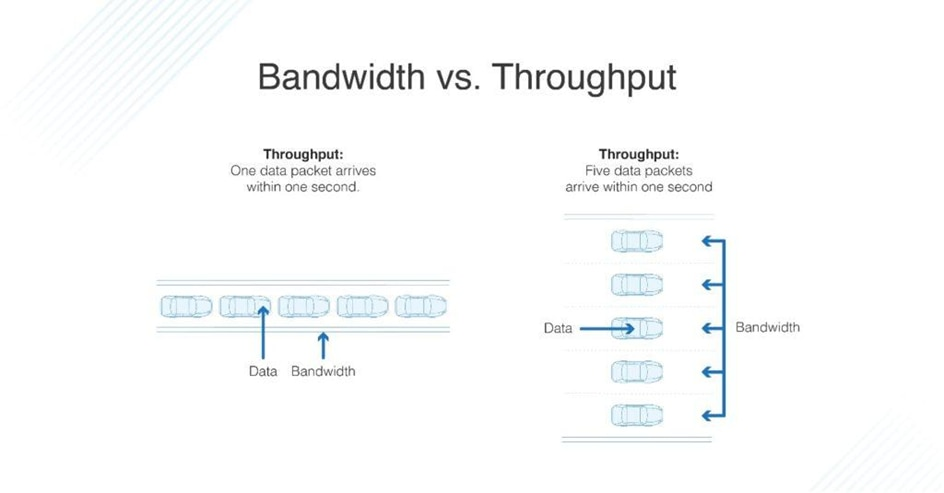

#### Jenis Bottleneck (DB)

- **I/O bottleneck**
  - sistem tdk bisa `read` / `write` data scr cepat.
  - gejala :
    - waktu tunggu disk ⬆️ ,
    - antrian I/O,
    - throughput disk ⬇️,
    - query table scan lambat
  - solusi :
    - SSD / NVMe
    - RAID
    - indeks
    - caching yg tepat
  - disebabkan **disk yg lambat** / **pola akses** tdk efisien / kurang **cache**.
  - analogi : SSD > HDD : booting lebih cepat
- **CPU bottleneck**
  - prosesor tdk bisa tangani beban komputasi
  - karena **query kompleks** / kurang optimal , kurang **paralelisme**
  - gejala:
    - CPU utilization ⬆️,
    - execution time ⬆️,
    - throughput ⬇️
  - solusi:
    - optimisasi query
    - partisi beban
    - upgrade CPU
    - implementasi paralelisme
- **Memory bottleneck**
  - sistem kekurangan **RAM** u/ operasi DB
  - berakibat ke : swapping ke disk & penurunan performa
  - penyebab :
    - **buffer pool** terlalu kecil,
    - query hasil besar,
    - konfigurasi memori krng tepat
  - gejala:
    - swapping ke disk berlebihan
    - page faults
    - performa tdk konsisten
  - solusi:
    - naikkan RAM
    - optimasi buffer pool
    - batasi # koneksi bersamaan
- **Network bottleneck**
  - bandwidth jaringan dk cukup u/ tangani volume data
  - berakibat ke DB distributed / aplikasi client-server
  - penyebab :
    - bandwidth terbatas
    - hardware spek rendah
    - konfigurasi buruk
    - jaringan padat
    - masalah server/app
  - gejala:
    - speed ⬇️
    - latency ⬆️
    - packet loss
    - loading time
  - solusi:
    - naikkan bandwidth
    - upgrade HW
    - optimalkan config
    - kurangi beban jaringan
    - periksa server/app

> buffer pool : a region of computer memory used to cache data read from disk
buffer pool mempercepat query, tetapi memakan memori

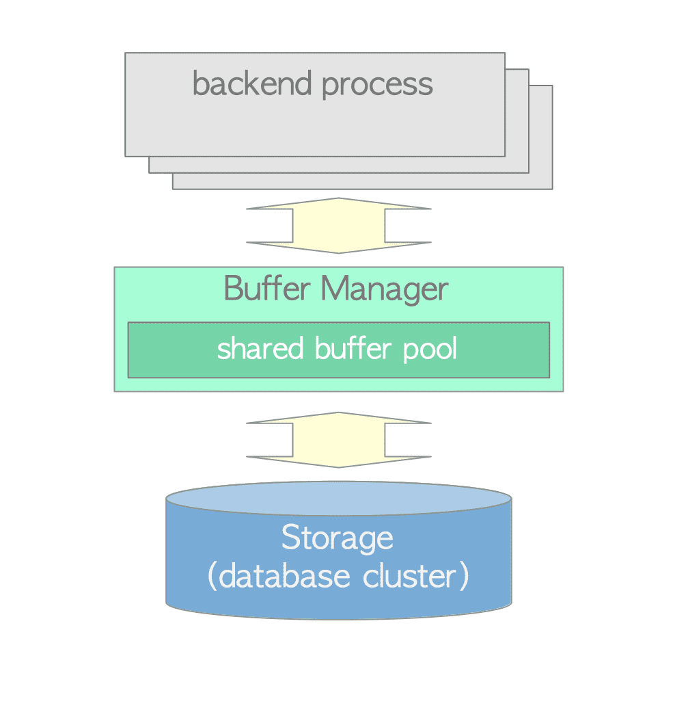

> page fault : ritical event in computer systems in which a program tries to attempt to access data or code that is not currently available in the physical memory (main memory).

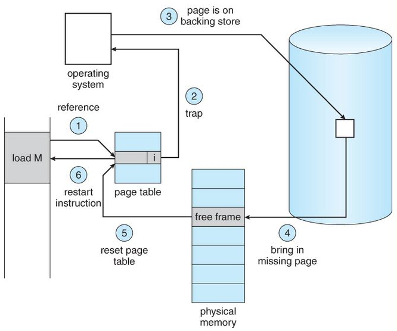

#### Tools untuk Identifikasi Bottleneck

- **Monitoring Tools**
  - pantau metrik performa DB scr real-time u/ deteksi dini masalah performa & analisis tren
  - bisa terapkan **alert** ketika metrik melampui level tertentu.
  - contoh:
    - `Prometheus`
    - `Grafana`
    - `New relic`

> Prometheus, Grafana : Prometheus and Grafana are commonly used together for monitoring and observability. Prometheus is a monitoring and alerting toolkit that collects and stores time-series data, while Grafana is a data visualization tool that can display that data in dashboards.

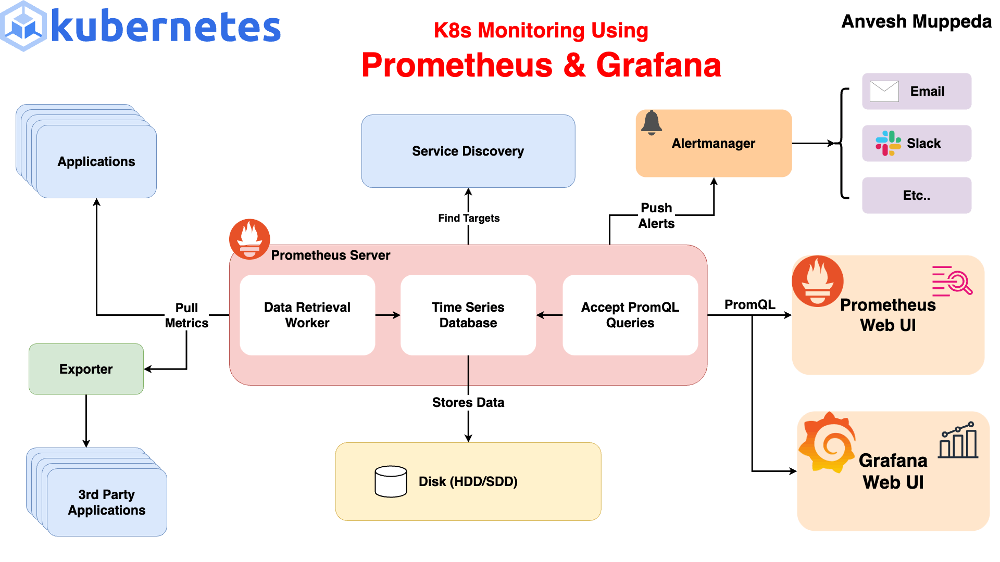

- **Query Analyzer**
  - Bantu pahami cara DB eksekusi query u/ menemukan operasi yg memakan waktu & bantu identifikasi area u/ optimasi.
  - tools:
    - `EXPLAIN` ,
    - `EXPLAIN ANALYZE`,
    - Query Planner Analyzer
- **Resource Monitor**
  - Menampilkan penggunaan sumber daya sistem u/ identifikasi komponen HW yg jadi penyebab bottleneck.
  - contoh tools:
    - `top`
    - `htop`
    - Performance Monitior

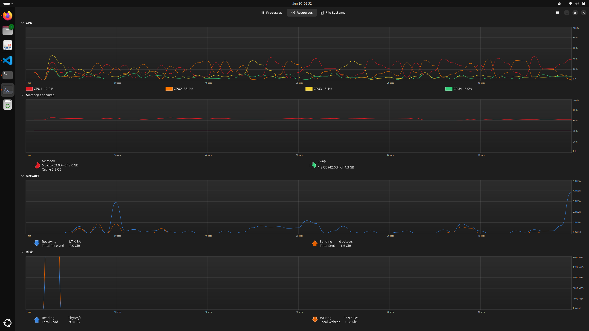

Monitoring Server & DB

- kumpulkan metrik
  - CPU, memori, I/O disk, jaringan
- Visualisasi
  - dlm bntk dashboard & grafik u/ analsiis & deteksi pola
- Analisis Tren
  - pelajari performa u/ identifikasi potensi masalah sebelum kejadian kritis
- Alerting
  - atur notifikasi u/ kondisi kritis
  - `slack`, `email`

### Teknik optimisasi Query

Analisis Query dengan Explain

Komponen:

- `select type`
  - jenis operasi `SELECT`
  - `SIMPLE` > `SUBQUERY` / `DERIVED`
- `type`
  - metode akses
  - `const` (best) > `eq_ref` > `ref` > `range` > `index` > `ALL` (worse)

      | Urutan | Metode   | Keterangan Singkat                             |
      | ------ | -------- | ---------------------------------------------- |
      | 1️⃣    | `const`  | Nilai tetap dari `PRIMARY KEY` atau `UNIQUE`   |
      | 2️⃣    | `eq_ref` | Join dengan hasil 1 baris dari index unik      |
      | 3️⃣    | `ref`    | Join/filter dengan beberapa baris dari index   |
      | 4️⃣    | `range`  | Kondisi rentang seperti `BETWEEN`, `>`, `IN()` |
      | 5️⃣    | `index`  | Full scan terhadap index (bukan data tabel)    |
      | 6️⃣    | `ALL`    | Full table scan (paling lambat)                |

- `key`
  - index yg digunakan
  - `NULL` : tdk ada index yg digunakan
- `rows`
  - jml baris yg diperiksa
  - semakin dikit, lebih baik
- `extra`
  - info tambahan
  - hindari `using filesort` & `using temporary`

> Sharding is a method of database architecture, mainly employed for horizontal partitioning across multiple machines or databases

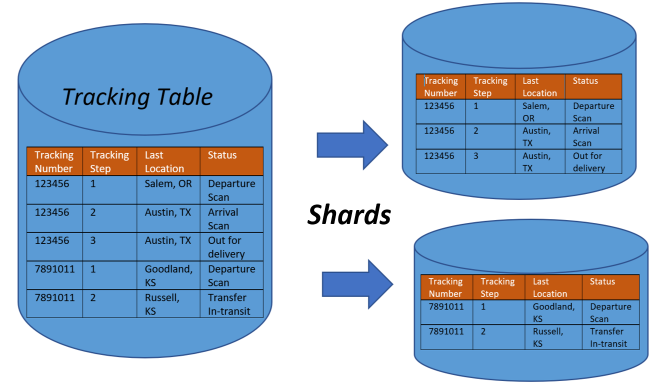

Contoh studi kasus : bottleneck DB e-commerce

- **identifikasi masalah** : selama periode diskon besar halaman produk butuh > 5 detik u/ dibuka, checkout sering gagal
- **analisis** : monitoring CPU usage , I/O antrian. `EXPLAIN` menunjukkan table scan pada tabel produk & dk ada pemakain `index`
- **solusi** : tambahkan indeks komposit pada kolom kategori & harga, optimasi query dgn hindari `SELECT *`, implementasi aching u/ query
- **hasil** : waktu respons turun jadi < 1 s, penggunaan CPU turun ke < 60%, tdk ada kegagalan checkout, throughtput naik 300%.

### Studi Kasus

> file : `STUDI_KASUS.md`

### (HANDS-ON) Performance Tuning SQL

## Pengenalan Apache Kafka & Data Streaming

> a distributed, fault-tolerant, scalable, and open-source event streaming platform

ideal u/ aplikasi streaming : log processing, big data analytics

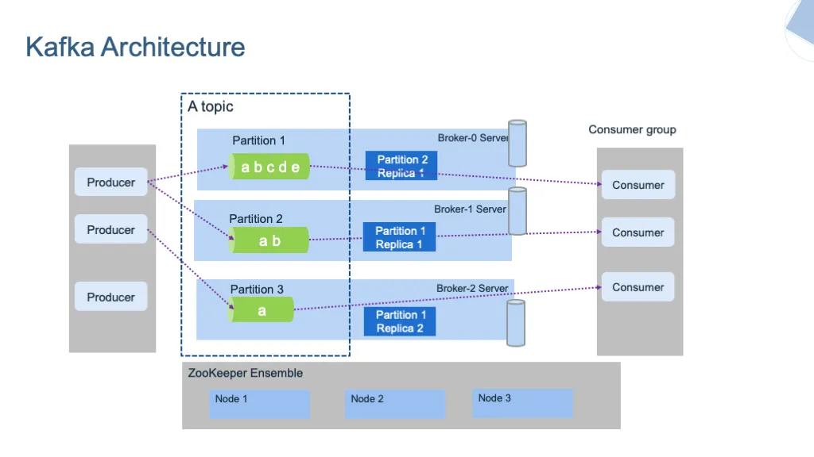

topic : log events
kafka header

streams API

Komponen Kunci:

- broker
  - server that runs Kafka and stores data
  - identified with an ID
  - simpan & kelola pesan
- producers
  - application or service that sends messages to a Kafka topic
  - kirim data ke broker
- topic
  - category or feed name to which messages are published
  - kategori u/ organisasi pesan
- consumer & consumer group
  - application that reads messages from Kafka topics
  - baca data dari topic
- zookeeper
  - manage metadata, control access to Kafka resources, and handle leader election and broker coordination

### Streaming data processing

> method of processing data in real-time as it is generated and continuously flows into a system

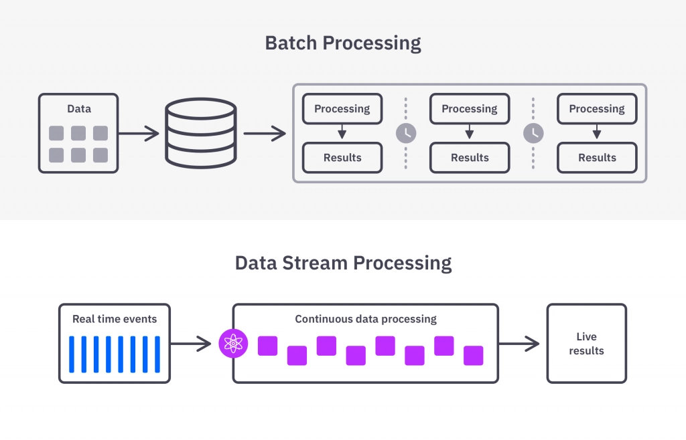

Pengolahan data berkelanjutan dalam **waktu nyata**.

Contoh penggunaan data streaming:

- monitoring data sensor
- log sistem & aplikasi
- feeds sosial media

## Apache Spark

u/ pemrosesan data streaming scr realtime. kafka sebagai penyalur data, spark yg proses.

an open-source, distributed processing system designed for big data workloads and large-scale data analytics

Spark's in-memory processing and optimized query execution can make it significantly faster than other big data processing systems, like Hadoop MapReduce, for certain workloads.

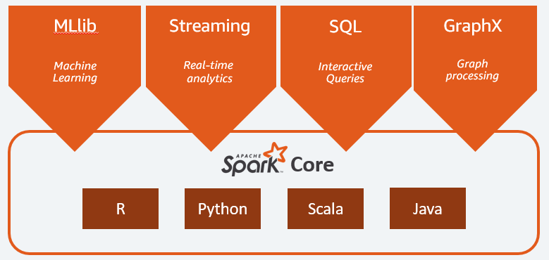

uses a master-slave architecture that consists of a driver, which runs as a master node, and many executors that run across as worker nodes in the cluster. Apache Spark can be used for batch processing and real-time processing as well.

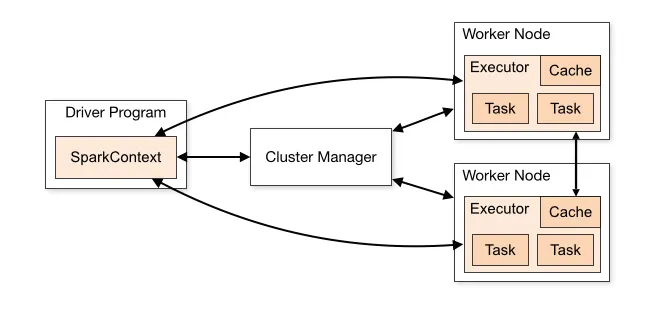

komponen kunci:

- Spark driver
  - process responsible for coordinating the execution of the Spark application.
- Spark executor
  - worker processes responsible for executing tasks in Spark applications
  - run tasks concurrently and store data in memory or disk for caching and intermediate storage
- The cluster manager
  - responsible for allocating resources and managing the cluster on which the Spark application runs
- sparkContext
  - entry point for any Spark functionality.
- Task
  - smallest unit of work in Spark

Cara kerja :

Ketika `driver Spark` dijalankan, ia akan membuat `SparkContext`, yang berfungsi sebagai pusat kendali. Spark Driver kemudian menggunakan komponen internal seperti `DAG Scheduler` dan `Task Scheduler` untuk mengubah kode pengguna menjadi tugas-tugas yang dapat dieksekusi di kluster. `Cluster Manager` berinteraksi dengan Spark Driver untuk mengalokasikan sumber daya ke worker nodes, yang akan mengeksekusi `task` yang lebih kecil. Hasil dari pemrosesan ini, seringkali melibatkan `RDD` (Resilient Distributed Dataset), dapat disimpan atau di-cache untuk penggunaan selanjutnya. Sepanjang proses ini, `Spark Driver` dan `SparkContext` secara kolektif memantau eksekusi tugas di seluruh kluster untuk memastikan kelancaran operasi.

spark streaming

- memanfaatkan DStream (discretized stream)
- proses data scr real time
- micro-batch processing

### Implementasi Event-Driven Processing

- Proses berbasis event
  - respons perubahan data scr real-time
- Reaktif
  - bereaksi thd event yg terjadi
- Asinkron
  - pemrosesan tdk blokir operasi lain

Alur kerja event-driven:

1. producer hasilkan event
2. kafka kelola & teruskan event
3. spark streaming analisis real-time
4. respons bdskan hasil tindakan

### (HANDS-ON) Simulasi Streaming Data

> file : `./handson/streaming.zip`

Cara menjalankan:

```bash
# mulai bangun container
./start.sh

#  menjalankan spark UI
./run_spark.sh

# akses localhost:4040

# untuk memberhentikan
./stop.sh
```

Hasil simulasi:

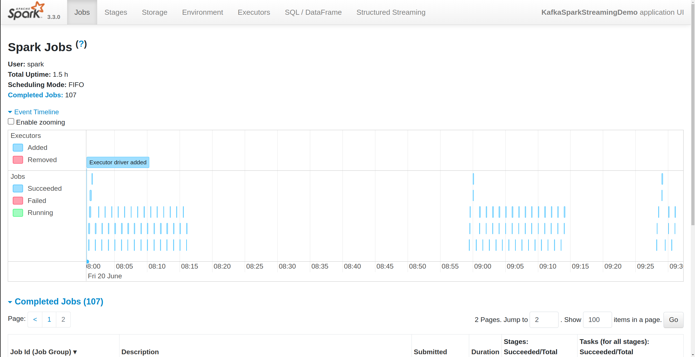

### (HANDS-ON) Demo Visualisasi Data

Cara Menjalankan

```bash
# buat docker container
./demo.sh start

# buat db, tabel, dan insert data postgresql
# copy dari local ke dalam container
docker cp init-scripts/postgres/init.sql demo_postgres:/init.sql

# jalankan script sql di dalam container
docker exec -it demo_postgres psql -U postgres -d demo_db -f /init.sql

# akses browser di localhost:3000

```

> file : `./handson/multisource.zip`

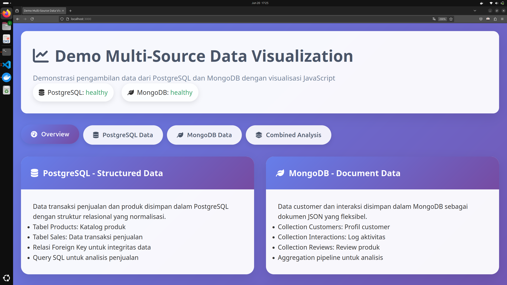

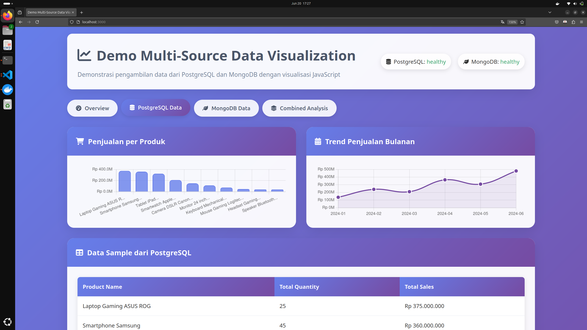

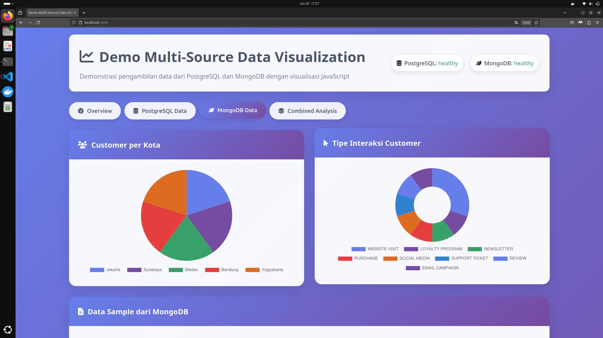

## Catatan Tambahan

### Lihat Process yang memakai port tertentu + Kill

```bash
# lihat process yang menggunakan port 9092
sudo lsof -i :9092

# contoh output:
# COMMAND   PID    USER   FD   TYPE DEVICE SIZE/OFF NODE NAME
# java    20715 bostang   18u  IPv6 138132      0t0  TCP localhost:42710->localhost:9092 (ESTABLISHED)
# java    20715 bostang   19u  IPv6 138740      0t0  TCP localhost:42722->localhost:9092 (ESTABLISHED)
# java    20715 bostang   20u  IPv6 135921      0t0  TCP localhost:42738->localhost:9092 (ESTABLISHED)

# matikan process dengan PID = 20715
sudo kill 20715
```
---
[🏠Back to Course Lists](https://odp-bni-330.github.io/)