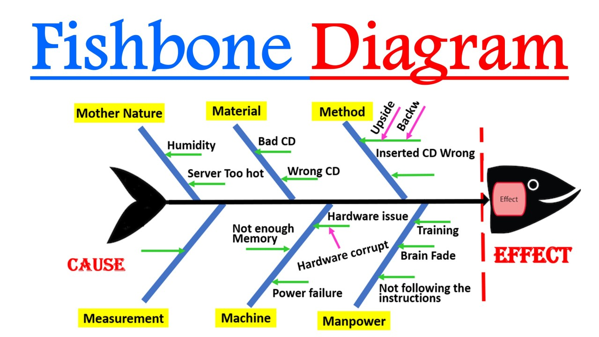
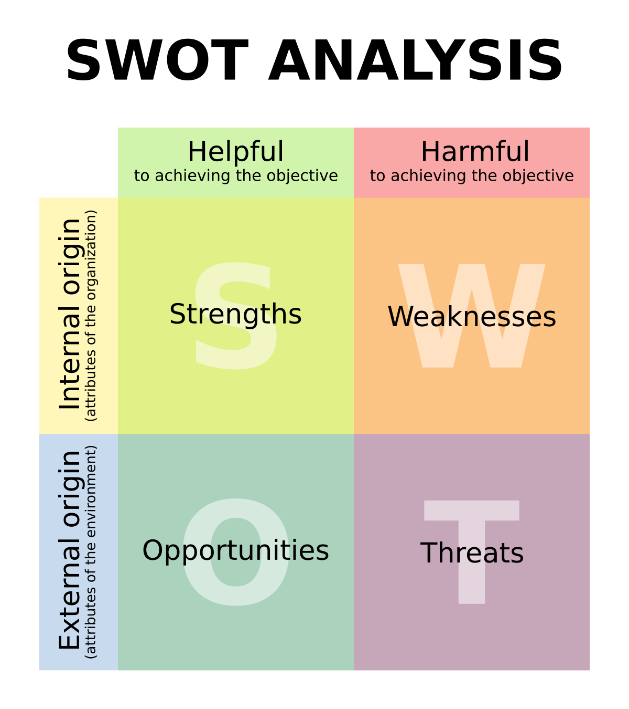
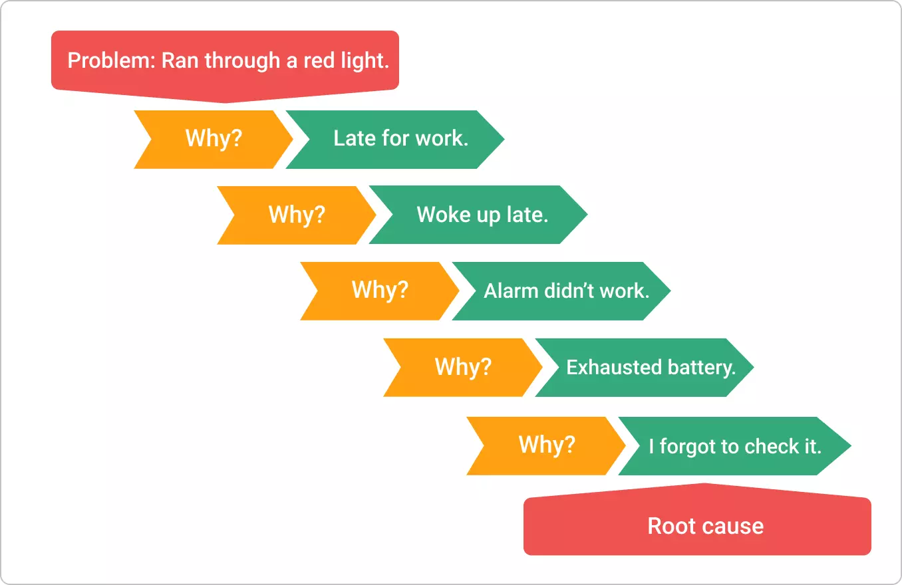

# Soft Skill

## Analytical Thinking

### Pentingnya Berpikir Kritis

- Pengambilan Keputusan
  - bdskan data & fakta, bukan hanya intuisi/emosi u/ hasilkan keputusan yg lebih tepat & dapat dipertanggungjawabkan
- Pemecahan Masalah
  - breakdown masalah kompleks menjadi lebih kecil dgn identifikasi akar masalah & temukan solusi yg efektif
- Keunggulan Professional
  - dapat menghadapi tanganan di lingkunga kerja & tingkatkan nilai jual organisasi

Berpikir Analisis : proses memecah masalah kompleks menjadi bagian2 yg lebih kecil u/ dianalisis & dipecahkan secara sistematis.

-> melibatkan :

- pengumpulan data
- identifikasi pola
- evaluasi informasi
- penarikan kesimpulan bdskan bukti

Karakteristik Utama:

- Sistematis & terstruktur
- Objektif & tidak bias
- Berbasis data & fakta
- Logis & rasional

Manfaat Berpikir Analitis:

- 85% efektivitas keputusan
- 3x peningkatan produktivitas
- 67% pengurangan risiko

| **Aspek**  | **Berpikir Analitis**            | **Berpikir Kritis**        |
|------------|----------------------------------|----------------------------|
| pendekatan | sistematis & terstruktur         | Bebas & tidak terstruktur  |
| Fokus      | pecah masalah jadi bagian2 kecil | gabungkan ide2 yg berbreda |
| Proses     | Logis & sekuensial               | Intuitif & nonlinear       |
| Hasil      | Solusi bdskan fakta & data       | Ide baru & inovatif        |

Penerapan Berpikir Analitis dlm Bisnis

- Analisis Pasar
- Keputusan Investasi
- Optimasi Proses

dlm Kesehatan

- diagnosis
- penelitian
- perencanaan pengobatan
- pemantauan

dlm pendidikan

- evaluasi kinerja
- pengingkatan berkelanjutan
- pengembangan kurikulum
- metode pengajaran

Teknik Analisis Masalah

- Diagram Sebab-Akibat (Fishbone)

Diagram Ishikawa : u/ identifikasi bbg faktor yg kontribusi pada suatu masalah u/ idenifikasi akar penyebab masalah.

kepala ikan : masalah utama
tulang utama: kategori penyebab
tulang kecil : brainstorming penyebab potensial
analisis hubungan sebab-akibat.

- Analisis SWOT

Strengh : internal positif -> keunggulan kompetitif
Weakness : internal negatif -> hambat capai tujuan
Opportunities : eksternal positif -> dpt dimanfaatkan u/ kemajuan
Threat : eksternal negatif -> membahayakan keberhasilan

- Teknik 5 Whys

identifikasi akar penyebab masalah dgn tanya "why" 5x.

### Langkah Menganalisis Masalah

1. Menentukan & identifikasi masalah
2. Kumpukan data & informasi
    - Data kuantiatif
    - Data kualitatif
    - Sumber data
3. Identifikasi penyebab & potensial solusi
4. Analisis data & tarik kesimpulan

### Menganalisis Data & Menarik Kesimpulan

Teknik Analisis Data;

- Analisis tren & pola
- perbandingan dgn benchmark
- analisis korelasi & kausalitas
- segmentasi & pengelompokan
- analisis skenario "what-if"
