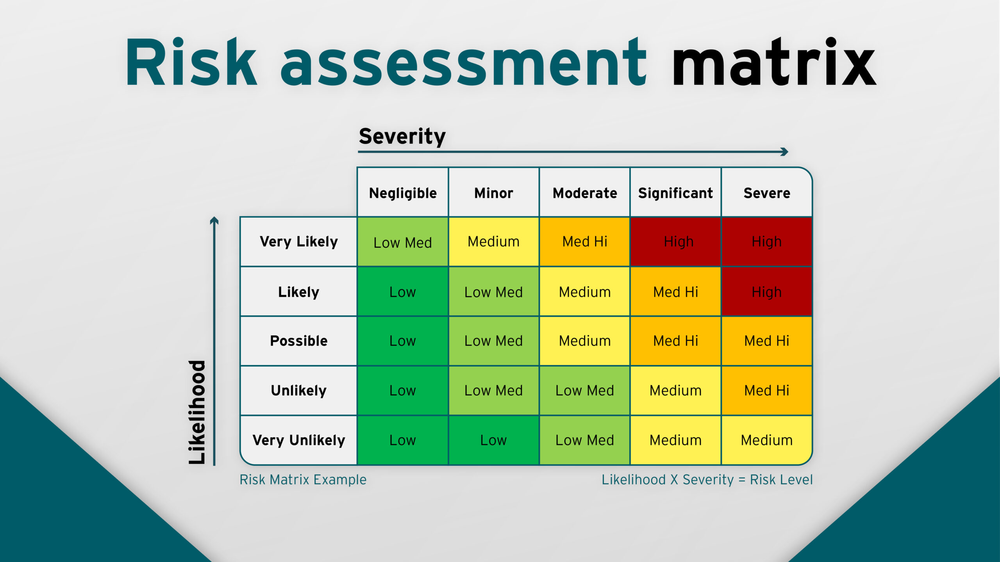

# Manajemen Risiko dalam Proyek IT

## Definisi Risiko dlm proyek IT

Risiko : ketidakpastian yg berpotensi negatif dlm pencapain tujuan proyek.

risiko : sgl aspek yg dpt memengaruhi keberhasilan implementasi sistem.

### Kategori Risiko

- Risiko Teknis
- Risiko Manajerial
- Risiko Eksternal

- Risiko Teknologi
  - berkaitan dgn pemilihan, implementasi, pemeliharaan, teknologi dlm proyek IT
  - contoh:
    - Keusangan teknologi yang cepat
    - Masalah skalabilitas saat beban sistem meningkat
- Risiko sumber daya manusia
  - kesenjangan keterampilan
  - pergantian staff
  - beban kerja berlebihan
- Risiko Anggaran & Waktu
  - estimasi tdk akurat
  - alokasi sumber daya
  - perubahan ruang lingkup
  - ketergantungan proyek
- Risiko Keamanan
  - pelanggaran data
  - serangan siber
  - kepatuhan regulasi
  - akses kontrol

Teknik Identifikasi Risiko:

- Wawancara
- Brainstorming
- Checklist
- Analisis Dokumentasi

