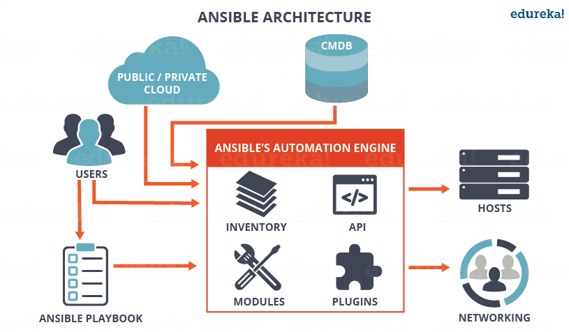
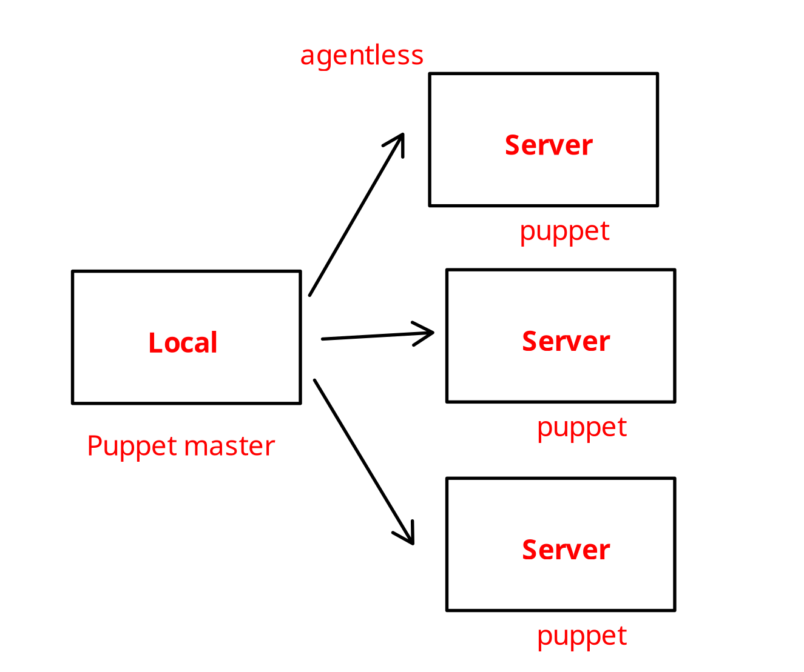
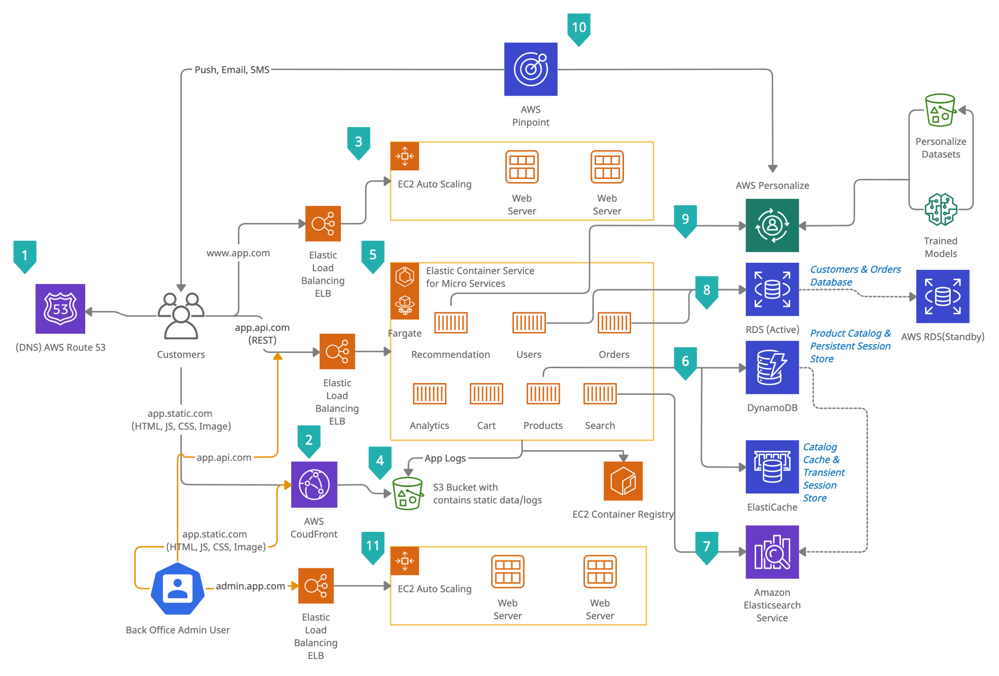

# Infrastructure as Code (IaC)

## Introduction to Infrastructure Automation

cloud provider : AWS, Azure, GCP, Alibaba Cloud, etc.

### Pengenalan DevOps & IaC

**Dev**elopment
**Op**eration**s**

➡️ Filosofi & praktik yg menekankan **kolaborasi** antar tim (pengembang/_development_ dan operasi/_operations_) u/ tingkatkan kecepatan & kualitas _delivery_ software.

- hilangkan silo tradisional antara tim.
- menekankan otomatisasi dan pemantauan di semua tahap pengembangan.

role : DevOps Engineer

Tahapan aplikasi sebelum _deploment_

Beberapa hal yang dipersiapakn DevOps:

- Message Queue
- Microservices
- Multistage docker build
- CI/CD
- Horizontal scalability

### Keuntungan Otomasi

- Ketepatan
  - kurangi _Human error_
- Kecepatan
  - time-to-market, kejar responsiviitas thd kebutuhan bisnis
- Kolaborasi
  - komunikasi antar tim

### IaC

motivasi : Bayangkan ada 100 server, maka akan sangat melelahkan untuk melakukan konfigurasi thd semua server itu secara manual (misal remote connection `ssh`).

IaC : pendekatan u/ kelola & sediakan infrastruktur komputasi melalui **kode** daripada proses manual. Infras didefinisikan dgn file konfigurasi yg dapat diverifikasi, dibagikan, dan dikelola versinya.

dikelola menggunakan sistem kontrol versi & praktik _software development_

#### Manfaat IaC

- Konsistensi
  - identik di semua lingkungan, kurangi masalah _"works on my machine"_
- Kecepatan
  - kurangi waktu tunggu
- Riwayat Perubahan
  - pelacakan melalui _version control system (VCS)_
- Skalabilitas
  - sesuai kebutuhan.

Pengelolaan tradisional vs IaC

| **Pengelolaan Tradisional**    | **IaC**                               |
| :----------------------------- | :------------------------------------ |
| konfigurasi manual via CLI/GUI | konfigurasi otomatis via kode         |
| dokumentasi tdk lengkap        | kode sbg dokumentasi                  |
| sulit u/ produksi lingkungan   | lingkungan identik mudah direproduksi |

**Otomasi dalam Proses DevOps**:

- Continous integration
- Automated testing
  - acceptance test
    - validasi kebutuhan bisnis
  - unit testing
    - fungsi individual
  - end-to-end testing
    - alur pengguna lengkap
  - integration testing
    - ineraksi antar komponen
- Contious delivery
- Monitoring

#### Jenis IaC

- **Deklaratif**
  - fokus pada "apa"
  - keadaan akhir yg ingin dicapai & cara terbaik
  - Contoh : Terraform, CloudFormation
- **Imperatif**
  - fokus pada "bagaimana"
  - tentukan langkah spesifik
  - Contoh : shell script
- **Hybrid**
  - campuran
  - contoh : Ansible, Puppet

### CI/CD

#### CI

menggabungkan perubahan kode ke repositori bersama, diikuti oleh build dan pengujian otomatis.

Tujuan : mendeteksi dan mengatasi masalah integrasi sedini mungkin dalam SDLC.

Komponen :

- _version control system_ (VCS)
- Server CI (Jenkins, Gitlab CI, CircleCI)
- automated testing (unit, integration)
- notifikasi otomatis u/ kegagalan build

### Tools IaC

#### Automated Infrastructure Provisioning

proses otomasi u/ siapkan & konfigurasi infras IT : server, jaringan, penyimpanan, dan layanan terkait lain.

Terraform, Ansible, CloudFormation

#### Monitoring & Alerting

- pemantauan kinerja
- sistem peringatan
- pengelolaan log
- health check

Grafana

### Pengenalan Terraform

alat IaC yang memungkinkan pengguna untuk mendefinisikan dan menyediakan infrastruktur menggunakan bahasa konfigurasi deklaratif yang disebut HashiCorp Configuration Language (HCL).

mengelola berbagai penyedia layanan cloud dan layanan on-premise melalui file konfigurasi yang sama, menjadikannya solusi multi-cloud.

#### Konsep Deklaratif Terraform

- Definisi Keadaan Akhir
  - **apa** yang mau dicapai, bukan **bagaimana**
  - Terraform akan tentukan langkah
- Abstraksi Kompleksitas
  - user bisa fokus pada kebutuhan bisnis daripada detail implementasi teknis
- Idempotence
  - konfigurasi dapat dijalankan scr berulang dan menghasilkan keadaan yang sama (tanpa efek samping yg tak diinginkan)

**Keuntungan Terraform**:

- Multi-cloud
  - dukung bbg Cloud provider : AWS, Azure, Google Cloud, etc. -> bisa dikelola di 1 platform
- Idempotent
- Platform-agnostic
- Komunitas besar

contoh sederhana HCL:

```t
provide "aws" {
    region = "us-west-2"
}

resource "aws_instance" "example"{
    ami = "..."
    instance_type = "t2.micro"
    tags = {
        Name = "terraform example"
        Environment = "development"
    }
}
```

### Pengenalan Ansible (Teori)

- alat otomasi u/ konfigurasi sistem, deployment app, orkestrasi.
- tdk butuh agen yg jalan di server target dgn SSH u/ koneksi & eksekusi tugas
- gunakan format `.yaml` u/ playbook : definsiikan serangkaian tugas yg dijalankan pada server target

Terraform hanya menyediakan infras (inisiasi) sedangkan konfigurasi dilakukan dgn Ansible.



Analogi :

dalam sebuah event:

Terraform : EO
Ansible : Planner
Puppet : eksekturo

#### Keuntungan Ansible

- Tanpa Agen
  - menggunakan `ssh` u/ konek & eksekusi tugas, sederhanakan setup & pemeliharaan
- Mudah digunakan
  - menggunakan file `.yaml` u/ playbook & konfigurasi
- Pendekatan Deklaratif
  - menentukan keadaan yg diinginkan tanpa harus langkah spesifik
- Modul yg kaya
  - u/ bbg tugas dari manajemen paket sampai konfigurasi layanan, buat otomasi bbg aspek infras lebih mudah.

keywords:

- ssh
- playbook : .yaml
- play
- task
- ansible vault

Penerapan Ansible:

- Pengaturan server
- Deploymen Aplikasi
- Kepatuhan keamanan
- Pembaruan software

### Pengenalan Puppet

- alat manajemen konfigurasi & otomasi yg fokus u/ make sure infras dalam keadaan yg diinginkan.
- menggunakan model client-server : agen puppet berjalan di server target & berkomunikasi dgn Puppet master u/ dapatkan config.
- Menggunakan bahasa deklaratif khusus u/ definsikan keadaan sistem
- cocok u/ lingkungan besar dgn banyak server



### (HANDSON) Infrastrukur e-commerce



## Menerapkan Ansible untuk Otomatisasi Infrastruktur

### Pengenalan Ansible

Komponen:

- Playbook
  - `.yaml` atau `.ini` berisi serangkaian tugas yg dijalankan 1/lebih host.
- Task
  - tindakan yg dilakukan di dalam playbook u/ capai keadaan yg diinginkan
- Inventory
  - daftar host & kelompok host yg dikelola ansible (`.ini` atau `.yaml`)
- Modul
  - unit eksekusi u/ lakukan tugas : install / kelola app.

### Struktur Ansible Playbook

#### Komponen

- Hosts
  - tentukan host / group host dari inventory yg akan diproses playbook
- Become
  - apakah menggunakan akses root (`sudo`) saat jalankan tugas
- Tasks
  - daftar tugas yg akan dijalankan scr berururan
- Vars
  - variabel yg dapat digunakan ansible playbook
  - u/ pisahkan data dari logika
  - biasa disimpan di `vault` dan jgn dipush ke github

contoh :

```yaml
---
- name: Install and configure Nginx
  hosts: all
  become: yes
  vars:
    nginx_version: "latest"  # atau versi spesifik seperti "1.18.0"
    nginx_start_on_boot: yes

  tasks:
    - name: Update apt cache (Debian/Ubuntu)
      apt:
        update_cache: yes
      when: ansible_os_family == 'Debian'

    - name: Install Nginx (Debian/Ubuntu)
      apt:
        name: nginx
        state: present
        version: "{{ nginx_version }}"
      when: ansible_os_family == 'Debian'

    - name: Install EPEL repo (CentOS/RHEL 7)
      yum:
        name: epel-release
        state: present
      when: ansible_distribution == 'CentOS' and ansible_distribution_major_version == '7'

    - name: Install Nginx (CentOS/RHEL)
      yum:
        name: nginx
        state: present
        version: "{{ nginx_version }}"
      when: ansible_os_family == 'RedHat'

    - name: Enable and start Nginx service
      service:
        name: nginx
        enabled: "{{ nginx_start_on_boot }}"
        state: started

    - name: Verify Nginx installation
      uri:
        url: "http://localhost"
        return_content: yes
      register: nginx_result
      until: nginx_result.status == 200
      retries: 5
      delay: 3
      ignore_errors: yes

    - name: Show Nginx welcome message
      debug:
        msg: "Nginx installed successfully! Access it at http://{{ ansible_host }}"
      when: nginx_result.status == 200
```

#### Ansible Inventory

file yg definsikan daftar host yg dikeloka ansibile.
memungkinkan u/ kelola kelompok host bdskan fungsi, lokasi, kriteria lain

format:

format ini :

```ini
# hosts.ini
[webservers]
web1.example.com
web2.example.com ansible_host=192.168.1.100

[dbservers]
db1.example.com
db2.example.com ansible_port=2222  # Custom SSH port

[all:vars]
ansible_user=admin
ansible_ssh_private_key_file=~/.ssh/id_rsa
```

fomat yaml:

```yaml
# hosts.ini
[webservers]
web1.example.com
web2.example.com ansible_host=192.168.1.100

[dbservers]
db1.example.com
db2.example.com ansible_port=2222  # Custom SSH port

[all:vars]
ansible_user=admin
ansible_ssh_private_key_file=~/.ssh/id_rsa
```

menggunakan inventory

```bash
# Menggunakan file INI
ansible-playbook -i hosts.ini playbook.yml

# Menggunakan file YAML
ansible-playbook -i hosts.yml playbook.yml

# Mengecek inventory
ansible-inventory -i hosts.ini --list
```

### Template Jinja2

mesin template yg digunakan ansible u/ hasilkan file dinamis.

dpt buat file konfigurasi yg kompleks dgn logika kondisional, perulangan, substitusi variabel.

Fitur Jinja2 dalam template

- subsitusi variabel

```conf
{{variabel_name}}
```

- kondisional

```conf

    ...

    ...

```

- perulangan

```conf

    ...

```

- filter

```conf
; sintax : {{ variable | filter }}
{{ path | basename }}
{{ string | upper }}.
```

contoh Template nginx.conf.j2

```conf
# {{ ansible_managed }}

user {{ nginx_user }};
worker_processes {{ nginx_worker_processes }};

error_log {{ nginx_error_log }} {{ nginx_error_log_level | default('error') }};


events {
    worker_connections {{ nginx_worker_connections }};
    
    multi_accept on;
    
}

http {
    include       {{ nginx_mime_types_path }};
    default_type  application/octet-stream;

    # Log Format
    log_format  main  '$remote_addr - $remote_user [$time_local] "$request" '
                      '$status $body_bytes_sent "$http_referer" '
                      '"$http_user_agent" "$http_x_forwarded_for"';

    
    access_log  {{ nginx_access_log }}  main;
    

    sendfile        on;
    tcp_nopush     on;
    tcp_nodelay    on;

    keepalive_timeout  {{ nginx_keepalive_timeout }};
    types_hash_max_size {{ nginx_types_hash_max_size | default(2048) }};

    
    # Gzip Settings
    gzip  on;
    gzip_disable "msie6";
    gzip_vary on;
    gzip_proxied any;
    gzip_comp_level {{ nginx_gzip_comp_level | default(6) }};
    gzip_types {{ nginx_gzip_types | default('text/plain text/css application/json application/javascript text/xml application/xml application/xml+rss text/javascript') }};
    

    # Virtual Host Configs
    include {{ nginx_conf_dir }}/conf.d/*.conf;
    include {{ nginx_conf_dir }}/sites-enabled/*;
}
```

### Role-based Playbooks

Struktur direktori:

- `roles/myrole/`
- `task/main.yaml`
- `handlers/main.yaml`
- `templates/some_template.j2`
- `files/some_file`

`ansible-galaxy init myrole`

```tree
ansible-role-example/
├── inventory.ini
├── site.yaml
└── roles/
    ├── webserver/
    │   └── tasks/
    │       └── main.yaml
    └── dbserver/
        └── tasks/
            └── main.yaml
```

`site.yaml`

```yaml
- name: Setup Web Servers
  hosts: web
  become: yes
  roles:
    - webserver

- name: Setup DB Servers
  hosts: db
  become: yes
  roles:
    - dbserver
```

- web role
- database role
- application role
- security role

### Debugging dan Logging

#### Debugging

- modul debug
  - Menampilkan pesan atau nilai variabel di konsol saat eksekusi playbook
- mode check
  - `--check`
- mode diff
  - `--diff`

contoh:

- modul debug

```yaml
- name: Debug example
  hosts: localhost
  tasks:
    - name: Show value of variable
      debug:
        var: ansible_facts['distribution']
        msg: "The value of my_var is {{ my_var }}"
```

- mode check:

```bash
ansible-playbook site.yaml --check
```

- mode diff:

```bash
ansible-playbook site.yaml --diff
```

#### Logging

`ansigble.cfg`

```cfg
[defaults]
log_path = /var/log/ansible.log
```
