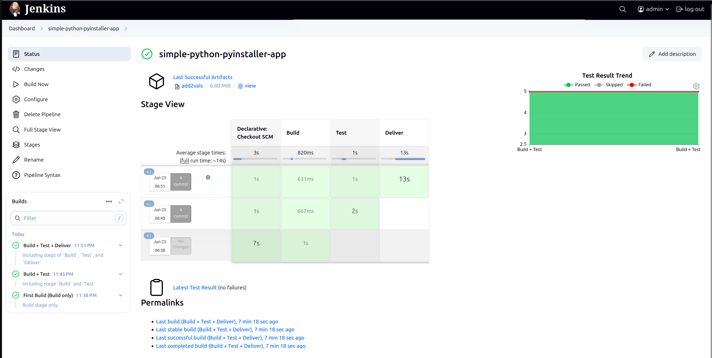
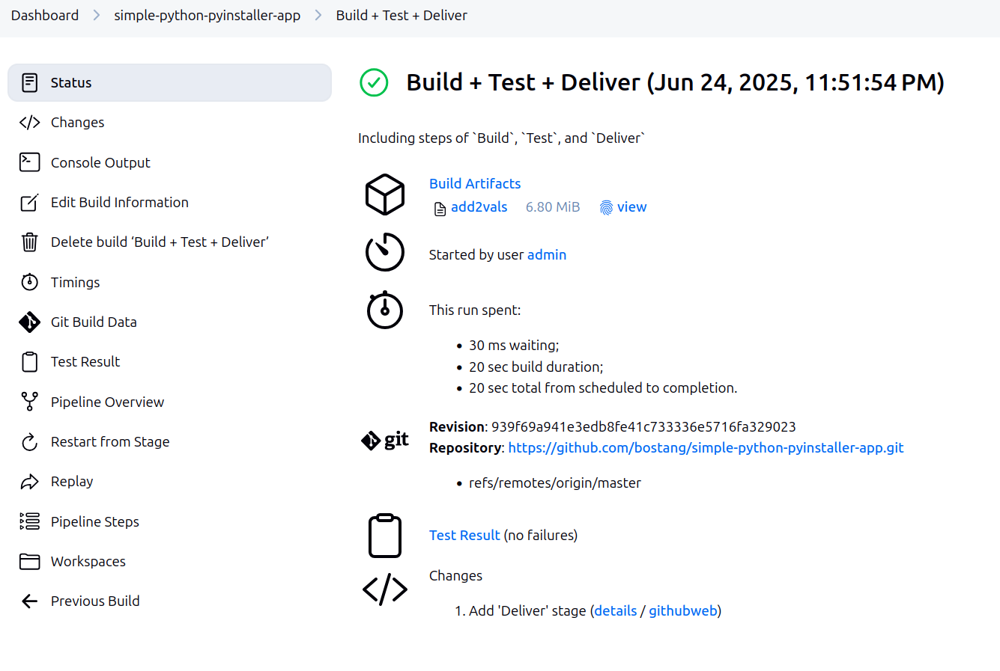
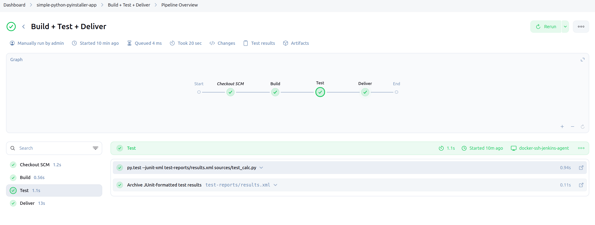
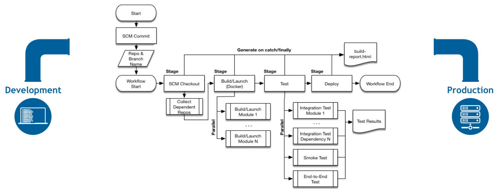
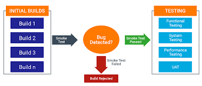

# Catatan Tambahan

## Jenkins

sintaks pipeline

```java
pipeline {
    agent any
    stages {
        stage('Build') {
            steps {
                echo 'Building...'
                // For Java: sh 'mvn clean package'
            }
        }
        stage('Test') {
            steps {
                echo 'Testing...'
                // For Java: sh 'mvn test'
            }
        }
        stage('Deploy') {
            steps {
                echo 'Deploying...'
                // Add deployment steps here
            }
        }
    }
}
```

- The agent section in a Jenkinsfile tells Jenkins where the code defined in your pipeline should be executed. agent any means "run this pipeline on any available machine connected to Jenkins."

- The stash step is how you save files generated in one part of your Jenkins pipeline so that later parts of the pipeline can access and use them,

### (HANDSON) Python + Jenkins

> file : `./handson/python_jenkins_app.zip`

[referensi lengkap](https://www.jenkins.io/doc/tutorials/build-a-python-app-with-pyinstaller/)

#### Langkah

**Langkah 1** : _fork_ [repo](https://github.com/jenkins-docs/simple-python-pyinstaller-app)

**Langkah 2** : clone repo yang telah di fork ke local PC

**Langkah 3** : Siapkan [Jenkins Controller](https://github.com/jenkins-docs/quickstart-tutorials.git)

```bash
docker compose --profile python up -d
```

**Langkah 4** : Buat `Jenkinsfile`

```java
pipeline {
    agent any
    options {
        skipStagesAfterUnstable()
    }
    stages {
        stage('Build') {
            steps {
                sh 'python -m py_compile sources/add2vals.py sources/calc.py'
                stash(name: 'compiled-results', includes: 'sources/*.py*')
            }
        }
        stage('Test') {
            steps {
                sh 'py.test --junit-xml test-reports/results.xml sources/test_calc.py'
            }
            post {
                always {
                    junit 'test-reports/results.xml'
                }
            }
        }
        stage('Deliver') { 
            steps {
                sh "pyinstaller --onefile sources/add2vals.py" 
            }
            post {
                success {
                    archiveArtifacts 'dist/add2vals' 
                }
            }
        }
    }
}
```

**Langkah 5** : Push ke github

```bash
git add .
git commit -m "tambahkan Jenkinsfile"
git push
```

**Langkah 6** : Jalankan Jenkins Pipeline

buka `localhost:8080` > pilih Pipeline > pilih `Build Now`

result:







### CD pipeline



## Smoke Test

