<!-- Dirangkum oleh : Bostang Palaguna -->
<!-- Juni 2025 -->

# Automation

**Objectives**:

- konsep CI/CD
- Jenkins
- optimasi alur kerja
- implementasi praktis

---

## CI/CD Fundamentals

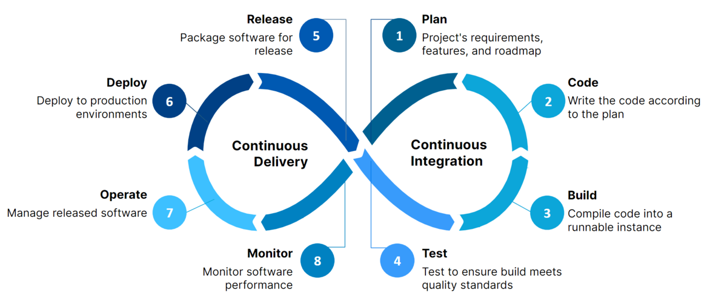

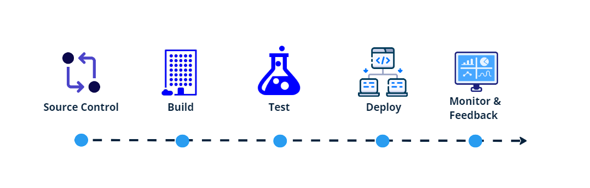

CI : Continous Integration
integrasikan kode ke repo utama
fokus : jaga kualitas kode, percepat deteksi bug
manfaat : early detection thd error

Langkah CI:

- commit
  - developer ubah kode di repo bersama
- build
  - Jenkins build otomatis
- test
  - automated testing u/ temukan bug
- feedback
  - tim dpt feedback thd kualitas kode

CD : continous deployment
kirim kode ke production environment setelah testing di CI.
fokus: pastikan app siap rilis
manfaat: deployment lebih cepat

Langkah CD:

- build
  - di lingkungan testing terkendali
- test
  - diuji scr menyeluruh di semua environment
- staging
  - environment mirip produksi
- deploy
  - go live

### Jenkins

`Airflow` vs `Jenkins`

How is `Airflow` different from `Jenkins`? `Airflow`: Orchestrates complex data workflows with DAGs suited for ETL processes. Jenkins: Focuses on CI/CD pipelines, automating software build, test, and deployment

`Airflow` ➡️ ETL ; urusan data engineer
`Jenkins` ➡️ CI/CD ; urusan DevOpes

### (HANDSON) Telegram notification

Menggunakan Bot Telegram sehingga ketika push ke github maka akan masuk notifikasi lewat bot.

⭐ Berguna untuk alerting system

#### Cara mendapatkan Token dan ID

chat `@BotFather`!

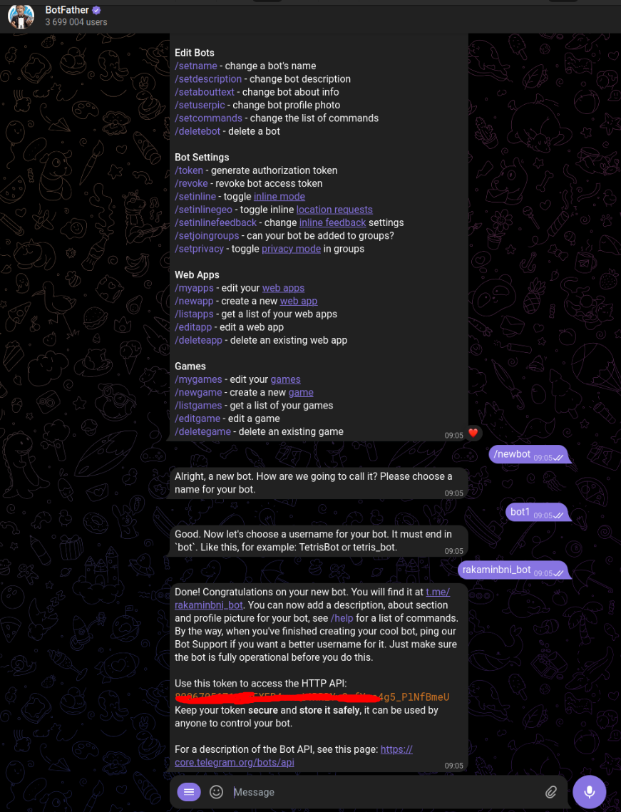

chat `@myidbot`

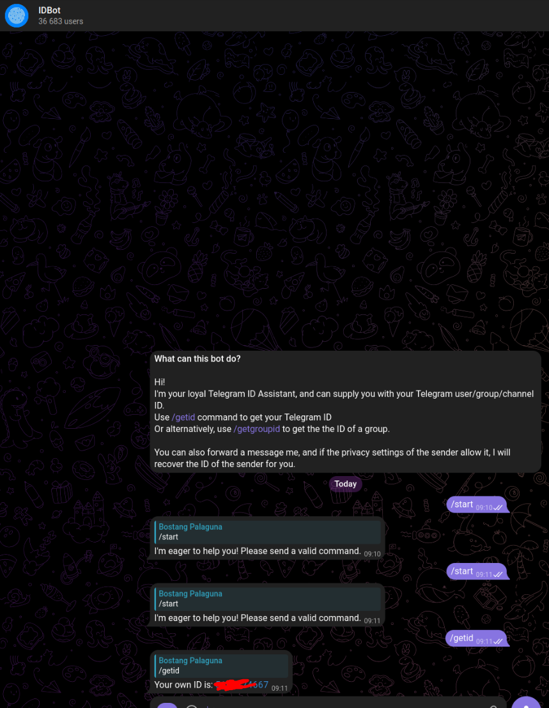

#### Cara Menjalankan

Pastikan bahwa di github repostiry sudah diatur `secrets` sebagai beirkut:

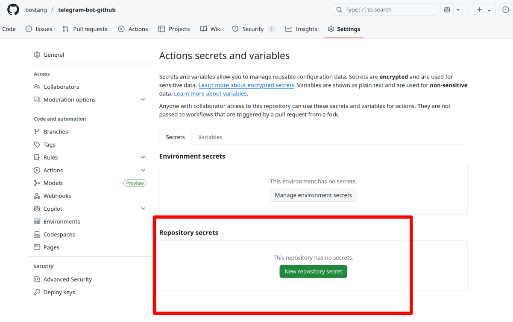

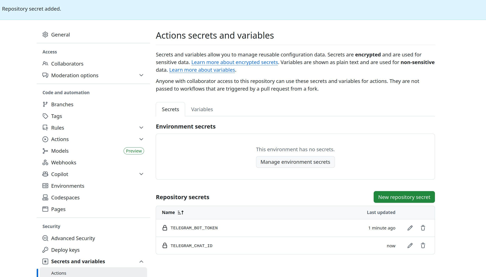

maka push kode, langsung akan masuk sebuah notifikasi ke telegram

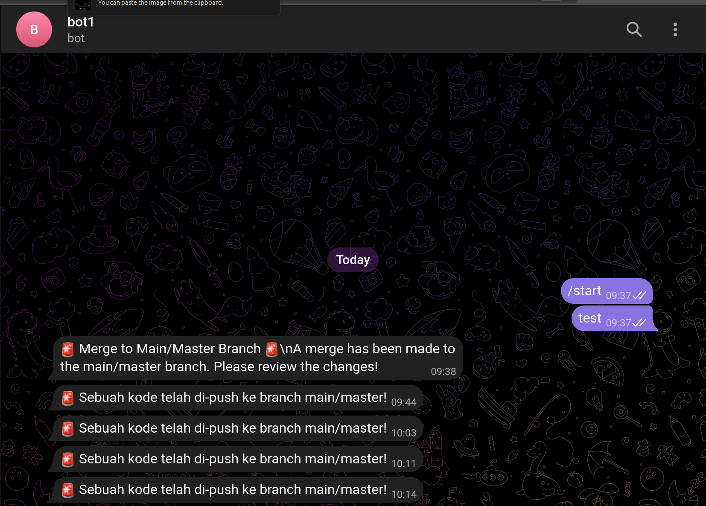

#### Catatan

Apabila sudah terlanjur mengupload _secrets_ seperti `.env` ke _remote repo_, segera _generate_ token baru.

### (HANDSON) Jenkins dan Telegram

> file : `./handson/linux-cicd.zip
>
> file original : `./handson/telegram-bot-github.zip`

Best Practice : simpan `TOKEN` dan `id` di Jenkins variable

`Dashboard > Manage Jenkins > Credentials > System > Global Credentials`

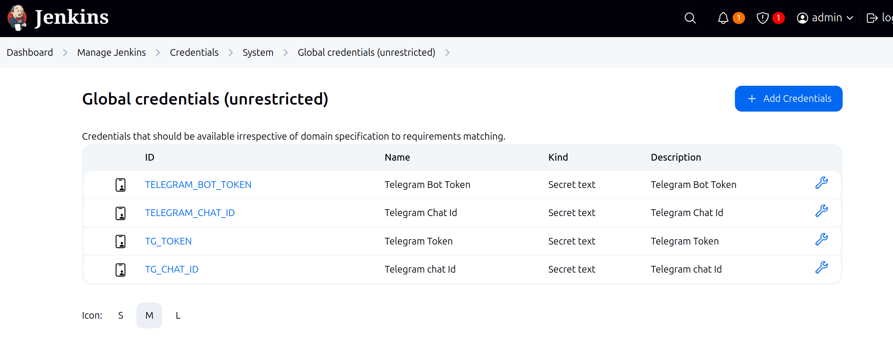

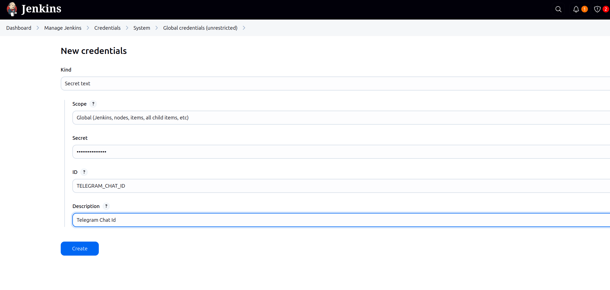

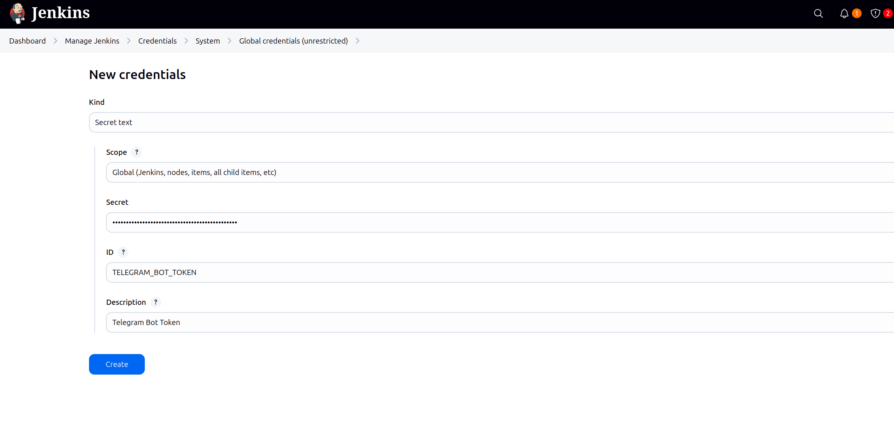

Atur `Jenkinfiles` di Configure.

lalu pilih `Build now`

setelah diperbaiki:

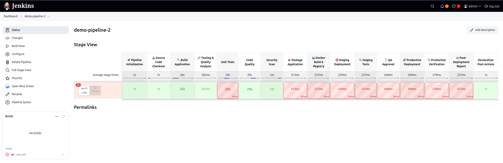

tampilan dashboard Jenkins:

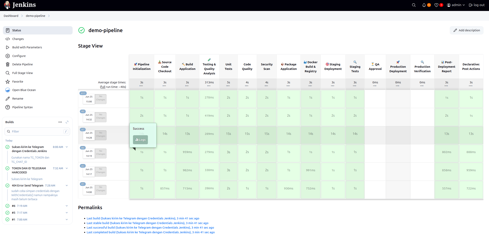

notifikasi yang muncul:

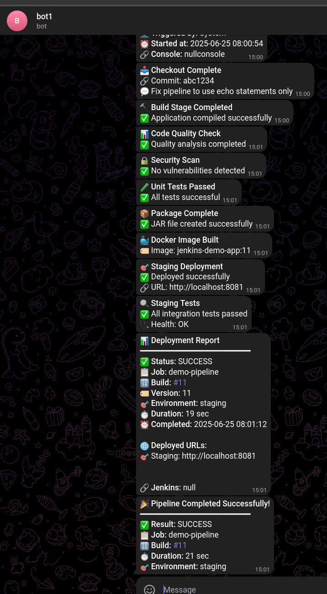

Catatan : apabila nama credentialsnya : `TELEGRAM_BOT_TOKEN` dan `TELEGRAM_CHAT_ID`, maka akan ada error
➡️ Telegram semacam mendeteksi dan langsung masking
➡️ gunakan nama seperti `TG_TOKEN` dan `TG_CHAT_ID`.

## Jenkins Advanced

### Integrasi Jenkins dengan Github

Peran `git` dalam CI/CD

- version control
  - melacak perubahan kode & memungkinkan kolaborasi
- history
  - riwaya perubahan kode u/ audit & rollback
- branching
  - pengembangan fitur parallel tanpa ganggu kode utama
- merging
  - inetgrasi bbg branch ke branch utama

Peran `Github` dalam CI/CD

- Hosting Repository
  - platform berbasis cloud u/ simpan & kelola repo git
- Kolaborasi
  - pull request, issue tracking, code review
- Integrasi
  - webhook & API u/ integrasi CI/CD tools spt Jenkins
- Keamanan
  - code scanning & manajemen akses

**Peran `Jenkin` dalam CI/CD**:

- automation server
  - membangun, menguji, dan men-deploy perangkat lunak secara otomatis
- pipeline
- Plugin ecosystem

**Jenis Kredensial Github di Jenkins**:

- username/password
- SSH keys
- access token

Jenkins ➡️ pipeline as code

### Webhook untuk Automasi Deployment

mekanisme yang memungkinkan satu aplikasi untuk memberikan informasi real-time ke aplikasi lain ketika suatu peristiwa terjadi.

**cara kerja**:

Ketika peristiwa tertentu terjadi di aplikasi sumber (misalnya, push ke repository GitHub), aplikasi tersebut mengirim HTTP POST request dengan payload yang berisi informasi tentang peristiwa tersebut ke URL yang telah ditentukan di aplikasi tujuan (misalnya, Jenkins)

> Webhooks and polling are both methods for retrieving data updates, but they differ significantly in how they work. Polling involves a client regularly requesting updates from a server, while webhooks are a "push" mechanism where the server sends updates to the client when an event occurs

## Monitoring

proses pengumpulan & analisis data dari sistem & app scr berkelanjiutan

krusial dalam lingkungan mikroservis

**Siklus** : Collect ➡️ store ➡️ analyze ➡️ alert

### Prometheus

_monitoring and alerting toolkit_.

stores all scraped samples locally and runs rules over this data to either aggregate and record new time series from existing data or generate alerts.

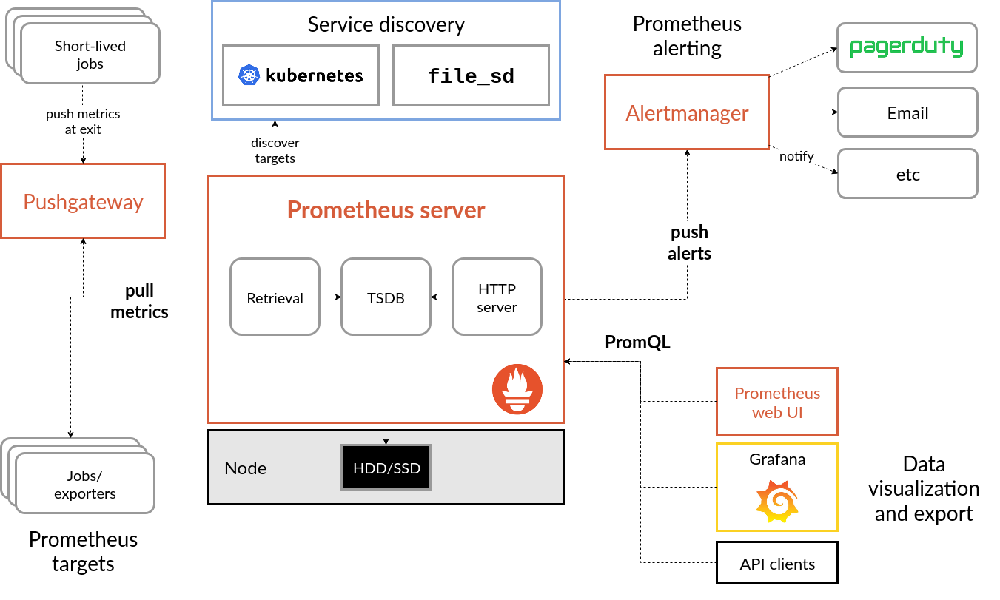

**Analogi Prometheus dengan ElasticSearch**:

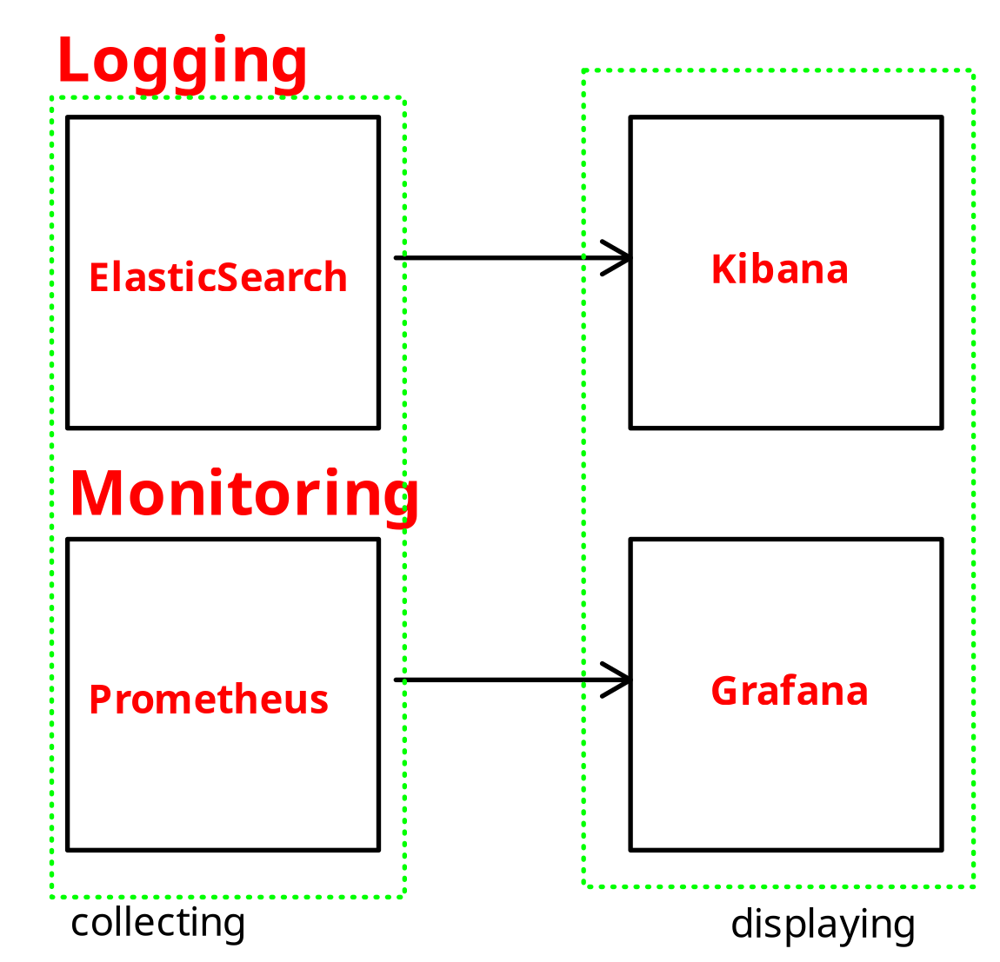

**Peran**:

- Time-series Database  (TSDB): simpan data metrik dgn timestamp u/ analisis historis.
- Query language : PromQL
- kirim notif saat kondisi tertentu terpenuhi (alerting)

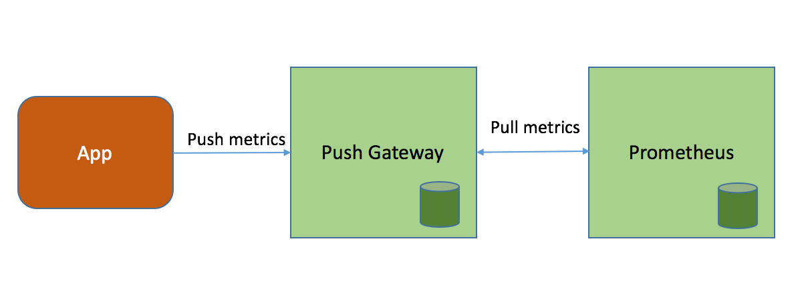

_Pushgateway is an intermediary service which allows you to push metrics from jobs which cannot be scraped_.

### Grafana

**peran**:

- koneksi data
- visualisasi
- kolaborasi

Identifkasi Masalah:

- Deteksi Anomali
- Lonjakan Error Rate
- Penurunan Performa

#### Jenis Monitoring

- **metrics**
  - numerik;dikumpulkan dari sistem scr berkala
  - beri gambaran performa sistem
  - jenis:
    - counter
      - hanya bertambah, tdk pernah turun
      - reset saat restart
      - tak negatif
      - contoh:
        - jumlah error
        - jumlah login
        - total request HTTP
    - gauge
      - naik/turun (fluktuatif)
      - contoh:
        - cpu usage
        - suhu server
        - free memory
    - histogram
      - distribusi sampel dlm bucket
        - contoh:
          - durasi request
          - ukuran respons
          - database latency
    - summary
      - simpan quantile yg dihitung
        - batch processing time
- **logs**
  - peristiwa/kejadian di aplikasi
  - berguna u/ debugging, audit, forensik
  - jenis log:
    - fatal
    - error
    - warning
    - info
    - debug
  - tantangan:
    - volume besar
      - orde GB per hari
    - parsing
      - ekstrak info penting dari format yg beragam
    - korelasi
      - hubungkan log dari bbg layanan & komponen
    - pencarian
      - cari informasi relevan scr cepat
- **tracing**
  - lacak request yg lewati komponen sistem terdistribusi
  - tunjukkan hubungan sebab-akibat antar peristiwa di sistem
  - u/ pahami latensi & dependensi antar layanan
  - **span** : representasi lengkap request via sistem
  - **trace** : unit kerja individual dlm trace
    - function call
    - query DB
    - API call
  - tools:
    - `Jaeger`
    - `Zipkin`
    - `OpenTelemetry`

### (HANDSON) Monitoring

> file : ./handson/linux-monit.zip
>
> file original : ./handson/monit.zip

dashboard grafana:

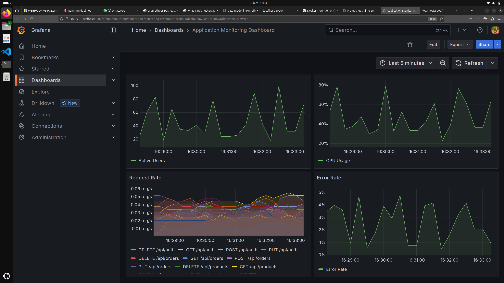

query di prometheus:

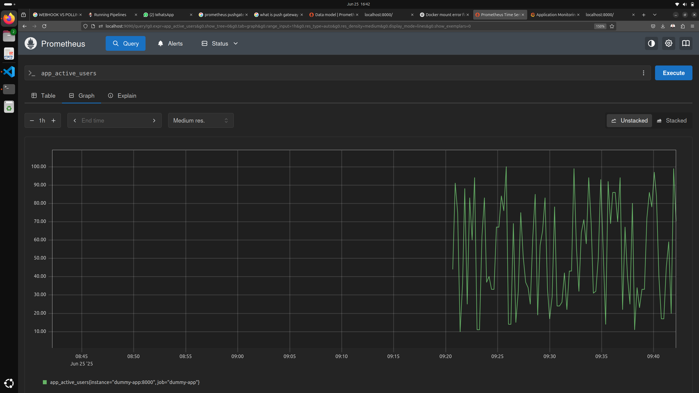

secara _real_, nanti ada library yang bisa dipakai u/ dapatkan _hardware resource_

> The `psutil` library is a widely used and recommended Python library for obtaining hardware resource usage information. It is a cross-platform library that provides an interface for retrieving information on running processes and system utilization, including CPU, memory, disk, and network usage

---
[🏠Back to Course Lists](https://odp-bni-330.github.io/)
