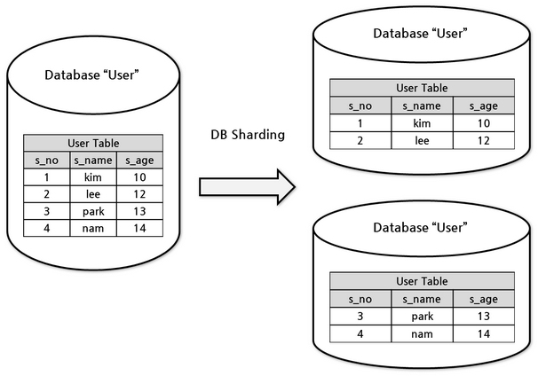
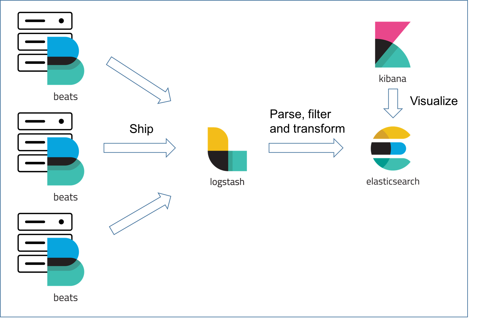
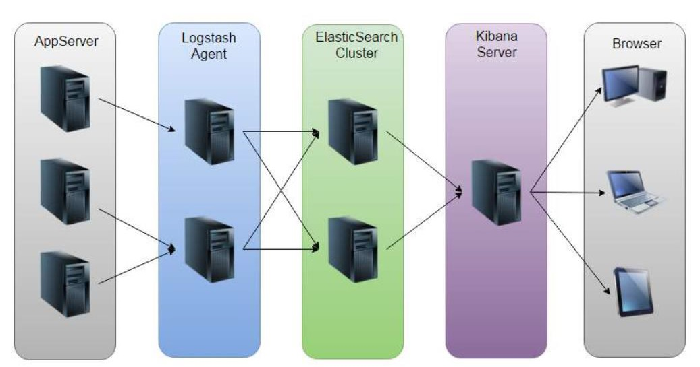
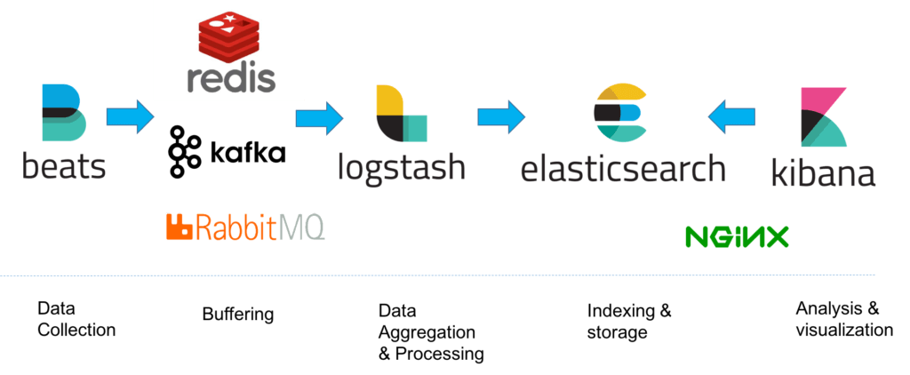
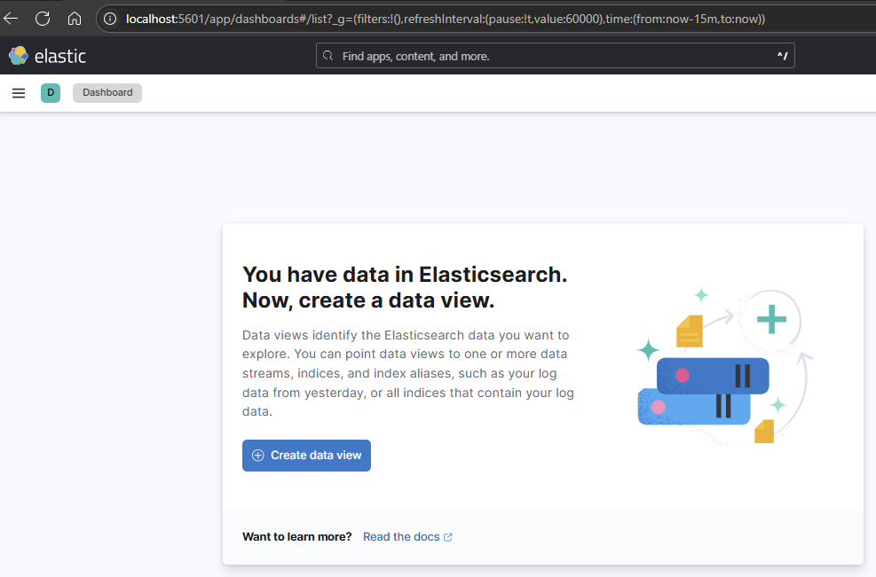
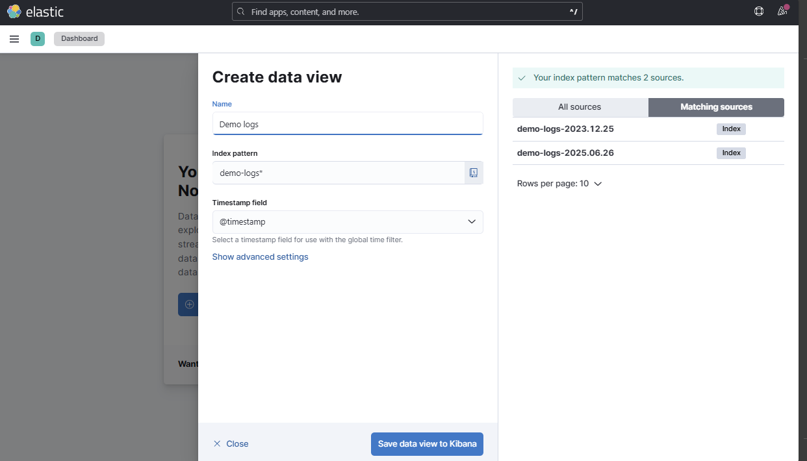
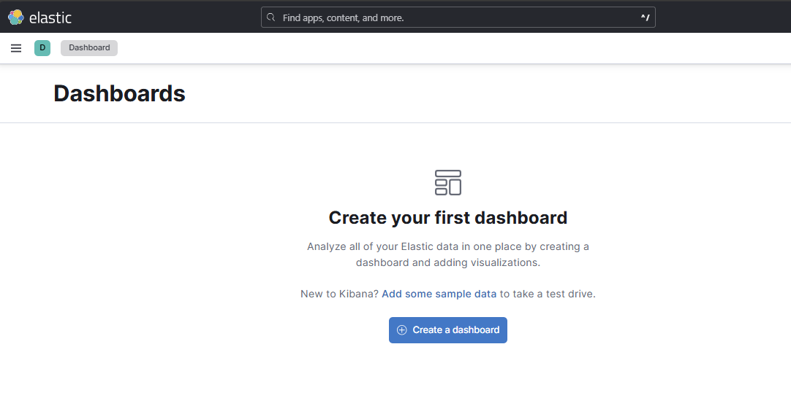
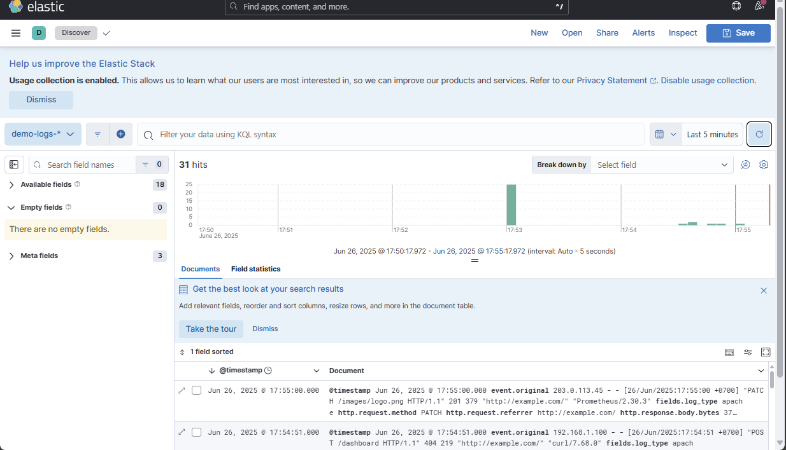

<!-- Dirangkum oleh : Bostang Palaguna -->
<!-- Juni 2025 -->

# Monitoring

## Elastic Stack (ELK) Introduction

**Mengapa log management penting**?

- visibilitas sistem
- Troubleshooting
- Analisis & Monitoring
- Keamanan & Kepatuhan

> betapa rumitnya melakukan logging satu per satu ke container, apalagi ketika containernya ada banyak.

**Tantangan dlm mengelola log**:

- volume data
  - orde TB/hari -> sulit penyimpanan & pengolahan
- format beragam
  - butuh standardisasi
- real-time processing
  - u/ respons lebih cepat
- pencarian & analisis
  - cari info spesifik

### ElasticSearch

`ElasticSearch` : mesin pencari & analitik terdistribusi berbasis RESTful berbasis `Apache Lucene`.

simpan data dalam format `.json` & sediakan API yg kaya u/ interaksi.

memungkinkan pencarian full-text yg cepat, analisis data kompleks, agregasi data dlm skala besar.

**HTTP methods**:

- `/POST` ➡️ tambah
- `/GET` ➡️ ambil
- `/DELETE` ➡️ hapus
- `/PUT` / `/PATCH` ➡️ update

perbedaan `/PUT` dan `/PATCH` :

payload `/PUT` harus semua data, sedangkan `/PATCH` cukup apa yang diubah.

```js
PUT {URL}
{
    "id" : 1
    "title" : "old_title",
    "description" : "new_descripion"
}

PATCH {URL}
{
    "description" : "new_descripion"  
}
```

**Kasus penggunaan ElasticSearch**:

- Search Engine
  - fitur full-text search, autcomplete, koreksi ejaan, highlighting
- Log & Event data analysis
  - u/ troubleshooting, monitoring, security analytics
- Business Analytics
  - data bisnis u/ identifikasi tren, pola, insight
  - agregasi & visualisasi real-time u/ dukung pengambilan keputusan
- Security Analytics
  - deteksi ancaman & anomali keamanan

#### Document & Index

**Document** : unit dasar dlm elasticsearch

```js
{
    "id" : 1234,
    "timestamp" : "2023-10-15T14:30:00Z",
    "level":"ERROR",
    "message" : "...",
    "service": "api-gateway"
}
```

**Index** : Kumpulan dokumen dgn karakteristik serupa:

```log
logs-app-2023.10.15
logs-system-2023.10.15
logs-security-2023.10.15
```

#### Sharding & Replicas

**Shards** : subdivisi dari index u/ distribusi data di seluruh cluster.

setiap shard : instance Lucene yg dapat di-host pada node manapun



manfaat:

- distribusi data horizontal
- paralelisasi operasi
- skalabilitas

**Replicas**: salinan dari shards u/ redundansi data & tingkatkan kapasitas pencarian.
Jika node yg berisi shard primer gagal, replica akan dipromosikan jadi shard primer.

manfaat:

- high availability
- fault tolerance
- ⬆️ throughput pencarian

replicas biasanya u/ backup/recovery ketika ada failure/disaster.

#### Mapping

- definisikan bgmn document & field disimpan di indeks
- mirip skema RDB
- tentukan tipe data u/ field
- dynamic vs explicit mapping
  - dynamic : otomatis deteksi tipe field
  - explicit : kontrol yg lebih ketat
- field analysis
  - tokenization, normalization u/ full-text-search
- field types
  - text, keyword, date, numeric, boolean, geo_point

### Kibana

- platform visualisasi dan manajemen data (works w/ Elasticsearch)
- mengubah data log mentah menjadi insight yang bermakna melalui berbagai jenis visualisasi
- fitur utama:
  - **discover**
    - menjelajahi data mentah dalam Elasticsearch
    - lihat detail dokumen individual
    - lihat distribusi data dlm range waktu
    - berguna untuk troubleshooting u/ gali detail spesifik
  - **visualize**
    - buat grafik u/ tampilkan metrik dan agregasi
  - **dashboard**
    - gabungkan bbrp visualisasi dlm 1 tampilan
    - dapat terapkan filter global
  - **DevTools**
    - u/ interaksi langsung dgn API ElasticSearch dgn kirim HTTP request & dapat respons
    - query elasticsearch

### LogStash

pipeline pemrosesan data yg kumpulkan data dari bbg sumber, lakukan transformasi dan kirim ke `stash` (ElasticSearch)

**komponen**:

- input
  - kumpul dari bbg sumber:
    - file
      - log
      - dukung wildcards path
    - beats
      - lightweight shipper : Filebeat, Metricbeat, Packetbeat, Winlogbeat
      - log dari bnyk server
    - http
    - Kafka/Redis
      - message queue
      - memungkinkakn buffering/decoupling antara producer & consumer
- filter
  - parsing & enrichment
  - mutate, date, GeoIP, JSON, KV (key-value), Ruby
  - Grok : parsing teks tdk terstuktur -> terstruktur (pattern matching)

    ```groovy
    grok{
        match=>{
            "message" => "%{IP:client} % {WORD:method} % {URIPATHPARAM:request} % {NUMBER:status}"
        }
    }
    ```

- output
  - kirim ke tujuan (Elasticsearch, Kafka, DB, S3/CloudStorage)

**Kapan Menggunakan Logstash**:

- Data Kompleks: memerlukan parsing dan transformasi signifikan
- Multiple Destinations: Perlu kirim data ke bbrp tujuan
- Advanced Filtering: perlu logika pemrosesan yg kompleks
- Data Enrichment: Perlu menambahkan informasi dari sumber eksternal

Logstash vs Beats

| Aspek      | **Logstash**      | **Beats**            |
| :--------- | :---------------- | :------------------- |
| Footprint  | Berat (JVM-based) | Ringan (Go-based)    |
| Deployment | terpusat          | distribusi ke sumber |
| resource   | tinggi (RAM, CPU) | ringan               |

### Arsitektur





Dengan tambahan Message Queue:



#### Skalabilitas & Ketahanan ELK Stack

- Skalabilitas
  - horizontal scaling
  - sharding
  - load balancing
  - stateless components
- Ketahanan
  - replicas
  - Node roles
  - message queues
  - snapshot & restore
  - cross-cluster replication

Contoh flow data:

1. Aplikasi web hasilkan logging
   - aktivitas penggunna, error, metrik performa
2. Filebuat kumpulkan log
   - penandaan baris dan kirim ke logstash
3. Logstash proses log
   - parsing log, ekstrak field, tambah metadata, normalkan format
4. Elasticsearch mengindeks data
   - u/ pencarian cepat
5. Kibana memvisualisasikan data
   - u/ insight & alerting

## Log Management with Logstash

ETL (extract, transform, load) : prosedur pengelolaan data

- Extract
  - mengumpulkan log : file lokal/network, protokol syslog, topik kafka, beat
- Transform
  - before

    ```log
    192.168.1.1 - - [21/Oct/2023:13:55:36 +0700] "GET /index.html  HTTP/1.1" 200 2326 "http://example.com/start.html" "Mozilla/5.0"
    ```

  - after

    ```js
    {
      "source.ip": "192.168.1.1",
      "timestamp": "21/Oct/2023:13:55:36 +0700",
      "method": "GET",
      "path": "/index.html",
      "response": 200,  
      "bytes": 2326,
      "referrer": "http://example.com/start.html",  
      "user_agent": "Mozilla/5.0"
    }
    ```

- Load
  - kirim data ke tujuan: ElasticSearch, S3, Kafka, DB

### Grok : Swiss Army Knife of Parsing

filter LogStash u/ urai teks tdk terstruktur jadi data terstruktur

sintaks dasar: `%{PATTERN:field_name}`
`PATTERN` : pola bawaan/customer
`filed_name` : nama filed yg dibuat

```groovy
filter{
  grok{
    match => {
      "message" => "%{IP:client_ip} %{WORD:method} %{URIPATHPARAM:request} %{NUMBER:status}"
    }
  }
}
```

### Mutate : modifikasi Field

- `add_field`

```groovy
add_field => {"environment" => "production"}
```

- `remove_field`

```groovy
remove_field => {"temp_field" => "debug_info"}
```

- `rename`

```groovy
rename => {"old_name" => "new_name"}
```

- `convert`

```groovy
convert => {"bytes" => "integer"}
```

### Date Filter : normalisasi TimeStamp

```groovy
filter{
  date{
    match => ["timestamp", "dd/MMM/yyyy:HH:mm:ss Z"]
    target => "@timestamp"
  }
}
```

#### Struktur Konfigurasi Logstash

```groovy
input {
  file {
    path => "/var/log/apache.log"
  }
}
filter {
  grok {
    match => { "message" => "%{COMBINEDAPACHELOG}" }
  }
}
output {
  elasticsearch {
    hosts => ["localhost:9200"]
  }
}
```

#### Konfigurasi Logstash sederhana

`01-simple.conf`

```conf
input { stdin {} }
output { stdout { codec => rubydebug } }
```

```bash
bin/logstash -f 01-simple.conf --config.reload.automatic
```

### Visualizing Data with Kibana

#### Visualisasi dan Monitoring

mengapa visualisasi & monitoring penting?

- insight cepat
  - pemahaman data
- deteksi anomali
- troubleshooting efektif
- pemantauan performa

#### Agregasi

- **Metrics Aggregation**
  - menghasilkan nilai tunggal dari kumpulan dokumen
  - Count: Jumlah total dokumen
  - Sum: Jumlah nilai dari field numerik
  - Average: Rata-rata nilai
  - Min/Max: Nilai terendah/tertinggi
  - Percentiles: Distribusi nilai
- **Bucket Aggregation**
  - mengelompokkan dokumen ke dalam kategori berdasarkan kriteria tertentu:
  - Date Histogram: Pengelompokan berdasarkan interval waktu
  - Terms: Pengelompokan berdasarkan nilai field
  - Range: Pengelompokan berdasarkan rentang nilai
  - Filters: Pengelompokan berdasarkan query
  - Geospatial: Pengelompokan berdasarkan lokasi

### (HANDSON) ELK Stack

> file handson : `./handson/log.zip`

**Langkah 1** : jalankan ELK stack di docker

```bash
docker compose up
```

**Langkah 2** : Buat Index
1. Open Kibana at http://localhost:5601
2. Go to Analytics > Discover
3. Select index pattern 'demo-logs-*'
4. View real-time logs










---
[🏠Back to Course Lists](https://odp-bni-330.github.io/)
