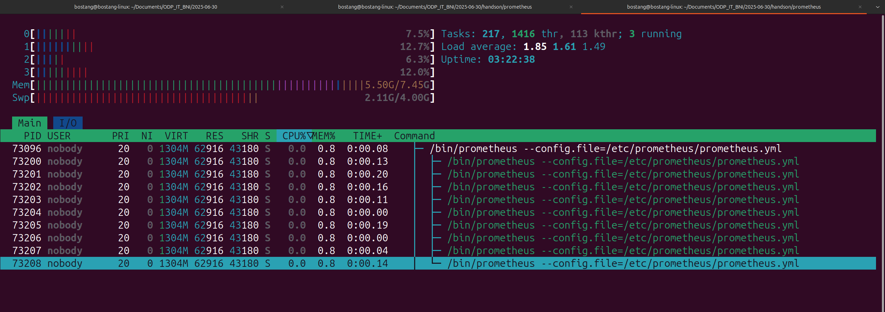

# Catatan Tambahan

## `top` `htop`



## Prometheus & Grafana

**Prometheus** is for _data collection and storage_:

- Scrapes metrics from your ML application endpoints
- Stores the collected data in its time-series database
- Provides a query interface (PromQL) for data retrieval

**Grafana** is for _visualization and alerting_:

- Connects to Prometheus as a data source
- Queries Prometheus with PromQL
- Visualizes the metrics in customizable dashboards
- Monitors metrics and triggers alerts based on defined conditions.

### Prometheus PromQL Commands with `node_exporter`

#### 1. Metrik CPU

- **Total Penggunaan CPU per Mode (persentase):**

```promql
100 * (1 - avg by (instance) (rate(node_cpu_seconds_total{mode="idle"}[5m])))
```

- **Penggunaan CPU per Mode (waktu/detik):**

```promql
rate(node_cpu_seconds_total[5m])
```

- **Penggunaan CPU "User" (persentase):**

```promql
100 * (rate(node_cpu_seconds_total{mode="user"}[5m]) / ignoring(mode) group_left sum(rate(node_cpu_seconds_total[5m])))
```

- **Penggunaan CPU "System" (persentase):**

```promql
100 * (rate(node_cpu_seconds_total{mode="system"}[5m]) / ignoring(mode) group_left sum(rate(node_cpu_seconds_total[5m])))
```

#### 2. Metrik Memori

- **Penggunaan Memori Fisik (persentase):**

```promql
100 * (node_memory_MemTotal_bytes - node_memory_MemAvailable_bytes) / node_memory_MemTotal_bytes
```

- **Penggunaan Swap (persentase):**

```promql
100 * (node_memory_SwapTotal_bytes - node_memory_SwapFree_bytes) / node_memory_SwapTotal_bytes
```

- **Total Memori Fisik (bytes):**

```promql
node_memory_MemTotal_bytes
```

- **Memori Tersedia (bytes):**

```promql
node_memory_MemAvailable_bytes
```

#### 3. Metrik Disk I/O

- **Laju Baca Disk (bytes/detik):**

```promql
rate(node_exporter_build_info[5m]) * sum(rate(node_disk_read_bytes_total[5m])) by (device, instance)
```

- **Laju Tulis Disk (bytes/detik):**

```promql
rate(node_exporter_build_info[5m]) * sum(rate(node_disk_written_bytes_total[5m])) by (device, instance)
```

- **Disk I/O Utilitas (persentase sibuk):**

```promql
rate(node_disk_io_time_seconds_total[5m]) * 100
```

#### 4. Metrik Jaringan

- **Laju Data Masuk Jaringan (bytes/detik):**

```promql
rate(node_network_receive_bytes_total[5m])
```

- **Laju Data Keluar Jaringan (bytes/detik):**

```promql
rate(node_network_transmit_bytes_total[5m])
```

- **Kesalahan Jaringan Masuk (per detik):**

```promql
rate(node_network_receive_errs_total[5m])
```

- **Kesalahan Jaringan Keluar (per detik):**

```promql
rate(node_network_transmit_errs_total[5m])
```

#### 5. Metrik File System

- **Penggunaan Disk File System (persentase):**

```promql
100 - (100 * node_filesystem_avail_bytes{fstype!="squashfs", mountpoint!~"/(run|var/lib/docker/containers)($|/.*)"} / node_filesystem_size_bytes{fstype!="squashfs", mountpoint!~"/(run|var/lib/docker/containers)($|/.*)"})
```

- **Ruang Disk Tersedia (bytes):**

```promql
node_filesystem_avail_bytes{fstype!="squashfs", mountpoint!~"/(run|var/lib/docker/containers)($|/.*)"}
```

- **Total Ruang Disk (bytes):**

```promql
node_filesystem_size_bytes{fstype!="squashfs", mountpoint!~"/(run|var/lib/docker/containers)($|/.*)"}
```

#### 6. Metrik Sistem (Load Average, Proses)

- **Load Average 1 Menit:**

```promql
node_load1
```

- **Load Average 5 Menit:**

```promql
node_load5
```

- **Load Average 15 Menit:**

```promql
node_load15
```

- **Jumlah Proses yang Berjalan/Total Proses:**

```promql
node_procs_running
node_procs_total
```

#### Tips Tambahan untuk PromQL:

- **`rate()`:** Digunakan untuk menghitung laju perubahan metrik counter dari waktu ke waktu. Sangat penting untuk metrik seperti byte atau jumlah kesalahan.
- **`irate()`:** Mirip dengan `rate()`, tetapi hanya melihat dua titik data terakhir. Berguna untuk deteksi perubahan cepat atau lonjakan.
- **`sum by (...)`, `avg by (...)`:** Digunakan untuk mengagregasi metrik berdasarkan label tertentu.
- **`group_left` / `group_right`:** Digunakan dalam operasi join (misalnya, saat membagi dua metrik yang memiliki label berbeda).
- **Time Durations:** Gunakan `[5m]` untuk 5 menit, `[1h]` untuk 1 jam, dll.
- **Grafana:** PromQL akan lebih kuat dan visual ketika Anda menampilkannya di dashboard Grafana. Anda bisa membuat grafik, tabel, dan bahkan alert berdasarkan query-query ini.
- **Alerting:** Setelah Anda mengidentifikasi metrik-metrik penting, Anda bisa membuat aturan peringatan di Prometheus atau Alertmanager berdasarkan ambang batas pada query-query ini (misalnya, "jika penggunaan CPU lebih dari 90% selama 5 menit, kirim notifikasi").


## [Docker](https://www.datacamp.com/tutorial/docker-for-data-science-introduction)

### `Dockerfile` and `docker-compose.yaml`

A Dockerfile and a docker-compose.yaml file serve distinct but complementary purposes in the Docker ecosystem.

`Dockerfile`:

- Purpose: Defines the instructions for building a **single Docker image**.
- Content: Contains a series of commands (e.g., FROM, RUN, COPY, CMD) that are executed sequentially to create a layered image.
- Outcome: Produces a Docker image, which is a lightweight, standalone, executable package containing everything needed to run a piece of software (code, runtime, system tools, libraries, and settings). 
- Command: Used with docker build.

`docker-compose.yaml`:

- Purpose: Defines and orchestrates **multi-container Docker applications**.
- Content: Uses YAML syntax to configure multiple services (containers), networks, and volumes that make up an application. It can reference Dockerfiles to build images for specific services.
- Outcome: Allows you to manage and run an entire application stack with a single command, starting all defined services in an isolated environment.
- Command: Used with docker-compose up.

### Python Virtual Environment

Virtual environments solve several key problems:

- **Dependency management**: Allow each project to maintain its dependencies without conflict.
- **Reproducibility**: Ensure that an application works the same way in development, testing, and production environments.
- **Isolation**: Prevent global installation of packages that might interfere with system packages or other projects.

#### `venv`

-> module that comes preinstalled with Python 3.3 and later. It allows you to create lightweight, isolated Python environments and operates at the level of the Python interpreter, meaningeach environment has its own Python binary and can have its own independent set of installed packages.

**How to use**?

```bash
# create the virtual environment
python -m venv myenv

# activate the environment
myenv\Scripts\activate      # windows
source myenv/bin/activate   # linux

# install packages
pip install package_name            # install 1 package
pip freeze >> requirements.txt      # menambahkan package yang baru diinstall ke requirements.txt

pip install -r requirements.txt     # menginstall list packages di requirements.txt

# keluar dari virtual environment
Deactivate
```

#### `conda`

-> open-source package and environment management system that supports multiple programming languages (Python, R, and C++).

**How to use**?

```bash
# Create an Environment
conda create --name myenv

# Activate the Environment
conda activate myenv

# Install packages
conda install package_name

# Deactivate
conda deactivate
```

how to choose between the two?

When choosing between these tools, take into account the following considerations:

- **Project complexity**: For simple, Python-only projects, venv is often sufficient. For complex projects with multiple dependencies and languages, conda is more appropriate.
- **Package management needs**: If you need to manage non-Python packages or complex dependencies, conda is the better choice.
- **Ease of use**: If you prefer a quick and simple setup with minimal configuration, venv is ideal. For more advanced features and comprehensive environment management, opt for conda.
- **Cross-platform requirements**: If your project needs to run consistently across different operating systems with various dependencies, conda provides better support.

## Bacaan Tambahan

- [Grafana untuk Monitoring ML model](https://www.datacamp.com/tutorial/grafana-tutorial-monitoring-machine-learning-models)

- [Arsitektur Prometheus](https://devopscube.com/prometheus-architecture/)


<!-- TELEGRAM BOT : MBAK FIQA -->
<!-- curl -X POST      -H 'Content-Type: application/json'      -d '{"chat_id": "1330543866", "text": "Mbak fiqa keren "}'      https://api.telegram.org/bot7737408450:AAHu8ycMTpUr6LMxPSZJ1qgqwkv8xLneU4Q/sendMessage
 -->