<!-- Dirangkum oleh : Bostang Palaguna -->
<!-- Juni 2025 -->

# System Monitoring

> Tutor : Mas Ayat Maulana (Ayat)
> Tech lead @Alto

<!-- BNI : PLP : penyedia layanan pembyaran
Alto : PIP : penyedia ifras. pembayaran -->

## Prometheus Fundamentals

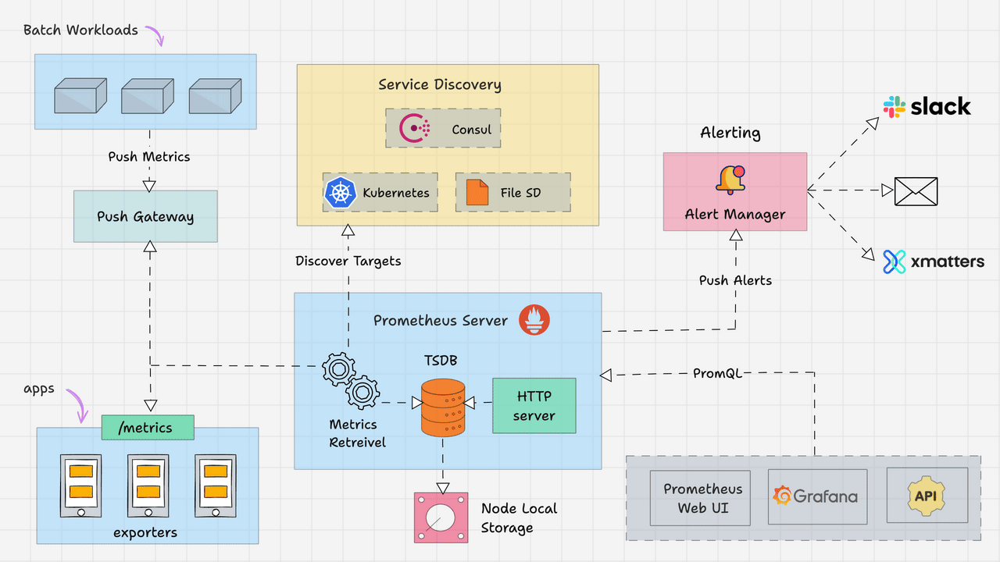

### Teori System Monitoring

System monitoring: pengamatan & pencatatan:
    - kinerja
    - kesehatan
    - status operasional
sistem komputer / app scr realtime & berkala
u/
    - deteksi masalah
    - optimalkan performa
    - make sure service stabil & efisien
      - u/ pengalaman pengguna yg baik

why butuh?

- _early detection of problem_
- optimalkan performa sistem
- maintenance layanan scr berkelanjutan

### Prometheus

→ sistem monitoring berbasis data _time series_ u/ rekam metrik dari layanan & infras. scr real time.

cara kerja?

- _pulling_ metrik dari HTTP endpoint target scr interval dan simpan dalam format time series.
- pengguna bisa query dengan `PromQL`
- dukung _alerting_

contoh sumber metrics:

- hardware & OS metrics menggunakan [Node Exporter](https://github.com/prometheus/node_exporter)
- database dgn Database exporter (misal : MySQL Exporter, PostgreSQL Server Exporter)
- aplikasi Java menggunakan [JMX Exporter](https://github.com/prometheus/jmx_exporter)

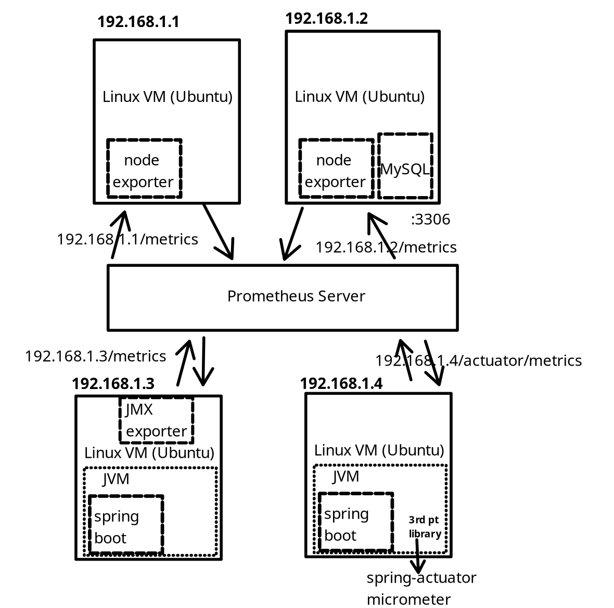

> Exporters are like agents that run on the targets. It converts metrics from specific system to format that prometheus understands.
> ...
> converted metrics are exposed by the exporter on /metrics path(HTTPS endpoint) of the target.

#### Arsitektur Prometheus

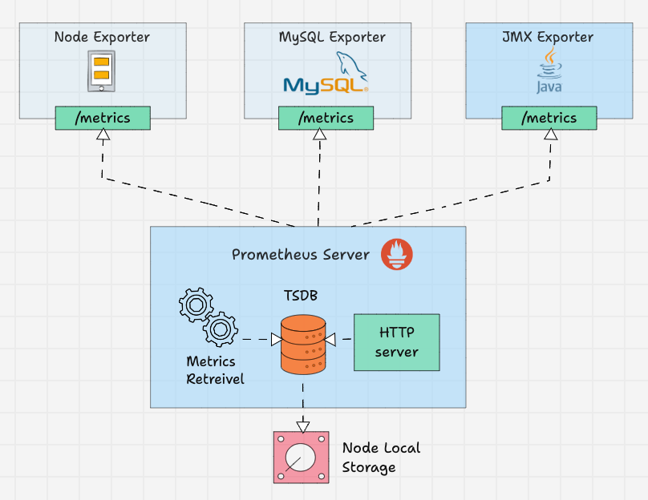

### Time Series Database (TSDB)

jenis DB u/ simpan & kelola data yg berubah seiring waktu:

- _metric system_
- performa app
- IoT sensor

TSDB simpan _metrics_ dlm rangkaian data dengan `timestamp` → haslkan `timeseries`

**why butuh**?

- u/ analisis performa by time
- agregasi, rate, hitung tren historis
- efisien dlm simpan data metrics berulang
- optimal u/ query spt: `AVG` dlm jangka waktu tertentu

struktur `timeseries`

```js
<metric_name>{<label_name>=<label_value>, ...} → <value> @ <timestamp>
```

- `<metric_name>`

contoh :

```js
http_requests_total{method="GET", code="200"} 1250 @ 2025-06-29T10:00:00Z
```

### Jenis Metrics

- **Counter**
  - hny bertambah / direset
  - contoh penggunaan:
    - #HTTP request
    - #error
    - #transaksi berhasil
  - contoh:
- **Gauge**
  - bisa naik/turun ; cocok u/ gambarkan kondisi skrng (_snapshot_)
  - cth:
    - memory usage
    - #koneksi aktif
    - temperatur CPU
    - queue length
- **Histogram**
  - ukur distribusi nilai bdskan bucket ; cocok u/ nilai di range tetap
  - cth:
    - durasi request
    - ukuran file
    - execution time
  - suffixes:
    - `*_bucket` → jumlah observasi dalam bucket tertentu
    - `*_sum` → jumlah total nilai
    - `*_count` → jumlah observasi
- **Summary**
  - mirip histogram ; hitung quantiles (percentiles) seperti p95, p99, dll
  - cth:
    - estimasi latency
    - ukuran rata2 request
  - suffixes:
    - `*_quantile` → nilai estimasi untuk persentil
    - `*_sum` → jumlah total nilai
    - `*_count` → jumlah observasi

### Exporter

→ komponen / program perantara u/ ambil data dari sistem eksternal yg secara native tdk sediakan endpoint `/metrics` agar bisa dibaca prometheus

Cara kerja:

1. kumpulkan data dari sistem target
2. konversi ke format metrik prometheus
3. _scrape_ endpoint `/metrics`

contoh:

- `Node Exporter`       → u/ pantau sistem LINUX (CPU, RAM, network, Disk)
- `MySQL Exporter`      → u/ pantal MySQL/MariaDB
- `Blackbox Exporter`   → u/ pantau traffic TCP/UDP/HTTP
- `JMX Exporter`        → u/ pantau JAVA metrics
- `NGINX Exporter`      → u/ pantau NGINX web server
- `Kafka Exporter`      → u/ pantau Kafka broker

### PromQL

→ bahasa query khusus u/:

- ambil
- filter → bdskan label
- hitung
- agregasi (`SUM`, `AVG`, `RATE`, dll.)
metrics time series

tujuan : hitung _trend over time_.

contoh:

| **Tujuan**                                  | **PromQL**                             |
| :------------------------------------------ | :------------------------------------- |
| ambil semua metrics di `http_request_total` | `http_request_total`                   |
| dptkan status http request dgn kode 500     | `http_request_total{code="500"}`       |
| rate per detik 5 detik terakhir             | `rate(http_requests_total[5m])`        |
| total permintaan                            | `sum by (method) (http_request_total)` |
| rata2 cpu usage per waktu                   | `avg_over_time(cpu_usage[10m])`        |

### (HANDSON) Prometheus untuk system monitoring container

> File : `./handson/prometheus.zip`

**Langkah 1** : Buat file `docker-compose.yml`

```yml
services:
  prometheus:
    image:  prom/prometheus:latest
    container_name: prometheus
    volumes:
      - ./prometheus.yml:/etc/prometheus/prometheus.yml
    ports:
      - "9090:9090"
    command:
      - "--config.file=/etc/prometheus/prometheus.yml"

  node_exporter:
    image: prom/node-exporter:latest
    container_name: node_exporter
    ports:
      - "9100:9100"
    restart: unless-stopped
```

**Langkah 2** : Buat file konfigurasi `prometheus.yml`

```yml
global:
  scrape_interval: 15s    # menentukan durasi periode scraping
                          # semaki kecil semakin bagus, tetapi size besear dan ada risiko overhead
                          # prometheus rekomendasi tiap 15 sekon
scrape_configs:
  - job_name : 'node_exporter'
    static_configs:
      - targets: ['node_exporter:9100']    # node_exporter : DNS local dari docker compose
                                         # kalau beda network, ganti `node_exporter` dengan IP
```

**Langkah 3** : Jalankan docker

```bash
docker compose up
```

**Langkah 4** : Akses Prometheus dari browser

```bash
### Prometheus ###
localhost:9090

localhost:9090/targets          # untuk melihat daftar target yg ada
localhost:9090/query            # untuk melakukan query
localhost:9090/metrics          # untuk akses data dlm format prometheus
##################
```

melihat metrics yang bisa dilihat:

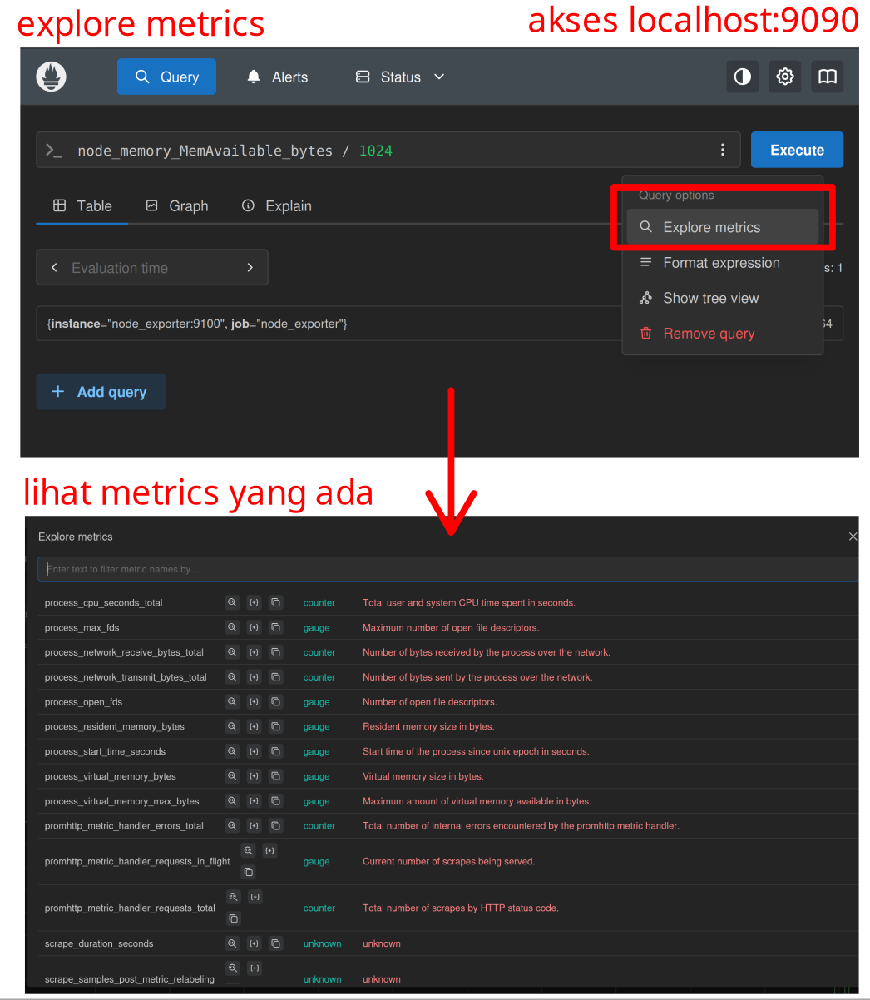

Hasil:

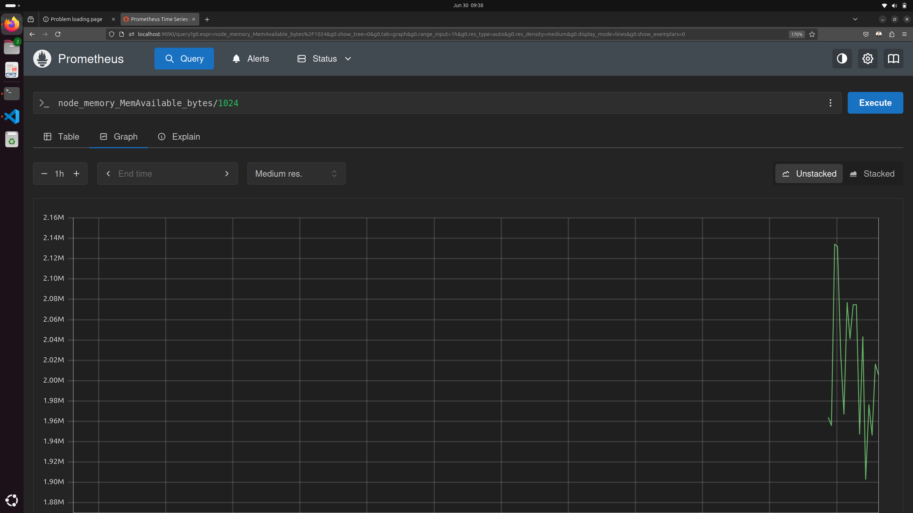

melihat metrics yang dilihat secara rela time oleh `node_exporter`

```bash
localhost:9100/metrics
```

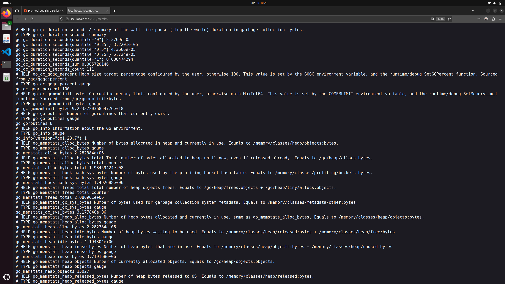

> UI dari Prometheus cukup sederhana. Biasanya visualisasi yang lebih kompleks bisa dilihat menggunakan Grafana.

```bash
# Memory used = Total Memory - Memory Available
(node_memory_MemTotal_bytes - node_memory_MemAvailable_bytes) / 1024 / 1024     # dalam MB

# Memory available
(node_memory_MemAvailable_bytes) / 1024 / 1024      # dalam MB

# CPU Usage
# CPU utilization percentage per instance over the last 5 minutes
100 - (avg by(instance) (rate(node_cpu_seconds_total{mode="idle"}[5m])) * 100)

# CPU Free
# CPU free over the last 5 minutes
avg by(instance) (rate(node_cpu_seconds_total{mode="idle"}[5m])) * 100
```

> Catatan : CPU dan Memory yang ditampilkan itu merupakan dari docker. Hasilnya akan beda dari host PC (misal menggunakan System Monitor / htop).
> ...
> untuk monitor tiap-tiap pod pada kubernetes, node_exporter akan diset di tiap-tiap pod dengan mode `DaemonSet`.

## Alerting & Notification

### AlertManager

komponen Promethteus u/ kelola, kelompokkan, dan kirimkan notifikasi (alert) ketika kondisi tertentu terpenuhi dalam sistem monitoring. (misal : CPU usage > 90%)

contoh penerapan di Banking:

- Fraud detection system -> deteksi transaksi anomali

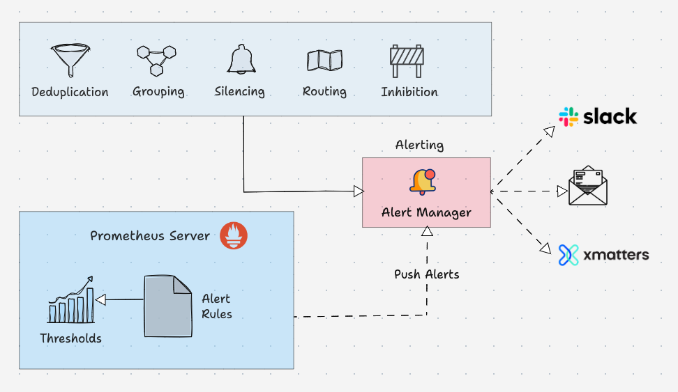

### Notification Channel

media/jalur komunikasi yg digunakan Prometheus AlertManager u/ beri alert.

tujuan:

- respons cepat saat insiden
- minimalkan downtime
- dpt disesuaikan dgn workflow tim
- support multi-channel & fallback

> Fallback adalah mekanisme yang digunakan untuk menentukan alternatif jika suatu fungsi atau proses tidak berhasil

dukungan:

- email via SMTP
- Telegram Bot
- Slack Channel
- PagerDuty
- dll.

### (HANDSON) AlertManager

> File : `./handson/alert-manager.zip`

monitor penggunaan CPU (alert via email jika CPU > 10%)

**Langkah 1** : Buat file `docker-compose.yml`

```yml
services:
############## PROMETHEUS ##############
  prometheus:
    image:  prom/prometheus:latest
    container_name: prometheus
    volumes:
      - ./prometheus.yml:/etc/prometheus/prometheus.yml
      - ./alert.rules.yml:/etc/prometheus/alert.rules.yml
    ports:
      - "9090:9090"
    command:
      - "--config.file=/etc/prometheus/prometheus.yml"
########################################

############## ALERT MANAGER ##############
  alertmanager: # Combined definition
    image: prom/alertmanager:latest # Use the specific image with ':latest' for consistency
    volumes:
      - ./alertmanager.yml:/etc/alertmanager/alertmanager.yml
    command:
      - '--config.file=/etc/alertmanager/alertmanager.yml' # Important to specify config
    ports:
      - "9093:9093"
    depends_on: # Important for MailHog to be ready
      - mailhog
      - prometheus # Also good practice to depend on prometheus for alert firing
###########################################

############## NODE EXPORTER ##############
  node_exporter:
    image: prom/node-exporter:latest
    container_name: node_exporter
    ports:
      - "9100:9100"
    restart: unless-stopped
###########################################

############## MAIL HOG ##############
  mailhog:
    image: mailhog/mailhog:latest
    ports:
      - "1025:1025" # SMTP
      - "8025:8025" # Web UI
######################################
```

**Langkah 2** : Buat file konfigurasi `prometheus.yml`

```yml
global:
  scrape_interval: 15s    # menentukan durasi periode scraping
                          # semaki kecil semakin bagus, tetapi size besear dan ada risiko overhead
                          # prometheus rekomendasi tiap 15 sekon

alerting:
  alertmanagers:
    - static_configs:
      - targets : ["alertmanager:9093"]
      
rule_files:
  - "alert.rules.yml"

scrape_configs:
  - job_name : 'node_exporter'
    static_configs:
      - targets: ['node_exporter:9100']    # node_exporter : DNS local dari docker compose
                                         # kalau beda network, ganti `node_exporter` dengan IP
```

**Langkah 3** : Buat file konfigurasi `alert.rules.yml`

```yml
groups:
  - name: cpu_alert_group
    rules:
      - alert: HighCPUUsage
        expr: 100 - (avg by (instance) (rate(node_cpu_seconds_total{mode="idle"}[2m])) * 100) > 10
        for: 1m
        labels:
          severity: warning
        annotations:
          summary: "CPU usage tinggi di {{ $labels.instance }}"
          description: "CPU usage di atas 10% selama lebih dari 1 menit."
```

**Langkah 4** : Buat file konfigurasi `alertmanager.yml`

```yml
global:
  # The default SMTP From header field.
  smtp_from: 'alertmanager@yourdomain.local'
  smtp_smarthost: 'mailhog:1025'
  
  # MailHog typically runs without TLS for local development.
  smtp_require_tls: false

# The root route on which each incoming alert enters.
route:
  group_by: ['alertname']
  group_wait: 30s
  group_interval: 5m
  repeat_interval: 1h
  receiver: 'email-receiver'

receivers:
  - name: 'email-receiver'
    email_configs:
      - to: 'your-test-email@example.com' # This is where MailHog will "receive" the email
        # No auth_username or auth_password needed for MailHog by default
        
# ############# GMAIL ##############
# global:
#   smtp_smarthost: 'smtp.gmail.com:587'
#   smtp_from: 'namakamu@gmail.com'
#   smtp_auth_username: 'namakamu@gmail.com'
#   smtp_auth_password: 'aplikasi_password_gmail'

# route:
#   receiver: email-receiver

# receivers:
#   - name: email-receiver
#     email_configs:
#       - to: 'penerima@example.com'
#         send_resolved: true
# ##################################
```

**Langkah 5** : Jalankan docker

```bash
docker compose up
```

**Langkah 6** : Akses Prometheus dari browser

Lakukan simulasi untuk membuat CPU utilization di atas 10% (misal menggunakan infinite for loop / load testing tools)

> Best Practice : menyimpan smtp_atuh_password di : Hashicorp vault ; jangan hard-coded.

Untuk simulasi, menggunakan [MailHog](https://github.com/mailhog/MailHog)

firing alert di prometheus:

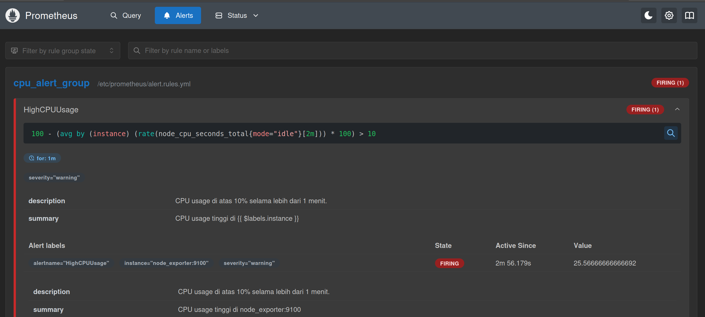

tampilan notifikasi di mailhog:

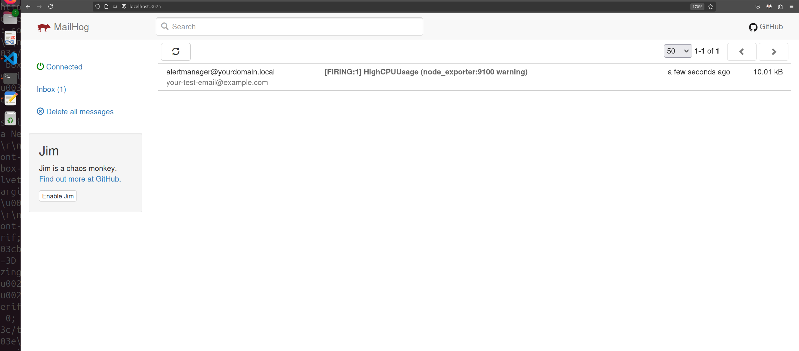

### (HANDSON) Prometheus dengan Grafana

> File : `./handson/prometheus-grafana.zip`

**Langkah 1** : tambahkan di `docker-compose.yml`:

```yml
############## GRAFANA ##############
# untuk visualisasi data
  grafana:
    image: grafana/grafana:latest
    container_name: grafana
    ports:
      - "3000:3000"
#####################################
```

**Langkah 2** : Atur connections ke Prometheus

Home > Connections > Data Sources > Prometheus

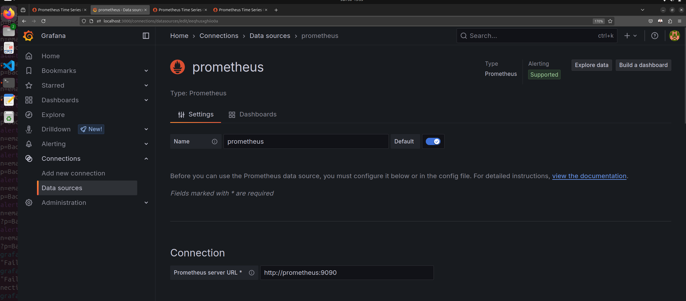

Maka kita bisa melihat metrics prometheus di grafana:

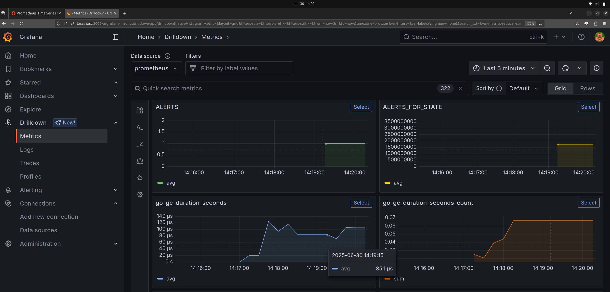

**Langkah 3** : Menambahkan Dashboard

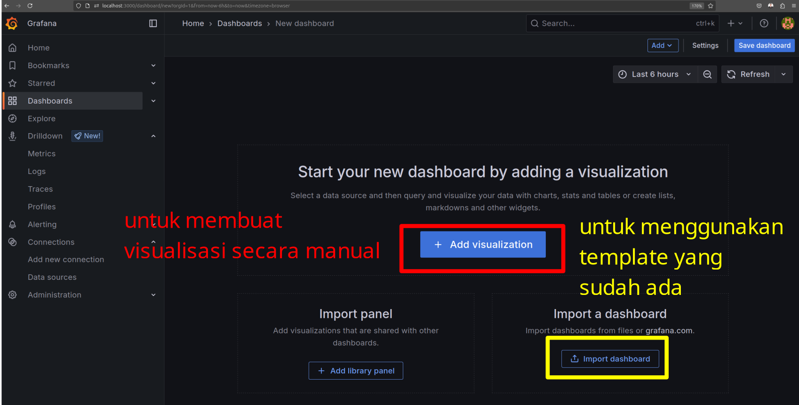

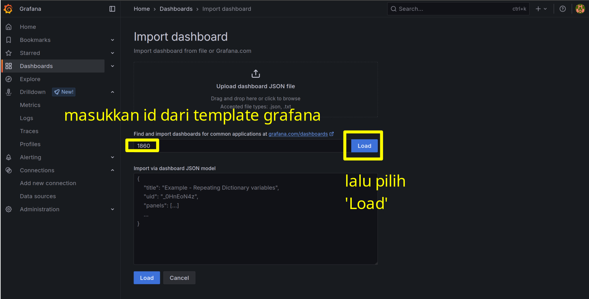

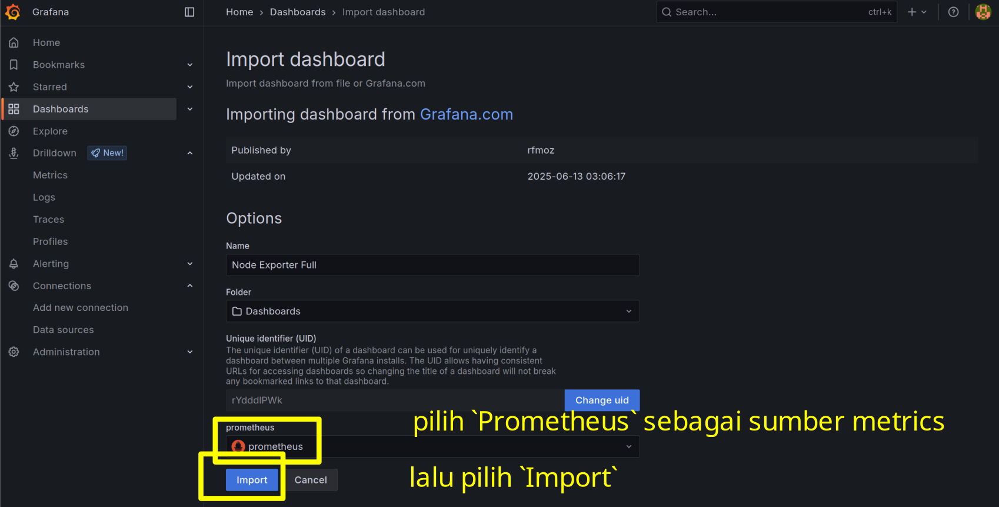

menggunakan template yang sudah pernah dibuat

[`Node Exporter Full`](https://grafana.com/grafana/dashboards/1860-node-exporter-full/)

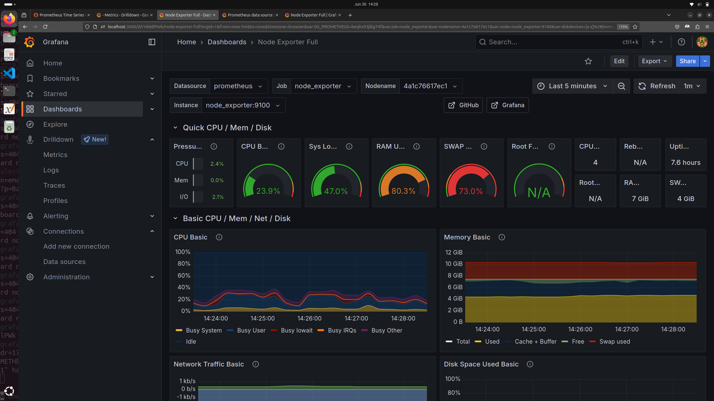

kita juga bisa membuat dashboard dan visualisasi kita sendiri:

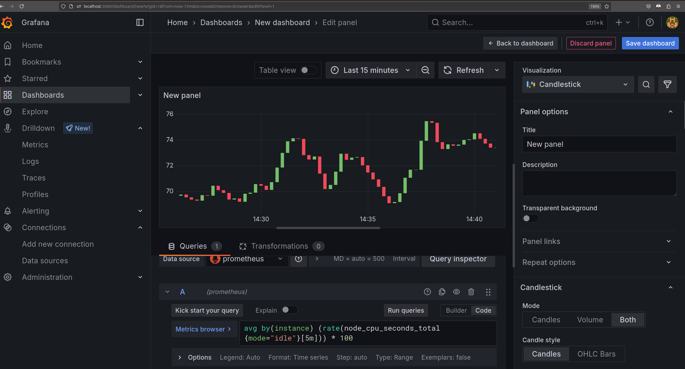

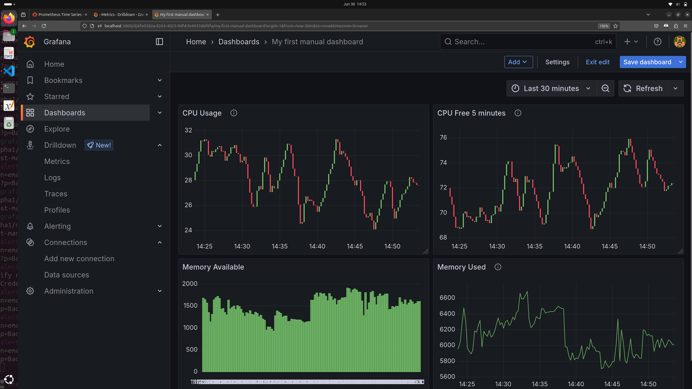

---
[🏠Back to Course Lists](https://odp-bni-330.github.io/)
