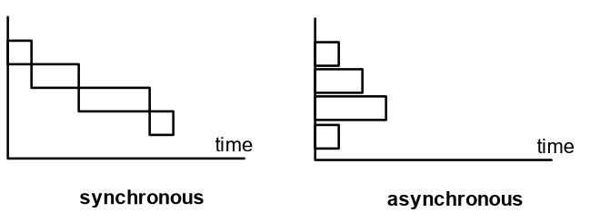
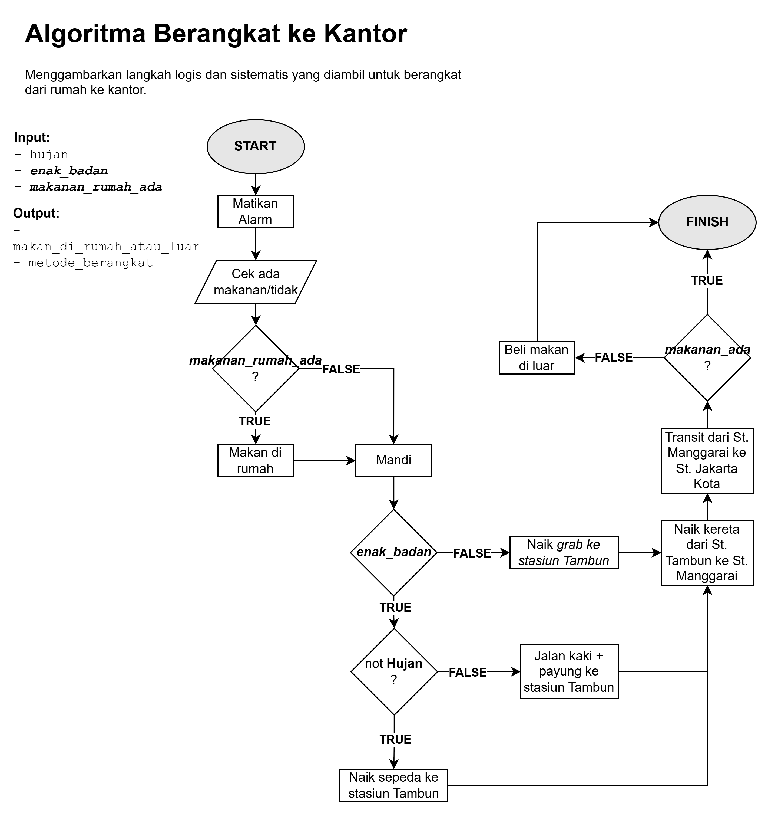
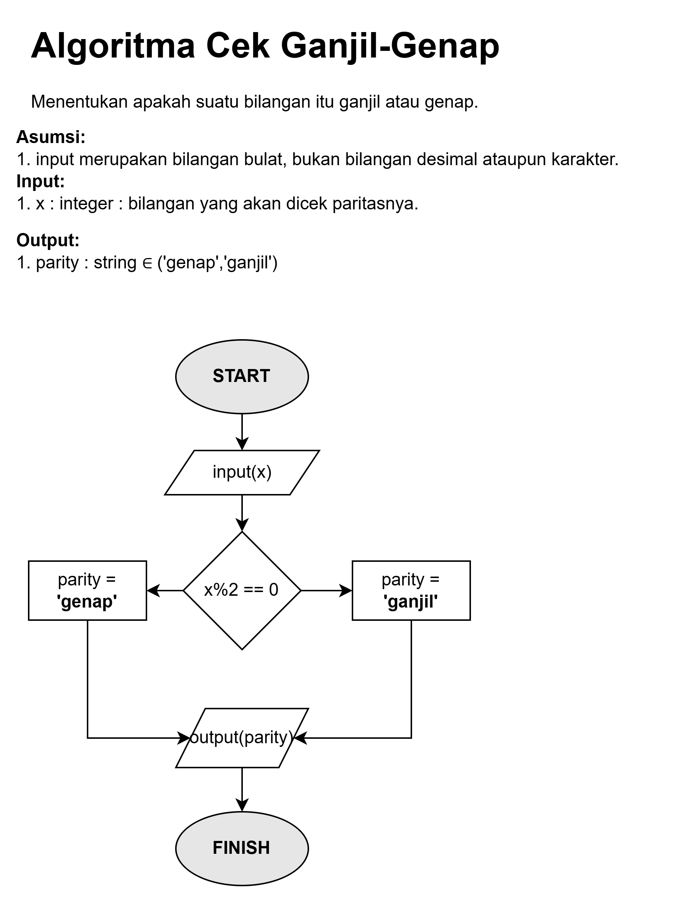
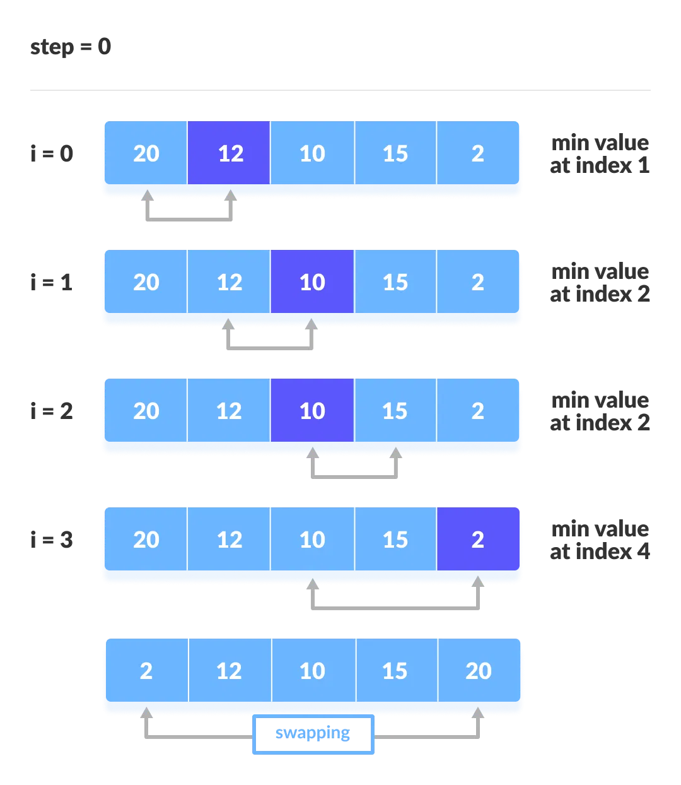
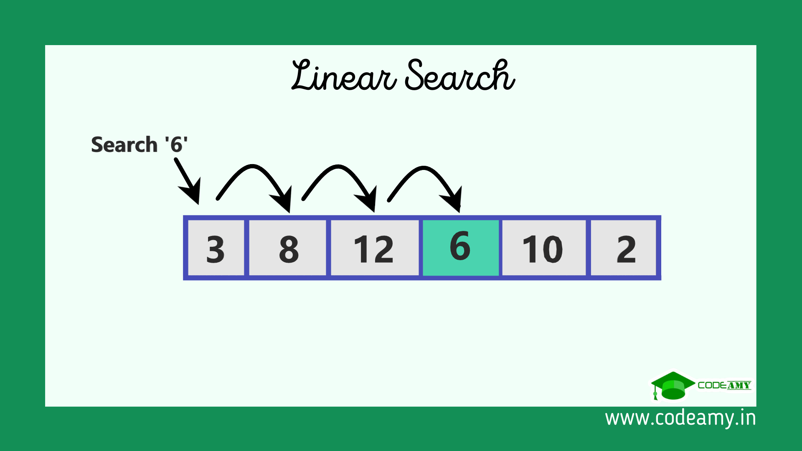
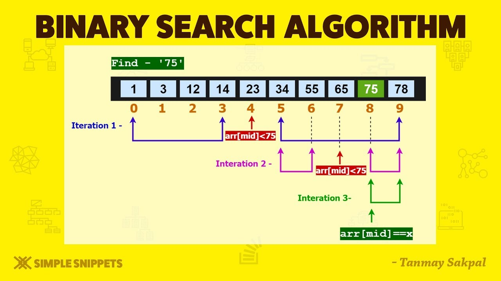

# Javascript (Asynchronous & Fetch API)

## Synchronous



## Asynchronous
- Call stack
- Web APIs
- Callback Queue

synchronous ➡️ langsung jalan di call stack.
asynchronous ➡️ masuk ke web APIs dulu.

asynchronous jangan return ➡️ karena jalannya nanti ➡️ manfaatkan callback.

cara deklarasi function:
- anonymous
```js
function(parameter){
    ...
}
```
- declaration
```js
function nama_fungsi(parameter){
    ...
}
```
- arrow function
```js
(parameter)=>{
    ...
}
```

# Introduction to Algorithm & Flowchart
Algoritma : langkah logis & sistematis u/ solving problem.

**struktur algoritma**:
1. input
2. output
3. definiteness
4. finiteness
5. efectiveness

**Cara penyajian** :
1. flowchart
2. Pseudocode





contoh pseudocode : notasi algoritmik

1. cek ganjil/genap
```java
PROGRAM cekGanjilGenap
    mengecek apakah suatu bilangan masukan x itu ganjil atau genap
    Asumsi : x merupakan bilangan bulat.
KAMUS
    VARIABEL
    x : integer
    parity : string
ALGORITMA   
    input   (x)
    if (x %2 == 0) then
        parity <- 'genap'
    else
        parity <- 'ganjil'
    output  (x)
```

2. berangkat ke kantor
```java
PROGRAM berangkatKantor
    Menggambarkan langkah logis dan sistematis yang diambil untuk berangkat dari rumah ke kantor.
KAMUS
    VARIABEL
        { variabel input }
        hujan : boolean
        enak_badan : boolean
        makanan_rumah_ada : boolean

        { variabel output }
        lokasi_makan : string
        metode_berangkat : string
    FUNGSI/PROSEDUR
        procecure matikanAlarm()
        procedure mandi()
        procedure naikKereta()
        procedure jalanKakikeKantor()
ALGORITMA
    matikanAlarm()
    input   (makanan_rumah_ada)
    if (makanan_rumah_ada = TRUE) then
        lokasi_makan <- 'rumah'
    else
        mandi()
    
    if (enak_badan = TRUE) then
        if (not hujan = FALSE) then
            metode_berangkat <- 'jalan_kaki_dengan_payung'
        else
            metode_berangkat <- 'naik_sepeda'
    else
        metode_berangkat <- 'naik_grab'
    naikKereta()
    
    if (makanan_rumah_ada = TRUE) then
        lokasi_makan <- 'dekat kantor'

    jalanKakikeKantor()
    END
```
## Sorting Algorithm
### Bubble sort


### Selection sort


## Searching Algorithm
### Linear Search



### Binary search

> syarat : array sudah terurut.



# Data Structure : Array & Object
object ➡️ dapat dideskripsikan. dapat menyimpan banyak value.

terdiri atas pasangan key-value

# Problem solving dengan algoritma
## Algoritma
## Debugging

bug-tracing.

broken windows ➡️ segera patch.

**contoh**:
1. hasil code tdk sesuai ekspektasi
2. muncul error
3. program tdk jalan sama sekali
4. infinite loop

**Alat debugging**:
1. print setiap proses (`console.log`)
2. devTools browser
3. baca dokumentasi

## Optimization
membuat kode lebih cepat dan efisien

1. algoritma yg efisien
2. pakai function yg reusable
3. menghindari looping yg banyak
4. modular function
5. refactor bertahap


# Referensi Tambahan
[Visualisasi Algoritma sorting](https://visualgo.net/en/sorting)

---
[🏠Back to Course Lists](https://odp-bni-330.github.io/)