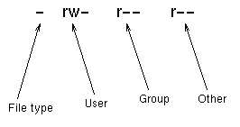

# Catatan Tambahan

## File Permission

```bash
ls -l filename

# output:
# -rw-r--r-- 1 eva statsusers 3325 Aug  2 09:15 test.html
```



`rw-` : may read and write the file but not execute it
`r--` : may read the file but not write or execute it.

### Changing file permission

```bash
# syntax:
    # chmod permissions list_of_files
chmod -R go+rX my_directory
    # -R : recursive
    # go : change permissions for Group and Other
    # +rX : add Read permissions, and add execute permissions

chmod 600 file.txt
chmod 700 file2.txt

# 700 : you can do anything with the file or directory and other users have no access to it at all. Suitable for private directories and programs.
# 600 : you can read and write the file or directory and other users have no access to it. Suitable for private text files.
```

### tty

tty stands for teletypewriter and refers to a device that provides a text-based interface for interacting with the operating system

```bash
# melihat container id
docker ps

# OUTPUT:
    # CONTAINER ID   IMAGE                   
    # c1d2e1a90f46   jenkins-ansible-jenkins 
    # 4047c6737c8c   ubuntu:latest           

docker exec -it [container_id] /bin/bash

# docker exec -it 4047c6737c8c /bin/bash

```

## Jenkins Pipeline

[Jenkins Declarative Pipeline](https://www.blazemeter.com/blog/jenkins-declarative-pipeline)
