# Automation

## Automasi Deployment dengan Ansible & Jenkins

### Ansible w/ Jenkins

#### Ansible

`Ansible` : tools u/ konfigurasi sistem, sebar app, orkestrasi server tanpa agen (cukup `ssh`).

menggunakan file `.yaml` (_playbook_) u/ definiskan tugas scr otomatis & berulang.

bersifat **idempoten** & integrasi baik dgn `Jenkins`.

**Cara Kerja**:

**_control node_** terhubung ke target server (**_managed node_**) dgn `ssh` / `WinRM`. Instruksi ditulis di _playbook_ berisi task seperti: `install nginx`, copy file konfigurasi, atau jalankan docker container.

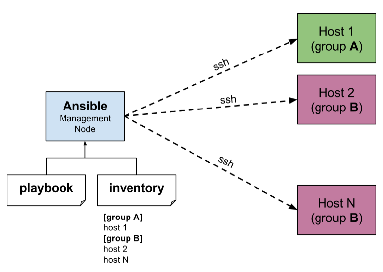

alternatif `ansible` : `puppet` dan `chef` ➡️ butuh agen.

- Terraform : provisioning, setup infra, OS.
- Ansible : konfigurasi

> Terraform excels at provisioning infrastructure, while Ansible is better suited for configuration management and automation tasks

#### Jenkins

tools u/ otomasi CI/CD. tahapan seperti `build`, `test`, `deploy` dilakukan scr otomatis

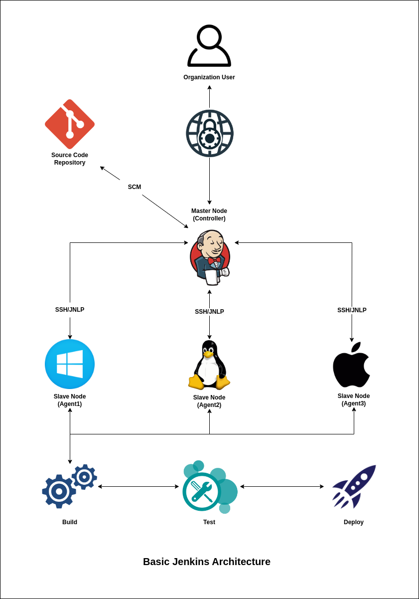

Jenkins by default deploy app dalam `.war`.

> `.war` : hasil kompilasi java u/ web archive ; tdk bisa lngsng dijalankan; butuh Java Servlet seperti Apache Tomcat.
> `.jar` : lebih fleksibel (bukan hanya web), bisa u/ CLI app.

**Komponen Jenkins**:

- **Controller Master**
  - atur semua job : jadwalkan, jalankan ; keloola plugin, simpan config
- **Jenkins Node Agent**
  - jalankan / build task
- Jenkins Job/Project
  - freestyle ➡️ config manual steps u/ build.
  - pipeline ➡️ dgn `Jenkinsfile` (bahasa : `Groovy`)
- Jenkins Pipeline
  - declarative
  - scriptive
- Jenkins Plugin
  - u/ integrasi dgn Git, Docker, Slack, Ansible, dll.

### Automatic Deploment

Jenkins ➡️ CI
Ansible ➡️ CD

event based on:

- manual trigger (`BUILD NOW`)
- webhook

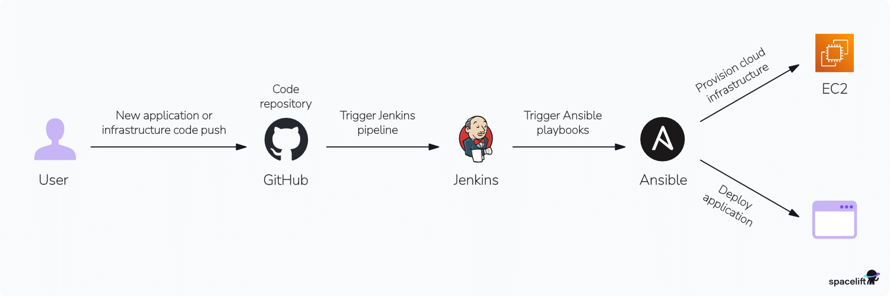

### (HANDSON) Jenkins

> file: /handson/jenkins-ansible.zip

**Goals**: Menginstall `cowsay` di target server

**struktur file**:

```tree
.
├── ansible
│   ├── ansible.cfg
│   ├── deploy.yml
│   └── inventory
├── docker-compose.yml
├── Dockerfile.jenkins
└── target-init.sh
```

**Langkah 1** : buat `docker-compose.yml`

u/ definisikan semua service yg ada:

- jenkins
- target

**Langkah 2** : buat `Dockerfile.jenkins`

setup & instalasi tools yg digunakan Jenkins seperti `ssh` client supaya bisa koneksi ssh ke target & bisa digunakan dari dalam jenkins

**Langkah 3** : buat `target-init.sh`

sebagai entry-point ; secara otomatis akan dijalankan ketika target service booting up.

u/ setup ssh-server & password credential agar bisa di-`ssh` dari jenkins/ansible

**Langkah 4** : buat file-file di folder `/ansible/`

- `/ansible/ansible.cfg` : file general configurasi ansible

- `/ansible/deploy.yml` : ansible playbook ➡️ u/ definisikan tugas yg akan dijalankan pada Ansible

- `/ansible/inventory` : file inventory utk simpan host

**Langkah 5** : Jalankan docker container

```bash
docker compose up
```

lihat password admin jenkins di log:

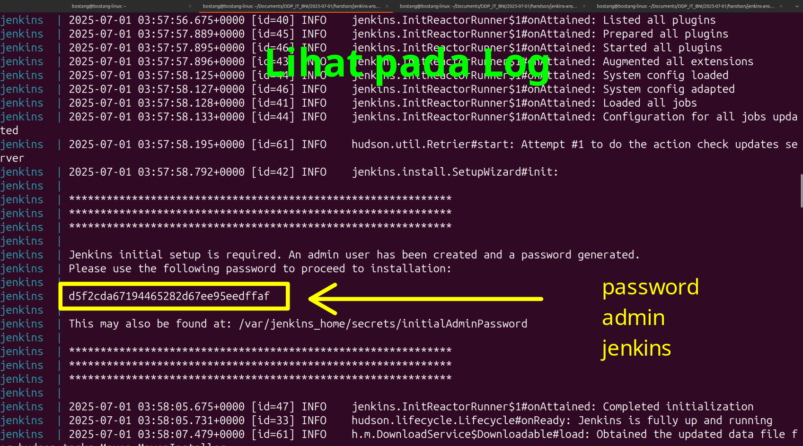

**Langkah 6** : Akses Jenkins melalui browser

akses `localhost:8080`

**Langkah 7** : Cek apakah ansible sudah terinstall di Docker Jenkins

Akses terminal lalu:

```bash
### cek apakah jenkins sudah terinstall ###
# Lihat container ID dari Jenkins
docker ps

# akses docker Jenkins
docker exec -ti [container_id] /bin/bash

# di dalam container Jenkins, cek versi dari ansible-playbook
ansible-playbook --version
###########################################


### cek apakah volume telah termount ###
#  pindah ke direktori di dalam container
cd /home/jenkins/ansible/

ls -la
########################################

exit  # keluar dari docker container Jenkins

### Coba hapus cowsays (agar diinstall ulang lagi nanti lewat Ansible -> Jenkins job) ###
# Lihat container ID dari Jenkins
docker ps

# akses  Docker Ubuntu
docker exec -ti [container_id] /bin/bash

# hapus cowsays & dependencynya
sudo apt purge cowsays -y
sudo apt autoremove
#########################################################################################
```

cek ansible terinstall di Docker container Jenkins:

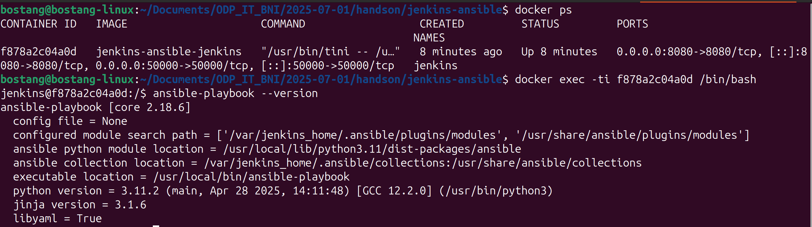

cek volume ter-mount

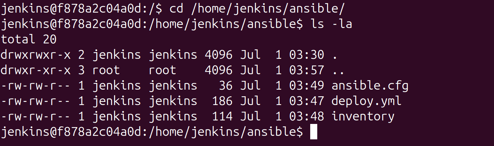

**Langkah 8** : Buat Project di Jenkins

New Item > Freestyle Project > Add Build step > Execute shell > Masukkan command ansible

misal nama project : `ansible-cowsay`

```bash
cd /home/jenkins/ansible && ansible-playbook -i inventory deploy.yml
# sintaks :
  # ansible-playbook -i [nama_file_inventory] [nama_file_playbook]

# UNTUK WINDOWS:
  # cd /home/jenkins/ansible && ANSIBLE_HOST_KEY_CHECKING=False ansible-playbook -i inventory deploy.yml
```

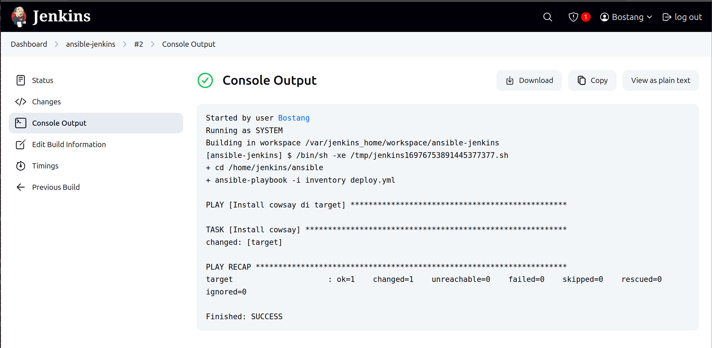

validasi lewat docker terminal:

```bash
cd /usr/games/
ls  # akan ada cowsays

./cowsay hello
```

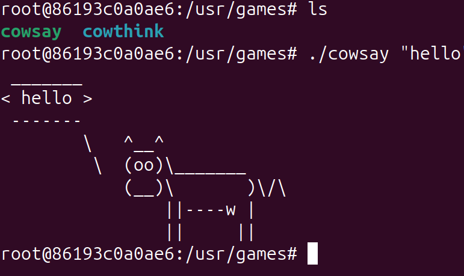

maka kita sudah berhasil menginstall `cowsay` pada `target` dengan melalui `Ansible` playbook.

**Catatan**:

Pada OS Linux, mungkin terdapat error ketika `target-init.sh` dijalankan melalui entry-point

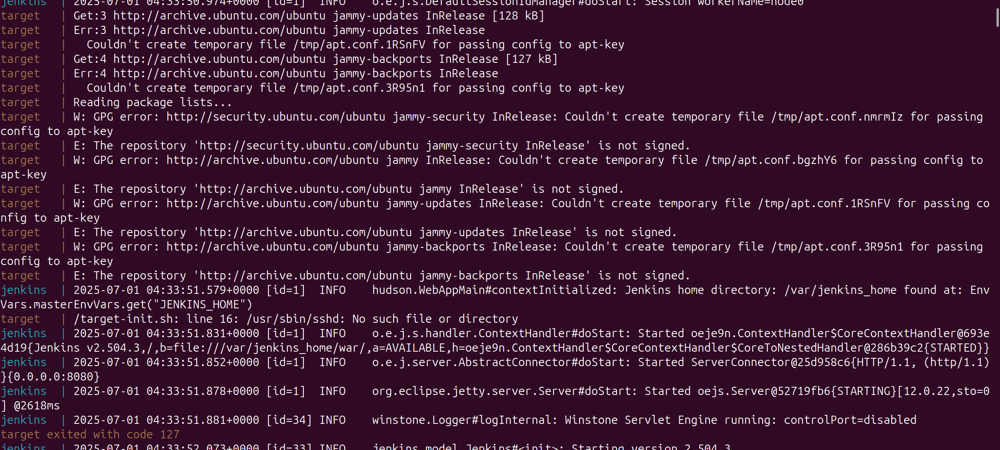

dalam hal ini, opsinya adalah masuk ke dalam containernya secara manual dengan `docker exec -ti [container_id] /bin/bash`

kemudian menjalankan baris per baris dari setiap _command_ di `target-init.sh`

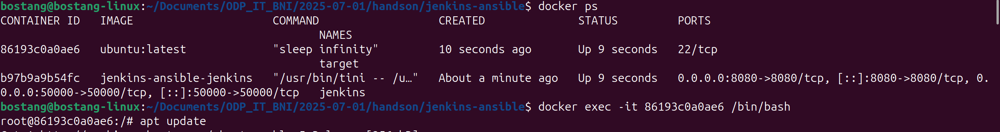

> [ CATATAN ]
> ..........................................
> `apt` : package manager yg dimiliki oleh linux distro debian & turunannya (termasuk ubuntu)
> ..........................................
> notasi Ansible sdh tetap dan memiliki notasi ekuivalen dlm bashscript
> ..........................................
> apabila menggunakan bare-metal server, `target` dapat diganti dengan IP / DNS-nya.
> ..........................................
> volumes perlu di-_mount_ agar persisten (ketika docker container di-restart, storage tidak hilang.) => dgn cara menambahkan `volumes` pada file `docker-compose.yml`
> ..........................................
> `entrypoint` : command yang akan dijalankan ketika container dijalankan => menggunakan instruksi bash script
> ..........................................
> Dockerfie ➡️ build image
> docker-compose ➡️ build container dari image
> ..........................................
> Dockerfile builds images, while Docker Compose runs and orchestrates containers based on those images (which can be built from Dockerfiles or pulled from registries).

### (HANDSON) Kerja Kelompok

Otomasi Ansible -> ubah playbook

Pada Jenkins job, harus ada 2 pipeline:

1. Up -> Install
2. Down -> Uninstall

#### Soal 1

Setup Konfigurasi Apache + static HTML file

> file: ./handson/apache-html-cicd

#### Soal 2

Setup & konfigurasi Nginx + static HTML file

#### Soal 3

Setup & konfigurasi MySQL + setup user & database

#### Soal 4

Setup & konfigurasi PostgreSQL + setup user & database

```bash
docker compose up --build
```

tunggu sampai test_n selesai `apt update` (lihat log-nya)

reset SSH key:

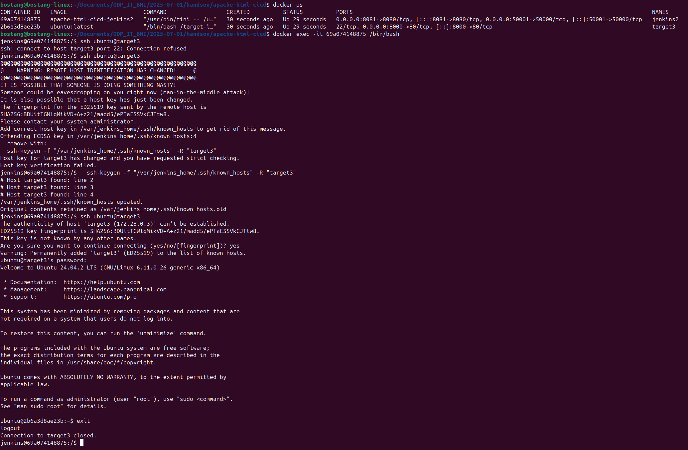

mengapa ini terjadi? IPAddress dari docker berubah ketika `docker compose down` lalu docker `compose up --build` ulang

```bash
docker inspect [container_id] | grep IPAddress
```

Build now pada jenkins
