# Catatan Tambahan

> Referensi : DataCamp

## Docker

Arsitektur Docker:

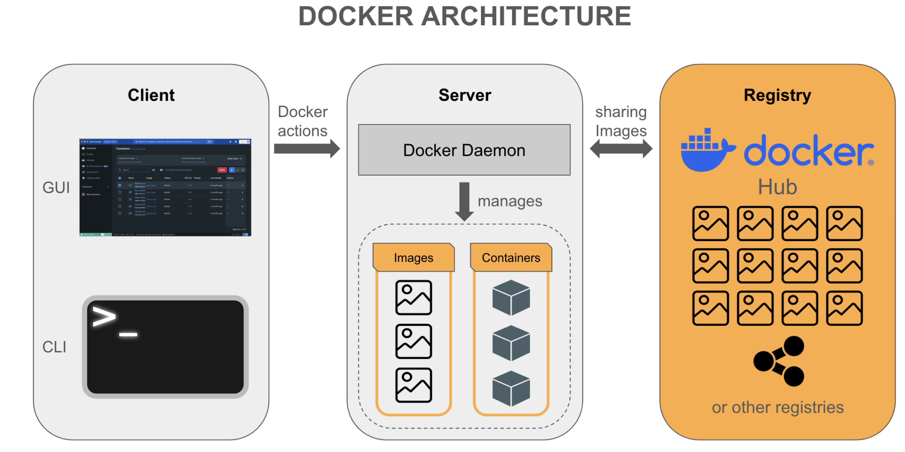

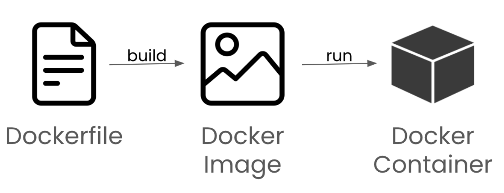

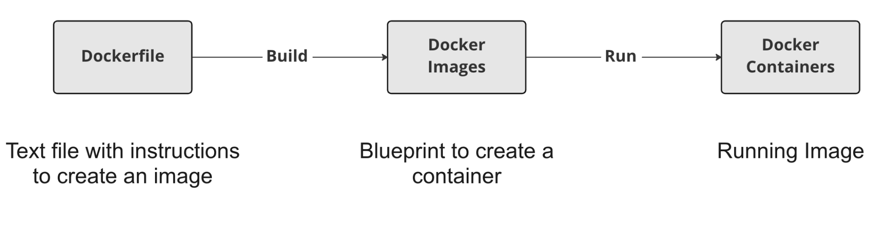

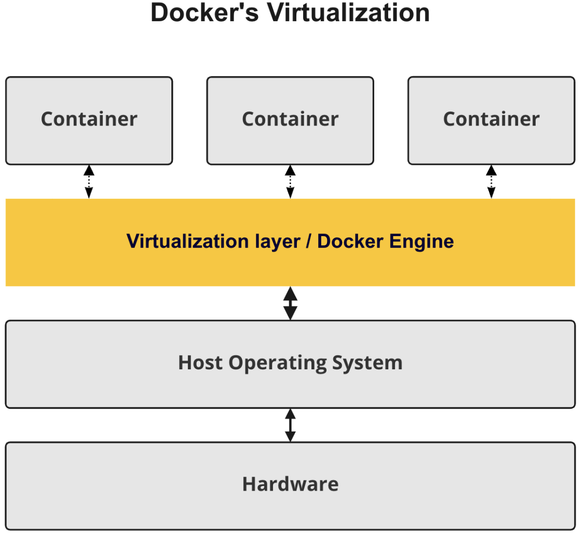

Important Docker instructions:

- `FROM`
- `COPY`
- `RUN`
- `ENTRYPOINT`

```Dockerfile
# syntax:
    # FROM <name_of_image>

# Define the image on which to build
FROM python:3.10
FROM ubuntu
FROM postgres:15.0

# syntax:
    # COPY <source> <destination>

# Copy files/folders to the main folder of the container
COPY . .
COPY /projects/pipeline_v3/pipeline.py /app/pipeline.py
COPY /projects/pipeline_v3/pipeline.py /app/
COPY /projects/pipeline_v3/ /app/

# syntax:
    # RUN <command>

# Install the application's dependencies
RUN apt-get update
RUN apt-get install -y python3
RUN pip install -r requirements.txt
# download file
RUN curl <file-url> -o <destination>        
# Unzip the file
RUN unzip <dest-folder>/<filename>.zip
# Remove the original zip file
RUN rm <copy_directory>/<filename>.zip

# syntax:
    # ENTRYPOINT ["command", "argument"]

# Run the script when the container starts
ENTRYPOINT ["python", "hello_world.py"]


# Running a shell command at startup
# syntax:
    # CMD <shell-command>

# Runs when the image is started.
# Does not increase the size of the image .
# Does not add any time to the build.

# Starting an application to run a workflow or that accepts outside connections.
CMD python3 my_pipeline.py
CMD postgres
    # stop when: database exit

# Starting a script that, in turn, starts multiple applications
CMD start.sh
CMD python3 start_pipeline.py
    # stop when: the shell is closed 

# Changing users and working directory

WORKDIR /home/my_user_with_a_long_name/work/projects/
# Changes the user to repl
USER repl

# Setting ARG variables at build time
ARG project_folder=/projects/pipeline_v3

# Create variables in a Dockerfile
# syntax:
    # ENV <var_name>=<var_value>
ENV DB_USER=pipeline_user
ENV DATA_DIR=/usr/local/var/postgres
ENV MODE production


```

```bash
# docker build
    # Builds Docker image from a Dockerfile
docker build <context>

# Docker run
    # Creates and runs Docker container from Docker image
docker run <name_of_image>
docker run python3-sandbox

# Adding -it to docker run will give us an interactive shell in the started container.
docker run -it <image-name>

# Adding -d to docker run will run the container in the background, giving us back control of the shell.
docker run -d <image-name>

# Named containers
docker run --name <container-name> <image-name>

# Listing running containers
docker ps

# Filtering
docker ps -f "name=<container-name>"

# Stopping container
docker stop <container-id>

# Container logs
docker logs <container-id>

# Live logs
docker logs -f <container-id>

# Cleaning up
docker container rm <container-id>

# Pulling an image
docker pull <image-name>
docker pull <image-name>:<image-version>

# Listing images
docker images

# Removing images
docker image rm <image-name>

# Cleaning up containers
docker container prune

# Dangling images
docker images
```

### Mounting the host filesystem

Container instances each have their own filesystem

Managing volumes:

```bash
docker volume

docker volume create <volumename>
docker volume create sqldata

docker volume ls
docker volume inspect

volume inspect sqldata

docker volume rm
```

### Port Mapping

```bash
# syntax:
#     -p <host port>:<container port>

docker run -p 5501:80 nginx
```

exposing in Dockerfile:

```Dockerfile
# syntax:
    # EXPOSE <number>

# Dockerfile
FROM python:3.11-slim
ENTRYPOINT ["python","-mhttp.server"]
# Let the Docker engine know
# port 8000 should be available
EXPOSE 8000
```

cek dengan:

```bash
docker inspect <id/name> | grep Ports
```

Docker Network types:

- **bridge**: Default driver, allows connections out, connections in if exposed
- **host**: Allows full communication between host and containers
- **none**: Isolate container from network communications

```bash
docker network <command>
docker network <command> --help

# to list all docker networks on the host
docker network ls 

# to create a network
docker network create 

docker network create mynetwork

# to remove a network
docker network rm 

# Attaching containers to networks

docker run --network <networkname> ...
docker run --network mynetwork ubuntu bash

# connect containers later
docker network connect <networkname> <container>
docker network connect mynetwork ubuntu-B

docker network inspect <networkname>
```

### Docker Compose

Define and manage multi-container applications

Specify containers, networking, and storage volumes in a single file: `docker-compose.yaml`

main sections:

- `services`: list the containers to load
  - `container_name`: the assigned name of the container otherwise it's random
  - `image`: which container image to use
  - `ports`: list of any port mapping required
- `networks`: handles networking definitions
- `volumes`: controls any volume mounting
- `configs`: handles configuration options without custom images
- `secrets`: Provides options to handle
- `passwords`, tokens, API keys, etc

example:

```yaml
# Define the services
services:
  # Define the container(s), by name
  webapp:
    image: "webapp"
# Optionally, define the port forwarding
ports:
  - "8000:5000"
# Define any other containers required
redis:
image: "redis:alpine"
```

```yaml
services:
  postgres:
    container_name: postgres
      image: postgres:latest
    ports:
      - "5432:5432"
    restart: always
  pgadmin:
    container_name: pgadmin
    image: dpage/pgadmin4:latest
    ports:
      - "5050:80"
    restart: always
```

```bash
# Starting an application
docker compose up

# detached mode
docker compose up -d

# Checking status of applications
docker compose ls

# Stopping an application
docker compose down

# Gathers output from all resources in application
docker compose logs

# shows status of resources within an application
docker compose top

```

#### dependencies

define the order of resources ; Resources (containers) may require other resources.

example:

`postgresql` -> `python_app` -> `nginx`

```yaml
services:
  postgresql:
    image: postgresql:latest

  python_app:
    image: custom_app
    depends_on:
      - postgresql

  nginx:
    image: nginx/latest
    depends_on:
      - python_app
```

#### Port mapping

`docker run -p hostport:containerport`

```yaml
services:
  resource:
  name: resource1

  ports:
    - hostport:containerport
    # Such as:
    - 8000:8000
```

## Kubernets

Orchestration:
The automated management of multiple components

ensuring that multiple containers interact effectively and efficiently

Declarative programming: Defining the desired output

application: Microservices architecture

components:

Pods : smallest deployable unit
Nodes : smallest hardware unit
Control Plane : Node management
Cluster : Grouping nodes

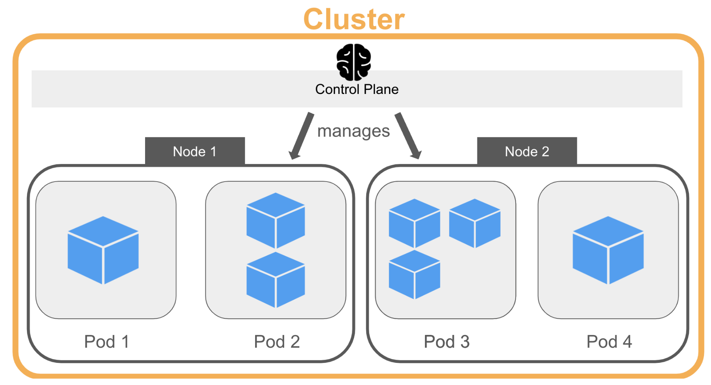

app architectures:

- traditional : monolithics
- modern : microservices

microservices:

- constructed from independent building blocks: microservices
- Can be independently maintained and updated
- Ideally suited for cloud computing

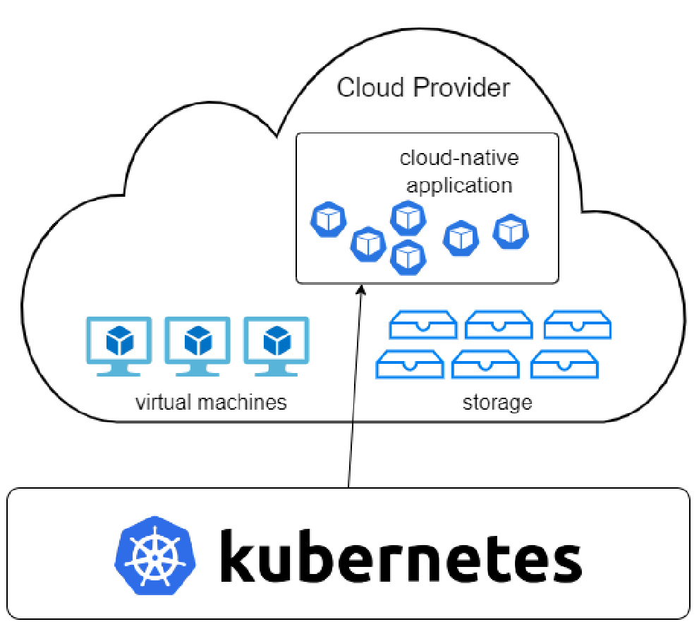

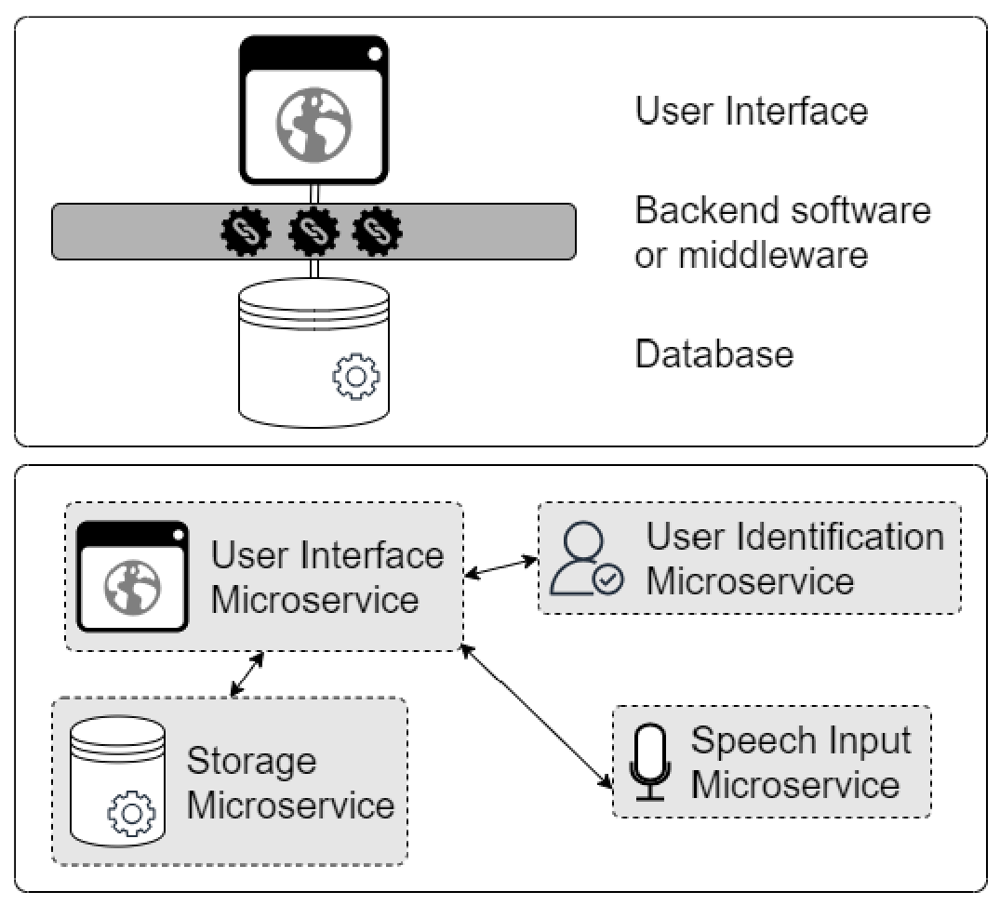

Kubernetes keeps track of all containers

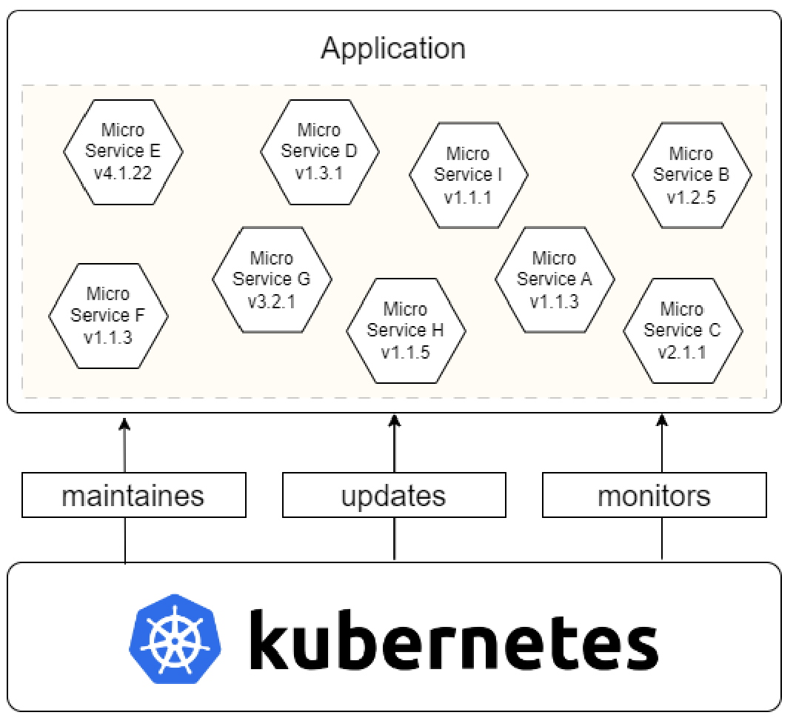

### kubernetes manifest

sections:

- `apiVersion`
- `kind`
- `metadata`: essential information about the object or resource
- `spec`: defines the specifications, or desired state, of the object or resource
  - `replicas`
  - `selector`
  - `template` : describes details for the creation the pods in the Deployment

```yaml
apiVersion: apps/v1
kind: Deployment
metadata:
  name: nginx-deployment
  labels:
    app: nginx
spec:
  replicas: 5
  selector:
    matchLabels:
      app: nginx
  template:
    metadata:
      labels:
       app: nginx
  spec:
    containers:
    - name: nginx
      image: nginx:1.25.4
      ports:
      - containerPort: 80
```

### `kubectl`

`kubectl` is a command line tool to interact with Kubernetes

It reads Manifest, sends them to Kubernetes via its API, and Kubernetes will compute what to do to achieve the state we want.

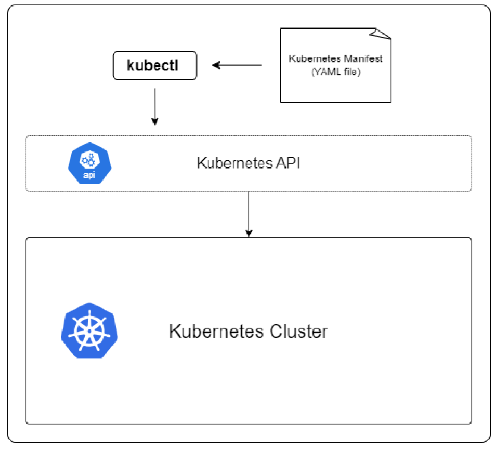

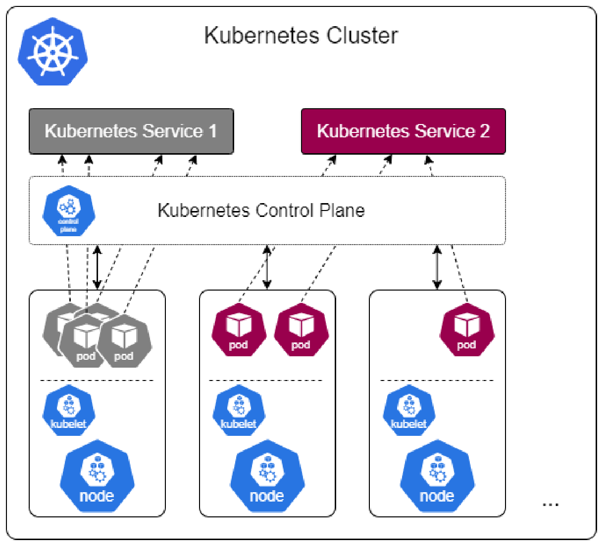

terminologies:

- k8s **Cluster**: set of connected computers (Nodes) configured to run Kubernetes
- k8s **Control** Plane: manages the Nodes in a Cluster
- k8s **Nodes**: also called "worker machines", running Linux and a container engine
- k8s **Pods**: a set of one or more containers, the smallest deployable unit
- k8s **Services**: a resource for exposing network connectivity, required to connect to Pods from outside, and for communication between Pods

```bash
# object : pod , service

# create new objects, with -f for "filename"
kubectl create -f <Manifest.yml>

# create new objects & change the state of objects
kubectl apply -f <Manifest.yml> 

# overview about objects deployed on Kubernetes
kubectl get <object> 
kubectl get pods
kubectl get services

# detailed information about an object
kubectl describe <object> 

# Scaling on Kubernetes
kubectl scale deployment .. --replicas <number>
```

#### Stateless App

Do not save an internal state, or context of processed data

contoh:

- The database frontend querying a database backend
- A search app querying a full text index
- A data stream app that converts temperature readings from an IoT sensor from °F to °C

#### Kubernets StatefulSets

Pods get predictable names like pod-0 , pod-1 , pod-2

```yaml
apiVersion: apps/v1
kind: StatefulSet
metadata:
  name: <deployment name>
  labels:
    app: <a label for the application>
spec:
  replicas: <number of initial replicas>
  selector:
    matchLabels:
     app: <matches the label above>
  template:
    metadata:
      labels:
        app: <label to be given to each pod>
  spec:
    containers:
    - name: <container name>
      image: <the image to be used>
      ports:
      - containerPort: <ports for networking>
```

### Persistent Volume (PV) & PV Claim (PVC)

There are only three objects that make storage work:

- `PersistentVolume`
- `PersistentVolumeClaim`
- `StorageClass`

- Fundamental Objects for storage: Persistent Volumes (PV)
- PVs are mapped to Pods using Persistent Volume Claims (PVC)
- Dynamic provisioning happens via Storage Classes (SC) without human intervention

- A Pod with demand for persisted data uses a `PersistentVolumeClaim`
- This PVC has Kubernetes create a `PersistentVolume` for the Pod
- This `PersistentVolume` is mapped to the claiming Pod
- A named `StorageClass` is used, which defines details like latency and backup strategy of
the PV
- This `PersistentVolume` survives (together with stored data), even when the Pod is
terminated

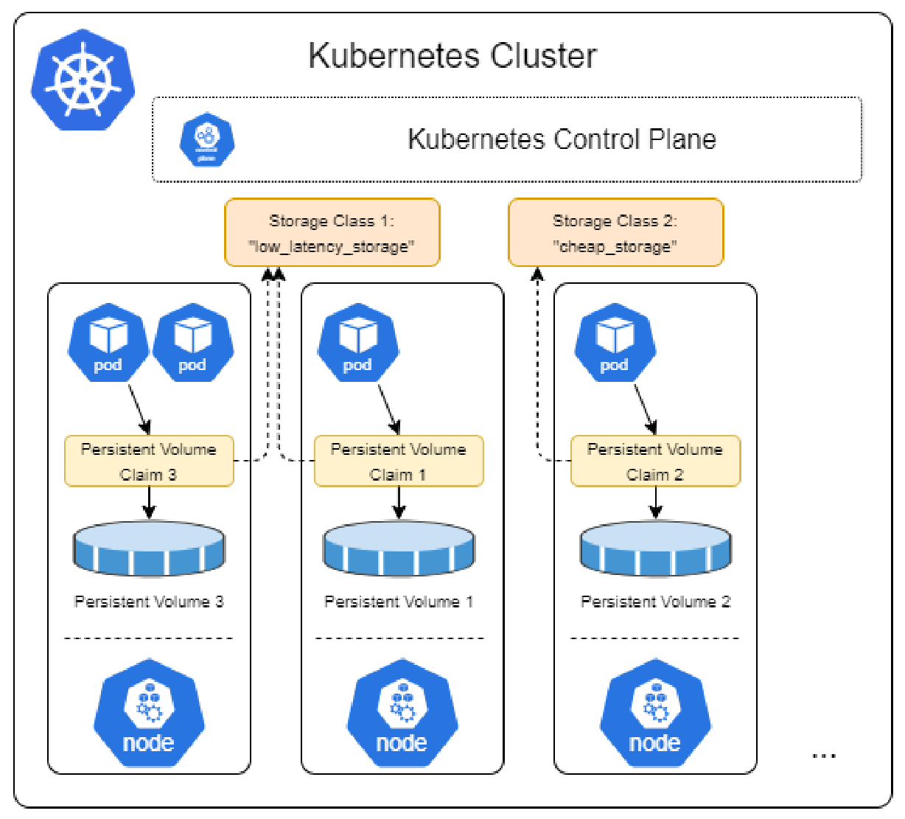

Pod with PersistentVolume manifest:

```yaml
apiVersion: v1
kind: Pod
...
spec:
  containers:
  ...
    volumeMounts:
    - name: pv-mydata
      mountPath: /mydata
  volumes:
  - name: pv-mydata
    persistentVolumeClaim:
      claimName: datacamp-pvc
```

PersistentVolumeClaim with StorageClass manifest:

```yaml
apiVersion: v1
kind: PersistentVolumeClaim
metadata:
  name: datacamp-pvc
spec:
  storageClassName: "standard"
  accessModes:
  - ReadWriteOnce
  resources:
    requests:
     storage: 5Gi
```

k8s commands for storage:

```bash
# lists all available Storage Classes
kubectl get sc

# lists all deployed Persistent Volume Claimes
kubectl get pvc

# lists all deployed Persistent Volumes
kubectl get pv
```

### Labels & Selector

**Labels** : Key/Value pairs attached to Kubernetes objects like Pods or Nodes

- `environment: prod`
- `app: my_cool_app`
- `has_GPU: true`

**Selectors** : used to identify objects via labels

```yaml
...
selector:
environment: prod
app: my_cool_app
...
...
nodeSelector:
has_GPU: true
...
```

### Networking

- Each Pod gets its own cluster-wide IP
- Can be used for communication between Pods
- As Pods can restart at any time, and will get a new IP
- **Services** are used to attach Pods to, and offer stable connectivity

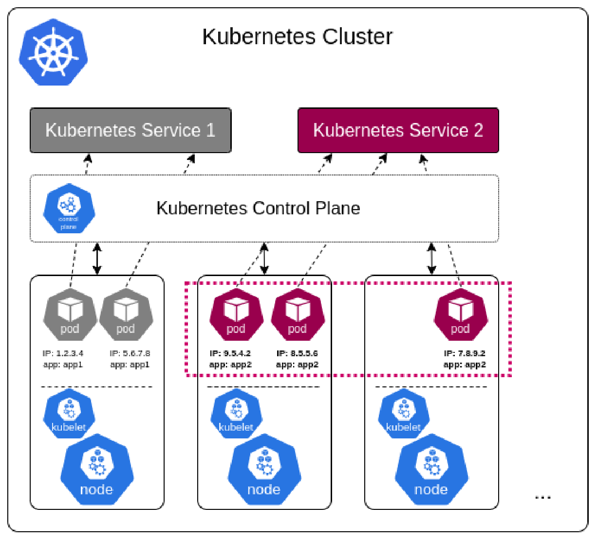

```yaml
apiVersion: v1
kind: Service
  metadata:
    name: Kubernetes_Service_2
spec:
  type: ...
    selector:
      app: app2
```

### Load Balancing

- distributes load over Pods
- Avoids uneven load on resources, increases efficiency and lowers response times

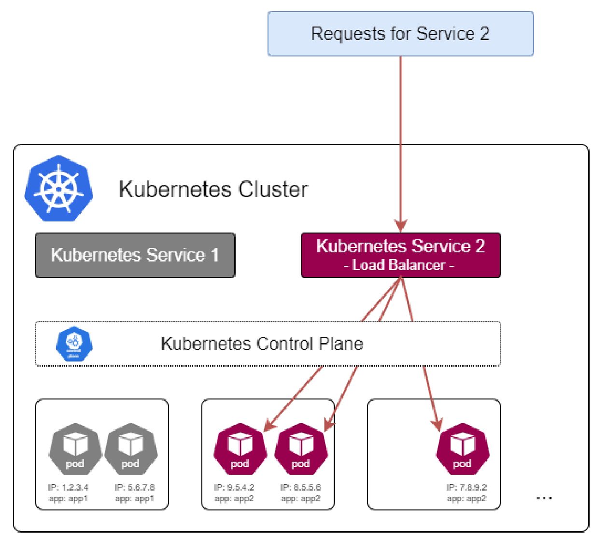

```yaml
apiVersion: v1
kind: Service
metadata:
  name: <service name>
spec:
  type: LoadBalancer
    selector:
      <key1>: <value1>
      <key2>: <value2>
  ...
```

#### Ingress

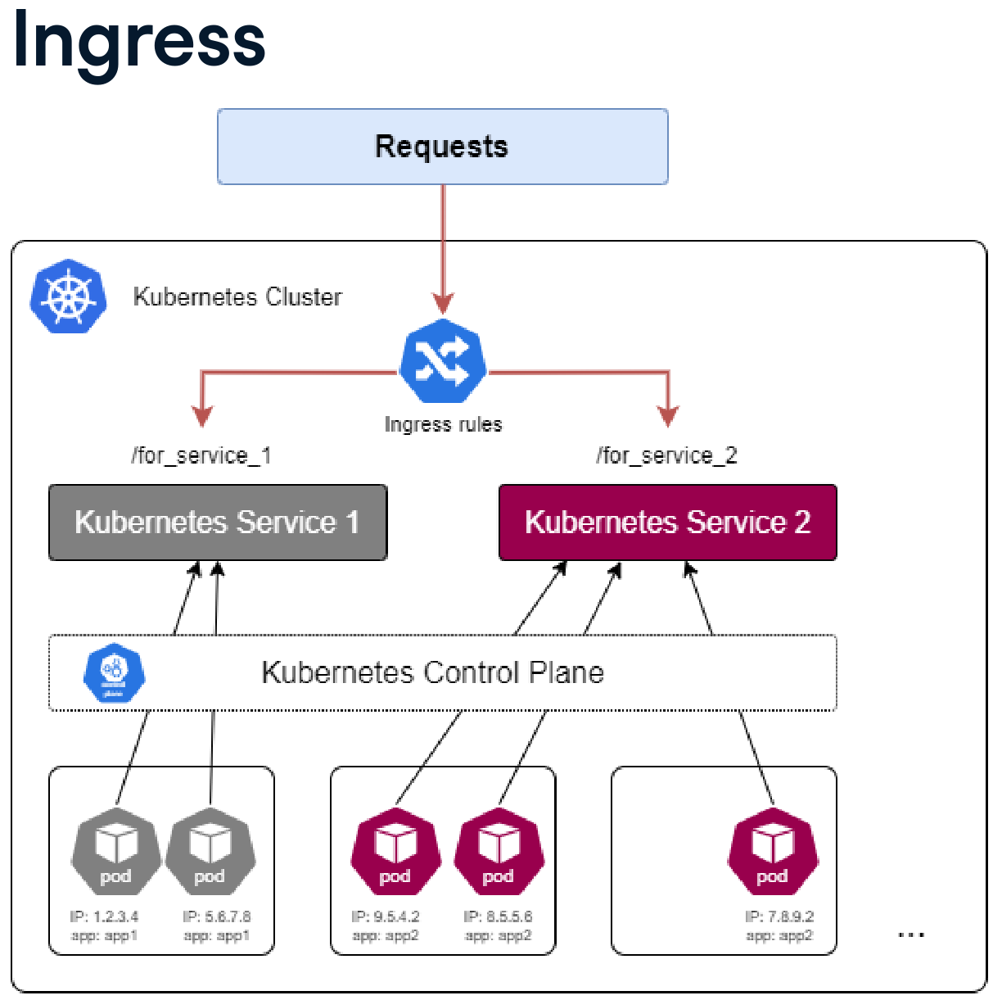

to route HTTP and HTTPS requests (traffic) from outside the cluster to services in the cluster.

Ingress rules define which requests are served by which service.

### Security

- the "Secret" API for confidential objects like passwords, tokens, keys etc
- role-based and attribute-based access control ("RBAC" and "ABAC")

## `/dev/null`

is a null device file. This will discard anything written to it, and will return EOF on reading.


### Shell Redirection

```bash
# > is a redirection operator, implemented by the shell. Its syntax is:

command > file
```

## Port Range

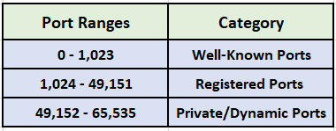

## VPC Peering

> VPC peering connects two Virtual Private Clouds (VPCs) to enable traffic routing using private IP addresses as if they were a single network

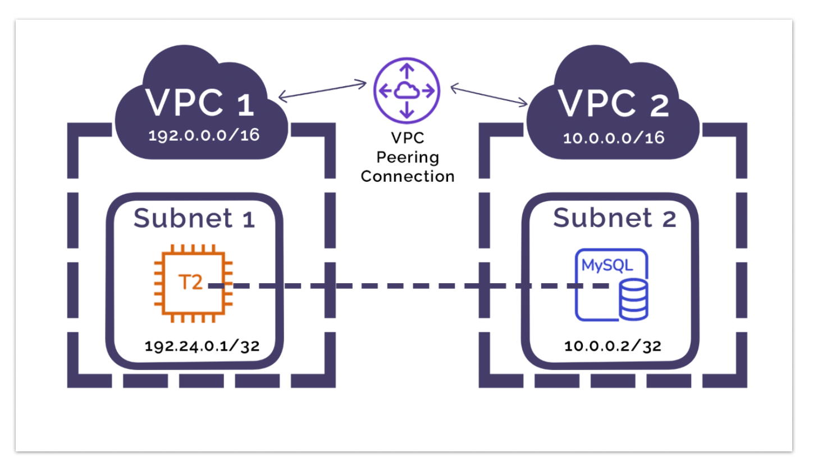

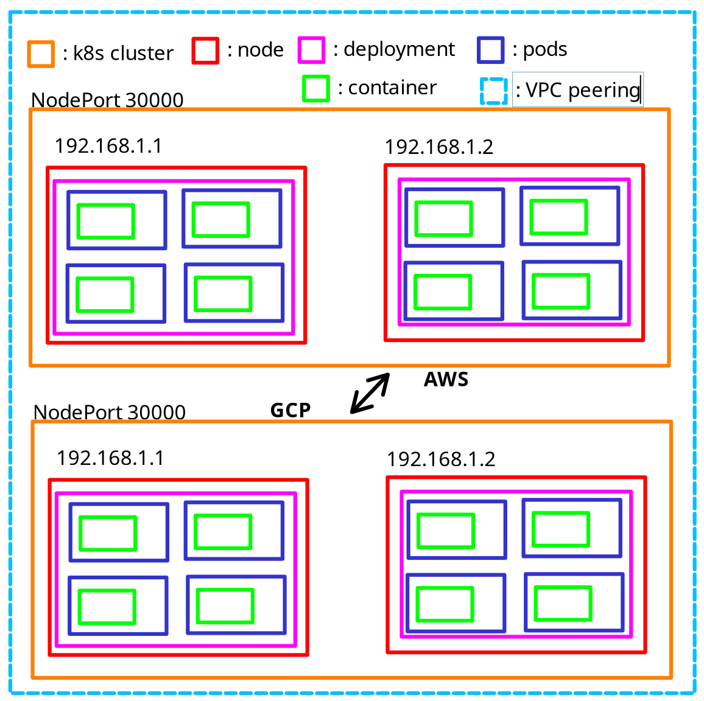

## Load Balancer vs Ingress

[referensi](https://medium.com/google-cloud/kubernetes-nodeport-vs-loadbalancer-vs-ingress-when-should-i-use-what-922f010849e0)

- **LoadBalancer** : standard way to expose a service to the internet. On GKE, this will spin up a Network Load Balancer that will give you a single IP address that will forward all traffic to your service.

All traffic on the port you specify will be forwarded to the service. no filtering. HTTP, TCP, UDP, Websockets, gRPC, or whatever.

The big downside is that each service you expose with a LoadBalancer will get its own IP address, and you have to pay for a LoadBalancer per exposed service.

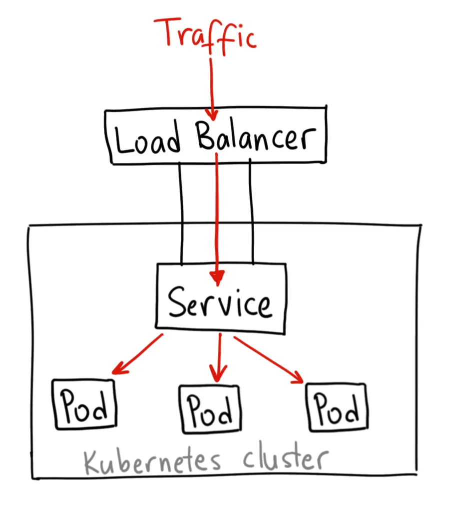

**Ingress** : sits in front of multiple services and act as a “smart router” or entrypoint into your cluster.

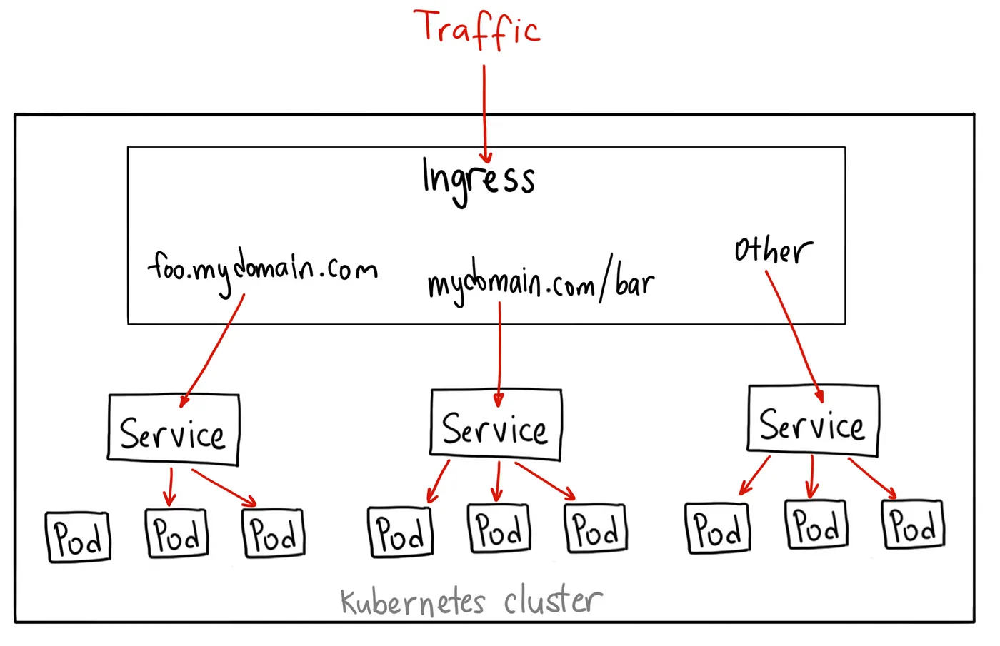

```yaml
apiVersion: extensions/v1beta1
kind: Ingress
metadata:
  name: my-ingress
spec:
  backend:
    serviceName: other
    servicePort: 8080
  rules:
  - host: foo.mydomain.com
    http:
      paths:
      - backend:
          serviceName: foo
          servicePort: 8080
  - host: mydomain.com
    http:
      paths:
      - path: /bar/*
        backend:
          serviceName: bar
          servicePort: 8080
```

## Bacaan Lanjutan

- [NGINX Ingress Controller](https://docs.nginx.com/nginx-ingress-controller/overview/design/)
