<!-- Dirangkum oleh : Bostang Palaguna -->
<!-- Juli 2025 -->

# Kubernetes

## Introduction to Kubernetes

platform u/ kelola, atur, otomatisasi _deployment_, perbanyak, kelola aplikasi berbasis _container_ dlm lingkungan komputasi **terdistribusi**.

**fitur**:

- penjadwalan container
- load balancing
- self-healing
- zero downtime update

**Manfaat**:

- otomatisasi deployment & maintenance app
- skalabilitas
  - manual/autoscaling bdskan kebutuhan resources / #traffic
- self-healing
  - jika container mati, maka scr otomatis akan mulai ulang
- load balancing & service discovery
  - distribusi trafik jaringan ke containers scr merata
  - DNS internal agar tiap service dpt saling discover
- konsistensi environment
  - container yg identik di bbg environment (dev, staging, prod.) sehingga kurangi environment mismatch
- penggunaan resource yg efisien
  - smart scheduling
  - maksimalkan penggunaan CPU, memori

### Arsitektur Kubernetes

2 jenis server:

1. control plane (master node)      -> byngkan sbg manager
2. worker node                      -> byngkan sbg developer

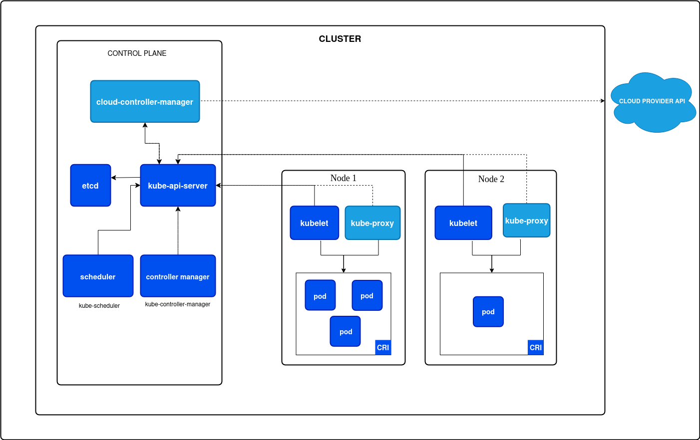

**Komponen**:

- Control plane (master node)
  - u/ atur seluruh cluster :
    - scheduling
    - status app
    - respons kerjadian
  - komponen:
    - API Server : Gerbang utama komunikasi
    - Controller Manager : control loop u/ jaga status sistem sesuai deklarasi
    - etcd : penyimpanan data terpusat (key-value) u/ config & status cluster
    - scheduler : tentukan di node mana pod baru akan dijalankan
- Worker node
  - tempat app / service dijalankan dlm bentuk pod
  - komponen:
    - kubelet : agen di setiap node u/ terima perintah dari control plane & jalankan pod
    - container runtime : atur jaringan & load balancing antar pod di node
    - kubeproxy : mesin yg jalankan container (Docker, containerd, CRI-O)

> KOMPONEN CONTROL PLANE
>
> - kube-apiserver : component of the k8s control plane that exposes the Kubernetes API.
> - etcd : Consistent and highly-available key value store
> - kube-scheduler : watches for newly created Pods with no assigned node, and selects a node for them to run on.
> - kube-controller-manager : runs controller processes
>   - Node controller
>   - Job controller
>   - EndpointSlice controller
>   - ServiceAccount controller
> - cloud-controller-manager : embeds cloud-specific control logic
>
> ---
> KOMPONEN NODE
>
> - kubelet : agent that runs on each node in the cluster ; ensure PodSpecs run & health
> - kube-proxy : network proxy that runs on each node ; maintains network rules
> - container runtime : managing the execution and lifecycle of containers
>
> ---
> CATATAN
> etcd stands for "distributed /etc", where "/etc" refers to the directory in Linux systems that stores configuration files. The "d" at the end signifies that etcd is a distributed key-value store, designed for managing configuration data across distributed systems

### Kubernetes vs OpenShift

- `k8s` -> dikembangkan Google & dikelola CNCF
- `Openshift` -> dikembangkan Red Hat => k8s + fitur enterprise, UI lebih baik, integrasi tools DevOps yg lebih lengkap

Fitur tambahan Openshift:

- web UI dashboard yg canggih
- OpenShift pipelines (CI/CD berbasis Tekton)
- security++
- OpenShift container registry bawaan
- source-to-image (S2I)
  - punya sourcecode, bisa lngsng deploy.

CLI: `kubectl` (Kubernetes) , `oc` (OpenShift)

k8s -> by default tdk ada UI-nya ; namun bisa install dashboard tambahan -> normalnya gunakan CLI

Kapan pilih OpenShift?

- perusahaan butuh solusi enterprise-ready
- fokus ke keamanan & compliance
- butuh support teknis official

### `minikube`

tool u/ jalankan k8s scr lokal. _sandboxing tool_.

cocok u/ belajar k8s, pengembangan & testing app local, eksperimen dgn config cluster tanpa server/cloud.

tdk cocok u/ production.

cara kerja:

`minikube` membuat VM / container local berisi semua komponen k8s -> bisa jalankan `kubectl` u/ interaksi dgn cluster.

```bash
minikube kubectl get pods
```

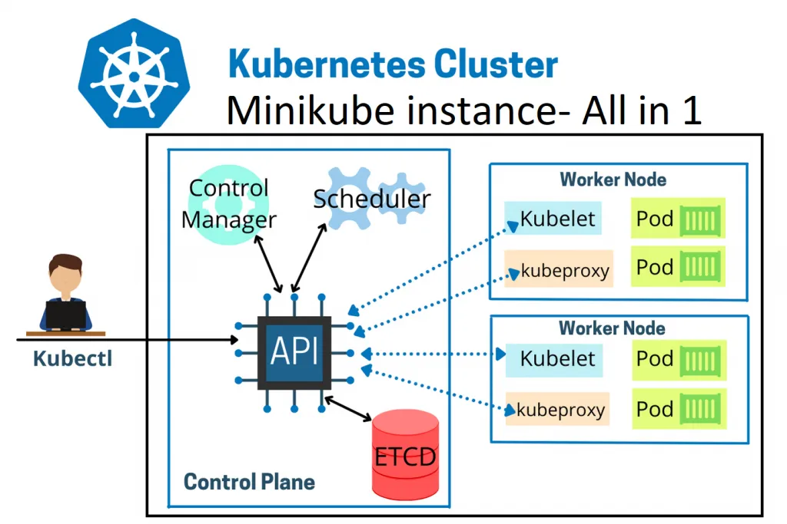

### `kubectl`

CLI tool u/ interaksi dgn cluster k8s

### (HANDSON) Minikube

**Langkah 0** : [Install Minikube](https://minikube.sigs.k8s.io/docs/start/?arch=%2Flinux%2Fx86-64%2Fstable%2Fbinary+download)

setup lalu akses via dashboard

**Langkah 1** : Install Minikube

```bash
minikube start --driver=docker --cpus=2 --memory=2048

# akses dashboard (alternatif dari command line)
minikube dashboard

# mendapatkan list nodes yg ada di dlm minikube cluster
minikube kubectl get nodes
minikube kubectl get all

# memberhentikan service
minikube stop
```

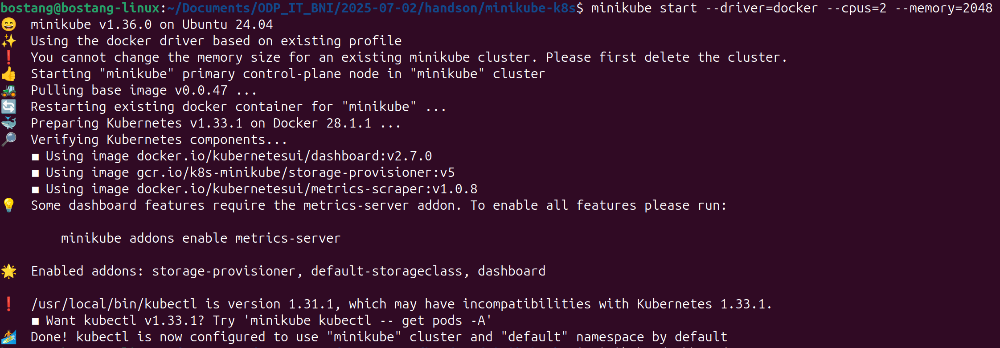

## Pods, Depoloyments, ReplicaSets

### Pods & Deployments

- `pod` : unit terkecil & dasar dlm cluster ; terdiri dri 1/bbrp container (biasanya Docker); u/ jlnkan app/proses tertentu

1 pod -> 1 instance dari proses yg jalan di cluster.

antar pod sharing:

- network space (IP, port)
- storage (volume)
- lifecycle (dikelola sbg)

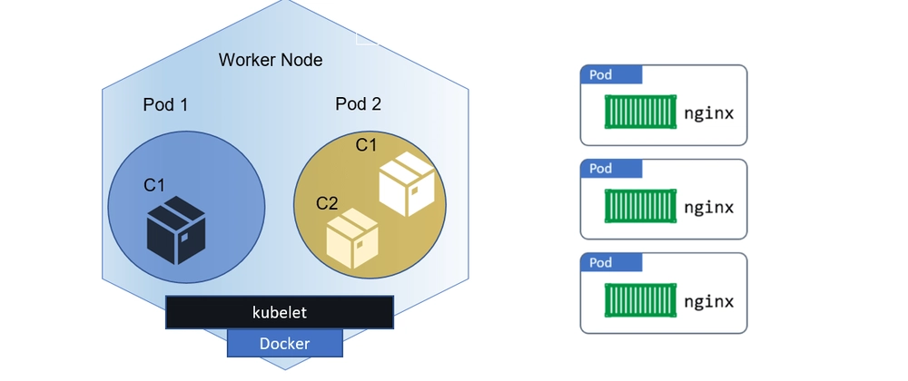

pod di-maintain oleh **deployment object**.

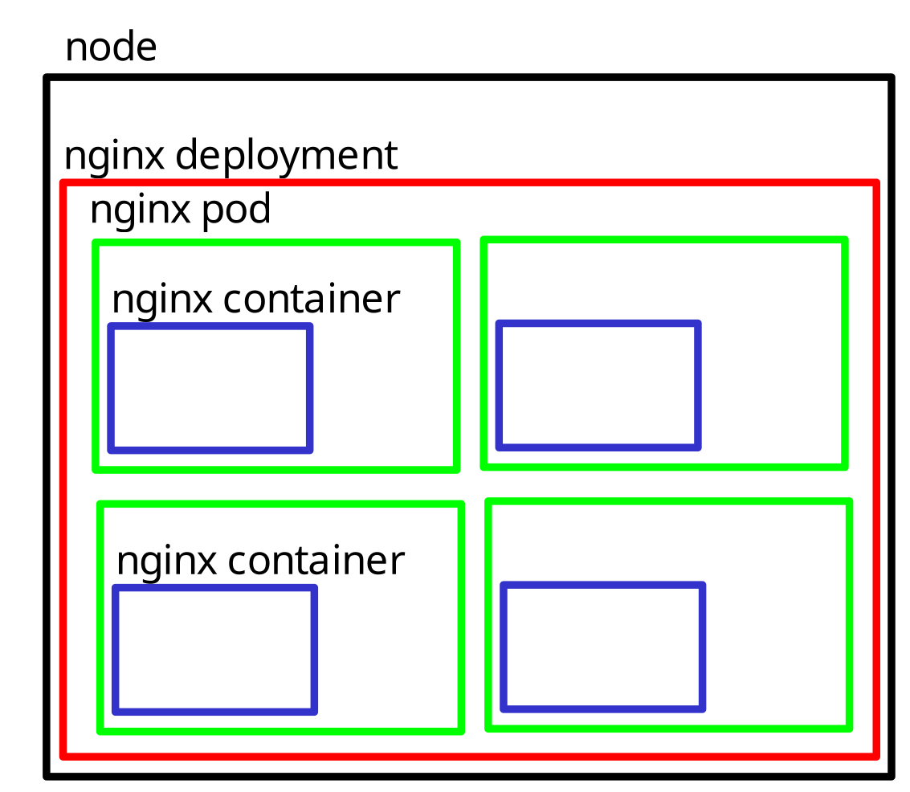

| **Fungsi**     | **penjelasan**                                      |
| :------------- | :-------------------------------------------------- |
| rolling update | update aplikasi tanpa downtime                      |
| rollback       | kembali ke versi sebelum jika update gagal          |
| scaling        | tambah/kurang #pod                                  |
| self-healing   | jika pod mati maka deployment buad pod scr otomatis |

apabila satu deployment mengupdate versi, maka setiap pod akan secara bergantian mengganti versinya. -> proses aman tanpa downtime (rolling update)

```yaml
apiVersion: apps/v1
kind: Deployment
metadata:
  name: nginx-deployment
spec:
  replicas: 3             # berapa bnyk pods dlm deployment ini
  selector:
    matchLabels:
      app: nginx
  template:               # definisikan pod manifest
    metadata:
      labels:
        app: nginx
    spec:
      containers:         # by default ambil dari docker hub
      - name: nginx
        image: nginx1.25
        ports:
        - containerPort : 80
```

### ReplicaSets

k8s object u/ jaga #pod tertentu tetap berjalan setiap saat.

apabila ada pod yg mati, maka akan dibuat otomatis.

```yaml
apiVersion: apps/v1
kind: Deployment
metadata:
  name: nginx-deployment
spec:
  replicas: 3
  selector:
    matchLabels:
      app: nginx
  template:
    metadata:
      labels:
        app: nginx
    spec:
      containers:
      - name: nginx
        image: nginx:1.25
        ports:
        - containerPort: 80
```

> **note** :
>
> ```yaml
> matchLables:
>   app: nginx
> ```
>
> harus resolve/ sama dgn:
>
> ```yaml
> template:
>   metadata:
>     labels:
>       app: nginx
> ```

### (HANDSON) Deployment Web Server NGINX ke k8s cluster + akses via browser

**Langkah 1** : buat file manifest `deployment.yml`

```yaml

```

**Langkah 2** : Terapkan manifest pada k8s

```bash
# terapkan deployment
minikube kubectl -- apply -f deployment.yml
# -- : jalankan dgn argumen yg dimiliki `kubectl` , bukan minikube
```

```bash
# terapkan deployment
minikube kubectl -- apply -f deployment.yml
# -- : jalankan dgn argumen yg dimiliki `kubectl` , bukan minikube

# hapus deployment
minikube kubectl -- delete -f deployment.yml

# verifikasi
minikube kubectl -- get all

# port-forwarding
minikube kubectl -- port-forward deployment.apps/nginx-deployment 8080:80
```

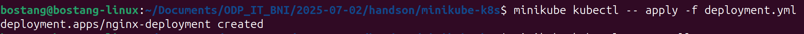

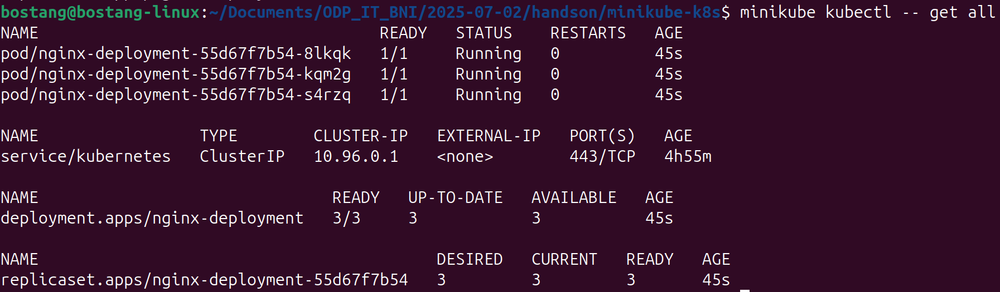

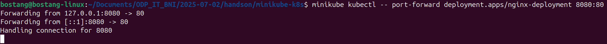

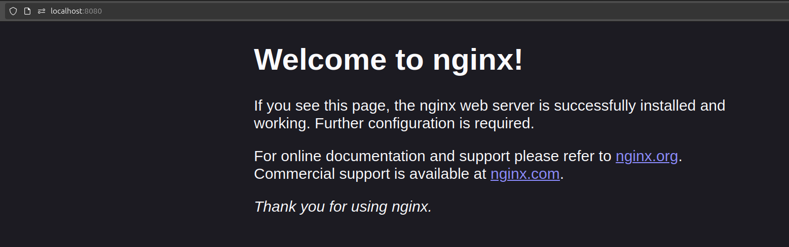

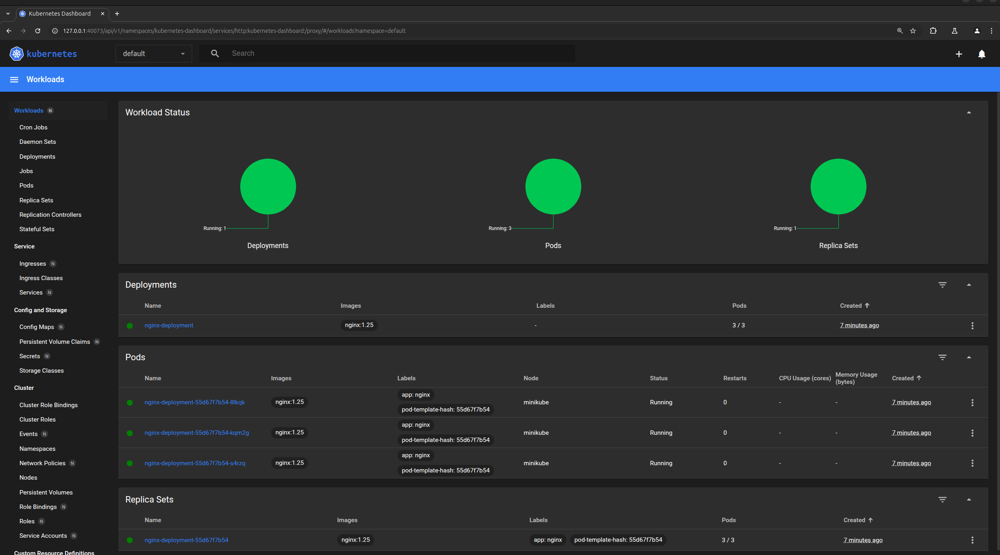

salah satu cara untuk configurasi `index.html` pada pods adalah melalui `config` atau secara mudah melalui `minikube dashboard`

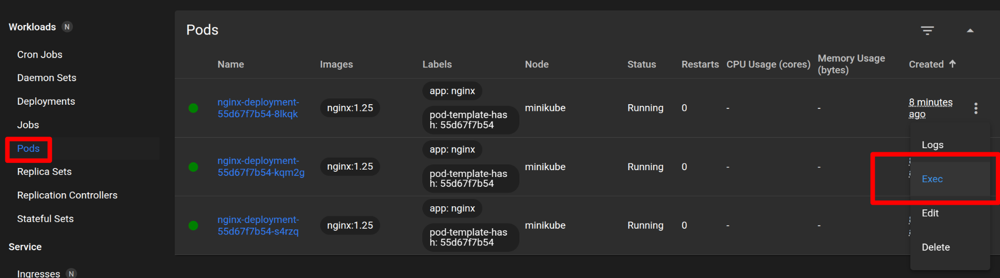

lakukan lagi untuk web server `apache` dan juga `caddy`

```bash
pwd
# /home/bostang/Documents/ODP_IT_BNI/2025-07-02/handson/minikube-k8s-nginx

cd ..

cp minikube-k8s-nginx minikube-k8s-apache
cp minikube-k8s-nginx minikube-k8s-caddy

# lalu edit file deployment.yml untuk folder /minikubge-k8s-apache dan /minikubge-k8s-caddy

# setelah edit, port forwarding lalu akses via browser
minikube kubectl -- port-forward deployment.apps/apache-deployment 8081:80
minikube kubectl -- port-forward deployment.apps/caddy-deployment 8082:80
```

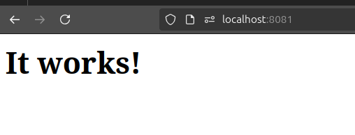

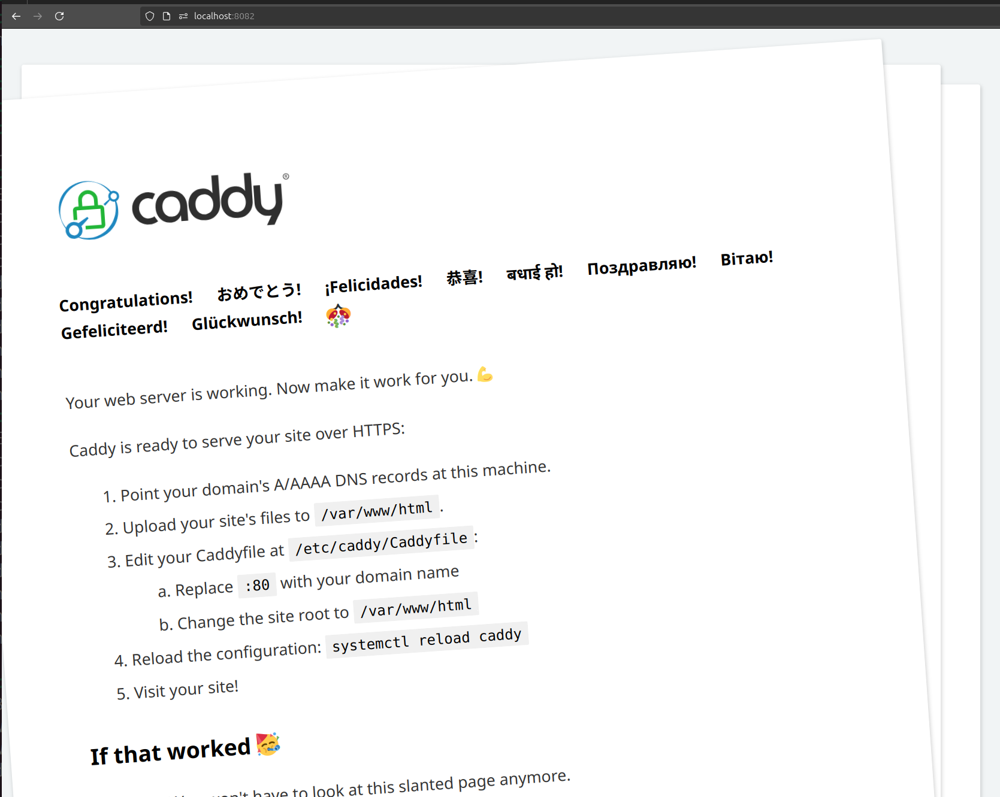

### Service, Ingress, Load Balancing

Networking (Kubernets) : cara semua bagian app bisa saling _connect_ & komunikasi.

misal DB dgn web service.

-> k8s perlu object yg disebut dgn `services` agar bisa diakses dari luar.

> **note** : meskipun belum memiliki service, kalau sudah port-forward, bisa diakses dari luar (temporary).

Jenis k8s `services`:

- ClusterIP
  - beri akses internal antar pod dlm 1 cluster
  - tdk membuka akses ke luar cluster ; hanya komunikasi internal antar layanan
  - jenis default

    ```yaml
    apiVersion: v1
    kind: Service
    metadata:
      name: nginx-service
    spec:
      selector:
        app: nginx-deployment
      ports:
        - protocol: TCP
          port: 80        # port di dalam cluster
          targetPort: 80  # port yg digunakan container
      type: ClutsterIP    # tipe service (default)
    ```

- NodePort
  - memungkinkan akses ke aplikasi dari luar cluster melalui port khusus di setiap node
  - tdk direkomendasikan u/ production
  - bisa diakses dari luar (`http://<IP-Node>:<NodePort>`)
  - rentang port: `30000` - `32767`
  - tetap terhubung ke Pod lewat cluster IP di background

    ```yaml
    apiVersion: v1
    kind: Service
    metadata:
      name: nginx-service
    spec:
      type: NodePort
      selector:
        app: nginx-deployment
      ports:
        - port: 80        # port di dalam cluster (ClusterIP)
          targetPort: 80  # port yg digunakan container
          nodePort: 30000 # port terbuka dari luar (bisa diakses via Node IP)
    ```

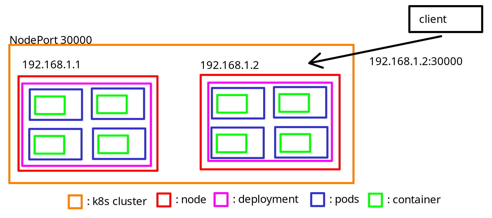

- LoadBalancer
  - buka akses ke app dari luar cluster via IP publik
  - scr otomatis meminta load balancer dari cloud provider (AWS, GCP, Azure, dsb) dan arahkan ke pod
  - cocok ketika app ingin bisa diakses dari public network/internet
  - ketika menggunakan k8s di dalam cloud provider
  
    ```yaml
    apiVersion: v1
    kind: Service
    metadata:
      name: my-app-loadbalancer
    spec:
      type: LoadBalancer
      selector:
        app: my-app
      ports:
        - port: 80        # port yg digunakan publik
          targetPort: 8080  # port di dalam container
    ```

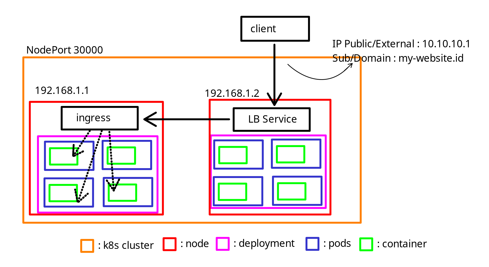

### Ingress Controller

- komponen k8s sbg gerbang masuk (gateway) u/ atur & kelola akses HTTP/HTTPS dari luar ke dalam cluster.
- kerja sama dengan objek `ingress`
- berisi aturan2 routing u/ app web

Jenis ingress controller:

- `NGINX`
  - stabil, luas dipakai, komunitas
  - terbatas expose : pada HTTP, HTTPS
- `Traefik`
  - `Let's Encrypt` -> salah satu SSL yang gratis
  - cocok u/ microservices
- `HAProxy`
  - performa tinggi, routing kompleks
  - dpt digunakan u/ expose bbg macam protokol termasuk ISO8583
- `Istio Gateway`
  - bagian service mesh, observability
  - cocok u/ enterprise besar, zero trust
- `Contour`
  - Envoy-based, ringan & modern

> ISO8583 -> menggunakan native TCP => digunakan antar mesin ATM ; seperti web socket tetapi lebih low level ; streaming connection

### (HANDSON) Expose app NGINX agar dapat diakses dari luar cluster

```bash
# step 0 : pastikan minikube sudah di-start (LIHAT HANDS-ON 1)

# lakukan apply ulang
minikube kubectl -- apply -f deployment.yml

# verifikasi
minikube kubectl -- get all

minikube kubectl -- get svc -w

# untuk assign public IP
minikube tunnel

# cek lagi IP ; maka sekarang load balancer akan punya external IP : localhost
minikube kubectl -- get svc -w

# lalu akses lewat web : localhost:80
```

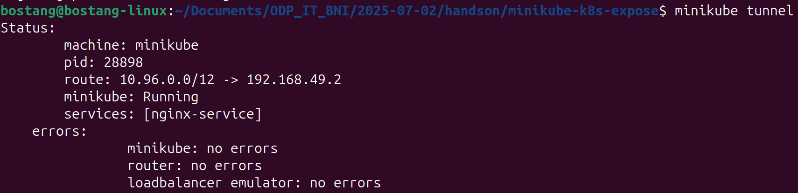

> | Properti          | Nilai                        |
> | ----------------- | ---------------------------- |
> | CIDR              | `10.96.0.0/12`               |
> | Subnet Mask       | `255.240.0.0`                |
> | Network Address   | `10.96.0.0`                  |
> | Broadcast Address | `10.111.255.255`             |
> | Host Range        | `10.96.0.1 – 10.111.255.254` |
> | Jumlah Host Valid | `1.048.574`                  |

`10.109.234.38` berada di dalam range host `CIDR`

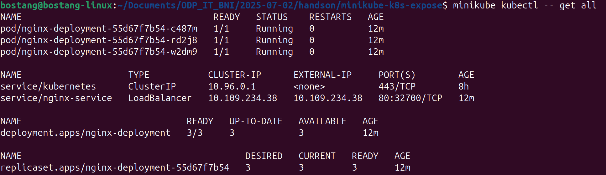

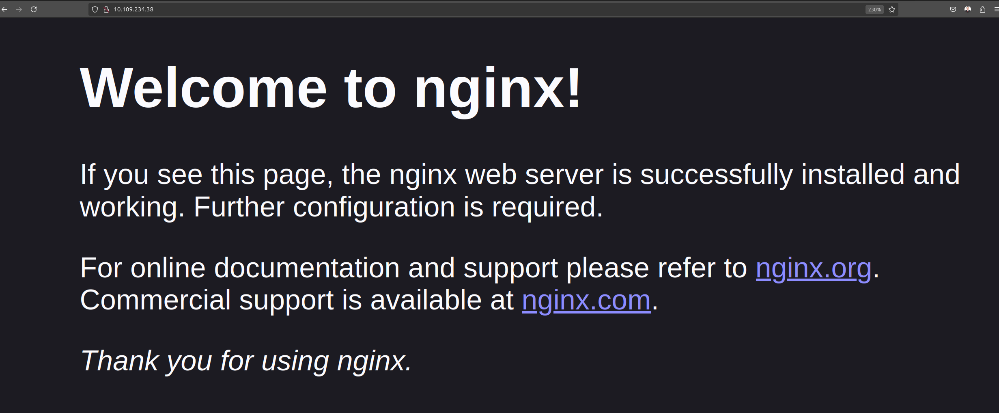

### ConfigMaps & Secrets

#### ConfigMap

objek u/ simpan konfigurasi app dlm bentuk pasangan `key-value` seperti variabel environment, file konfigurasi, atau argumen yg dipisahkan dari image aplikasi.

termasuk:

- `application.properties` dari `springboot`
- `nginx.config` pada `NGINX`,
- `inventory.ini` dari `Ansible`.

- memungkinkan kita u/ kelola konfigurasi scr fleksibel tanpa harus ubah/bangun ulang image container.
- biasa digunakan u/ atur _environment variable_ / mount file konfigurasi ke pod saat runtime.
- ConfigMap tdk dienkripsi sehingga **tdk cocok u/ simpan data sensitif spt password/token**.

Tujuan:

- pisahkan `config` dari `image` app
- permudah update `config` tanpa rebuild `image`
- digunakan u/:
  - env variable
  - file konfigurasi volume
  - argumen ke container

```yaml
apiVersion: v1
kind: ConfigMap
metadata:
  name: my-config
data:
  APP_ENV: "production"
  DB_HOST: "postgres-service"
  DB_PORT: "5432"
```

penggunaan `configMap` pada pods:

- sbg env variables:

```yaml
envFrom:
  - configMapRef:
      name: my-config
```

- sbg file mounting:

```yaml
volumes:
  - name: config-volume
    configMap:
      name: my-config
```

#### Secrets

objek di k8s u/ simpan data sensitif :

- password
- token API
- encryption key
- sertifikat TLS

`ConfigMap` -> konfigurasi biasa
`Secrets` -> informasi rahasia

Karakteristik secret : disimpan dalam `base64` (bukan terenkripsi, tetapi disamarkan)

base64 bukanlah metode enkripsi — hanya penyandian agar data bisa ditransmisikan dan dibaca sistem secara aman tanpa rusak.

Untuk benar-benar menjaga kerahasiaan, perlu digunakan enkripsi storage dan kontrol akses yang ketat.

solusi: gunakan 3rd party / external secret manager:

- 1Password
- HashiCorp Vault
- bitWarden
- AWS Secrets Manager
- GCP secret manager

```yaml
apiVersion: v1
kind: Secret
metadata:
  name: my-secret
type: Opaque
data:
  username: YWRTaW4=    # base64 dari 'admin'
  password: cGFzc3dvcmQxMjM=
```

option B:

`.env`

```conf
USERNAME=admin
PASSWORD=password123
```

```bash
kubectl create secret generic my-secret --from-env-file=.env
```

### (HANDSON) UPDATE INDEX.html dari server nginx

**Langkah 0** : Siapkan file `index.html` / folder `/templates`

**Langkah 1** : create configMap

```bash
minikube kubectl -- create configmap nginx-index --from-file=index.html

# jika beberapa file dalam satu folder
minikube kubectl -- create configmap nginx-index --from-file=templates/

# verifikasi
minikube kubectl -- get configmap
```

**Langkah 2** : ubah deployment.yml

```yaml
apiVersion: apps/v1
kind: Deployment
metadata:
  name: nginx-deployment
spec:
  replicas: 3
  selector:
    matchLabels:
      app: nginx
  template:
    metadata:
      labels: 
        app: nginx
    spec:
      containers:
      - name: nginx
        image: nginx:1.25
        ports:
        - containerPort: 80
########## TAMBHAKAN INI ##########
        volumeMounts:                         # mounting volume yg di-claim
          - name: html-volume
            mountPath: /usr/share/nginx/html
      volumes:                                # buat persistent volume
      - name: html-volume
        configMap:
          name: nginx-index
###################################
```

**Langkah 3** : terapkan manifest dan cek (akses via browser)

```bash
minikube kubectl -- apply -f deployment.yml

minikube kubectl -- get pods -w

```

tampilan web yang sudah berubah:

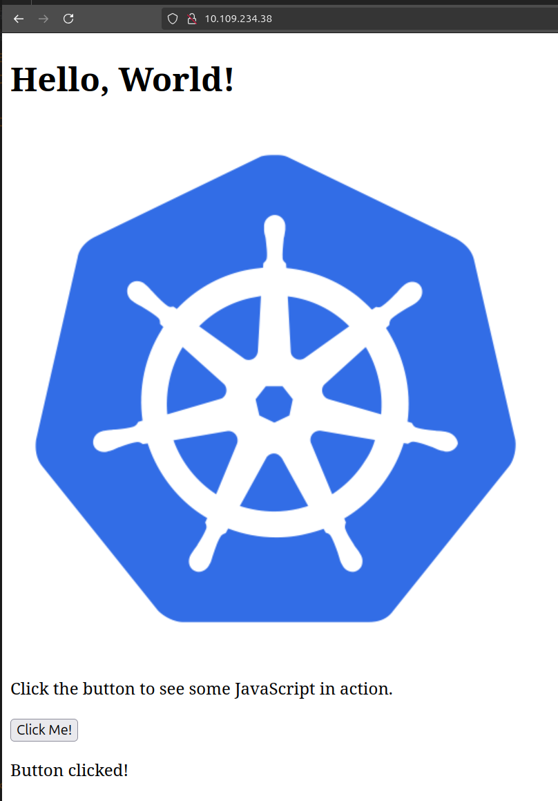

tampilan config file (edit):

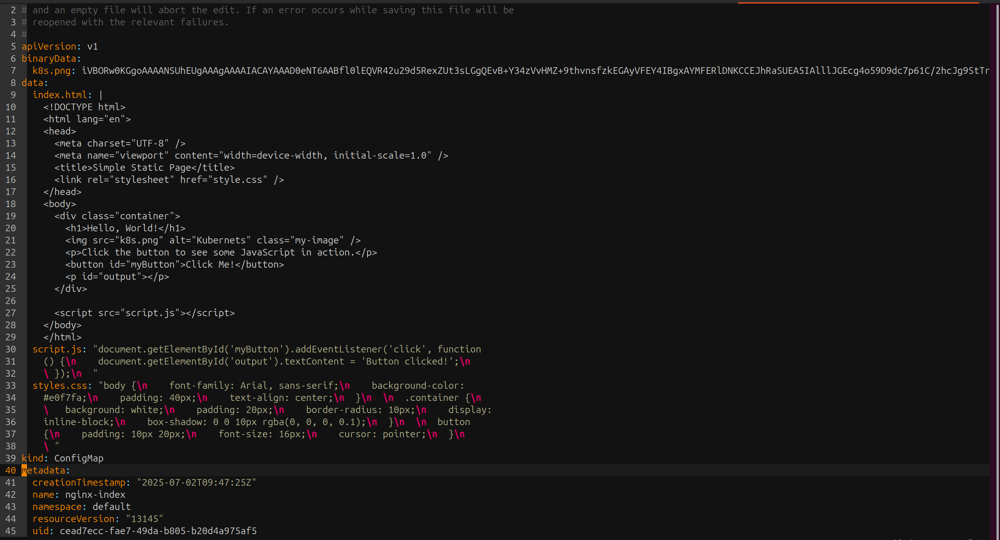

catatan:

dalam praktisnya, apabila ada file-file yang besar, disimpan di PVC (persistentVolumeClaim), bukan di configMap.

**Catatan Tambahan**:

```bash
# EDIT CONFIGMAP
# syntax:
  # kubectl edit configmap <configmap-name> -n <namespace>
minikube kubectl -- edit configmap nginx-index

# DELTE CONFIGMAP
# syntax:
  # kubectl delete configmap <configmap-name> -n <namespace>
minikube kubectl -- delete configmap nginx-index
```

---
[🏠Back to Course Lists](https://odp-bni-330.github.io/)
