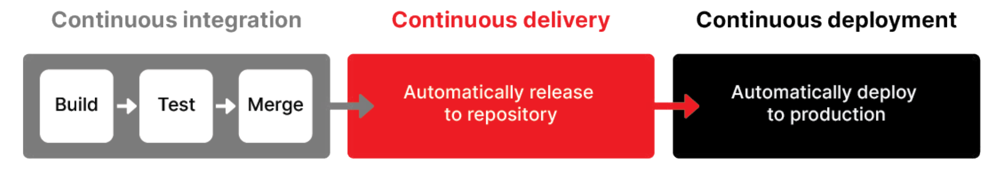
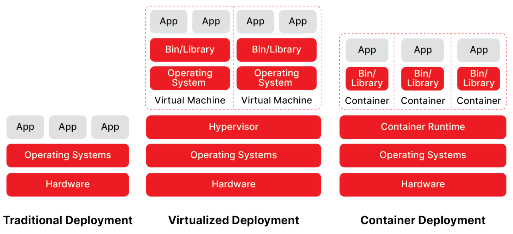
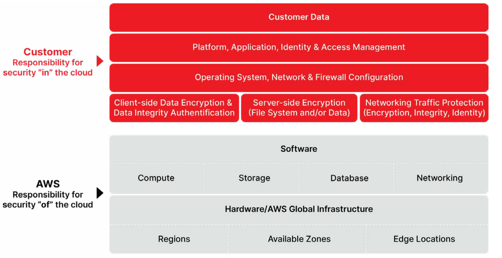
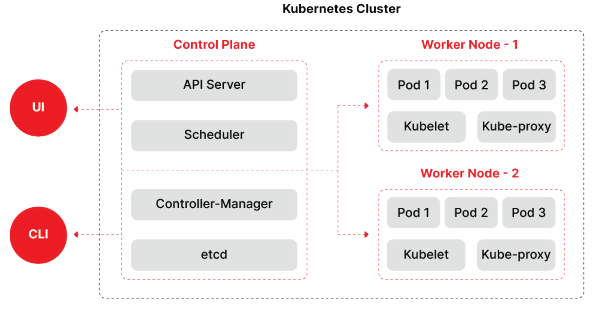

# K8s Security

[reference](https://go.crowdstrike.com/2025-kubernetes-security-ebook.html?utm_campaign=clod&utm_content=crwd-clod-apj-sea-en-psp-x-x-x-tct-x_x_x_x-x&utm_medium=sem&utm_source=goog&utm_term=kubernetes%20security&cq_cmp=17127402600&cq_plac=&gad_source=1&gad_campaignid=17127402600&gclid=CjwKCAjwsZPDBhBWEiwADuO6y2u1yDAFEZ8j40KmMb5RPYGhXcoN1qom5XlQjgt-9QaWjIRHctn9ThoCJ-MQAvD_BwE)

## Chapter 1 : Understanding Kubernetes and Its Place in Cloud-Native Architecture

inherent security advantages:

- isolation
- version control

nature that poses security challenges:

- distributed
- ephemeral

**CI-CD pipeline**:

**benefits of cloud-native architecture**:

- inherent scalability (horizontally). -> ensures :
  - optimal resource utilization,
  - cost-effectiveness
  - ability to handle varying workloads seamlessly

    microservices : decouple application components, making it easier to update,
    maintain and deploy specific parts of an application without affecting the entire system
- resilience and fault tolerance. -> ensuring high availability even in the face of infrastructure failures.
  - redundancy
  - failover mechanisms

Kubernetes -> container orchestration platform -> for managing numerous components in the cloud (microservices & containers) -> reduce human error

deploment models:

Containers : lightweight and portable

security challenges:

- securing communications between microservices,
- managing access controls and
- protecting sensitive data

security risks:

- Complex Access Controls
  - prone to misconfigurations
  - RBAC ; principle of least privilege
- Container Image Vulnerabilities
  - container image is meant to be immutable once it is deployed -> "patching" workflow not compatible
- Insecure Networks
  - controlling traffic between pods and services
  - proper network segmentation
  - restrictions of unnecessary communication paths
- Improper Secrets Management
  - encryption
  - secret rotation

## Chapter 2 : Initial Entry Points for Container Compromise

MITRE ATT&CK® framework : 3 common techniques attackers can use to compromise containers:

- **Exploit Public-Facing Application**
  - gain shell access to app/services over internet
- **External Remote Services**
  - leverage exposed Kubernetes services
  - some not require authentication
  - exposed Docker API
- **Valid Accounts**
  - valid cloud credentials obtained in various ways, such as phishing / exposure in a public code repository.

shared responsibility model : security responsibilities are shared among:

- the cloud provider
- platform operator
- application developer.

mindset of “trust, but verify.” : trust cloud providers to secure
their infrastructure, we are responsible  for:

- application security,
- network policies
- user access controls.

## Chapter 3 : Kubernetes Security Aligned to the Cloud- Native Application Development Life Cycles

k8s offer built-in security functionalities:

- namespace isolation,
- RBAC,
- network policies

need : layered approach, addressing both the orchestrator and the applications it manages.

k8s cluster consists of:

- **control plane**
  - managing the entire Kubernetes cluster
    - esource allocation,
    - manages workloads
    - ensures everything runs smoothly
  - components:
    - API Server: central communication hub
    - Controller Manager: Monitors the cluster’s health and ensures that everything is functioning as expected.
    - etcd: storage system of cluster’s configuration and state.
    - Scheduler: distribute workload between resources
- **worker nodes**
  - handle all of the actual processing and running of applications.
  - components:
    - Pods : smallest building blocks containing apps / services
    - Services: allow pod to communicate -> make available over network
    - Kubelet: ensure containers in each pod are running correctly and talks to the control plane
    - Kube-proxy: maintain networking rules -> communication between service & pods
    - Ingress: manages how external traffic, like HTTP and HTTPS requests, reaches services inside the cluster.

4 phases of cloud-native app dev :

- Develop
- Distribute
- Deploy
- Runtime

### Develop & Distribute Phases

implement security checkpoints in between development and deployment

**example attacks**:

- IaC Misconfigurations
  - assign overly broad permissions to an identity and access management (IAM) role
  - leave a cloud storage bucket open to the public
  - hard-coded secrets
  - unrestricted inbound/outbound network
- Typosquatting
  - typographical errors : malicious packages or containers with names that are very similar.
  - `ngnix` vs `nginx`
- Compromising Source Code Repositories
  - exploiting weak passwords
  - gaining the trust of the open-source community
  - phishing attacks to steal credentials
  - exploiting vulnerabilities in the repository hosting service

**Security Solution Reccomendations**:

- Develop Life Cycle Phase
  - test security policies
  - secure IaC configurations ; IaC scans
  - code review process
- Distribute Life Cycle Phase
  - run the latest stable version of k8s
  - verify the source of packages before install
  - use trusted repositories & official sources
  - strict naming policies
  - automated tools to scan for and detect malicious packages
  - Scan container images and check the results against pipeline compliance rules
  - use up to date images
  - use minimized base container images or empty if possible
  - up to date with vulnerabilites patches
  - Periodically re-scan container

### Deploy & Runtime Phases

security monitoring components: compute, access and storage.

implement continuous, real-time security monitoring at runtime.

advanced response capabilities

**example attacks**:

- Sidecar Container Injection
  - secondary containers that run alongside the main application container to extend its functionality without altering the logic of the main application container.
  - attacker can either manipulate the functionality of an existing sidecar container or inject their own, allowing them to avoid deploying a new pod in the cluster.
- Denial-of-Service (DoS) Attack with a Fork Bomb
  - process continually replicates itself to deplete system resources, leading to a system crash
- Attacking the API Server
  - search for publicly available, unauthenticated kubelet APIs using freely available tools, such as Shodan

**Security Solution Reccomendations**:

- Develop Life Cycle Phase
  - secure k8s network policies
  - Encrypt traffic
  - use the image sha256 hash
  - Set namespaces to isolate Kubernetes resources
  - use container-optimized operating systems
  - admission controller ImagePolicyWebhook
  - Open Policy Agent (OPA) to enforce centralized policy management
  - security context to pods and containers with the principle of least privilege
  - Block access to network ports and limit access to the Kubernetes API server
  - update the source image and redeploy the containers (don't update directly container)
  - create separate namespaces for different applications & environments
  - Verify the integrity of any artifacts
  - Restrict service accounts used by applications
  - Apply restrictive Pod Security Standards to limit what containers can do within the cluster
  - hardening your Kubernetes nodes : disabling unused services, security patches, use minimal and secure base images
  - check changes/regression in CI/CD pipeline
- Runtime Life Cycle Phase
  - Design Zero Trust into the architecture of microservices
  - Configure containers to use read-only root file systems
  - use container-optimized operating systems
  - Define short lifetimes for certificates and automate rotation
  - Define resource limits and quotas for CPU and memory
  - Pod Security Standards
  - Prevent ServiceAccount’s API credentials from being automounted
  - multi-tenant : practice container sandboxing or isolate running containers from the host kernel
  - Prevent containers from loading unwanted kernel modules -> SELinux
  - Leverage an external storage plugin that encrypt volumes
  - authentication mechanisms between cluster nodes
  - review Kubernetes Security Checklist
  - advanced container security solution that can monitor for any threats or vulnerabilities at runtime
  - Track runtime activity across pods
