<!-- Dirangkum oleh : Bostang Palaguna -->
<!-- Juli 2025 -->

# Kubernetes

## Kubernetes Security Best Practices

### Kubernetes RBAC

role-based access control

RBAC ➡️ mekanisme u/ atur izin akses pengguna / komponen sistem thd resource di dalam kluster k8s bdskan _role_ yg dimiliki

atur : **siapa** yg boleh lakukan **apa** thd **_resource_** di dlm cluster.

membuat user baru namun dengan akses terbatas:

- hanya bisa create pods
- hanya bisa view pods
- ...

contoh:

- Dev : hanya bisa lihat `pod` di `namespace_1`
- Admin : boleh atur semua _resources_ di seluruh cluster.

why penting?

- jaga keamanan resources ➡️ batasi akses hanya yg diperlukan.
- dukung _principle of least privilege_
- manajemen akses berbasis _role_ / _group_

Komponen:

- **Role** : permission di 1 _namespace_
- **ClusterRole** : permission berlaku di 1 _cluster_
- **RoleBinding** : mengaitkan role ke user / group di 1 _namespace_
- **ClusterRoleBinding** : mengaitkan ClusterRole ke user/group di 1 _cluster_

RBAC : cluster-scope , namespace-scope;

> simplenya, namespace ini adalah satu folder

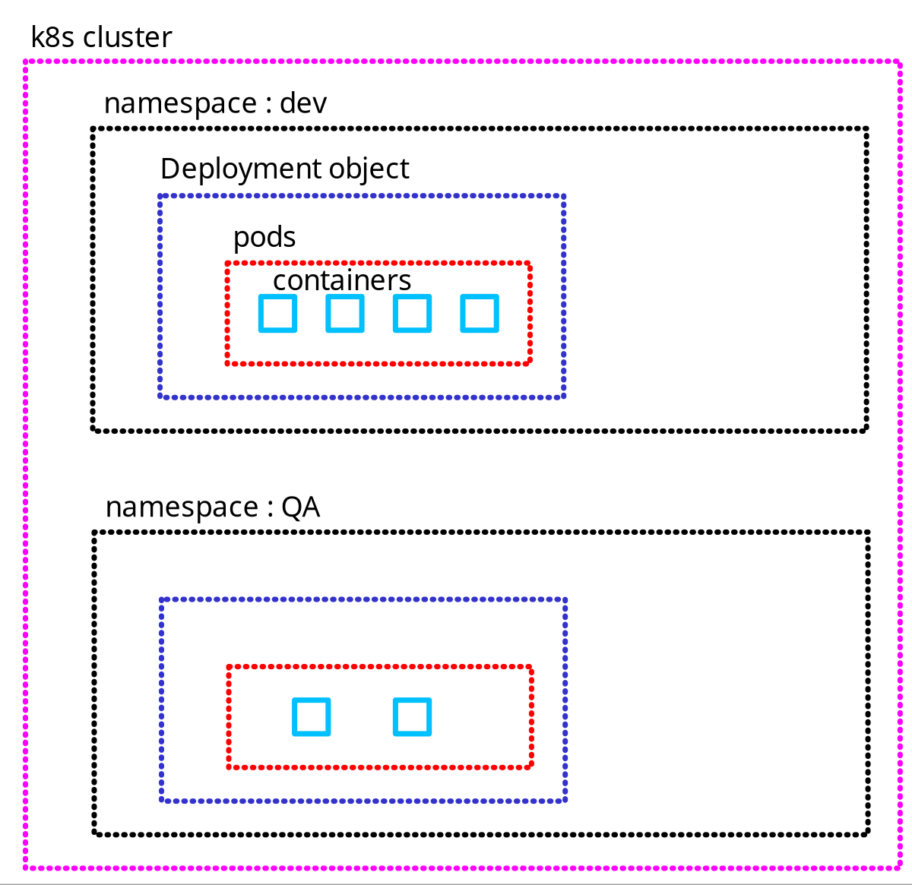

- `resources`:
  - `pods`
  - `deployments`
  - `services`
  - `configMaps`
  - `secrets`
  - `persistentVolumes`
  - `persistentvolumeClaims`
  - `daemonsets`
  - `events`
  - `endpoints`
  - `horizontalpodautoscalers`
  - `ingress`
  - `jobs`
  - `limitranges`
  - `namespacs`
  - `nodes`
  - `resourcequotas`
  - `replicasets`
  - `replicaactioncontrollers`
  - `services`
  - `serviceaccounts`
  - ...
- permissions / `verbs`:
  - `list`
  - describe : `get` , `watch`
  - `create`
  - `delete`
  - `patch` : utk perubahan kecil
  - `update` : utk sesuatu yg masif

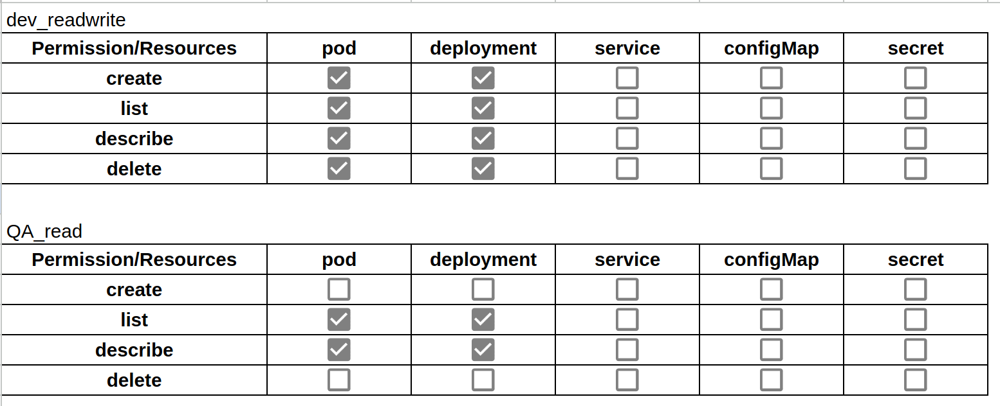

- Role

```yaml
apiVersion: rbac.authorization.k8s.io/v1
kind: Role
metadata:
  namespace: dev
  name: pod-reader
rules:
- apiGroups: [""]     # isi dengan apiVersion dari namespace (misal: apps/v1)
  resources: ["pods"]
  verbs: ["get", "list", "watch"]
```

- RoleBinding

```yaml
apiVersion: rbac.authorization.k8s.io/v1
kind: RoleBinding
metadata:
  name: read-pods
  namespace: dev
subjects:
- kind: User
  name: jane
  apiGroup: rbac.authorization.k8s.io
roleRef:
  kind: Role
  name: pod-reader      # refer ke 'name' dari metadata role
  apiGroup: rbac.authorization.k8s.io
```

maka `jane` berhasil diassign ke role `pod-reader` yang mampu melakukan operasi `get`, `list`, dan `watch` pada resource `pods` di dalam namespace `dev`.

Cara k8s melakukan autentikasi : menggunakan `client-certificate` & `client-key`. Selain itu, bisa juga menggunakan `token`

`kubectl` ➡️ `kubeconfig`

```bash
# dpt dilihat di:
minikube kubectl -- config view
```

### Network Policies

objek API u/ kontrol traffic antar pod dalam 1 _namespace_.

by default, setiap container bisa saling komunikasi dlm 1 cluster.
Setelah ada network policies, hanya komunikasi yg di-define scr eksplisit.

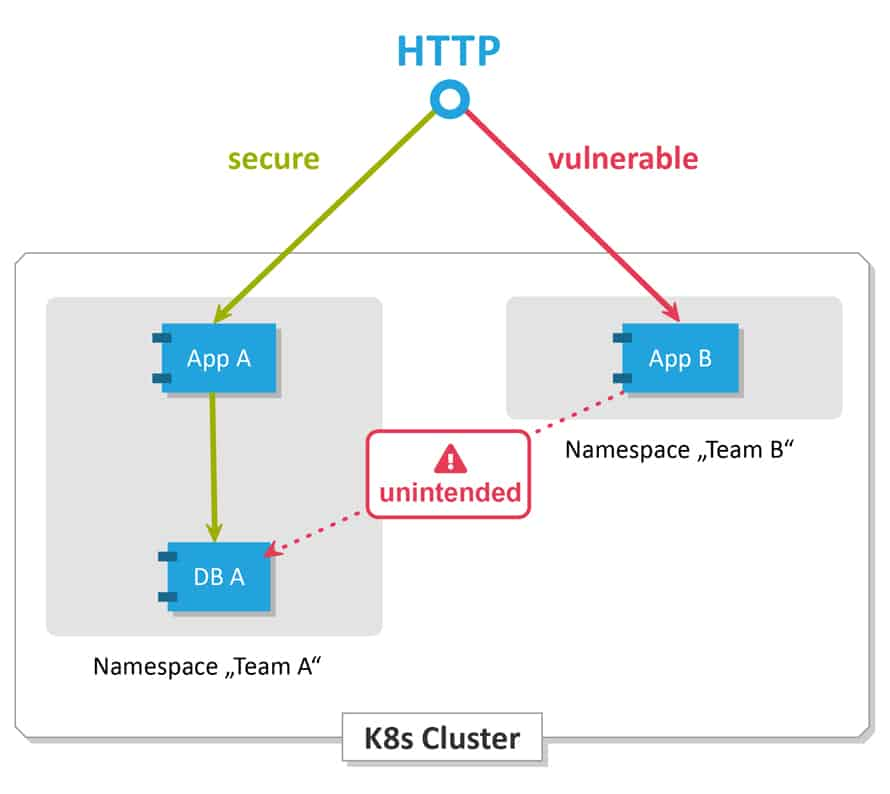

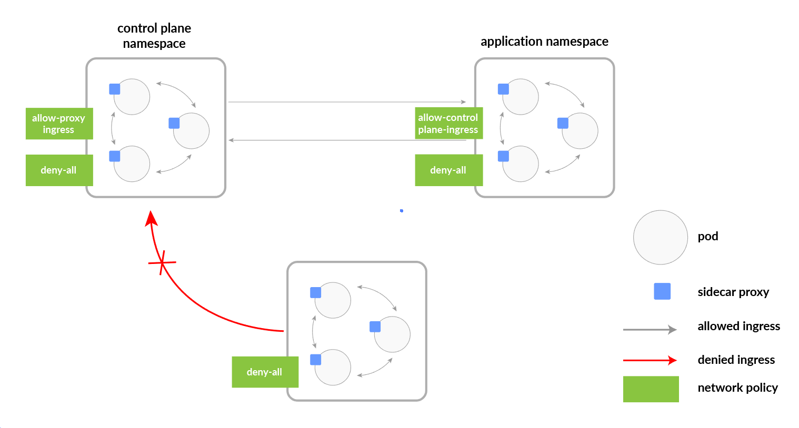

> [bacaan tambahan](https://k21academy.com/docker-kubernetes/network-policies-in-kubernetes/)

Konsep Dasar:

| **Konsep**         | **penjelasan**                      |
| :----------------- | :---------------------------------- |
| Pod selector       | tentukan pod mana yg dikenai policy |
| Ingress            | aturan u/ traffic masuk pod         |
| Egress             | aturan u/ traffic keluar pod        |
| Namespace selector | tentukan namespace asal traffic     |
| IP block           | atur akses berbasis IP              |

- NetworkPolicy hanya efektif jika CNI plugin (Calico, Cilium) yg dipakai support.
- Policy bersifat aditif : jika tdk ada policy, semua traffic boleh. Jika ada, hanya aturan yg boleh lewat.

contoh policy ingress

label selector dgn nama `web` diatur hanya bisa diakses dgn label `frontend`

```yaml
# ...
spec:
  podSelector:
    matchLabels:
      app: web
    policyTypes:
    - Ingress
    ingress:
    - from:
      - podSelector:
          matchLabels:
            app: frontend
# ...
```

contoh policy egress

```yaml
# ...
spec:
  podSelector:
    matchLabels:
      app: web
    policyTypes:
    - Egress
    egress:
    - to:
      - podSelector:
          matchLabels:
            app: database
# ...
```

### (HANDSON) RBAC

#### Deskripsi

Menerapkan prinsip least privilege dengan memisahkan hak akses tim agar hanya bisa mengakses namespace masing-masing.

namespace:

- `dev`
- `qa`

#### Tahapan HANDSON

**Langkah 0** : Nyalakan container `minikube`

```bash
# mulai k8s cluster
minikube start --driver=docker --cpus=2 --memory=2048

# verifikasi sudah running
minikube status
```

**Langkah 1** : Buat namespace baru

```bash
# buat namespace
minikube kubectl -- create namespace dev    # developer
minikube kubectl -- create namespace qa     # QA

# verifikasi
minikube kubectl -- get namespace qa
```

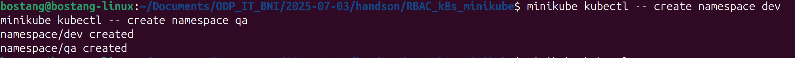

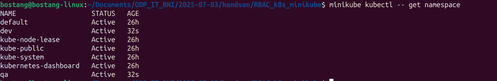

**Langkah 2** : Buat service account (SA)

sebagai user credential dari sisi aplikasi

```bash
# buat service account `sa-developer` di dalam namespace `dev`
minikube kubectl -- create serviceaccount sa-developer -n dev

# buat service account `sa-qa` di dalam namespace `qa`
minikube kubectl -- create serviceaccount sa-qa -n qa

# validasi
# lihat service account di namespace qa
minikube kubectl -- get sa -n qa
# lihat service account di namespace dev
minikube kubectl -- get sa -n dev
# lihat service account di semua namespace
minikube kubectl -- get sa -A
```

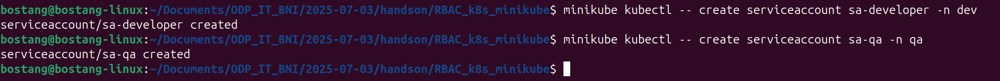

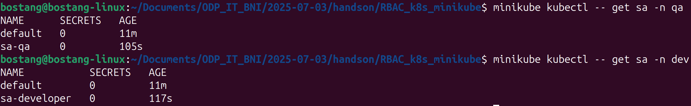

Langkah 3 : buat `dev-role.yml` , `dev-rolebinding.yml`, `qa-role.yml`, `qa-rolebinding.yml`

- `dev-role.yml`

```yaml
apiVersion: rbac.authorization.k8s.io/v1
kind: Role
metadata:
  name: dev-pod-reader
  namespace: dev
rules:
- apiGroups: [""]
  resources: ["pods"]
  verbs: ["*"]
```

- `dev-rolebinding.yml`

```yaml
apiVersion: rbac.authorization.k8s.io/v1
kind: RoleBinding
metadata:
  name: bind-dev-sa
  namespace: dev
subjects:
- kind: ServiceAccount
  name: sa-developer
  namespace: dev
roleRef:
  kind: Role
  name: dev-pod-admin
  apiGroup: rbac.authorization.k8s.io
```

- `qa-role.yml`

```yaml
apiVersion: rbac.authorization.k8s.io/v1
kind: Role
metadata:
  name: qa-pod-reader
  namespace: qa
rules:
- apiGroups: [""]
  resources: ["pods"]
  verbs: ["get", "list", "watch"]
```

- `qa-rolebinding.yml`

```yaml
apiVersion: rbac.authorization.k8s.io/v1
kind: RoleBinding
metadata:
  name: bind-qa-sa
  namespace: qa
subjects:
- kind: ServiceAccount
  name: sa-qa
  namespace: qa
roleRef:
  kind: Role
  name: qa-pod-reader
  apiGroup: rbac.authorization.k8s.io
```

**Langkah 4** : apply 4 manifest service yang telah dibuat

```bash
# langsung apply seluruh konfigurasi yg ada di dalam 1 folder
    # lebih efisien dari melakukan satu per satu (4x)
        # minikube kubectl -- apply -f dev-role.yml
        # minikube kubectl -- apply -f dev-rolebinding.yml
        # minikube kubectl -- apply -f qa-role.yml
        # minikube kubectl -- apply -f qa-rolebinding.yml
minikube kubectl -- apply -f .
```

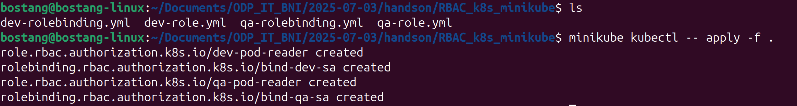

**Langkah 5** : Uji Akses

```bash
minikube kubectl -- auth can-i list pods --as=system:serviceaccount:qa:sa-qa -n qa

# bisa juga dipecah ke dalam bbrp baris
minikube kubectl -- auth can-i delete pods \
 --as=system:serviceaccount:qa:sa-qa -n qa

# dst..

# describe roles di suatu name-space
minikube kubectl -- describe roles qa-pod -n qa

##### MENGGUNAKAN SCRIPT #####
chmod +x cek-akses.sh   # agar executable
./cek-akses.sh
```

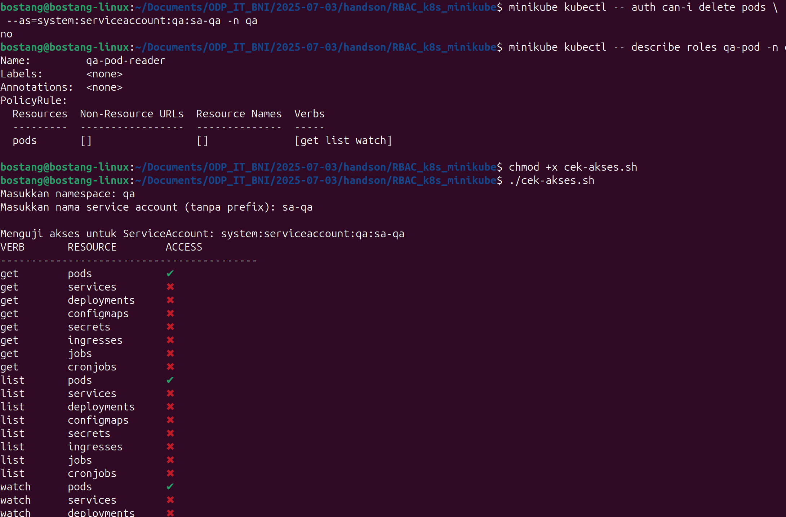

## Monitoring & Logging

### Observability

kemampuan u/ dptkan visibilitas menyeluruh thd sistem yg jalan di cluster k8s :

- perilaku app,
- performa infras,
- alur komunikasi antar komponen.

memungkinkan kita u/ pantau kondnisi sistem, diagnosis masalah, memastikan app berjalan scr efisien di lingkungan yg dinamis & terdistribusi

`Kube-Prometheus Stack` : stack observability berbasis `Prometheus` u/ monitoring k8s ➡️ monitoring, alerting, visualisasi ➡️ dikemas dalam 1 `Helm Chart`

Komponen

Tujuan Observability:

- pantau kesehatan & performa cluster k8s
- pantau resource usages (CPU, memory, network, storage)
- alserting saat gangguan
- integrasi end-to-end dgn dashboard Grafana

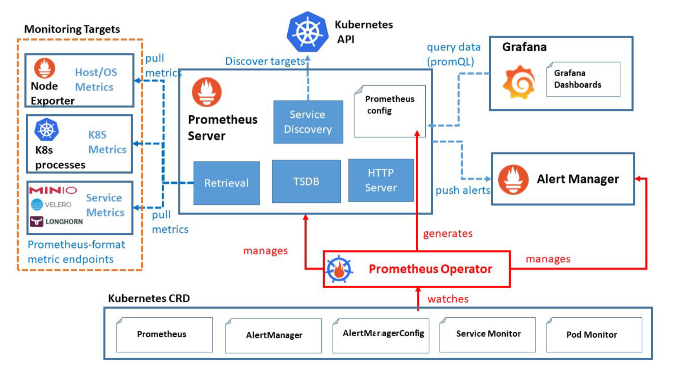

#### Helm

- package manager u/ k8s
- mirip `apt` u/ Ubuntu atau `yum` di CentOS
- memudahkan u/ instalasi, kelola, update package

### (HANDSON) Helm Kube Prometheus

**Tujuan** : enggunakan Helm untuk melakukan instalasi pada Kube Prometheus Stack

#### Langkah HANDSON

**Langkah 0** : [Instalasi Helm](https://helm.sh/docs/intro/install/)

Berikut adalah langkah instalasi u/ linux Ubuntu:

```bash
# download dari https://github.com/helm/helm/releases

wget https://get.helm.sh/helm-v3.18.3-linux-amd64.tar.gz


#### cek keaslian package (checksum) ####
# syntax:
    # echo "[CHECKSUM_BENAR_DARI_WEBSITE] [nama_file].tar.gz" | sha256sum --check

echo "6ec85f306dd8fe9eb05c61ba4593182b2afcfefb52f21add3fe043ebbdc48e39  helm-v3.18.3-linux-amd64.tar.gz" | sha256sum --check

# output:
    # helm-v3.18.3-linux-amd64.tar.gz: OK

# unpack
tar -zxvf helm-v3.18.3-linux-amd64.tar.gz

# pindahkan ke lokasi terstandard (/usr/local/bin/helm)
    # agar bisa langsung diakses lewat terminal dengan `helm`
sudo mv linux-amd64/helm /usr/local/bin/helm

helm version  # cek versi terinstall
```

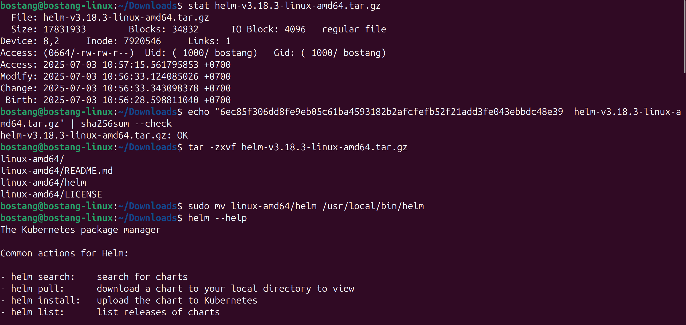

**Langkah 1** : Install kube prom stack

```bash
# menambah repository target
helm repo add prometheus-community https://prometheus-community.github.io/helm-charts
helm repo update        # update repository

# menginstall
helm install prom-stack prometheus-community/kube-prometheus-stack

# verifikasi
minikube kubectl -- get all -A | grep prom-stack


```

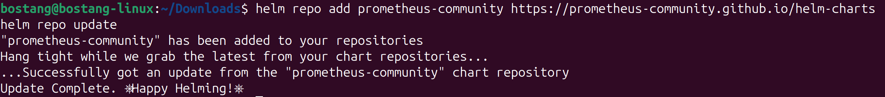

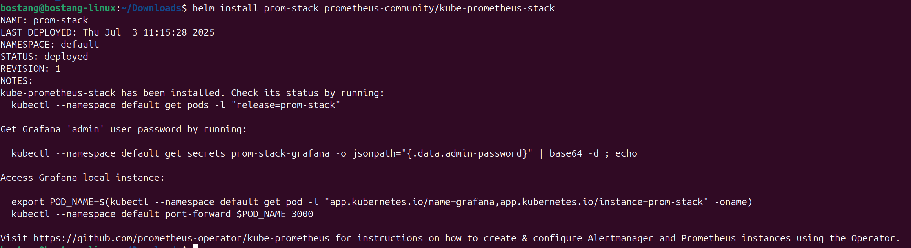

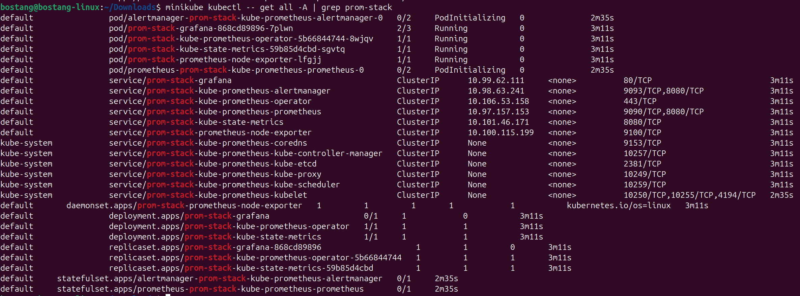

**Langkah 2** : Port Forward

```bash
# cek namespace
minikube kubectl -- get namespace

# cek status pod
kubectl --namespace default get pods -l "release=prom-stack"
# contoh output:
    # NAME                                                   READY   STATUS    RESTARTS   AGE
    # prom-stack-kube-prometheus-operator-5b66844744-8wjqv   1/1     Running   0          11m
    # prom-stack-kube-state-metrics-59b85d4cbd-sgvtq         1/1     Running   0          11m
    # prom-stack-prometheus-node-exporter-lfgjj              1/1     Running   0          11m

# atau dapat dilakukan dengan:
minikube kubectl -- get pods

# APABILA TERINSTALL DI namespace `observability` :
minikube kubectl -- port-forward service/prom-stack-grafana -n observability 3001:80

# APABILA TERINSTALL DI namespace `default` :

minikube kubectl -- port-forward service/prom-stack-grafana 3001:80
```

**Langkah 3** : Akses dashboard di `localhost:3001`

lihat password dengan jalankan di terminal:

```bash
kubectl --namespace default get secrets prom-stack-grafana -o jsonpath="{.data.admin-password}" | base64 -d ; echo

# contoh output : prom-operator
```

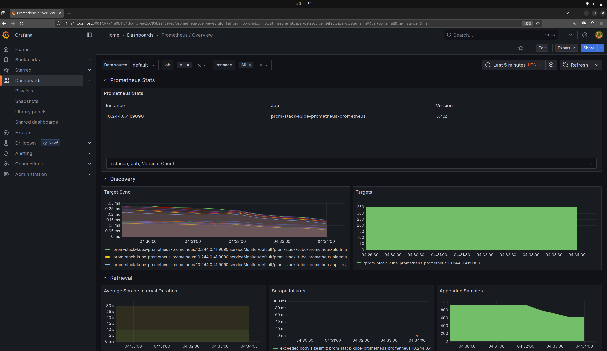

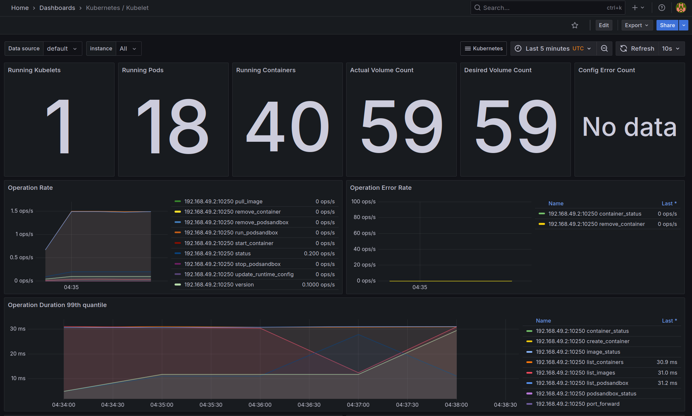

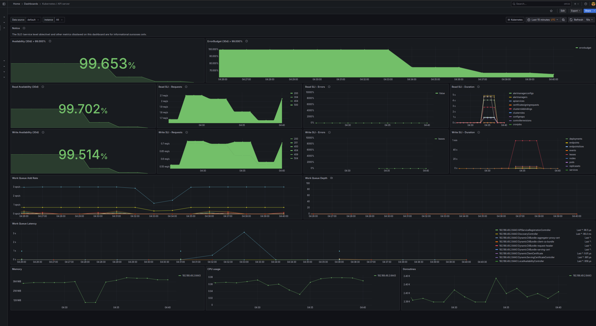

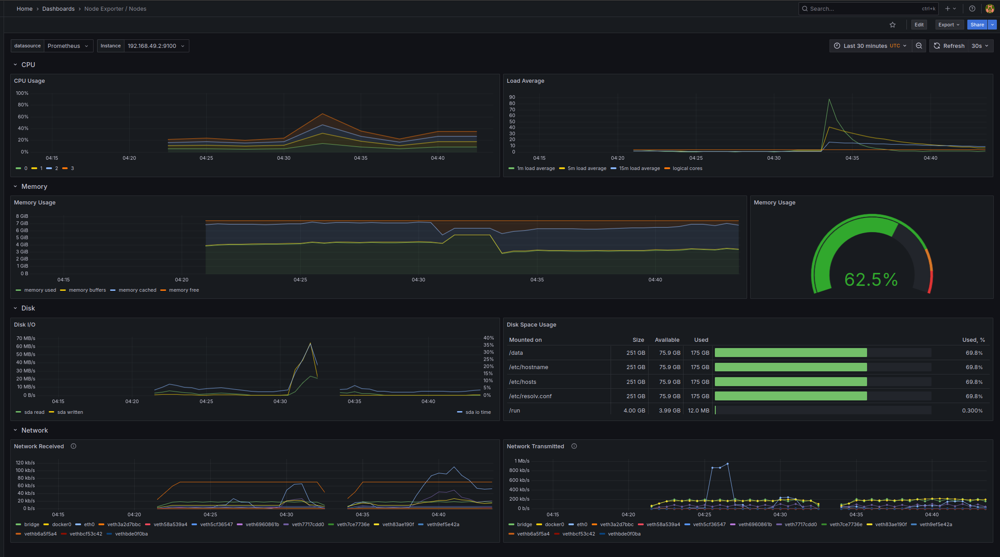

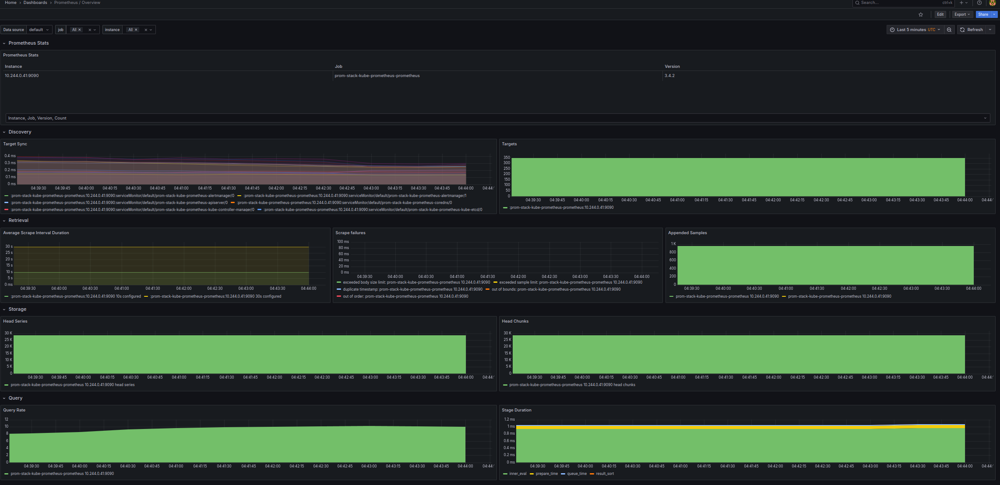

## Troubleshooting K8s Deployment

### Debugging pods

butuh pemahaman terkait komponen2 K8s : pod lifecycle, kubelet, dll.

creating docker:

- pulling image
- distribusi image ke node
- node mencoba menjalankan

**Status pod**:

- `Creating` ➡️ saat pertama kali dijalankan
- `Pending` ➡️ Belum dijadwalkan ke node
- `Running` ➡️ sdh jalan
- `Succeeded` ➡️ selesai tnp error
- `Failed` ➡️ gagal
  - penyebab:
    - ada konfigurasi kurang
    - network
    - dll.
- `CrashLoopBackOff` ➡️ crash terus2an
  - penyebab:
    - konfigurasi environment yg salah
    - volume mount gagal
    - service dependency tdk ada
    - error pada app (seperti : NullPointerException)

K8s baru memberi traffic kalau statusnya `Running` dan lulus `HealthCheck`

**General Error**:

- ImagePullBackOff
  - gagal pull. akibat nama image salah, tdk bisa akses image privat

```bash
kubectl describe pod <pod_name>
kubectl create secret docker-registry regcred \
  --docker-server=<server> \
  --docker-username=<username> \
  --dokcer-password=<password> \
  --docker-email=<email>
```

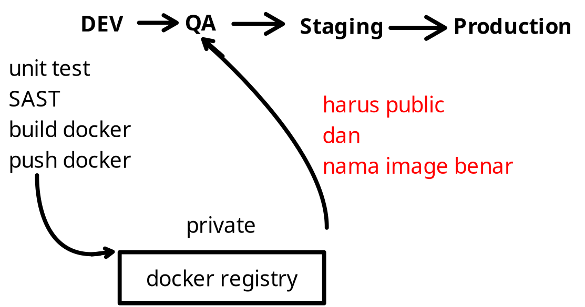

- Crash Loop Backoff
  - app crash karena error
  - solusi:
    - cek log
    - perbaiki config `/secret/env`
    - tambah backoff limit pada YAML deployment
      - `restartPolicy: OnFailure`
  - cara cek log:
    - melalui `minikube dashboard`
      - `pods > ... > logs`
    - `ssh` ke dalam pods
      - `pods > ... > exec`
    - melalui terminal

```bash
minikube kubectl -- get pods      # untuk melihat nama pods

# sintaks:
  # minikube kubectl logs [nama-pods]

minikube kubectl -- logs nginx-deployment-86855b595f-dlw96 -f   # -f : mode follow

minikube kubectl -- logs --help   # list argument yg bisa diberikan pada command `logs`
```

- OOMKilled
  - memori container melebihi batas
  - solusi: set resource limit yg dipakai

```yaml
resources:
  limits:             # membatasi jumlah maksimal resource yang akan digunakan
    memory: "512Mi"
  requests:           # alokasi awal terhadap resource yang akan dibutuhkan oleh pods
    memory: "256Mi"
```

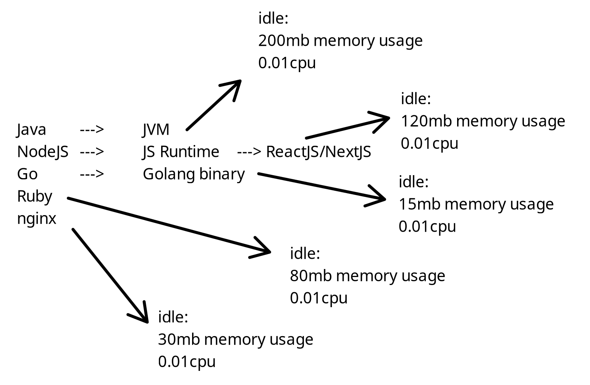

### (HANDSON) App deployment dengan K8s

#### Instruksi

DEPLOY APP SPRINGBOOT + DB di app local + aplikasi load balancer -> tunnel supaya bisa diakses lewat localhost dan bisa test via postman

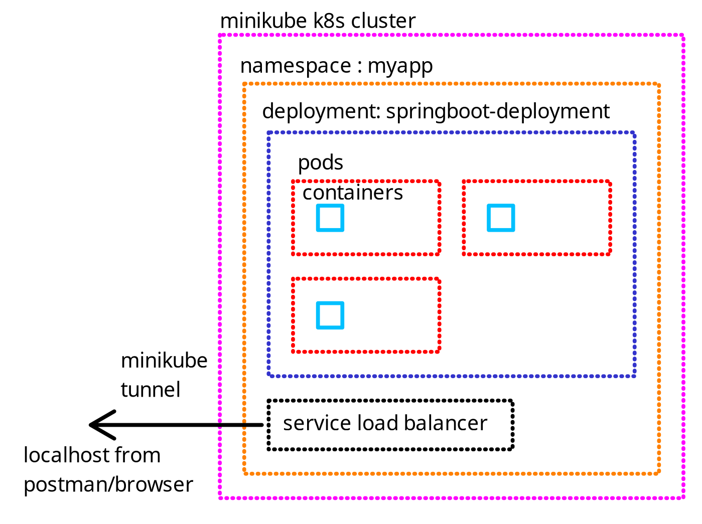

#### Langkah

**Langkah 1** : Siapkan aplikasi SpringBoot starter (simple, tanpa koneksi DB)

```bash
# pindah ke direktori springboot-app
# setelah melakukan development:
./mvnw clean install    # agar dihasilkan .jar yang akan di-consume Dockerfile
```

**Langkah 2** : Build docker image & push ke DockerHub

- 2.1 Buat `Dockerfile`

```Dockerfile
# Menggunakan image Java yang ringan
FROM openjdk:21-jdk-slim

# Set folder kerja di dalam container
WORKDIR /app

# Copy file jar ke folder kerja container
COPY demo-0.0.1-SNAPSHOT.jar app.jar

# Expose port Spring Boot default
# PORT ini yg akan dipakai di deployment.yml nanti
EXPOSE 8080     

# Jalankan aplikasi Spring Boot
ENTRYPOINT ["java", "-jar", "app.jar"]
```

- 2.2 Push ke `DockerHub`

```bash
# Login docker
docker login

# build Docker Image
docker build .    # secara otomatis mencari Dockerfile

# tagging Docker Image
  # provide an image with a memorable name
  # syntax:
    # docker tag <username-dockerhub>/<nama-image>:<tag>
docker tag demo-app titoalexsta/demo-app:latest

# push ke Docker Hub
docker push titoalexs/demo-app:latest

# pull dari Docker Hub (lakukan pada devais lain)
docker pull titoalexsta/demo-app:latest
```

**Langkah 3** : Gunakan image untuk dideploy di Minikube (local cluster)

3.1 buat `deployment.yml` yang berisi `springboot-deployment` dan `springboot-service` (LoadBalancer)

```yaml
apiVersion: apps/v1
kind: Deployment
metadata:
  name: springboot-deployment
spec:
  replicas: 3
  selector:
    matchLabels:
      app: springboot
  template:
    metadata:
      labels: 
        app: springboot
    spec:
      containers:
      - name: springboot
        image: titoalexsta/demo-app:latest
        ports:
        - containerPort: 8080

---

apiVersion: v1
kind: Service
metadata:
  name: springboot-service
spec:
  type: LoadBalancer
  selector:
    app: springboot
  ports:
    - port: 80          # yang diakses dari localhost
      targetPort: 8080    # masuk ke port container (container port)
      protocol: TCP
```

3.2 apply manifest `deploment.yml`

```bash
minikube kubectl -- apply -f deployment.yml

# cek status pods
  # tunggu sampai pod springboot ready
minikube kubectl -- get pods -w
```

**Langkah 4** : Expose service ke load balancer

```bash
# lakukan portforwarding ke sebuah IP (port 8090)
minikube kubectl -- port-forward deployment.apps/springboot-deployment 8090:8080

# cek IP dari load balancer
minikube kubectl -- get service

# CONTOH OUTPUT:
# NAME                                      TYPE           CLUSTER-IP       EXTERNAL-IP      PORT(S)                      AGE
# ...
# springboot-service                        LoadBalancer   10.110.221.186   10.110.221.186   80:31194/TCP                 8m54s
```

**Langkah 5** : Akses dari Postman / Browser

akses `10.110.221.186`

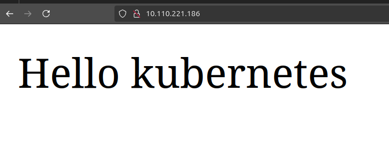

> **Catatan**:
> Agar bisa menambahkan gambar / customize HTML, ubah di :
> /resources/static/
> bisa tambahkan index.html, styles.css, script.js

---
[🏠Back to Course Lists](https://odp-bni-330.github.io/)
