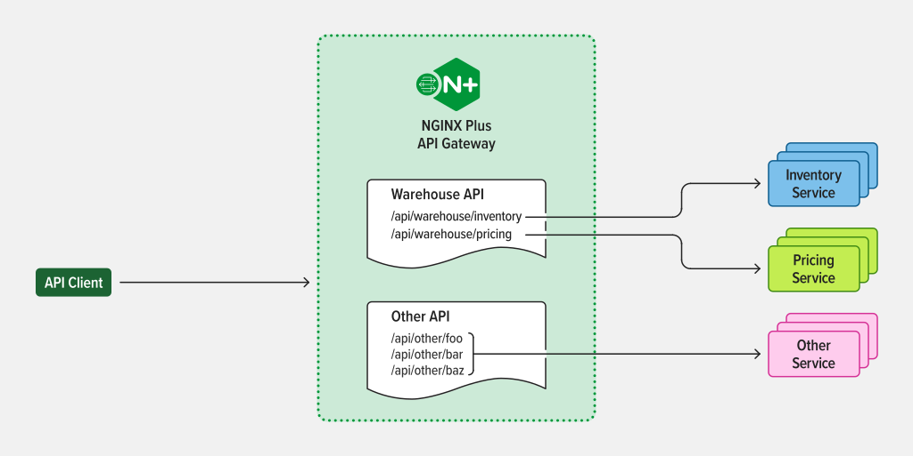
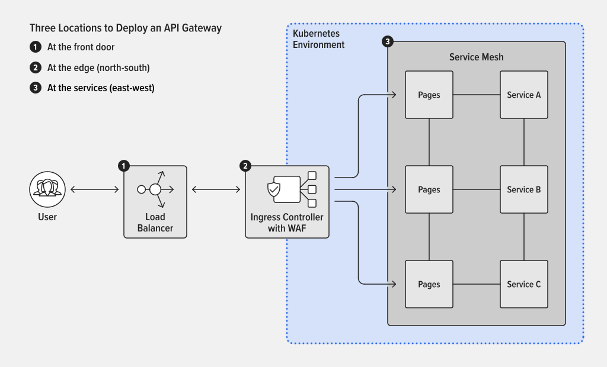
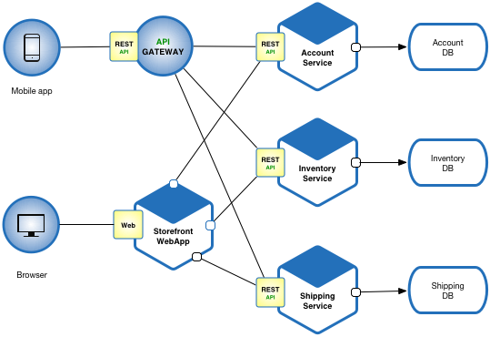
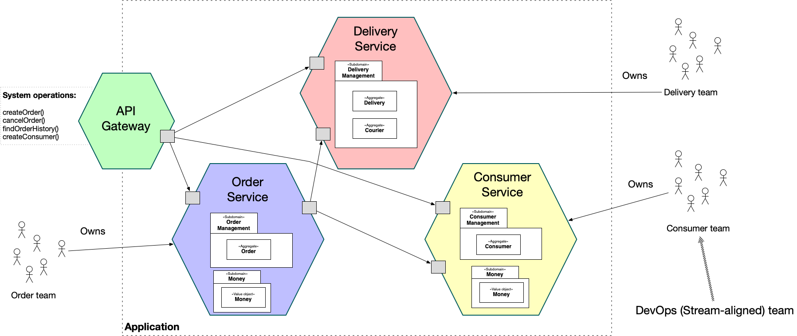
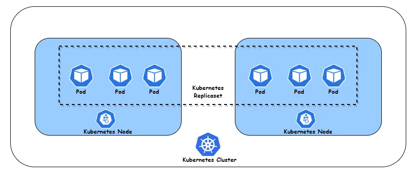
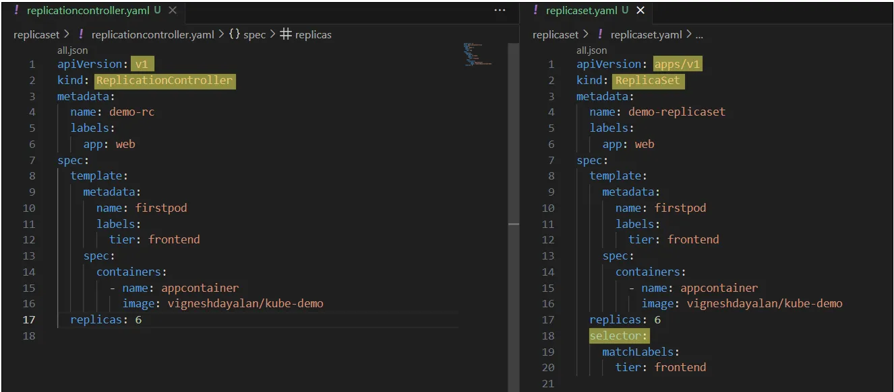
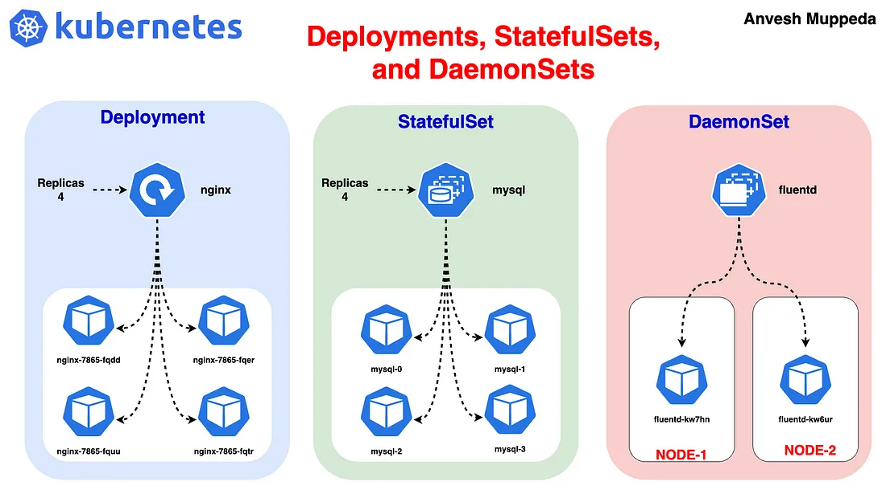

# Catatan Tambahan

## API Gateway

An API gateway accepts API requests from a client, processes them based on defined policies, directs them to the appropriate services, and combines the responses for a simplified user experience. Typically, it handles a request by invoking multiple microservices and aggregating the results. It can also translate between protocols in legacy deployments.

API gateways commonly implement capabilities that include:

- **Security** policy – Authentication, authorization, access control, and encryption
- **Routing** policy – Routing, rate limiting, request/response manipulation, circuit breaker, blue-green and canary deployments, A/B testing, load balancing, health checks, and custom error handling
- **Observability** policy – Real-time and historical metrics, logging, and tracing

bentukan API gatway: aplikasi juga

kalau Load Balancer & F5 : dapat berupa hardware atau software

- Free:
  - [Zuul](https://github.com/Netflix/zuul) -> Java
  - [Spring Cloud Gateway](https://spring.io/projects/spring-cloud-gateway)
  - [KrakenD](https://www.krakend.io/?gad_source=1&gad_campaignid=20256404369&gclid=Cj0KCQjw1JjDBhDjARIsABlM2Su3ok0tA5ErjluUD4hkER4VEbl8Kne-EOUsCcIddbck-EoqN-LojFAaAhTuEALw_wcB) -> Go
  - [TYK](https://tyk.io/) -> Go
  - [APISIX](https://apisix.apache.org/) -
- Paid:
  - [KONG](https://konghq.com/products/kong-gateway)
  - [TYK](https://tyk.io/)
  - [GCP-Gateway](https://cloud.google.com/api-gateway/docs)

[referensi](https://www.f5.com/glossary/api-gateway)





## Microservices





## ReplicationController vs ReplicaSets



[referensi](https://medium.com/@vigneshdayalan/achieving-high-availability-with-kubernetes-meet-replication-controllers-and-replicasets-1941e38cf057)

Replication Controller: Ensuring Continuity

These controllers automate the task of creating and maintaining multiple PODs



Create Kubernetes objects from configuration files:

```bash
#  Create a Kubernetes object from a file.
kubectl create -f <FileName.yml>
```

ReplicaSet Commands:

```bash
# List ReplicaSets.
kubectl get replicaset

# Get detailed information about a specific ReplicaSet.
kubectl describe replicaset <replicaset_name>

# Delete a ReplicaSet and all associated PODs.
kubectl delete replicaset <replicaset_name>
```

Modifying the Number of POD Instances:

```bash
# Update the number of replicas in the file and then execute this command to increase the POD count.
kubectl replace -f <FileName.yml>

# Temporarily scale the number of running PODs to 6, without updating the file.
kubectl scale --replicas=6 -f <FileName.yml>

# An alternate method for scaling.
kubectl scale replicaset <replicaSet_name> --replicas=6

#  Opens the configuration for the ReplicaSet in an editor to make real-time changes.
kubectl edit replicaset <replica_name>
```

## Deployment, StatefulSets, DaemonSets

[referensi](https://medium.com/@muppedaanvesh/a-hands-on-guide-to-kubernetes-deployments-statefulsets-and-daemonsets-%EF%B8%8F-20167634775d)



- deployment
  - manage a set of identical pods
  - ensures that the specified number of pod replicas are running at any time
  - use when manage stateless applications

```yaml
apiVersion: apps/v1
kind: Deployment
metadata:
  name: nginx-deployment
spec:
  replicas: 3
  selector:
    matchLabels:
      app: nginx
  template:
    metadata:
      labels:
        app: nginx
    spec:
      containers:
      - name: nginx
        image: nginx:latest
        ports:
        - containerPort: 80
```

- statefulSet
  - used for applications that require stable, unique network identifiers and persistent storage
  - ideal for DB and other stateful applications that need a consistent identity and storage across restarts.

```yaml
apiVersion: apps/v1
kind: StatefulSet
metadata:
  name: mysql
spec:
  serviceName: "mysql"
  replicas: 3
  selector:
    matchLabels:
      app: mysql
  template:
    metadata:
      labels:
        app: mysql
    spec:
      containers:
      - name: mysql
        image: mysql:5.7
        env:
        - name: MYSQL_ROOT_PASSWORD
          value: "password"
        ports:
        - containerPort: 3306
```

- DaemonSet
  - ensures that a copy of a pod runs on all (or some) nodes in the cluster.
  - perfect for running background tasks such as log collection, monitoring, and other node-specific services.
  - use when you need to run a service on all or selected nodes in the cluster.

```yaml
apiVersion: apps/v1
kind: DaemonSet
metadata:
  name: fluentd
spec:
  selector:
    matchLabels:
      name: fluentd
  template:
    metadata:
      labels:
        name: fluentd
    spec:
      containers:
      - name: fluentd
        image: fluentd:latest
        env:
        - name: FLUENTD_ARGS
          value: "--no-supervisor -q"
        volumeMounts:
        - name: varlog
          mountPath: /var/log
        - name: varlibdockercontainers
          mountPath: /var/lib/docker/containers
          readOnly: true
      volumes:
      - name: varlog
        hostPath:
          path: /var/log
      - name: varlibdockercontainers
        hostPath:
          path: /var/lib/docker/containers
```

```bash
kubectl get pods

kubectl get deployments
kubectl describe deployment nginx-deployment

kubectl get statefulsets
kubectl describe statefulset mysql

kubectl get daemonsets
kubectl describe daemonset fluentd
```

## GCP CLI

[Quick start](https://cloud.google.com/run/docs/quickstarts?authuser=1&_gl=1*1rp9ya*_ga*MTYwNjQxOTAyOC4xNzUxNDQ3OTkx*_ga_WH2QY8WWF5*czE3NTE2MTA2NTckbzQkZzEkdDE3NTE2MTQ3NjYkajE3JGwwJGgw)

Instalasi google cloud platform CLI

```bash
# paduan instalasi : https://cloud.google.com/sdk/docs/install?authuser=1

wget https://dl.google.com/dl/cloudsdk/channels/rapid/downloads/google-cloud-cli-linux-x86_64.tar.gz

# verify checksum
  # should return OK
echo "01d322b29107e57f13e1418c789b9c3c0e6db1eb8e182d41ab6de09e6e0ca805 google-cloud-cli-linux-x86_64.tar.gz" | sha256sum --check

# un-tar
tar -xf google-cloud-cli-linux-x86_64.tar.gz

# jalankan installer
./google-cloud-sdk/install.sh

# inisiasi google cloud CLI
./google-cloud-sdk/bin/gcloud init
```
