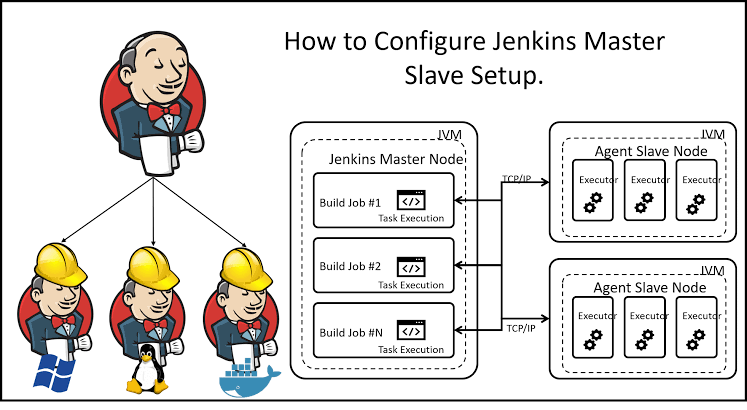
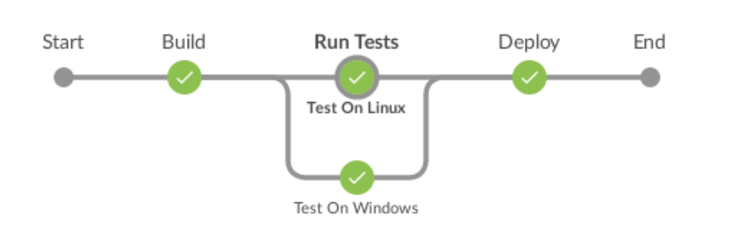
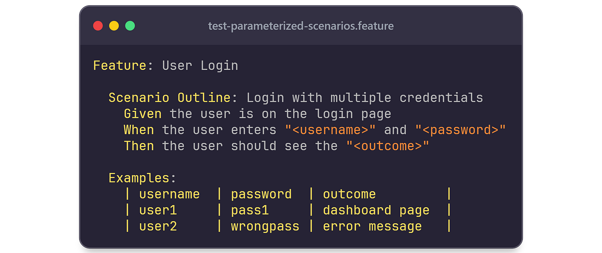
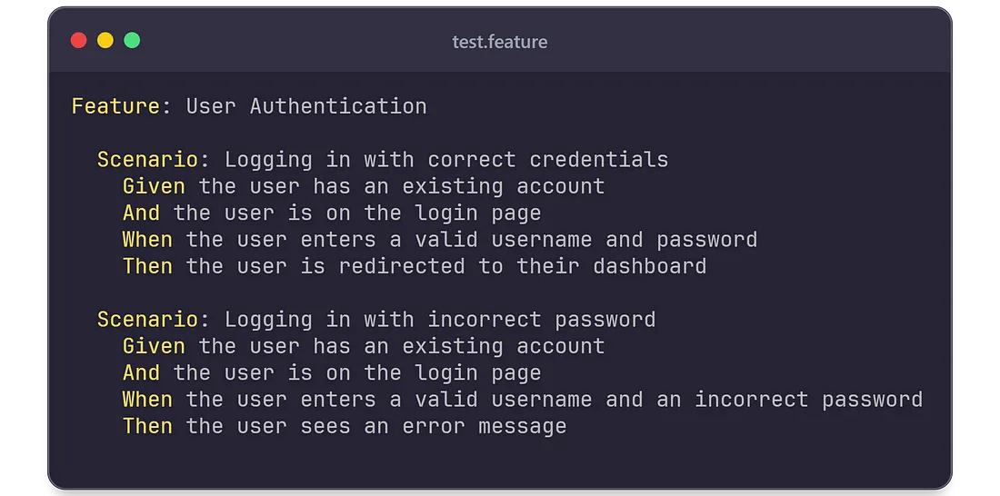
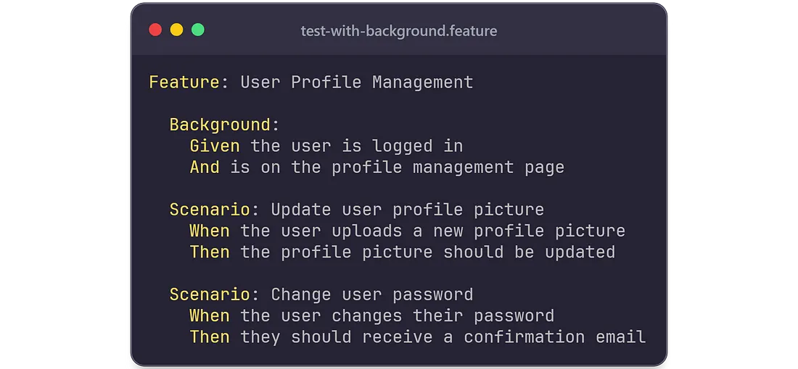
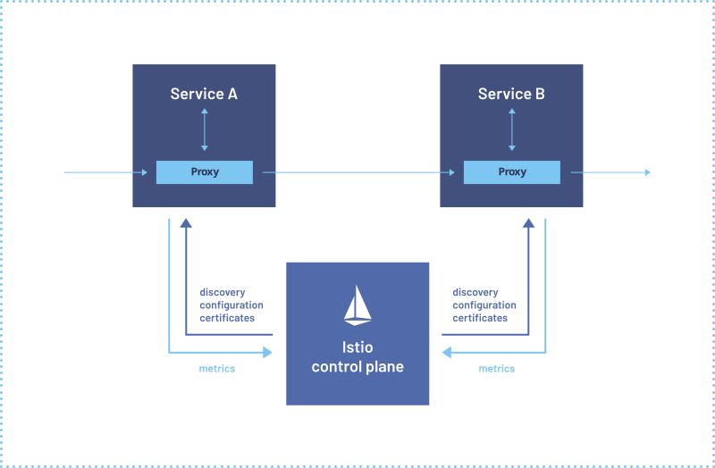

# Catatan Tambahan

## Jenkins Agent

> Jenkins agent : a machine or container that connects to a Jenkins controller (master) and executes build jobs or tasks as directed by the controller

```Groovy
pipeline{
    agent { label "Dev-server"}
    stages{
        stage("Build and Test"){
            steps{
                sh "docker build . -t node-app:latest"
            }
        }
        stage("Deploy"){
            steps{
                sh "docker-compose down && docker-compose up -d"
            }
        }
    }
}
```



creating agent:

```bash
docker run -d --rm --name=agent1 -p 22:22 \
-e "JENKINS_AGENT_SSH_PUBKEY=[your-public-key]" \
jenkins/ssh-agent:alpine-jdk21
```

## Shared Library

[referensi](https://www.jenkins.io/doc/book/pipeline/shared-libraries/)

## `Promise.all()` JS

```js
const promise1 = Promise.resolve(3);
const promise2 = 42; // A non-Promise value is treated as a resolved Promise
const promise3 = new Promise((resolve, reject) => {
  setTimeout(resolve, 100, 'foo');
});

Promise.all([promise1, promise2, promise3])
  .then((values) => {
    console.log(values); // Expected output: [3, 42, "foo"]
  })
  .catch((error) => {
    console.error(error); // Catches the first rejection if any
  });
```

## Parallel stage

sintaks dasar:

```groovy
/* .. snip .. */
stage('run-parallel-branches') {
  steps {
    parallel(
      a: {
        echo "This is branch a"
      },
      b: {
        echo "This is branch b"
      }
    )
  }
}
/* .. snip .. */
```

contoh:



```groovy


pipeline {
    agent none
    stages {
        stage('Run Tests') {
            parallel {
                stage('Test On Windows') {
                    agent {
                        label "windows"
                    }
                    steps {
                        bat "run-tests.bat"
                    }
                    post {
                        always {
                            junit "**/TEST-*.xml"
                        }
                    }
                }
                stage('Test On Linux') {
                    agent {
                        label "linux"
                    }
                    steps {
                        sh "run-tests.sh"
                    }
                    post {
                        always {
                            junit "**/TEST-*.xml"
                        }
                    }
                }
            }
        }
    }
}
```

## ARM64 vs AMS64

The primary difference between AMD64 and ARM64 chipsets lies in their instruction set architectures (ISAs) and their respective target applications. AMD64, also known as x86-64, is the 64-bit extension of the x86 architecture, primarily used in personal computers and servers. ARM64, also known as AArch64, is a 64-bit architecture developed by ARM, commonly found in mobile devices, embedded systems, and increasingly in servers and cloud computing

The amd64 (also known as x86_64) architecture is based on the 64-bit extension of the x86 instruction set originally developed by Intel and AMD. It’s the dominant architecture for desktops, laptops, and servers.

arm64 (also known as aarch64) refers to the 64-bit architecture used by ARM processors. ARM processors are known for their energy efficiency and are used in a wide range of devices, from smartphones and tablets to servers and development boards like the Raspberry Pi.

## Matrix Build

[refrensi](https://www.jenkins.io/blog/2019/11/22/welcome-to-the-matrix/)

```Groovy


pipeline {
    agent none
    stages {
        stage('BuildAndTest') {
            matrix {
                agent any
                axes {
                    axis {
                        name 'PLATFORM'
                        values 'linux', 'windows', 'mac'
                    }
                    axis {
                        name 'BROWSER'
                        values 'firefox', 'chrome', 'safari', 'edge'
                    }
                }
                stages {
                    stage('Build') {
                        steps {
                            echo "Do Build for ${PLATFORM} - ${BROWSER}"
                        }
                    }
                    stage('Test') {
                        steps {
                            echo "Do Test for ${PLATFORM} - ${BROWSER}"
                        }
                    }
                }
            }
        }
    }
}
```

## Version Control System (VCS)

= source control.

benefits:

1. A complete long-term change history of every file.
2. Branching and merging.
3. Traceability. Being able to trace each change made to the software and connect it to project management and bug tracking software

contoh:

- Github
- Gitlab
- Gitea

## Git tree visualize

```bash
git log --graph --decorate --oneline
```

## Gherkin

Gherkin is a plain-text language used in Behavior-Driven Development (BDD) to describe software behavior in a human-readable format. It's designed to be understandable by both technical and non-technical stakeholders, facilitating communication and collaboration in the software development process.







## istio

open-source service mesh that helps manage, secure, and monitor microservices in a distributed environment

[istio](https://istio.io/)


