<!-- Dirangkum oleh : Bostang Palaguna -->
<!-- Juli 2025 -->

# CI/CD

## Introduction to CI/CD

### Jenkins (lanjutan)

> Jenkins ➡️ platform-agnostic
> Github Action ➡️ terikat ke Github ecosystem.

- tangani pipeline kompleks
- deploy multi-environment
- otomasi infras. ➡️ combine dgn Terraform

_Pipeline as code_ ➡️ tulis alur CI/CD dlm `Jenkinsfile` ➡️ disimpan bersama sourcecode / config project ➡️ bahasa : Groovy

| **Gaya**      | **Deklaratif**         | **Scripted**               |
| :------------ | :--------------------- | :------------------------- |
| Sintaks       | terstruktur-deklaratif | imperatif-bebas spt Groovy |
| kompleksitas  | rendah                 | tinggi                     |
| control logic | terbatas               | fleksibel                  |
| reccomended?  | ✅                     | hny u/ kasus kompleks      |

- Deklaratif
  - kelebihan:
    - struktur tervalidasi
    - lebih mudah dibaca
    - integrasi dgn plugin
    - menggunakan keyword2 yg diprovide jenkins

```groovy
pipeline{
    agent any
    environment{
        ENV = 'staging'
    }

    stages{
        stage('Checkout'){
            steps{
                git 'https://github.com/example/repo.git/repo.git'
            }
        }

        stage('Build'){
            steps{
                sh './gradlew build'
            }
        }

        stage('Test'){
            steps{
                sh './gradlew test'
            }
        }
    }
}
```

- Scripted
  - kelebihan:
    - control penuh
    - banyak menggunakan bash scripting

```Groovy
node{
    stage('Checkout'){
        git '...'
    }

    stage('Build'){
        sh './gradlew build'
    }

    stage('Test'){
        if (env.BRANCH_NAME == 'main'){
            sh './gradlew test'
        }
        else{
            echo 'Skip test on non-main branch'
        }
    }
}
```

### Shared Library

bbrp proyek logic pipeline mirip ➡️ mengurangi reduplikasi kode

**contoh**:

- build java app
- linting ➡️ periksa apakah kode sesuai std
- docker build & push to registry
- deploy ke k8s

### Parallel Stage

jalankan bbrp proses scr bersamaan u/ efisiensi waktu

- build dgn SAST ✅ ➡️ build tdk berkaitan dgn SAST sehingga bisa parallel
- testing dgn build ❌ ➡️ karena proses test bergantung thd build

```groovy
// ...
    stage('Test'){
        parallel{
            unitTest: {
                sh './gradlew test'
            }

            integrationTest: {
                sh './gradlew integrationTest'
            }

            linting: {
                sh 'npm run lint'
            }
        }
    }
// ...

// secara konsep mirip `Promise.all()` di JS => menunggu sampai semua selesai; bukan dulu2an
```

### Matrix Build

strategi Jenkins jlnkan build dgn kombinasi variabel (OS, Java Version, Arsitektur CPU, environment) tertentu

🎯 :

- compatibility test
- bug detection

**contoh kombinasi**:

|         | JDK8 | JDK11 |
| :------ | :--- | :---- |
| Linux   | 1    | 2     |
| Windows | 3    | 4     |

```groovy
pipeline{
    agent none
    matrix{
        axes{
            axis{
                name: 'JDK'
                values: '8', '11'
            }

            axis{
                name{ 'OS'}
                values: 'linux', 'windows'
            }
        }

        agent any
        stages{
            stage('Build'){
                steps{
                    echo "Building JDK ${JDK}, OS ${OS}"
                    // building logic
                    // ...
                }
            }

            stage('Test'){
                steps{
                    echo "Running test on JDK ${JDK}, OS ${OS}"
                    // testing logic
                    // ...
                }
            }
        }
    }
}
```

**when to use**?

- parallel:
  - 1 konteks namun beda jenis (unit, integration, e2e)
  - proses tdk terkait env
- matrix:
  - cek combinatorial compatibility
  - proyek lintas platform/arsitektur

### Credentials & Secret Manager

ketika Jenkins butuh info sensitif (password, API keys, SSH key, token, etc.) u/ interaksi dgn sistem lain (Github, Docker Registry, Cloud Provider, dsb)

contoh penggunaan Secrets:

Jenkins ➡️ Manage Jenkins ➡️ Credentials ➡️ pilih scope (globa/folder/job) ➡️ add credentials

```Groovy
pipeline {
    agent any
    
    environment {
        APP_NAME = 'jenkins-demo-app'
        APP_VERSION = "${BUILD_NUMBER}"
        DOCKER_IMAGE = "${APP_NAME}:${APP_VERSION}"
        
        // Telegram Bot Configuration
        TELEGRAM_BOT_TOKEN = credentials('TG_TOKEN')    // ambil dari Jenkins Credentials
        TELEGRAM_CHAT_ID = credentials('TG_CHAT_ID')
    
    }
    // ...
}
```

```groovy
pipeline{
    agent any
    environment{
        GITHUB_TOKEN = credentials('github-token-id')
    }

    stages{
        stage('Clone Repo'){
            steps{
                sh 'git clone https://$GITHUB_TOKEN@github.com/.../repo.git'
                // sintaks
                    // git clone https://<token>@github.com/owner/repo.git
            }
        }
    }
}
```

**Credential Scope** :

- global
  - all jobs
- system
  - internal plugin Jenkins
- folder/domain
  - job dlm folder/domain tertentu

**tips**:

- jgn hardcode _secrets_ dlm `Jenkinsfile`
- gunakan blok `withCredentials{}`
- gunakan Vault Plugin (e.g. HashiCrop Vault)
- rotasi _secrets_ scr berkala
- audit (dgn plugin)

### Jenkins Trigger

mekanisme u/ eksekusi job scr otomatis bdskan kondisi tertentu. => responsif, event-driven.

**Jenis**:

- SCM Pooling
  - cek perubahan berkala pada repo
- Webhook
  - otomatis ketika ada push/pull request
- Parameterized Trigger
- Upstream/Downstream Trigger
- Cron Timer
- Manual Approval
- External Trigger
- Github/Gitlab integration
- Remote Trigger

#### SCM Pooling

```groovy
pipeline{
    triggers{
        poolSCM('H/5 * * * *') // cek setiap 5 menit
        // This is the SCM polling trigger.
        // 'H/5 * * * *' is a cron-like syntax:
        // - 'H' (for hash) means Jenkins will distribute the workload of polling
        //   across the minute, rather than all jobs polling at the same exact minute.
        //   This is good for server performance.
        // - '/5' indicates that it will check every 5 minutes.
        // - The remaining '* * * *' represent hour, day of month, month, and day of week, respectively,
        //   meaning it will poll every 5 minutes regardless of the specific hour, day, month, or day of week.
        // In essence, this trigger tells Jenkins to periodically check the configured
        // Source Code Management (SCM) system (e.g., Git, SVN) for changes.
        // If changes are detected in the repository, the pipeline will be triggered.
    }

    stages{
        stage('Build'){
            steps{
                echo 'SCM pooling triggered build'
            }
        }
    }
}
```

🟢:

- mudah dikonfig
- tdk butuh konfig repo git

🔴:

- boros resource
- tdk real-time
- tdk efisien u/ multi-repo

#### Webhook

Repo git kirim notifikasi (_event_) ke Jenkins saat ada perubahan (real-time, tdk tunggu jadwal)

cara konfig:

Github/Gitlab webhook trigger/General webhook > catat endpoint

🟢:

- real-time
- ringan & efisien

🔴:

- butuh konfig git
- jenkins harus publc / pakai tunnel (cloudflared/ngrok)
- rentan thd perubahan IP jika tanpa static DNS

## Automated Testing dgn Jenkins

Testing pyramid:

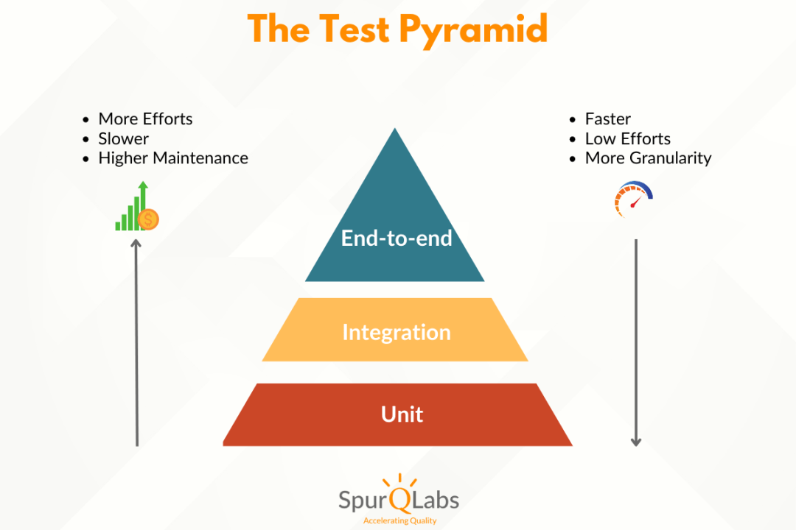

### Unit Testing

verifikasi fungsionalitas unit terkecil dari kode (fungsi, prosedur, metode dlm class)

contoh:

As a user, I want to access the `/hello` endpoint so that I can receive a friendly greeting

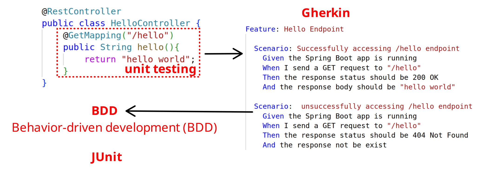

**tujuan**:

- make sure logika internal hasilkan output yg diekspektasikan
- jaga keandalan kode saat ada code refactoring

ditulis oleh dev saat/setelah development, bukan QA

**Manfaat**:

- deteksi bug dini
  - sebelum masuk integrasi/produksi
- dukung refactoring
  - penjamin tdk rusak fungsionalitas
- otomatisasi
  - bisa berulang dlm CI/CD pipeline
- dokumentasi kode

**Ciri**:

- isolasi
  - unit test tdk boleh bergantung sistem eksternal (DB, file system, network API, framework UI)
  - dependency dpt digantikan `mock` / `stub`
- repeatable & konsisten
  - beri hasil sama
- cepat & ringan
  - orde ms / s.

contoh:

```Java
public double hitungDiskon(double harga, double persen){
    return harga - (harga * persen/100);
}

hitungDiskon(100, 10);   // return : 90
hitungDiskon(200, 10);   // return : 200
hitungDiskon(0, 50);     // return : 0
```

hasil : percent coverage

**Tools**:

- Java
  - Framework: `JUnit`, `TestNG`
  - Mocking: `Mockito`
- JS
  - Framework: `Jest`, `Mocha`
  - Mocking: `Sinon`
- Python
  - Framework: `unittest`, `PyTest`
  - Mocking: `unittest.mock`

### Integration Testing

komponen modular sistem:

- service layer
- data access layer
- REST API client
- authentication provider
- external API (payment, shipping, login)
- caching layer (Redis)
- messaging system (Kafka, RabbitMQ)

setiap komponen scr individu ok, tetapi tdk ada jaminan sukses ketika digabung.

integration test: validasi kerja sama antar komponen

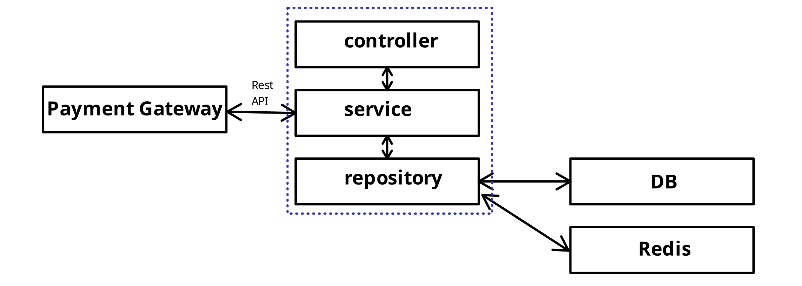

Risiko tdk lakukan integration test:

- silent failure
- data corrupiton
- runtime error

### (HANDSON) Jenkins CI/CD Pipeline

> file: /handson/Jenkins_CI_CD

Java SpringBoot mau otoomasi Ci/CD dgn Jenkins. step:

- Git push ke branch
- Trigger Jenkins Pipeline dgn webhook
- Unit testing & upload ke Sonar
- SAST dan upload ke Sonar

Docker Compose services:

- Jenkins
- SonarQube
- Cloudflared
  - local tunner Jenkins dgn Github Webhook
- PostgreSQL

**Langkah 1** : Buat file `docker-compose.yaml`

```yaml
services:
############ Jenkins ############
  jenkins:
    image: jenkins/jenkins:lts
    container_name: jenkins
    ports:
      - "8080:8080"
      - "50000:50000"
    volumes:
      - jenkins_home:/var/jenkins_home
    privileged: true
    networks:
      - cicd-net
#################################

############ Cloudflared ############
  cloudflared:
    image: cloudflare/cloudflared:latest
    container_name: cloudflared
    command: tunnel --url http://jenkins:8080
    networks:
      - cicd-net
    depends_on:
      - jenkins
#####################################

############ SonarQube ############
  sonarqube:
    image: sonarqube:community
    container_name: sonarqube
    depends_on:
      - db
    environment:
      SONAR_JDBC_URL: jdbc:postgresql://db:5432/sonar
      SONAR_JDBC_USERNAME: sonar
      SONAR_JDBC_PASSWORD: sonar
    ports:
      - "9001:9000"
    volumes:
      - sonarqube_conf:/opt/sonarqube/conf
      - sonarqube_data:/opt/sonarqube/data
      - sonarqube_logs:/opt/sonarqube/logs
      - sonarqube_extensions:/opt/sonarqube/extensions
    networks:
      - cicd-net
###################################

############ PostgresQL ############
  db:
    image: postgres:13
    container_name: sonar-postgres
    environment:
      POSTGRES_USER: sonar
      POSTGRES_PASSWORD: sonar
      POSTGRES_DB: sonar
    volumes:
      - postgresql:/var/lib/postgresql
      - postgresql_data:/var/lib/postgresql/data
    networks:
      - cicd-net
####################################

volumes:
  jenkins_home:
  sonarqube_conf:
  sonarqube_data:
  sonarqube_logs:
  sonarqube_extensions:
  postgresql:
  postgresql_data:

networks:
  cicd-net:
    driver: bridge
```

**Langkah 2** : jalankan docker compse

```bash
docker compose up
```

**Langkah 3** : akses sonarqube di `localhost:9001`

default credentials: `admin/admin`

<!-- ubah default password dengan misalkan: )PaYm)GYRT}6Dwc -->

[kode](https://github.com/noghanodedra/spring-boot-rest-api-unit-tests/)

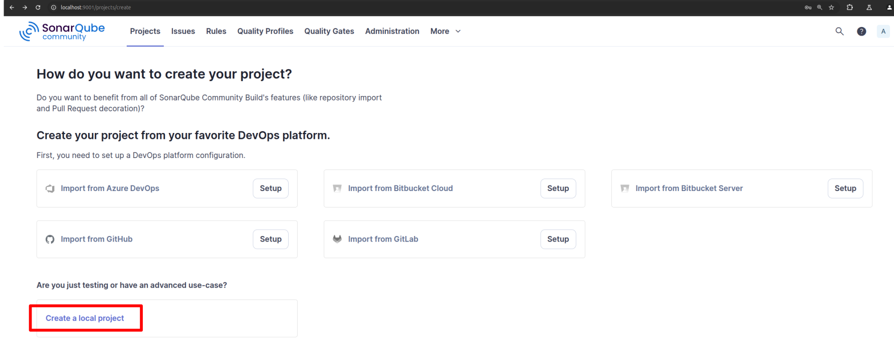

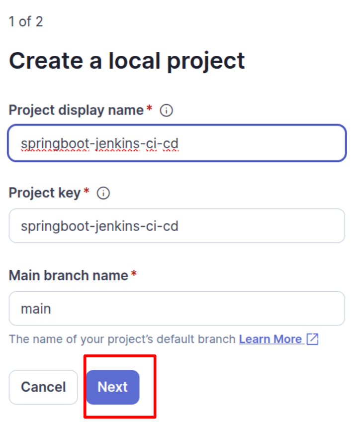

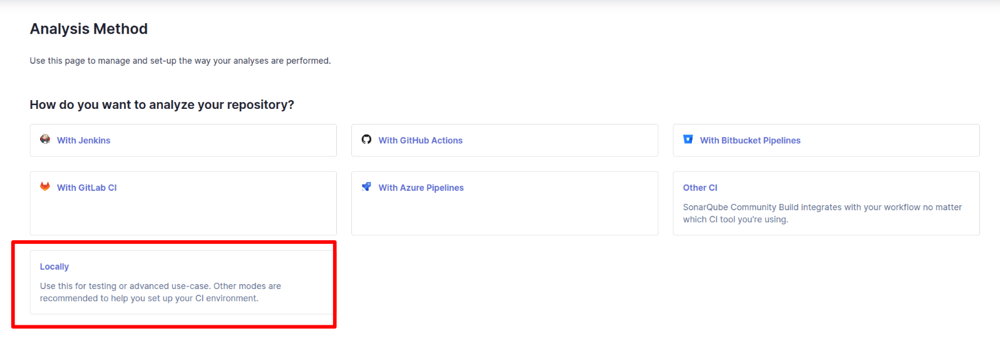

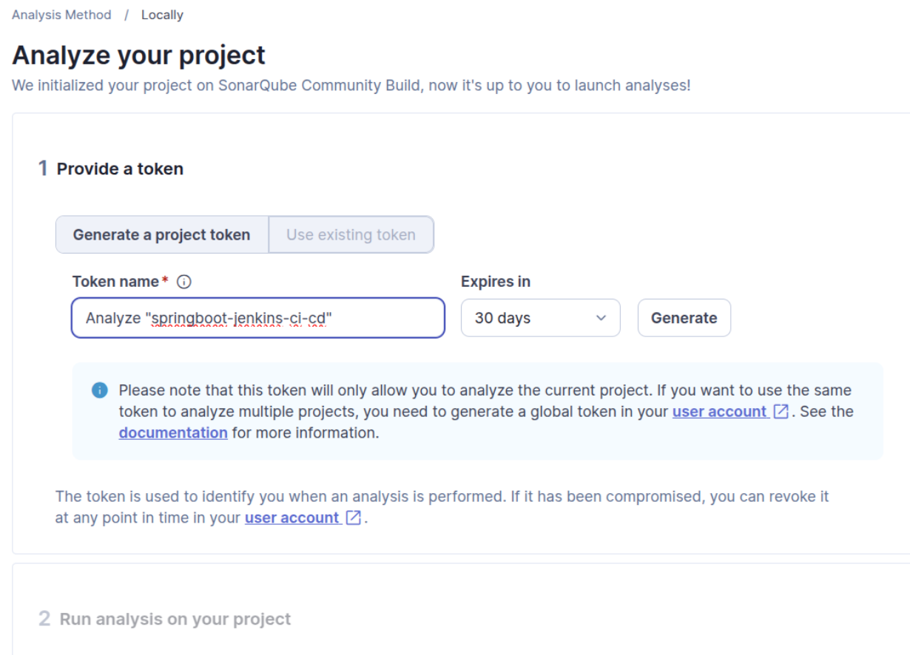

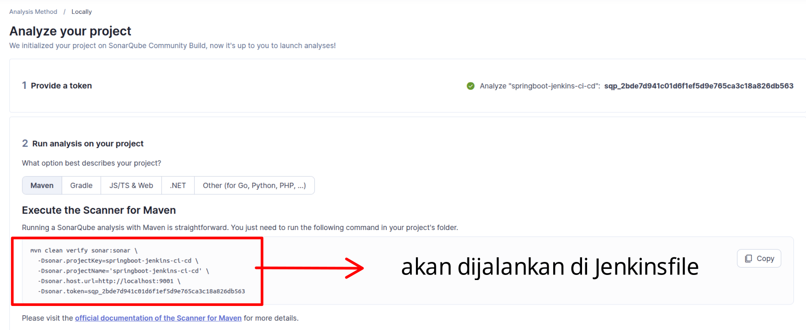

```groovy
  environment {
    SONARQUBE_SERVER = 'SonarQube' 
    SONAR_TOKEN = credentials('sonar_token')          // tambahkan ini
                                                      // simpan di Jenkins credentials
  }
// ...
   stage('Static Code Analysis (SAST) via Sonar') {
      steps {                                         // verify jadi compile
sh """
            mvn clean compile sonar:sonar \
  -Dsonar.projectKey=springboot-jenkins-ci-cd \
  -Dsonar.projectName='springboot-jenkins-ci-cd' \
  -Dsonar.host.url=http://sonarqube:9000 \
  -Dsonar.token=${SONAR_TOKEN}
        """
      }
    }
```

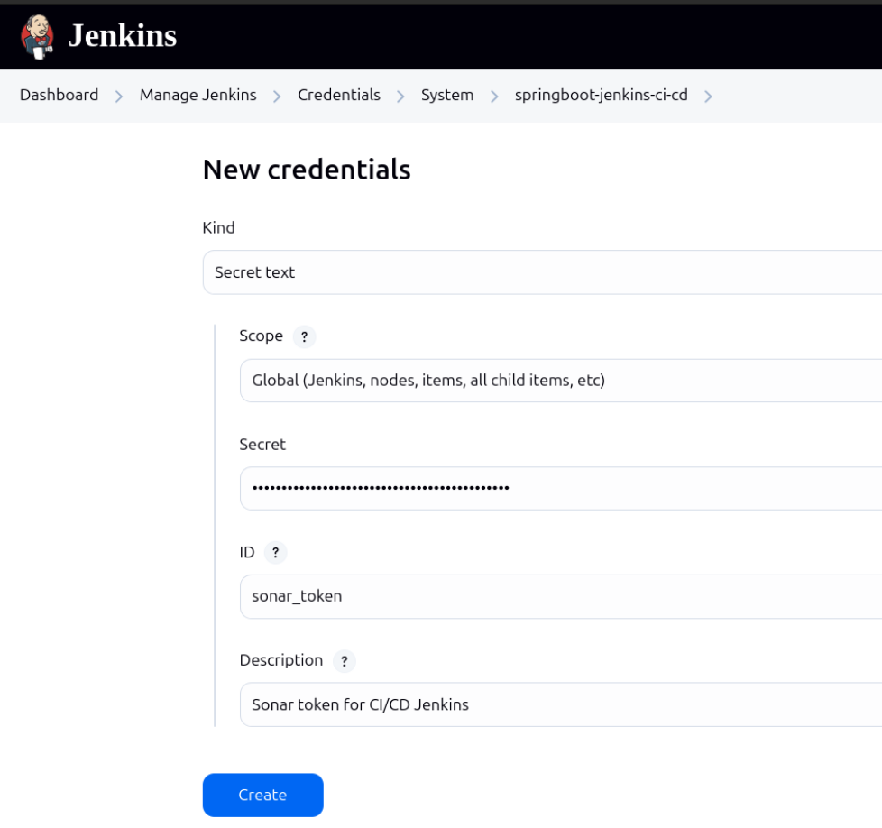

<!-- sqp_2bde7d941c01d6f1ef5d9e765ca3c18a826db563 -->

**Langkah 4** : akses Jenkins di `localhost:8080`

<!-- ubah default password dengan misalkan: 288b8f154c9e4c2c9c82bbbcb4364b3b -->

atau bisa akses lewat DNS yang sudah di-tunnel:

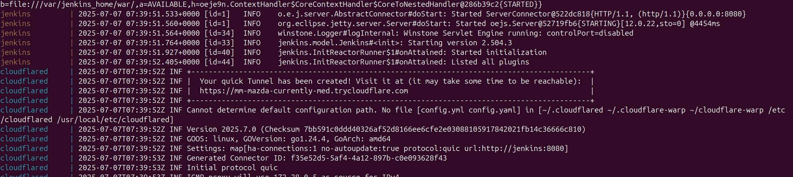

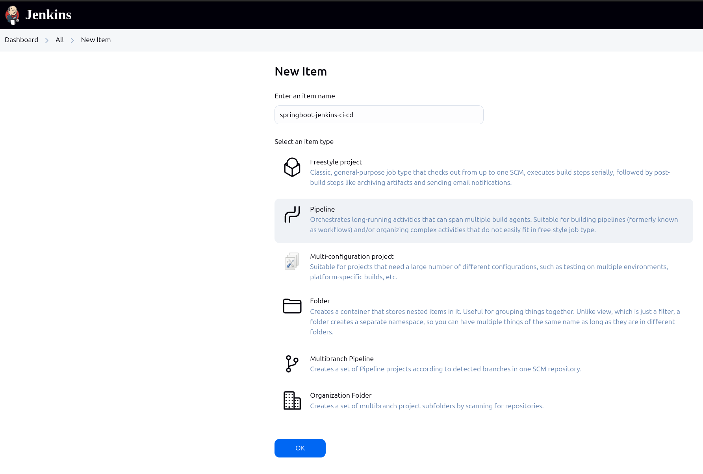

Install Maven dan JDK :

Manage Jenkins > Tools

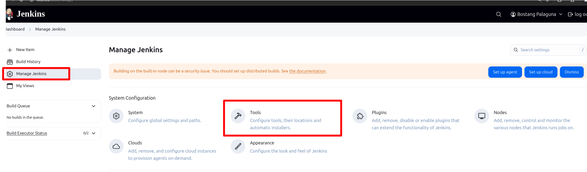

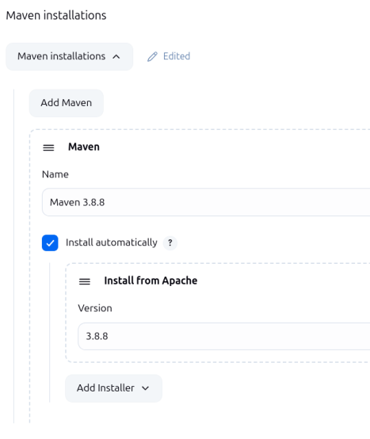

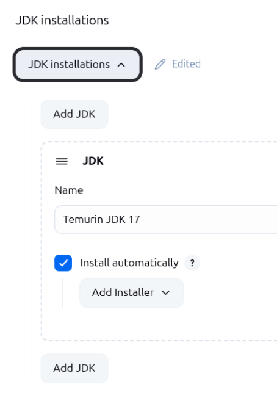

**Langkah 5** : Enable Webhook

agar ketika git push ke repo, maka scanning otomatis dilakukan

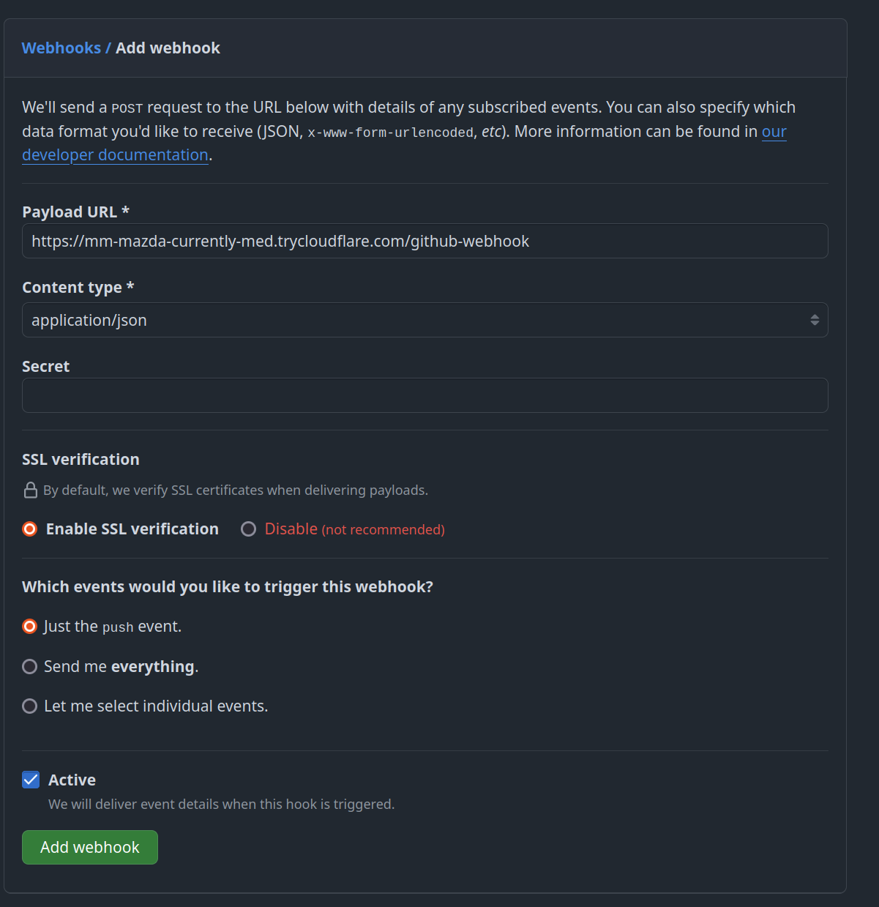

centang `Github hook trigger for GITScm polling` :

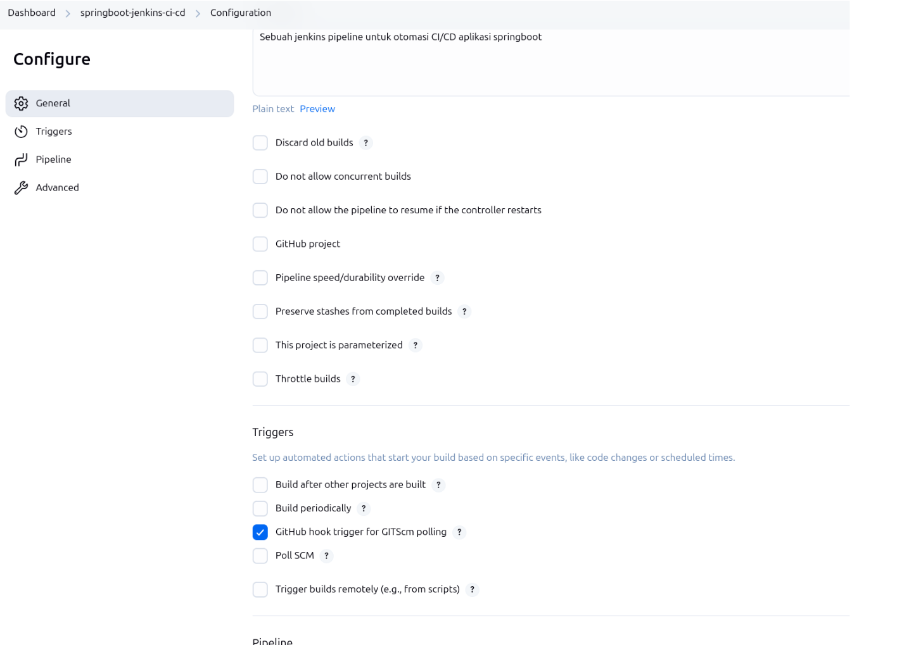

**Langkah 6** : Coba push sesuatu ke github

lalu amati bahwa secara otomatis akan melakukan scanning SonarQube.

#### TIPS DEBUGGING JENKINS

1. cara paling cepat adalah `docker compose down` lalu `docker compose up` ulang

misalkan kita gagal menambahkan webhook :

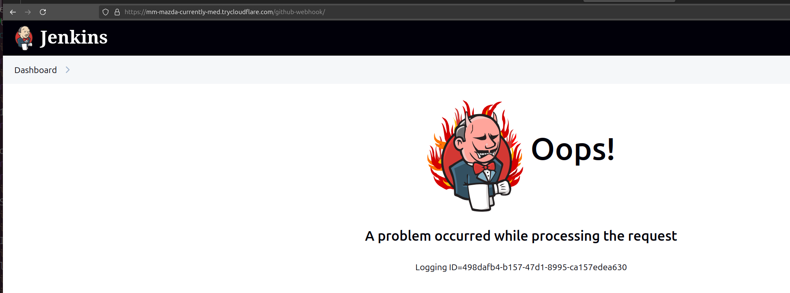

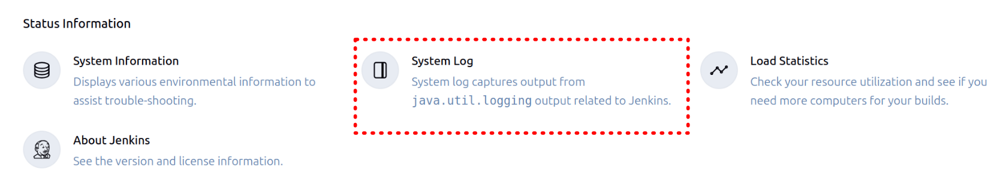

maka ketika ada error, detailnya bisa dibaca di sini. Apabila sukses, juga terlihat.

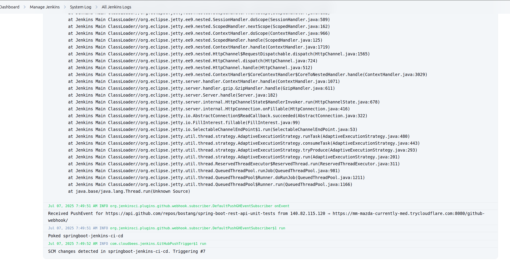

## Deploying to Production

### Zero Downtime

app tetap available meskipun:

- update app
- bug fixing
- migrasi DB
- perubahan config

dlm industri seperti bank / e-commerce, sistem down 1 - 2 menit dpt sebabkan kerugian, rusaknya reputasi, turunnya kepuasan pelanggan.

Solusi:

1. Canary Deployment
2. BlueGreen Deployment

### Canary Deployment

versi baru dari app hny dijalankan u/ sebagian kecil pengguna dlu sebelum rilis ke seluruh sistem.

canary = versi uji coba

tujuan:

- hindari risiko saat release
- uji versi baru di production (terbatas)
- memungkinkan rollback cepat jika ada error
- pantau performa & error sebelum sebar ke semua pengguna

Cara kerja:

- deploy v2 ke 5% traffic
- monitor log, error rate, metric performa
- naikkan ke 20%, 50%, 100%
- jika error, rollback ke v1 hanya utk 5% pengguna itu

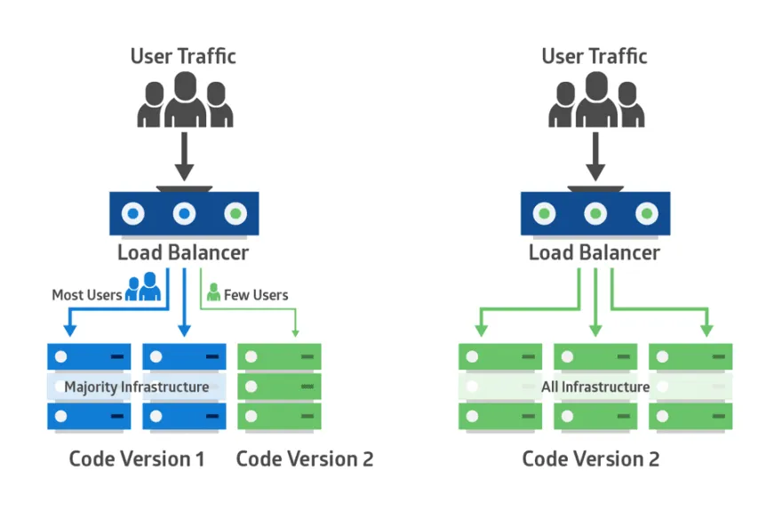

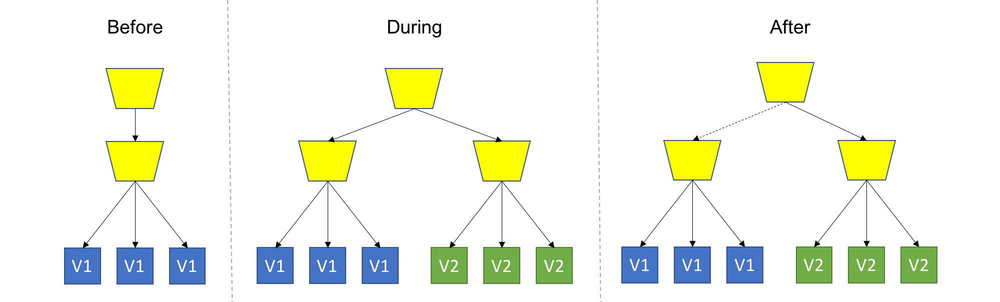

### Blue Green

pakai 2 environment identik : blue (versi lama), green (versi baru).

cara kerja:

- blue env aktif (v1)
- green env dideploy (v2), test internal
- setelah yakin aman, switch traffic ke green
- blue tetap standby u/ rollback jika perlu

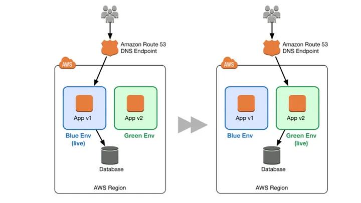


Perbedaan:

| **Aspek**  | **Blue-Green**      | **Canary**                 |
| :--------- | :------------------ | :------------------------- |
| Lingkungan | 2 environment penuh | 1 cluster-rollout bertahap |
| traffic    | 100% dialihkan      | bertahap : 5%->25%->100%   |
| risiko     | besar saat switch   | bisa dideteksi lebih awal  |
| rollback   | cepat & mudah       | bertahap                   |

### (HANDSON) Canary & BlueGreen Deployment

**Langkah 0** : Jalankan Minikube container

```bash
# jalankan minikube
minikube start --driver=docker --cpus=2 --memory=2048
```

#### (HANDSON) Blue-Green Deployment

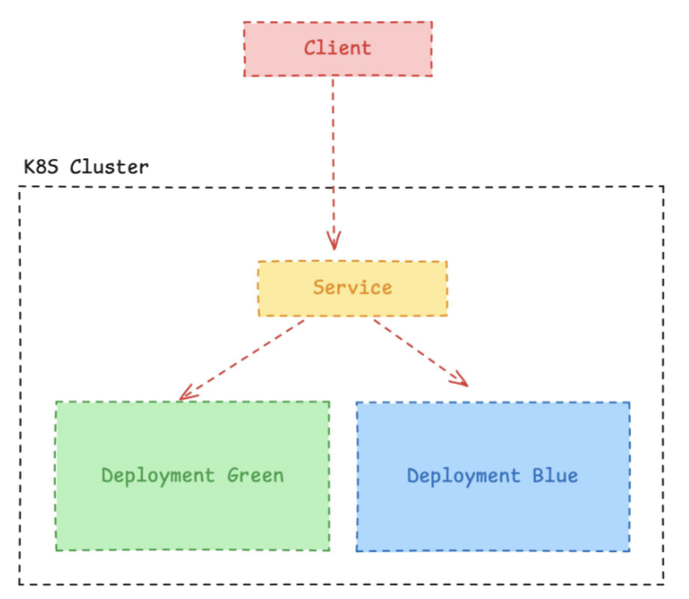

**Langkah 1** : buat & apply file manifest

- `blue-deployment.yml`

```yaml
apiVersion: apps/v1
kind: Deployment
metadata:
  name: app-blue
spec:
  replicas: 2
  selector:
    matchLabels:
      app: myapp
      version: blue
  template:
    metadata:
      labels:
        app: myapp
        version: blue
    spec:
      containers:
        - name: app
          image: nginx:latest
          ports:
            - containerPort: 80
```

- `green-deployment.yml`

```yaml
apiVersion: apps/v1
kind: Deployment
metadata:
  name: app-green
spec:
  replicas: 2
  selector:
    matchLabels:
      app: myapp
      version: green
  template:
    metadata:
      labels:
        app: myapp
        version: green
    spec:
      containers:
        - name: app
          image: httpd:latest
          ports:
            - containerPort: 80
```

- `service.yml`

```yaml
apiVersion: v1
kind: Service
metadata:
  name: myapp-service
spec:
  selector:
    app: myapp
    version: green    # ubah ke blue nanti
  ports:
    - port: 80
      targetPort: 80
  type: LoadBalancer
```

```bash
minikube kubectl -- apply -f .    # semua file yaml di dalam folder saat ini

# lakukan tunneling IP
minikube tunnel
```

cek ip tunnel:

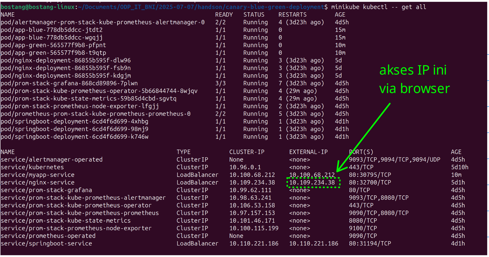

hasil akses via browser:

blue:

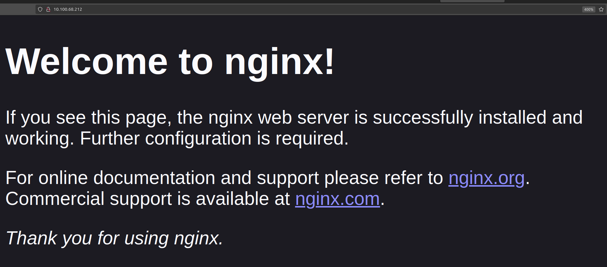

green:

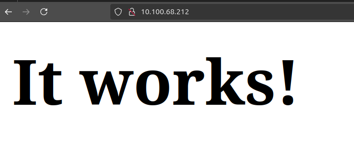

#### (HANDSON) Canary Deployment

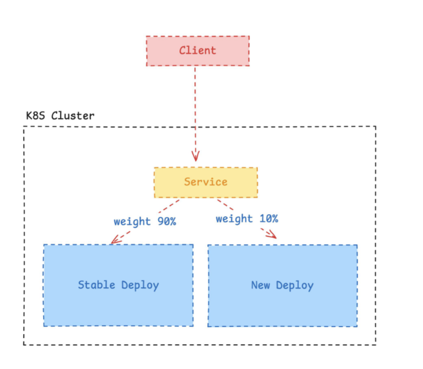

**Langkah 1** : buat & apply file manifest

- `stable-deployment.yml`

```yaml
apiVersion: apps/v1
kind: Deployment
metadata:
  name: myapp-stable
spec:
  replicas: 1
  selector:
    matchLabels:
      app: myapp1
      track: stable
  template:
    metadata:
      labels:
        app: myapp1
        track: stable
        version: "v1"
    spec:
      containers:
        - name: app
          image: nginx:latest
          ports:
            - containerPort: 80
```

- `new-deployment.yml`

```yaml
apiVersion: apps/v1
kind: Deployment
metadata:
  name: myapp-canary
spec:
  replicas: 1
  selector:
    matchLabels:
      app: myapp1
      track: canary
  template:
    metadata:
      labels:
        app: myapp1
        track: canary
        version: "v2"
    spec:
      containers:
        - name: app
          image: httpd:latest
          ports:
            - containerPort: 80

```

- `service-deployment.yml`

```yaml
apiVersion: v1
kind: Service
metadata:
  name: myapp1      # agar membedakan dengan yg blue-green
spec:
  selector:
    app: myapp1
  ports:
    - port: 80
      targetPort: 80
  type: LoadBalancer
```

Catatan:

apabila di browser terus-terusan nginx atau httpd, kemungkinan besar itu karena cache browser.

maka : cek dengan curl

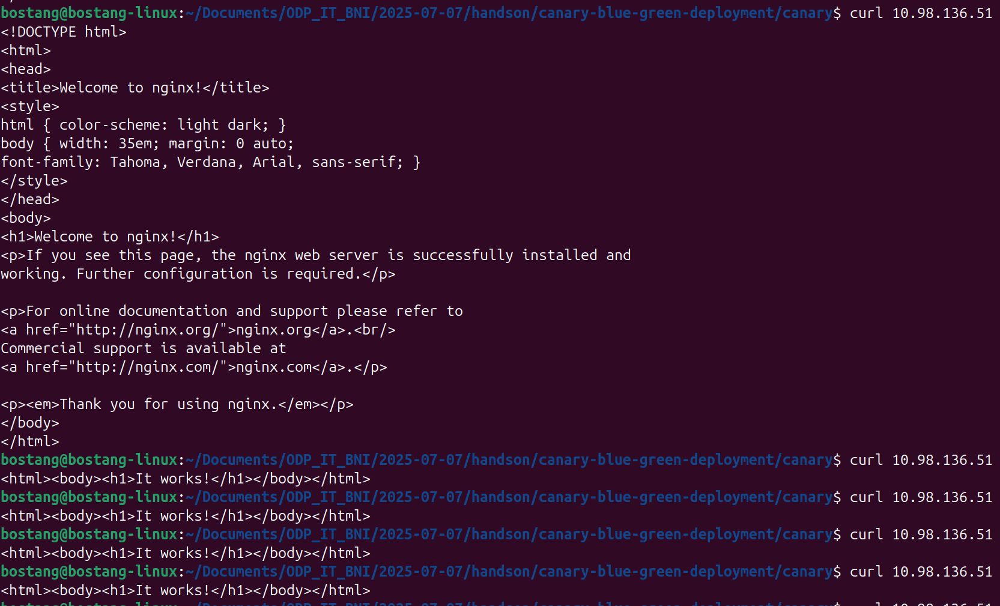

---
[🏠Back to Course Lists](https://odp-bni-330.github.io/)
