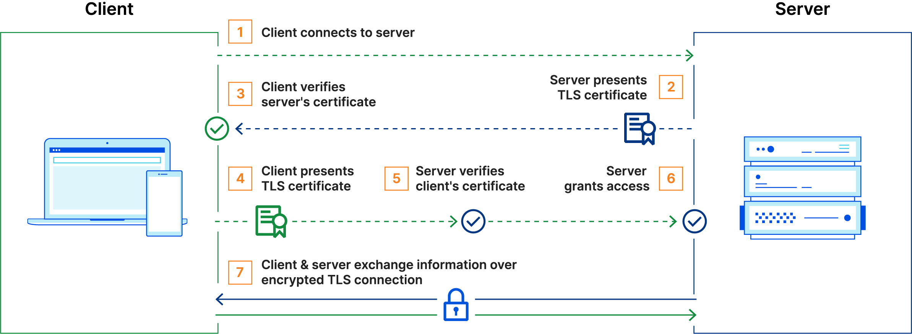
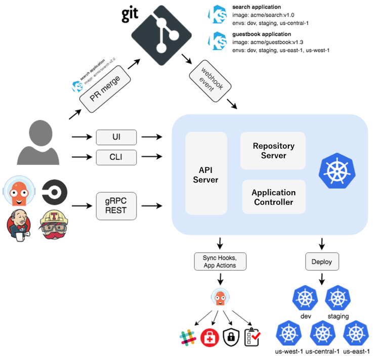

# Catatan Tambahan

## mTLS

Mutual TLS (mTLS) is a type of authentication in which the two parties in a connection authenticate each other using the TLS protocol.



## Hashicorp Configuration Language (HCL)

arguments:

```groovy
image_id = "abc123"
```

block:

```groovy
resource "aws_instance" "example" {
  ami = "abc123"

  network_interface {
    // ...
  }
}
```

```groovy
resource "aws_vpc" "main" {
  cidr_block = var.base_cidr_block
}

<BLOCK TYPE> "<BLOCK LABEL>" "<BLOCK LABEL>" {
  # Block body
  <IDENTIFIER> = <EXPRESSION> # Argument
}
```

## ArgoCD

[ArgoCD](https://argo-cd.readthedocs.io/en/stable/)



Argo CD is implemented as a Kubernetes controller which continuously monitors running applications and compares the current, live state against the desired target state (as specified in the Git repo).
