<!-- Dirangkum oleh : Bostang Palaguna -->
<!-- Juli 2025 -->

# CI/CD

## Infrastructure as Code (IaC)

otomasi infras TI : _provisioning resources_ (server, network, storage) via config file (script/template).

memungkinkan infras didefinisikan, dilacak versi, diuji, dideploy scr konsisten dgn **tujuan**:

- efisiensi ⬆️
- human error ⬇️
- replikasi lingkungan dlm skala besar ✅

**manfaat**:

- repeatable
  - infras dpt direplikasi scr konsisten
- version control
  - config disimpan di Git, audit & rollback
- deployment cepat
  - otomatisasi provisioning server & resource cloud
- testable
  - validasi config sblm apply
- efisiensi biaya
  - human error & idle resource ⬇️

**Prinsip Dasar**:

- idempotency
  - eksekusi berulang beri hasil yg sama
- version control
- automation first
- self-documentation

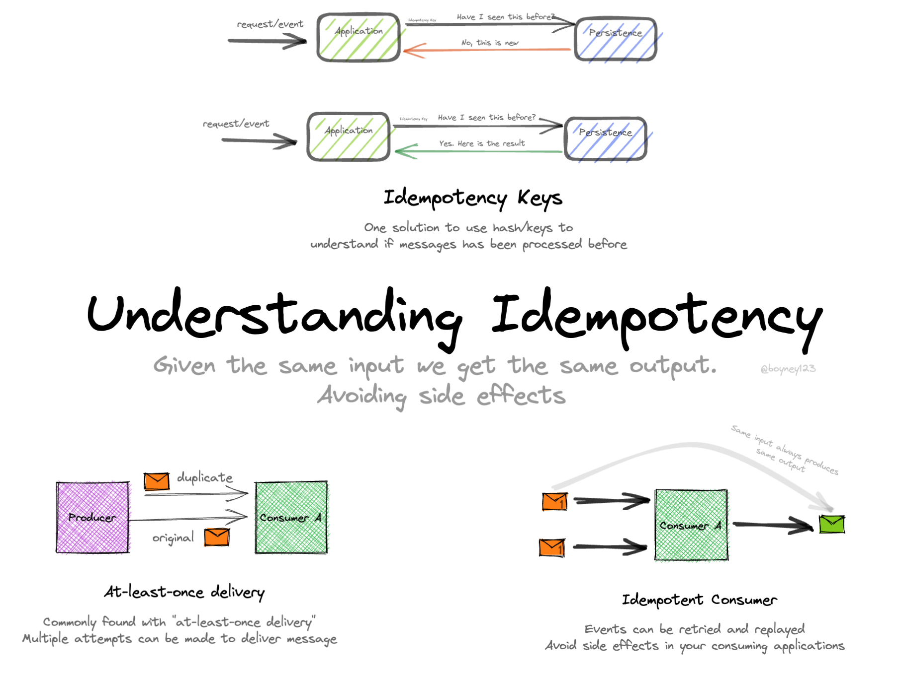

> Idempotency :  property of an operation where applying it multiple times has the same effect as applying it once

**Tantangan**:

- kompleksitas pd skala besar
- perlu skill scripting & toolset baru
- salah kode = dampak luas

IaC solution:

- HashiCorp Terraform -> enterprise-level
- Pulumi -> open source

> **Beberapa produk HashiCorp lain** :
>
> - HashiCorp Nomad : Orchestrate, deploy, and manage containers, binaries, and batch jobs in the cloud or on-prem
> - HashiCorp Vault : Secure applications identities and protect sensitive data

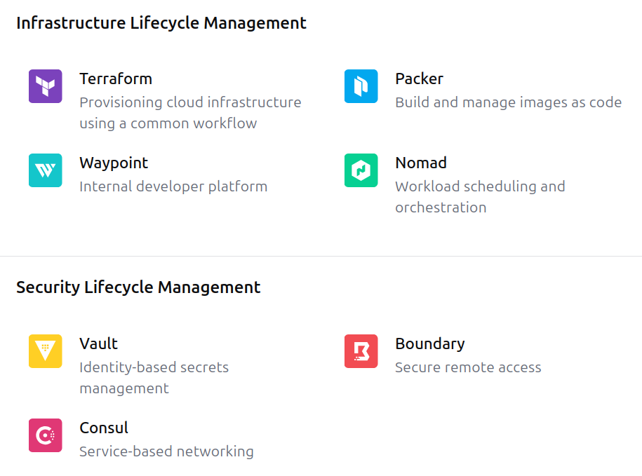

### Contoh Kasus

Tim Dev butuh buat server testing u/ fitur baru (VM + DB). Sebelumnya config manual via dashboard cloud -> makan 1 - 2 jam, sering salah konfig.

Solusi IaC:

- gunakan template config server & DB dlm file `.yaml` / `.json`
- gunakan `git` u/ version control
- jalankan provisioning otomatis setiap ada branch fitur baru

Hasil:

- setup server -> 5 menit saja
- semua env idnetik (dev, staging, testing)
- perubahan config bisa direview & rollback via `git`

## Terraform

- dikembangkan HashiCorp
- dukung bbg cloud provider : AWS, Azure, GCP, K8s, dll.
- file config berbasis HCL(HashiCorp Configuration Language).

**why**?

- dukung multicloud & hybridcloud
- deklaratif
- modular
- plan,validate, apply
- kompatibel dgn GitOps & CI/CD pipeline

**Arsitektur**:

- file `.tf` (Terraform configuration)
- Terraform CLI
- state file (terraform.tfstate)
- provider plugin (AWS, Azure, dll)
- backend (local, remote spt S3)

Lifecyle:

- `write` : definisikan resource dlm `.tf`
- `init` : inisialisasi project & plugin provider
- `plan` : simulasi perubahan struktur
- `apply` : terpakan perubahan
- `destroy` : hapus resource

best practices:

- jgn simpan secrets dlm file `.tf` (pakai Vault)
- pakai remote state dgn backend aman (S3 + DynamoDB, GCS)
- gunakan `plan` sebelum `spply`

### (HANDSON) Terraform

Deskripsi:

mendeploy container berbasis image `nginx:latest` ke `Google Cloud Run` dengan domain publik dan tanpa autentikasi, serta dikelola sepenuhnya menggunakan Terraform.

**Langkah 0** : Instalasi [Hashicorp CLI](https://developer.hashicorp.com/terraform/tutorials/aws-get-started/install-cli) dan [Google Cloud CLI](https://cloud.google.com/sdk/docs/install)

Berikut paduan untuk OS Ubuntu:

- Terraform

```bash
# Ensure that system is up to date && make sure gnupg software-properties-common packages
sudo apt-get update && sudo apt-get install -y gnupg software-properties-common

# Install HashiCorp's GPG key
wget -O- https://apt.releases.hashicorp.com/gpg | \
gpg --dearmor | \
sudo tee /usr/share/keyrings/hashicorp-archive-keyring.gpg > /dev/null

# Verify the GPG key's fingerprint
gpg --no-default-keyring \
--keyring /usr/share/keyrings/hashicorp-archive-keyring.gpg \
--fingerprint

# Add the official HashiCorp repository to system
echo "deb [arch=$(dpkg --print-architecture) signed-by=/usr/share/keyrings/hashicorp-archive-keyring.gpg] https://apt.releases.hashicorp.com $(grep -oP '(?<=UBUNTU_CODENAME=).*' /etc/os-release || lsb_release -cs) main" | sudo tee /etc/apt/sources.list.d/hashicorp.list

sudo apt update

sudo apt-get install terraform
```

- GoogleCloud CLI

```bash
# paduan instalasi : https://cloud.google.com/sdk/docs/install?authuser=1

wget https://dl.google.com/dl/cloudsdk/channels/rapid/downloads/google-cloud-cli-linux-x86_64.tar.gz

# verify checksum
  # should return OK
echo "01d322b29107e57f13e1418c789b9c3c0e6db1eb8e182d41ab6de09e6e0ca805 google-cloud-cli-linux-x86_64.tar.gz" | sha256sum --check

# un-tar
tar -xf google-cloud-cli-linux-x86_64.tar.gz

# jalankan installer
./google-cloud-sdk/install.sh

# inisiasi google cloud CLI
./google-cloud-sdk/bin/gcloud init

# setelah itu restart devais agar gcloud dapat terdeteksi
# cek versi
gcloud --version

# lakukan autentikasi (login)
gcloud auth application-default login

# contoh output:
  # Credentials saved to file: [/home/bostang/.config/gcloud/application_default_credentials.json]
# catatan: abaikan warning:
# WARNING: 
# Cannot find a quota project to add to ADC. You might receive a "quota exceeded" or "API not enabled" error. Run $ gcloud auth application-default set-quota-project to add a quota project.

```

**Langkah 1** : Siapkan folder project

```tree
cloud-run-nginx
├── main.tf
├── outputs.tf
├── terraform.tfvars
└── variables.tf
```

**Langkah 2** : konfigurasi google cloud terminal

```bash
# menampilkan project yang ada
gcloud projects list

# contoh output:
# PROJECT_ID                    NAME                    PROJECT_NUMBER
# personal-portfolio-443623     Personal Portfolio      266266377482
# rakamin-ttc-odp-it-1          Rakamin TTC ODP IT - 1  161403111738
# rakamin-ttc-odp-it-7          Rakamin TTC ODP IT - 7  243850322773
# sample-firebase-ai-app-e3c8d  Sample Firebase AI App  432549591548

# apabila error, lakukan login ulang
gcloud auth login

# set project
  # syntax:
  #   gcloud config set project <nama_project>
gcloud config set project rakamin-ttc-odp-it-1
# catatan : ignore warning
  # WARNING: Your active project does not match the quota project in your local Application Default Credentials file. This might result in unexpected quota issues.

  # To update your Application Default Credentials quota project, use the `gcloud auth application-default set-quota-project` command.
  # Updated property [core/project].

# verifikasi project sudah di-set
gcloud config get-value project
```

**Langkah 3** : Buat kode Terraform

- `main.tf`

```Groovy
provider "google" {
  project = var.project_id
  region  = var.region
}

resource "google_cloud_run_service" "nginx" {
    # sesuaikan dengan project masing-masing
  name     = "bostang-terraform-nginx-cloudrun-service"
  location = var.region

  template {
    spec {
      containers {
        image = "nginx:alpine"
        ports {
          container_port = 80
        }
      }
    }

    metadata {
      annotations = {
        "autoscaling.knative.dev/maxScale" = "3"
      }
    }
  }

  traffic {
    percent         = 100
    latest_revision = true
  }
}

resource "google_cloud_run_service_iam_member" "noauth" {
  location = var.region
  project  = var.project_id
  service  = google_cloud_run_service.nginx.name

  role   = "roles/run.invoker"
  member = "allUsers"
}
```

- `terraform.tfvars`

```groovy
project_id = "rakamin-ttc-odp-it-1"
region = "asia-southeast2"
```

- `variables.tf`

```groovy
variable "project_id" {
    description = "Google Cloud Project ID"
    type        = string
}

variable "region" {
  description = "Region to deploy Cloud"
  type        = string
  default     = "asia-southeast2"
}
```

- `outputs.tf`

```groovy
output "cloud_run_url" {
  value = google_cloud_run_service.nginx.status[0].url
}
```

cara mendapatkan project-id:

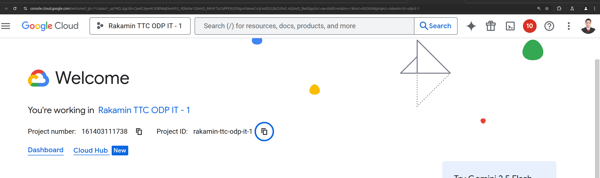

apply konfigurasi:

```bash
# init terraform
  # initializes the working directory, preparing it for use with Terraform by downloading necessary providers and modules, and setting up the backend
terraform init

# review plan
terraform plan

# deploy
terraform apply
```

akses cloud_run_url:

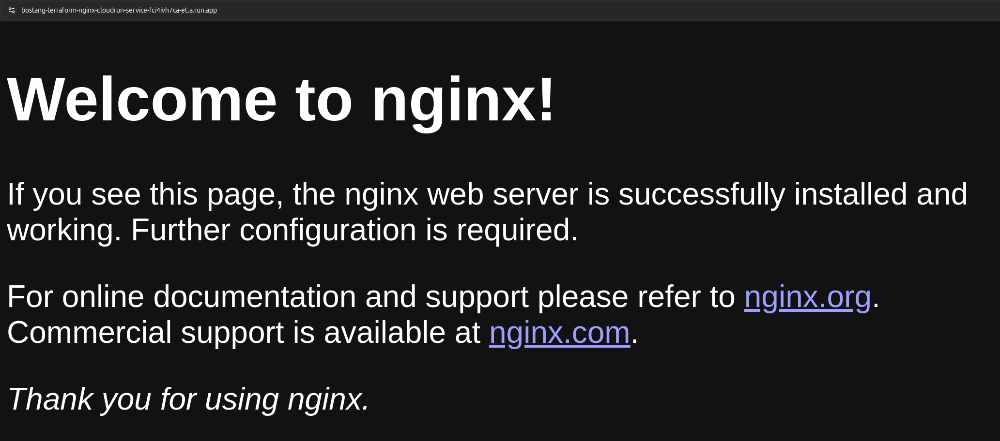

coba ubah container image ke `httpd:latest` lalu `terraform apply` ulang.

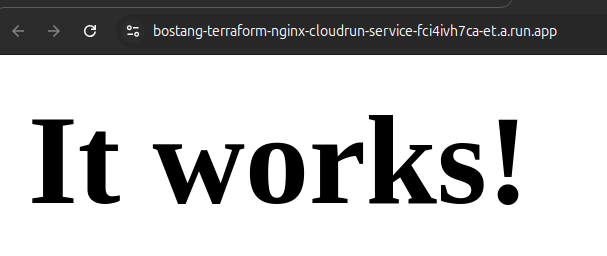

coba ubah lagi ke `caddy:alpine` :

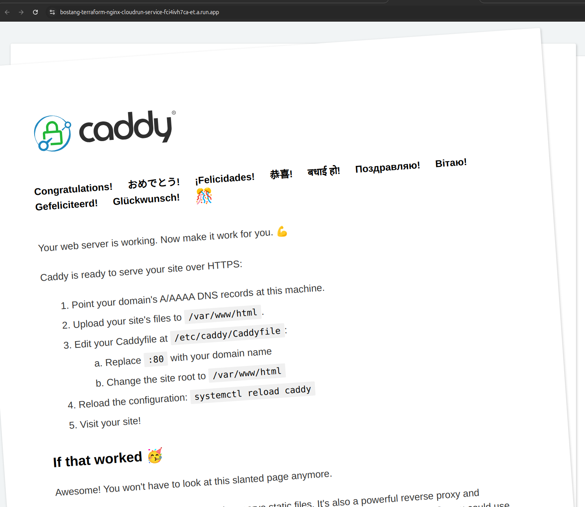

coba ubah lagi ke container image yang pernah kita buat (``):

```bash
# untuk menghapus resource yg sdh di-provision
terraform destroy
```

---
**Catatan**:

- proses yang kita lakukan di atas serupa dengan yang biasa dilakukan di GCP Console (GUI), namun dengan cara _coding_.

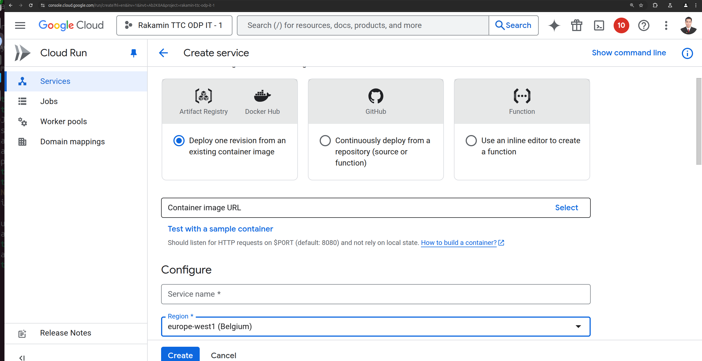

- apabila gagal `terraform init`, ganti wifi

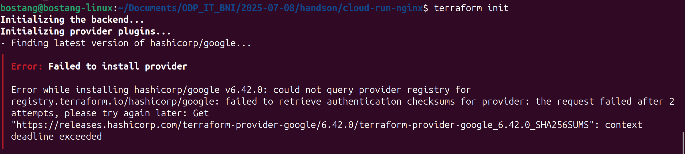

## Implementing Full CI/CD Pipeline (e2e implementation)

e2e : otomatisasi penuh dari commit kode hingga deployment ke production : testing, build, release.

- Continous Integration
  - clone repo project
  - jalankan unit test
  - jalankan SAST (sonarQube)
  - Build Docker Image
  - Push Docker to Registry (Docker Hub)
- Continous Delivery
  - Deploy ke CloudRun menggunakan Terraform
  - Kirim notifikasi status deployment ke email/notification channel lain

### (HANDSON Challenge) buatkan e2e pipeline CI/CD

[_original source code_ untuk di-deploy](https://github.com/bezkoder/spring-boot-unit-test-rest-controller)

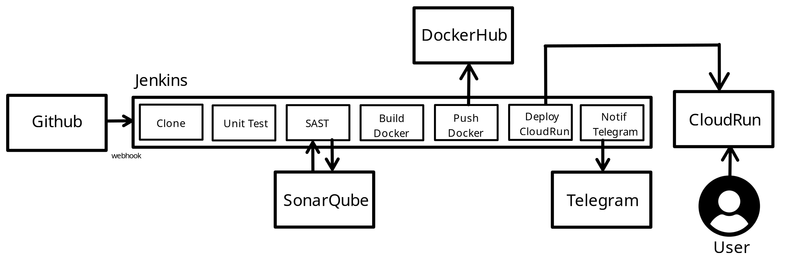

- **Hasil SAST (including Coverage Test): bisa dicek pada bagian Workspace** :

Unit Test:

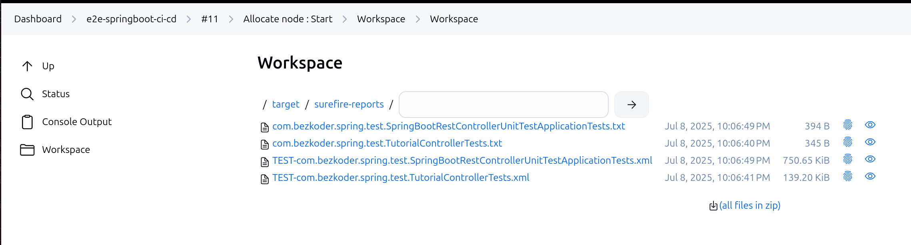

Coverage:

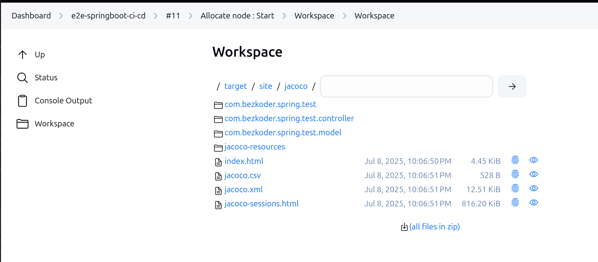

SAST:

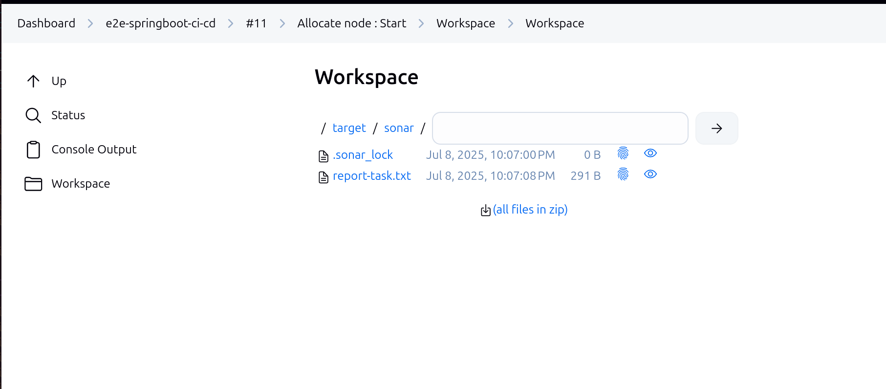

Hasil SAST di SonarQube (`localhost:9001`):

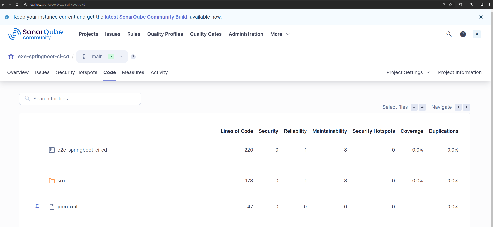

- **Hasil notifikasi telegram** :


verifikasi docker sudah terpasang di container jenknis:

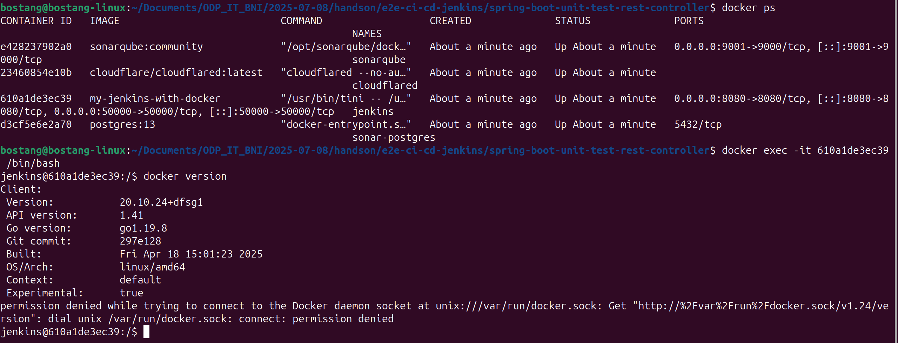

tips : berikan judul/deskripsi build information yang jelas

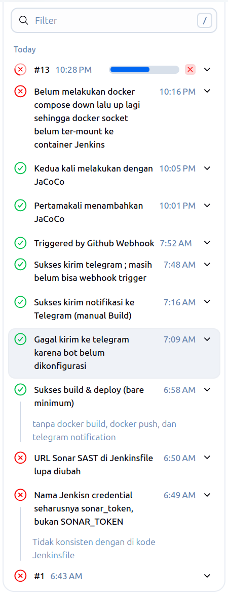

---
[🏠Back to Course Lists](https://odp-bni-330.github.io/)
