<!-- Dirangkum oleh : Bostang Palaguna -->
<!-- Mei 2025 -->

> Fasilitator : Ferli (Cilegon, Lead SW engineer - ML KS)

# OWASP Intro

OWASP : komunitas global yang buat _project_, _standard_, dan edukasi ttg keamanan aplikasi.

IT security ➡️ layer network (L4, L5)
Developer ➡️ L7

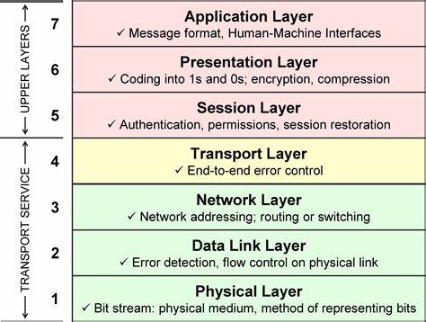

## SDA & proyek penting:
1. OWASP Top 10
2. ...

## Alat Utama
1. ZAP (Zed Attack Proxy)
    penetration testing, QA testing
2. Juice Shop
    website untuk belajar
3. ...

## Beberapa Framework OWASP
## Software Assurance Maturity Model (SAMM)
-> konteks u/ cakupan software security & good security practice:
- Governance
- Design
- Implementation
- Verification
- Operations

fondasi keamanan software : fungsi bisnis.

### Confidentiality, Integrity and Availability (CIA) triad
-> keamanan pada dasarnya:
- siapa yg bisa berinteraksi dgn informasi
- apa yg mereka bisa lakukan dgn informasi
- kapan mereka berinteraksi dgn informasi

CIA bisa diperluas ke AAA : Authorization, Authentication and Auditing.

C : protection of data against unauthorized disclosure;
    memastikan bahwa hanya pihak yg ber-otoritas yg bisa akses data (rest / transit).
    data privacy.

I : protecting data against unauthorized modification
    memastikan _data trustworthiness_
    source integrity 
A : ensure presence of information or resources. 
    replication of data
    protection of the services that provide access to the data -> load balancing.


## OWASP Top 10


### 1. Broken Access Control
➡️ isu yang masih bertahan sejak 2003.

tidak memberi akses yang _proper_ ke user.
e.g. _user_ bisa akses _dashboard admin_.

mekanisme : _bypass check_ (modifikasi URL parameter, token JWT), IDOR, _privilege escalation_.
e.g. akses endpoint `\admin` ; ubah `user_id=123` ke `user_id=456`

_Indirect object reference_ (IDOR)

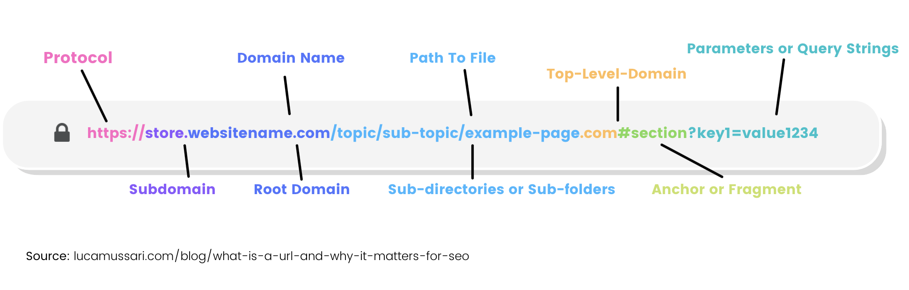

**preventif**:
1. RBAC (_role-based-access-control_)
2. prinsip _least privilege_
3. manajemen sesi yg tepat
4. ACLs (access control list)
    biasa dipakai untuk _internal tools_

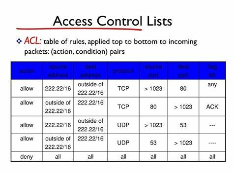

**autentikasi** : kamu boleh masuk/tidak
**otorisasi** : setelah masuk, apa saja yang bisa diakses

_access control_ ➡️ isu otorisasi.

### 2. Cryptographic Failures
akibat enkripsi lemah/tdk ada.
    contoh algoritma enkripsi **lemah** : `SHA-1`, `MD5`.

algoritma enkripsi **kuat** yang dipakai sekarang : `AES-256` Encryption

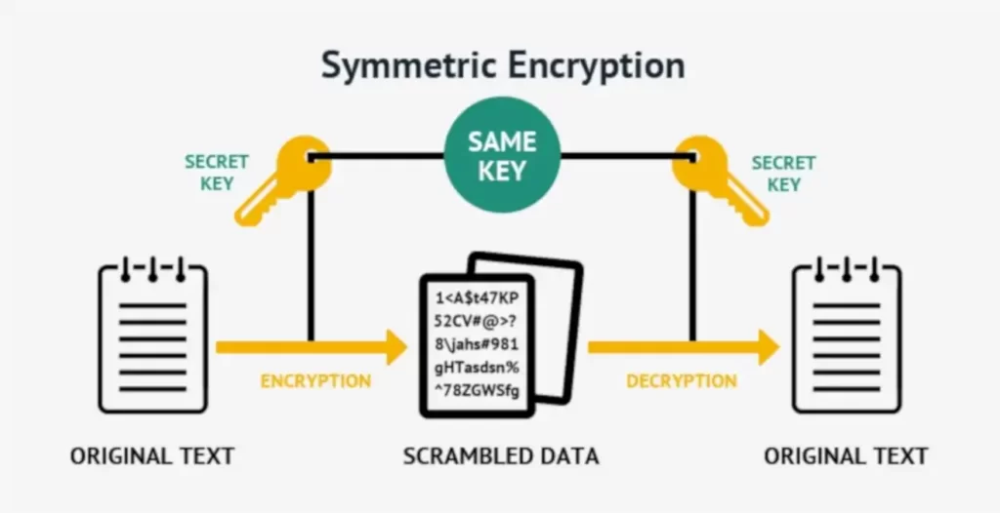

contoh : app simpan CVV tanpa enkripsi.

**Preventif**:
1. pakai algoritma enkripsi kuat : `AES/RSA`, `Blowfish`
2. Update pustaka kriptografi
3. manajemen kunci tepat
4. protokol aman (HTTPS/TLS)

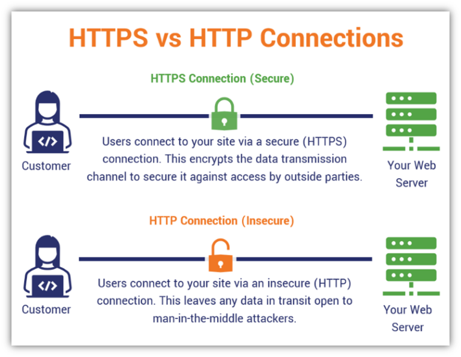

### 3. Injection
➡️ _attacker_ eksekusi program di sistem akibat input yang tidak divaldasi
contoh :
- SQLi (modifikasi query database)
- OS command injection (jalankan perintah sistem)
- SSTI (server-side template injection)

contoh : [' or 1==1 --](https://stackoverflow.com/questions/60939830/sql-injection-or-1-1-vs-or-1-1)

**preventif**:
- validasi input
    contoh:
    - panjang data dibatasi (e.g. max 20 karakter)
    - tipe data
- parameterized queries
    ORM tools by default sudah parameterized ➡️ bisa mengatasi SQLi
- sanitasi data
    mengubah simbol menjadi bentuk ascii/UTF-8 ➡️ untuk menghindari eksekusi kode.


### 4. Insecure design
- arsitektur software yang tidak aman
- insecure password reset

contoh nyata : (2019) : instagram password 250 kali hanya utk 1 perangkat/IP. buat vm / cloud instances 4000 ➡️ bisa attempt 250 x 4000 kali.

preventif:
- pelajari incident report perusahaan lain u/ tdk mengulangi kesalahan yg sama

### 5. Security misconfiguration
➡️lupa mematikan debug mode di environment production ➡️ NASA/Jira 


### 6. Vulnerable & Outdated components
maintain _dependecy_.
Jangan gunakan library 3rd party yg _vulnerable_.

preventif:
1. SBOM (software bill of material) 
    list library yg dipakai, tahun install, end-of-life, dan versinya 

### 7. Identification & Authentication failures

- brute-force password lemah
- session fixation/hijacking
- dictionary attack
    quickly running through a list of commonly used words, phrases, and number combinations.
- social engineering

preventif:
1. gunakan sandi kuat➡️ bisa pakai fitur generate password
2. MFA
3. rate limiting

### 8. Software & Data integrity failures

Subresource Integrity (SRI) : integrity version ➡️ otomatis kunci versi tertentu di JS.

```html
<script src="https://cdn.example.com/library.min.js"
        integrity="sha384-oqVuAfXRKap7fdgcCY5uykM6+R9GqQ8K/ux6q9g+8z5p6a6K9g6K9g6K9g6K9g6"
        crossorigin="anonymous"></script>
```

### 9. Security Logging & Monitoring Failures
kesalahan:
    - eksposur data berlebihan
    - tidak ada log sama sekali
log :
    - data sistem
    - data user

preventif:
- testing di luar jam aktif
- pastikan semua aktivitas penting tercatat

### 10. XSRF (cross-side request forgery)
_app_ ambil sumber daya jarak jauh tanpa validasi URL
misal : lewat SSH masuk ke cloud kita (AWS, GCP, dll.)


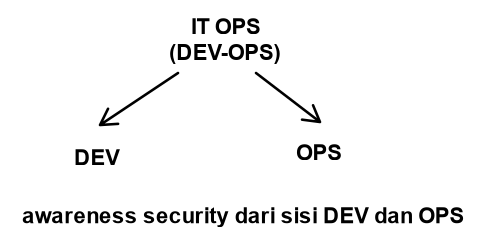

# Secure Coding Best Practices

## Risiko keamanan Utama dalam JS
1. XSS
2. SQLi
3. CSRF
4. Session Hijacking
5. Broken Auth
5. Password Lemah

## Prinsip dasar penulisan kode aman
1. **validasi** semua input
2. escape output sesuai konteks ➡️ hindari XSS
3. gunakan manajemen sesi yg aman

## Top 10 web application threats
1. input validation
2. output encoding
3. authentication & password mngmt
4. session mngmt
5. access control
6. cryptographic practices
7. error handling & logging
8. data protection
9. communication security
10. system config

### Input validation

storage di sisi client (browser):
- local storage
- session
- cookies

storage di sisi server :
- cache 


authentication (role mngmt):
backend => bertanggung jawab dgn DB
frontend => bertanggung jwb dgn input user


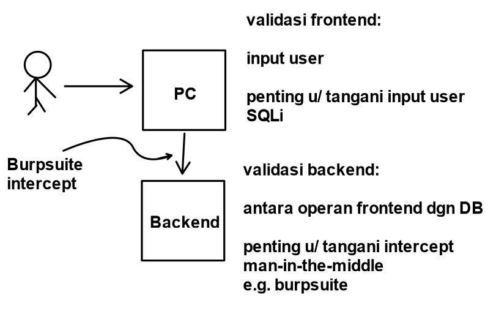

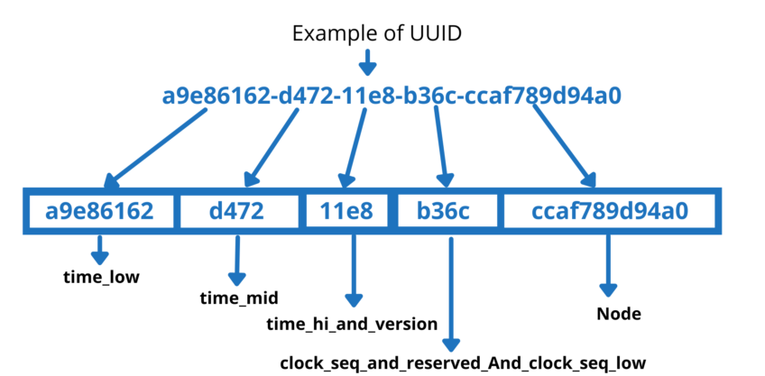

kapan menggunakan `uuid` ketimbang `id` biasa? untuk mencegah bruteforce access.

# web Security
**SDLC**:
plan - STA
dev - dev
test - DevOps
deploy - SRE

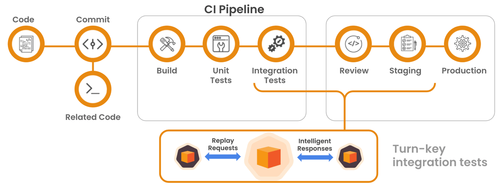

# SonarQube
SonarQube ➡️ untuk analisis _sourcecode_. (static analysis)
- Cara Menjalankan server
```bash
node app.js
```


- Testing melempar request dari client
➡️bisa menggunakan `Postman` atau `curl`
    - contoh dengan `curl`:

    - contoh testing dengan `postman`:


**code coverage**

setiap baris kode harus dilakukan _unit test_.

```pseudocode
IF (A and B and C)
{
    ...
}
```

maka ada $2^3$ _case_.
tim _ops_ manage code coverage.


tahapan penggunaan sonarQube : 

1. _Analyze new project_

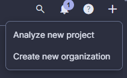

2. Pilih **previous version**
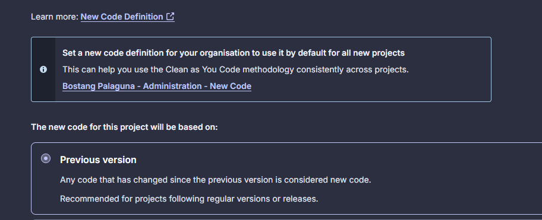

Contoh hasil analisis dari sonarQube:
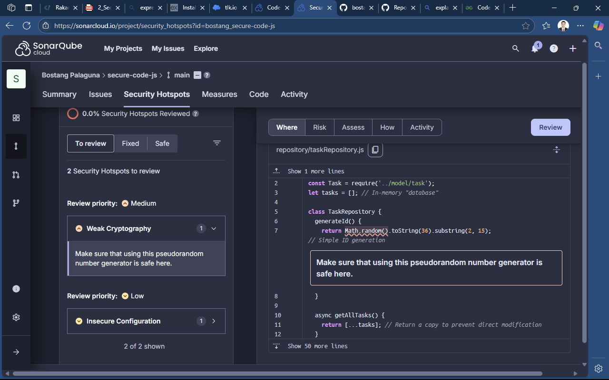

## Aspek SonarQube

- **security**
    Tingkat kerentanan keamanan (vulnerabilities) dalam kode yang dapat dieksploitasi oleh serangan eksternal, seperti SQL injection, XSS, atau penggunaan dependensi yang tidak aman.  
- **reliability**
    berfungsi tanpa kegagalan (bug) yang menyebabkan crash atau perilaku tidak terduga.  
- **maintainability**
    Kemudahan memahami, memodifikasi, dan memperluas kode. Termasuk kompleksitas dan technical debt.
- **accepted issues coverage**
    Persentase issue (bug, kerentanan, dll.) yang telah ditandai sebagai *Accepted* (diterima/diabaikan) oleh tim developer.  
- **duplications**
    Tingkat duplikasi kode (potongan kode yang identik atau hampir sama di beberapa lokasi).  
- **security hotspots**
    Potensi kerentanan keamanan yang memerlukan **review manual** untuk memastikan apakah benar berbahaya.


# Referensi Tambahan
[PCI-DSS](https://digitalsolusigrup.co.id/pci-dss-adalah/)
[burpsuite](https://portswigger.net/burp/communitydownload)
[Crackstation](https://crackstation.net/)
[Akamai](https://www.akamai.com/)
    ➡️ tools u/ monitor request masuk dari mana sebelum masuk ke aplikasi
[Terraform](https://developer.hashicorp.com/terraform)
