<!-- Dirangkum oleh : Bostang Palaguna -->
<!-- Mei 2025 -->

# Softskill : Critical Thinking in IT

## DevOps

- Dev
- Sec
- Ops
- QA
➡️DevSecOps

### CI-CD Pipeline

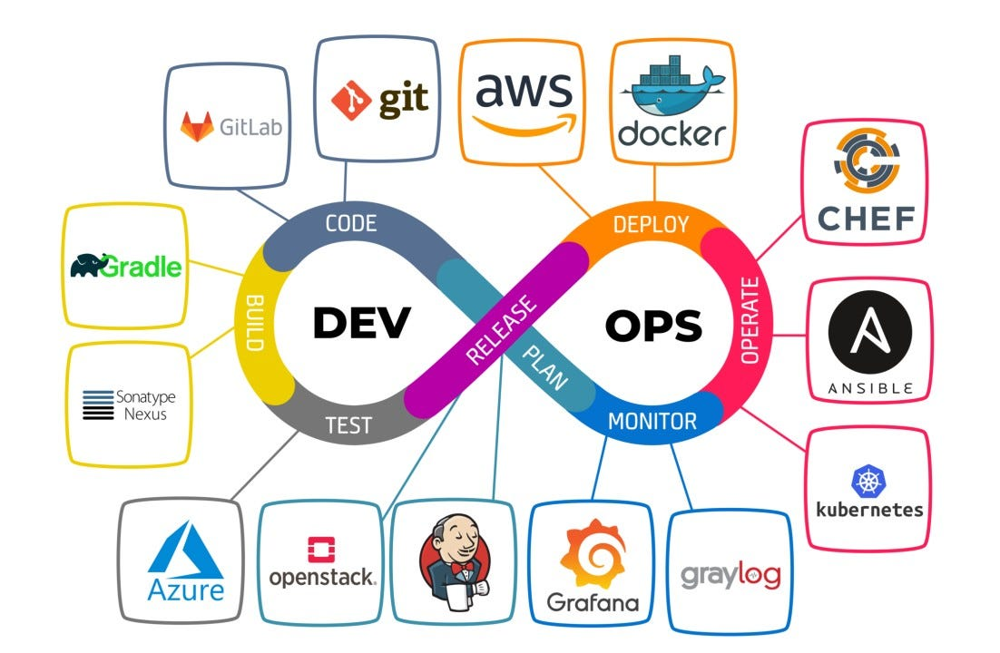

### DevOps vs Platform Engineer vs SRE

- DevOps ➡️ jembatan dev dan ops.
- Platform Engineering
- SRE

- **DevOps**: Filosopi kolaborasi antara tim development dan operations untuk otomatisasi CI/CD, mempercepat rilis software.  
- **SRE (Site Reliability Engineering)**: Implementasi DevOps dengan pendekatan engineering (SLA, error budget, observability) untuk menjaga keandalan sistem.  
- **Platform Engineer**: Membangun/mengelola internal platform (tools, infra) agar developer bisa deploy dan operasi aplikasi secara self-service.  

**Perbedaan utama**:  

- DevOps = Kultur + proses  
- SRE = Praktek operasional berbasis keandalan (reliability)  
- Platform Engineer = Fokus pada pembuatan platform untuk mendukung DevOps/SRE.

DevOps ➡️ kental dengan `scripting`
Dev ➡️ kental dengan `programming`.

DevOps Engineer:

- IaC
- CI&CD
- Automation
- Deployment
- Collaboration
SRE :

- SLOs
- reliability
- monitoring
- availability
- incident response

Platform Engineer:

- service orchestration
- cloud infrastructure
- countainerization
- scalability
- ALM

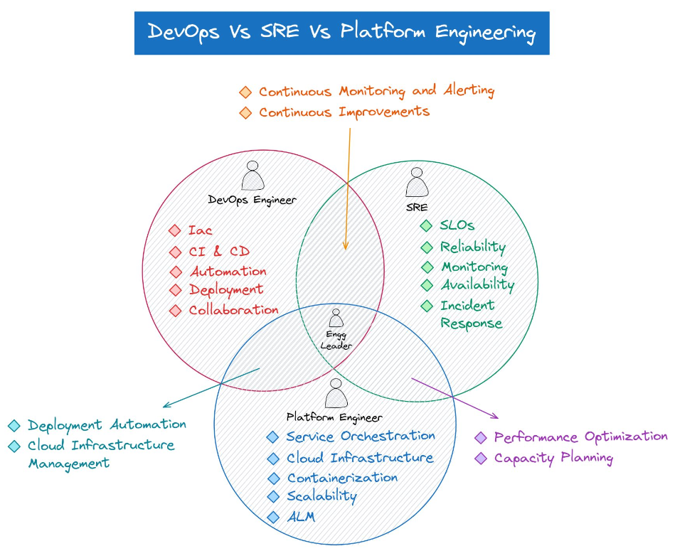

## Thinking Frameworks

Framework :

- First Principle thinking
 ➡️tools untuk bisa beradaptasi secara cepat namun mendalam
- Pareto Principle : 20% effort generates 80% important results.

e.g. baca 20% incident response orang dpt memengaruhi 80% pekerjaan kita.

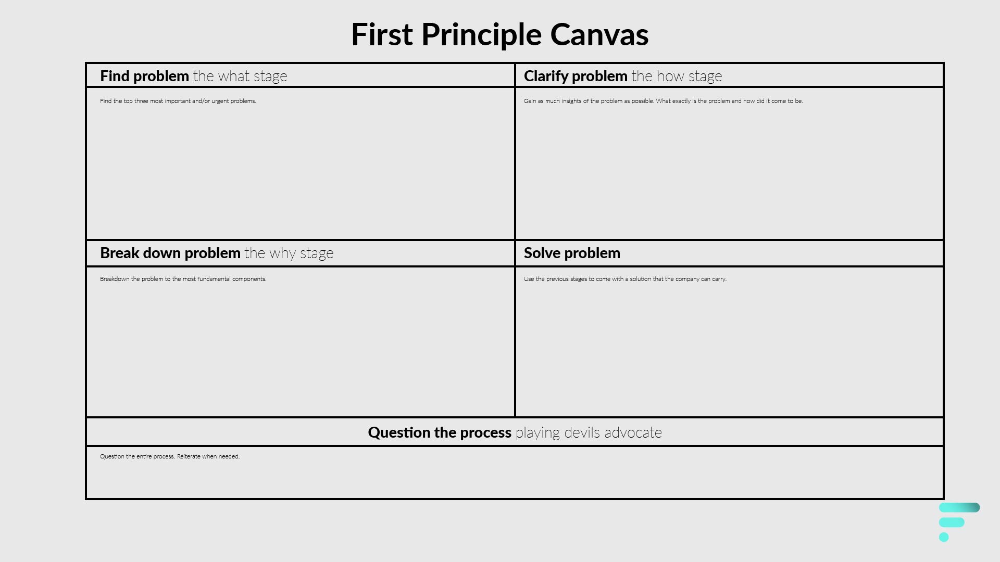

contoh penerapan : dituntut untuk mempelajari bahasa pemrograman baru.

melakukan _skimming_ kemudian menemukan istilah-istilah yang kita tidak pahami / tidak tahu. Istilah-istilah yang tidak tahu tersebut diperdalam kemudian di-_breakdown_.

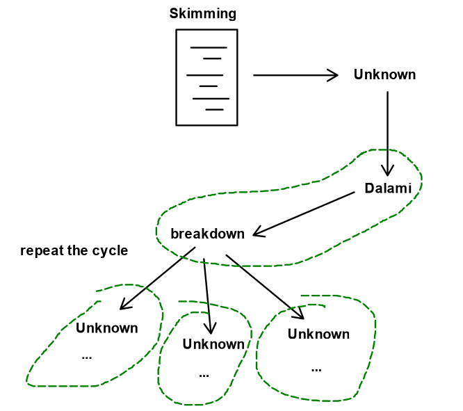

**Penerapan** :

1. Cari 1 hal yang tidak tahu
2. Skimming sebuah tutorial tentang hal itu
3. Catat hal-hal yang tidak dipahami
4. Ulik hal-hal yang tidak dipahami tersebut
5. Catat hal-hal yang tidak diketahui saat langkah 4
6. Ulangi langkah 4 dan 5

### Root Cause Analysis (RCA)

[Belajar dari Gojek](https://www.gojek.io/blog/why-we-swear-by-the-rca): RCA membantu GOJEK menemukan penyebab utama masalah tech dan memperbaikinya secara permanen, alih-alih hanya mengatasi gejala. Ini adalah kunci untuk membangun produk yang stabil dan scalable.

### Five-whys

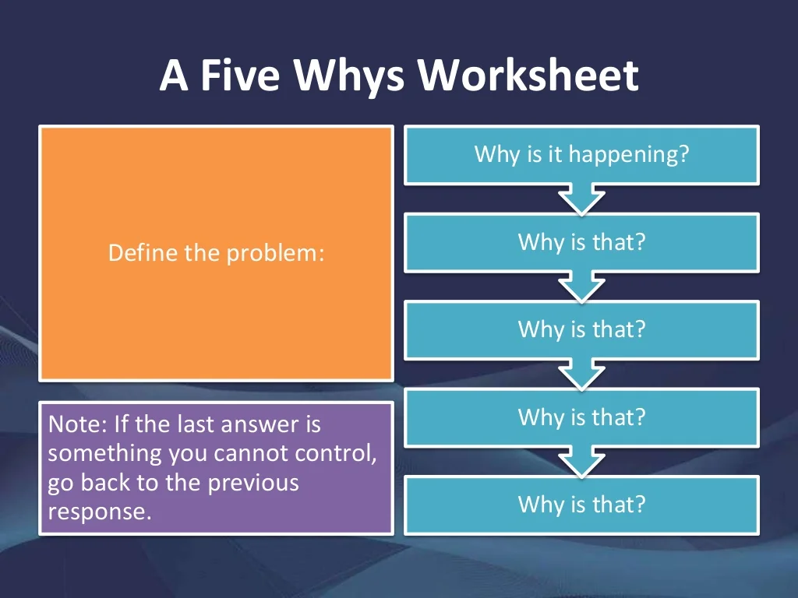

[Belajar Incidence response dari Tokopedia](https://medium.com/tokopedia-engineering/embracing-on-call-system-in-software-development-process-c74b030e6565) : menerapkan Sistem on-call.
➡️ praktik di mana engineer secara bergiliran bertanggung jawab menangani insiden atau masalah produksi di luar jam kerja normal. Tujuannya adalah memastikan ketersediaan (availability) dan keandalan (reliability) layanan.

On-call system Tokopedia ➡️ ketika ada incident (misal traffic naik 200%), maka sistem secara otomatis melakukan telepon ke tim Dev dan Ops.
 ➕ mitigasi sangat cepat
 ➖ mengganggu kesehatan mental orang2 Dev & Opsnya.

**Incidence response procedure**:

1. Alert
2. Triage
3. Notify
4. Investigation
5. resolution
6. documentation

ketika ada suatu permasalahan, selesaikan dulu. Lalu kemudian cari akar permasalahannya.
mitigasi.

## ZAP

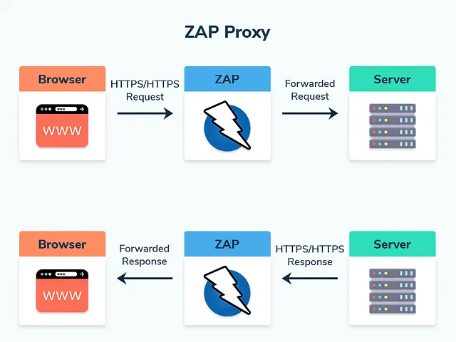

dari browser set proxy sehingga traffic antara browser dengan server harus melalui ZAP terlebih dahulu. Konsepnya mirip dengan VPN.

Tampilan Network tools pada Inspect element:
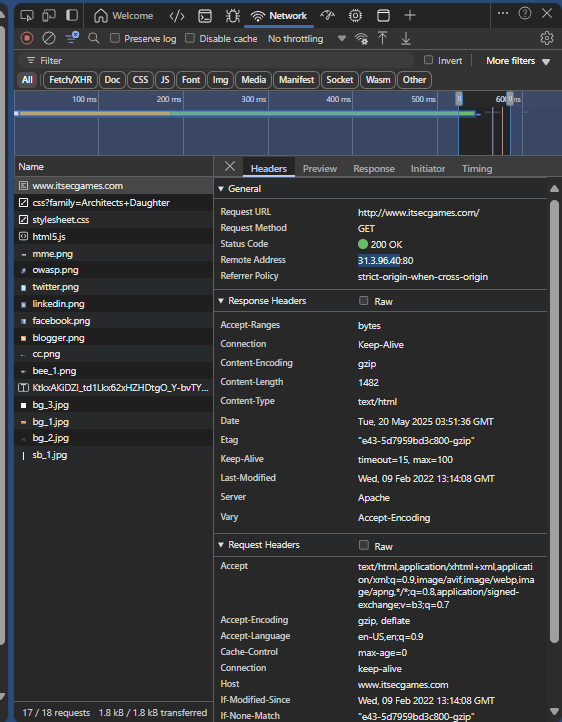

**Cara menjalankan** :
gunakan `Spider` ➡️ tools untuk crawlinng

`Tools > Client Spider > masukkan URL > start scan.`

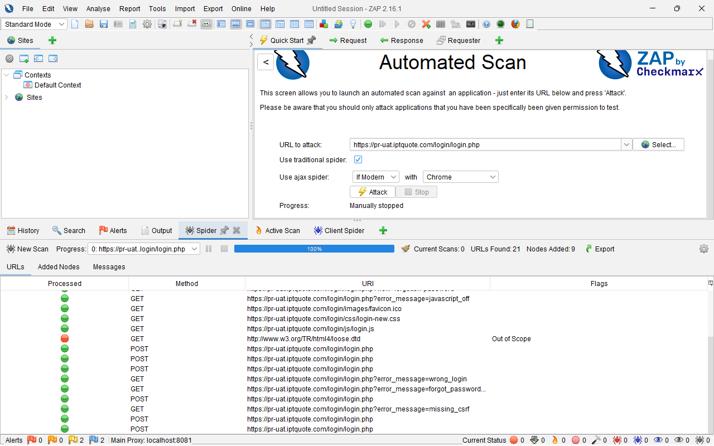

zap mampu mendeteksi sub-URL lain

salah satu metode untuk _information gathering_ adalah dengan _scanning_.

tools di ZAP untuk manipulasi HTTP request (seperti di postman) ➡️ `Fuzz`.

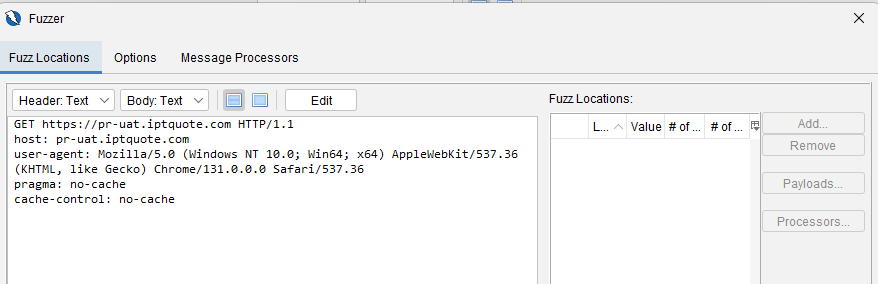

`Tools > Active scan`. ➡️ simulasi attacking ➡️ tahapan terakhir sebelum melakukan pentest

kalau bisa, _active scanning_ dilakukan di _isolated environment_ (misal localhost)

> ⚠️ Active Scanning dengan OWASP ZAP dapat menimbulkan potensi suatu server down, sehingga harus berhati-hati dalam menggunakannya.

## OWASP Juice Shop & DVWA

> langkah awal : scoreboard

[OWASP Juice Shop](https://preview.owasp-juice.shop/#/score-board) ➡️ sebuah playground untuk _testing vulnerabilities_.

alternatif : [DVWA](https://github.com/digininja/DVWA)

> ⚠️ DVWA dan Juiceshop dirancang untuk tidak secure. Apabila ingin _hands-on_, lakukan di _environment_ terisolasi seperti _virtual machine_ atau _docker_.

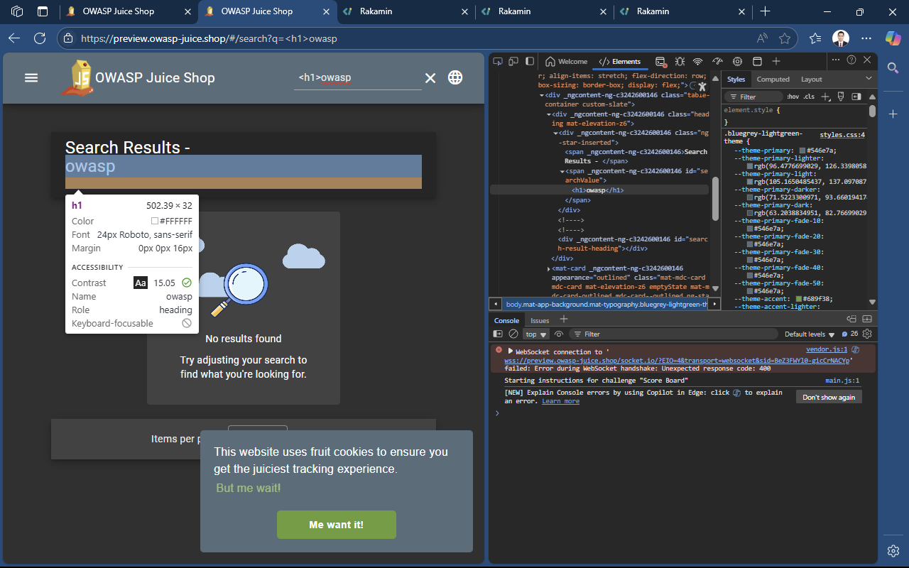

di kolom search, coba masukkan:

```html
<script>alert(xss)</script>
```

```html
<iframe src="javascript:alert('xss')">
```

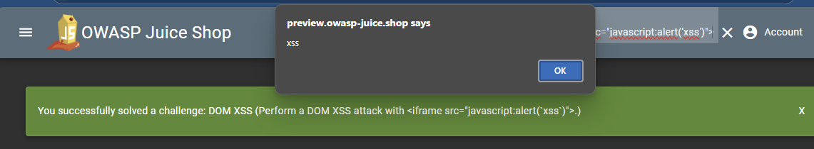

ini menunjukkan website kita rentan dengan script injection.

metode crawling dengan ZAP :

- Spider  ➡️ works untuk website sederhana
- AJAX Spider  ➡️ works untuk website zaman jadul
- Client Spider ➡️ untuk web modern (component based) ; crawling dari virtual DOM (component)

## Referensi Tambahan

[Contoh incident response (google)](https://status.cloud.google.com/incident/zall/20013)

[Contoh Incident Responses](https://github.com/danluu/post-mortems?tab=readme-ov-file)
[Tokopedia Summit 2022](https://medium.com/life-at-tokopedia/tokopedia-start-summit-2022-bringing-tech-learning-to-the-next-level-3c9dc3653f82)

---
[🏠Back to Course Lists](https://odp-bni-330.github.io/)
