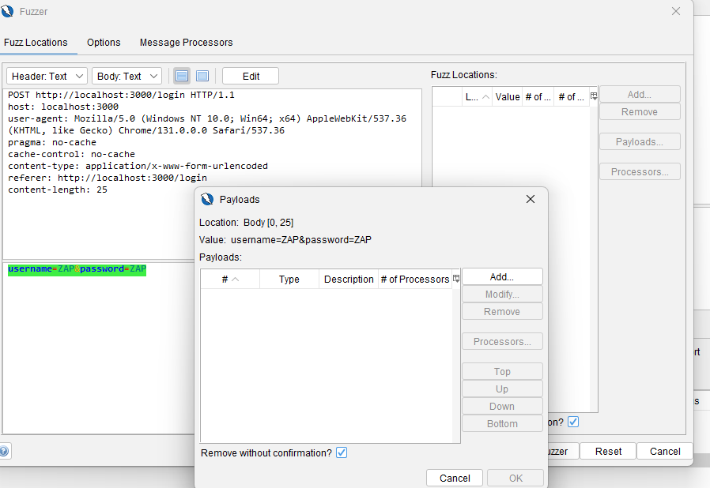

<!-- Dirangkum oleh : Bostang Palaguna -->
<!-- Mei 2025 -->

# Tahapan Penggunaan
## Instalasi
### LANGKAH 0
pindah ke direktori

### LANGKAH 1
```bash
git clone https://github.com/verlym/vuln-app
```

### LANGKAH 1.5
```bash
Set-ExecutionPolicy -Scope Process -ExecutionPolicy Bypass
```

### LANGKAH 2
```bash
npm install
```

### LANGKAH 3
```bash
node server.js
```


---
## Information Gathering

1. Buka Zap

2. Tools > Spider

3. 


4. Tools > Fuzzing


5. add payload




apabila ada input yang mengakibatkan respons selain 200, maka : `tools > Manual Request Editor..`

seperti postman, kita bisa atur sendiri payload, header, body, etc.


## Pentesting 
1. `Tools > Active Scan`


