<!-- Dirangkum oleh : Bostang Palaguna -->
<!-- Mei 2025 -->

# Spring

Spring ➡️ _framework_

- akan menyusun sendiri struktur foldernya
- di springboot tidak perlu melakukan instalasi library secara manual. kita tidak perlu mengurus _dependency_. (sudah ada _dependencies management_)
- memiliki fitur _auto-configuration_ : **Automagic Setup**
  ➡️developer dapat fokus ke mengembangkan fitur, bukan setup project.

## Fitur Springboot

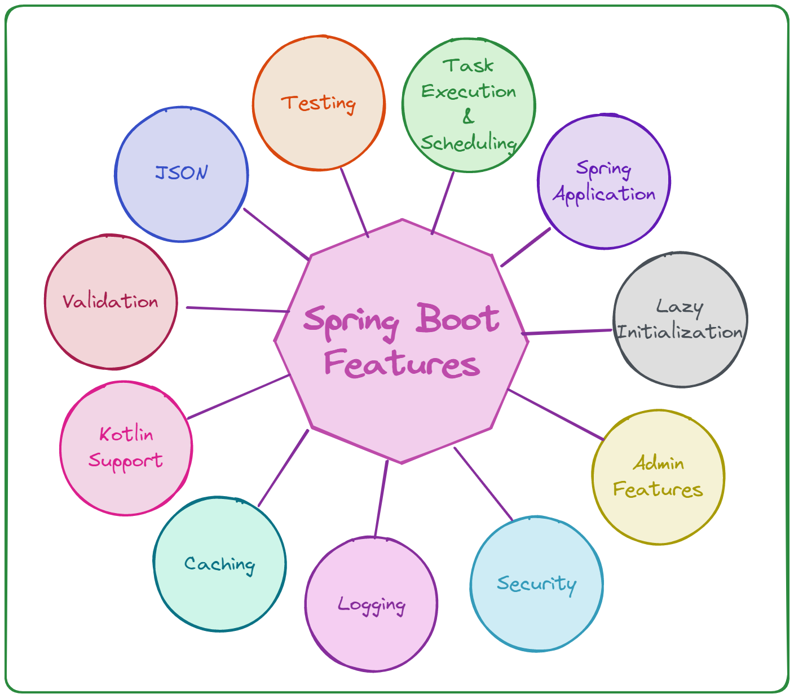

## Layered Architecture

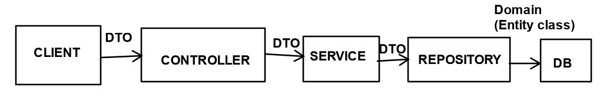

Springboot mengikuti _layered architecture_:
`presentation` > `business logic` > `data access`

- `presentation` layer : user interface
  ➡️ dlm model MVC : controller classes
- `business logic` (application) layer : decisions, calculations, evaluations, processing data between other layers
  ➡️ service classes
- `data access` layer : interact w/ DB
  ➡️ repository classess

Fungsi **controller**:

- terima input
- validasi input

contoh flow: spring boot MVC web app w/ Thymeleaf (frontend/client)

```diagram
Browser ➡️(1) employee controller ➡️(2) employee service ➡️(3) employee repository ↔️(4) DB (model)
                    ↩️(5)
```

(1) spring controller receive HTTP request f/ browser
(2) spring controller porcess request & send to service layer
(3) service layer
(4) repository layer
(5) spring controller return view (JSP / thymeleaf)

alur interaksi user dari depan (_controller_), namun implementasi / _development_ dari belakang (_model_)

- controller classes
  ➡️receive input, validate data, return views
- service classes
  ➡️core business logic ; bridge between controllers & repositories ; ensure modularity & reusability
- repositiory classes
  ➡️CRUD f/ DB, abstracting low-level detail for cleaner code

### Springboot annotation

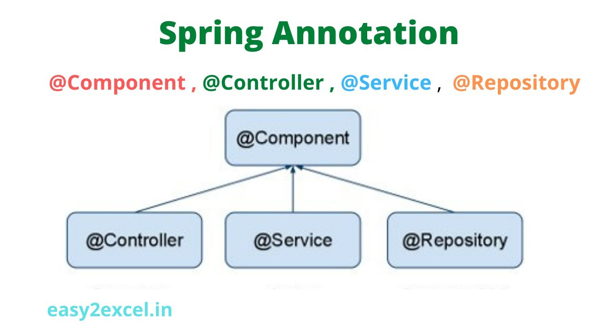

`@SpringBootApplication` ➡️ mainclass

Menggunakan fitur **Code Generator (Java)** di VSCode:
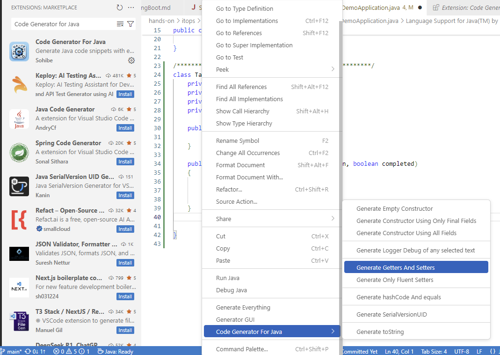

## Tahapan Membuat Project

**Langkah 1**. BUKA [start.spring.io](start.spring.io)

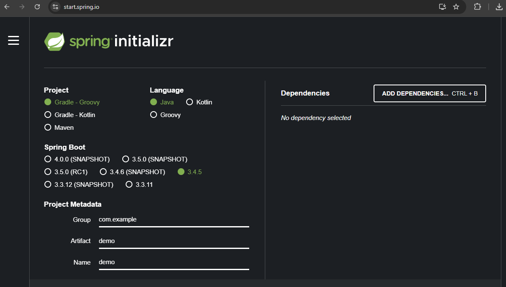

**Langkah 2**. Konfigurasi Proyek
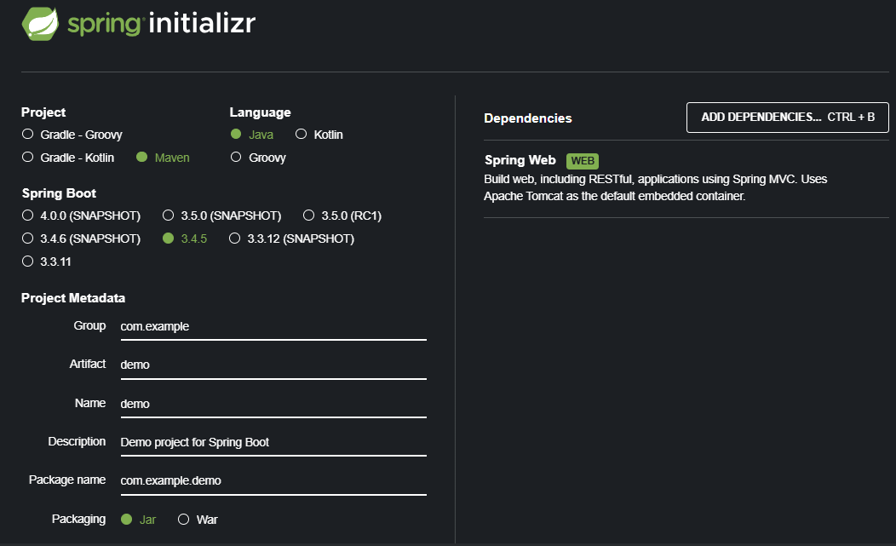

`group` : biasanya nama _company_.
`artifact` : fitur yang mau diimplementasikan.

**Langkah 3**. Tambahkan _dependencies_ yang dibutuhkan

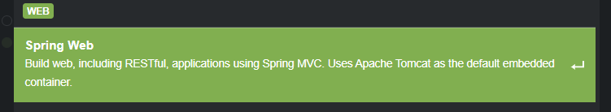

**Langkah 4**. klik **generate**, maka akan mendownload sebuah file `.zip`'

**Langkah 5**. jalankan perintah running

```bash
./mvnw clean install
```

**_common issues_** :

1. di langkah 1, masih memilih `Gradle - Groovy` alih-alih `Maven`
2. Memilih versi Java yang tidak sesuai
➡️pastikan ketika di langkah 1, memilih versi Java sesuai yang kita punya

- cek versi JDK yang kita punya :
```java --version```

- cek versi java yang digunakan di maven:
```mvn -v```

- cara mengubah versi java:
atur `JAVA_HOME` di environment variabel, tambahkan `%JAVA_HOME%\bin` ke path.

## Menambahkan Dependency setelah Project sudah dibuat

modifikasi `pom.xml`

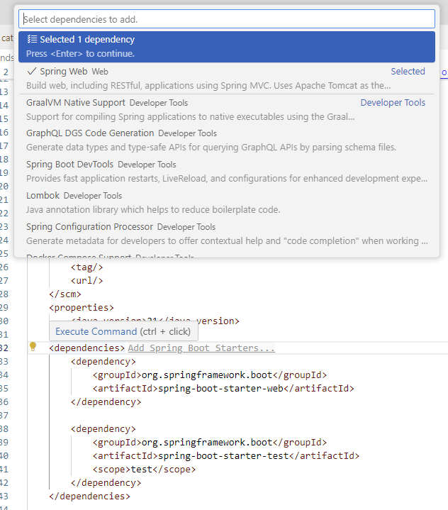

## Mengatur konfigurasi

`resources` > `application.properties`

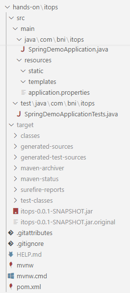

## Tahapan Menjalankan Aplikasi

**Lankgah 0**. Buat project (dengan bantuan `Spring Initializr`)
**Lankgah 1**. modifikasi `~/src/main/`
**Lankgah 2**. kompilasi  dengan :

```bash
./mvnw clean install
```

**Langkah 3**. jalankan dengan:

```bash
./mvnw spring-boot:run
```

**_common error_**:
port 8080 sudah terpakai

**solusi** : ubah port di `application.properties`
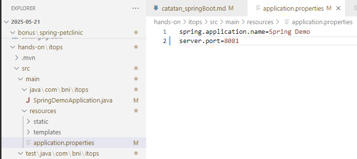

## HTTP CLient Extension VSCode

Percobaan _send request_ dapat dilakukan pada VScode dengan menggunakan extension : `HTTP Client`
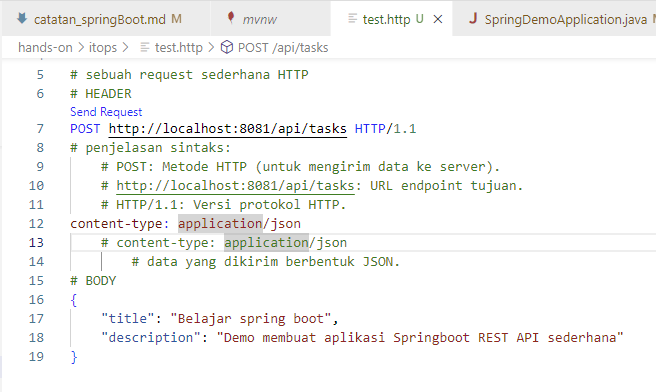

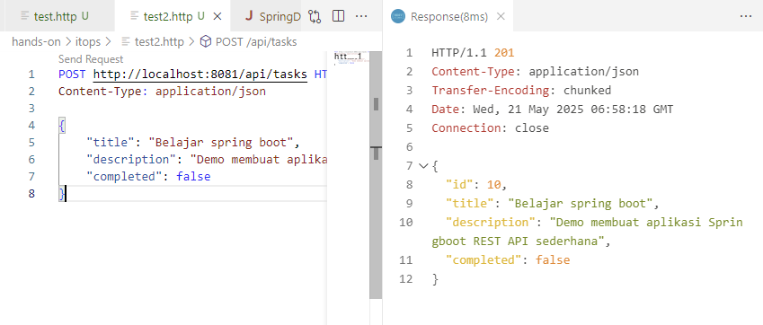

alternatif lain : Menggunakan `Postman`.
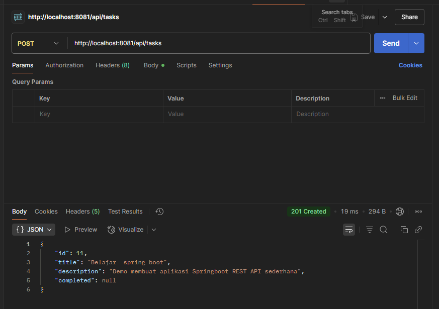

>💡 Tips : `ctrl + [CLICK]` garis bawah merah error lalu _quick fix_ > _add all missing import_

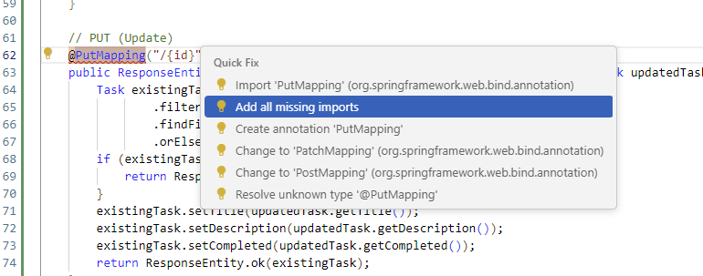

---

## Catatan Tambahan

|                         **Annotation**                         |                                                   **Short Desc.**                                                   |
|:--------------------------------------------------------------:|:-------------------------------------------------------------------------------------------------------------------:|
| `@SpringBootApplication`                                       | bootstrap a Spring Boot application. combines : `@Configuration`, `@EnableAutoConfiguration`, and `@ComponentScan`. |
| `@RestController`                                              | indicate that a class is a RESTful controller                                                                       |
| `@RequestMapping`                                              | map web requests to specific handler methods                                                                        |
| `@Autowired`                                                   | automatically wire dependencies in Spring beans                                                                     |
| `@Component`                                                   | indicate that a class is a Spring bean                                                                              |
| `@Service`                                                     | a class is used for business logic                                                                                  |
| `@Repository`                                                  | a class is used for database access                                                                                 |
| `@Value`                                                       | inject values from properties files                                                                                 |
| `@EnableAutoConfiguration`                                     | enable Spring Boot’s auto-configuration mechanism                                                                   |
| `@GetMapping`, `@PostMapping`, `@PutMapping`, `@DeleteMapping` | specific HTTP methods to handler                                                                                    |
| `@PathVariable`                                                | bind a method parameter to a path variable                                                                          |
| `@RequestParam`                                                | bind a method parameter to a request parameter                                                                      |
| `@RequestBody`                                                 | bind the request body to a method parameter                                                                         |
| `@Qualifier`                                                   | specify which bean to inject                                                                                        |
| `@ConditionalOnProperty`                                       | conditionally enable or disable a bean or configuration                                                             |
| `@Scheduled`                                                   | schedule the execution of a method                                                                                  |

---
[🏠Back to Course Lists](https://odp-bni-330.github.io/)
