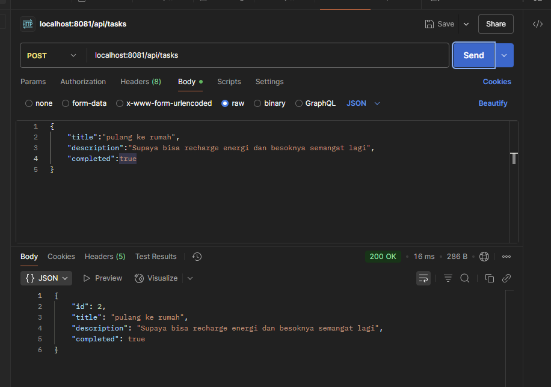

<!-- Dirangkum oleh : Bostang Palaguna -->
<!-- Mei 2025 -->
# ORM
_object relational mapping_
➡️jembatan antara RDB dgn kode OOP.
memungkinkan untuk interaksi dgn DB tanpa query SQL langsung


**mengapa menggunakan ORM?**
1. interaksi sederhana w/ DB
2. kurangi kode _boilerplate_
➡️ menulis query langsung
3. abstraksi DB
4. tingkatkan pemeliharan kode
5. percepat pengembangan


**model adalah representasi database**
kelas ➡️ tabel
properti ➡️ kolom tabel
instance ➡️ baris tabel


contoh:

Perbandingan sintaks SQL dan ORM
SQL
```sql
CREATE TABLE pengguna(
    id  INT PRIMARY KEY,
    nama    VARCHAR(255),
    email   VARCHAR(255)
);
```

ORM (Java)
```java
class Pengguna{
    constructor(id, nama, email){
        this.id = id;
        this.nama = nama;
        this.email = email;
    }
};
```

- create

```sql
INSERT INTO pengguna(nama, email) VALUES('Budi','budi@email.com');
```

```java
User savedUser = userRepositoiry.save(newUser);
```

- read
```sql
SELECT * FROM penggna WHERE id = 1;
```

```java
Optional<User> userOptional = userRepository.findById(1);
```

- update
```sql
UPDATE pengguna SET nama = 'Budi Santoso' WHERE id = 1;
```

```java
Optional<User> userOptional = userRepository.findById(1);
userOptional.ifPresen
```

- delete
```sql
DELETE FROM pengguna WHERE id = 1;
```

```java
userRepositoiry.deleteById(1);
```

## Method ORM yang penting


## Sprinng Boot - Spring Data JPA
JPA : Java Persistance API


### Model Layer
POJO

`@Entity` : kelas dapat dipetakan ke tabel
`@Id` : priary key
`@GeneratedValue` : strategi pembuatan key yg dipakai

```java
@Entity
public class Employee{
    // @Id : menandakan primary key dari entity

    // @GeneratedValue : strategi inkremen primary key
    @Id
    @GeneratedValue(strategy = GenerationType.AUTO)
    private long id;    // primary key
    private String name;
    private String city;
}
```

### Repository Layer
`@Repository`
```java
@Repository
public interface EmployeeRepository extends
JpaRepository<Employee, Long>{

}
```

PostgreSQL, MySQL ➡️ persistent DB ➡️ tersimpan di HW.

Springboot ➡️ H2 database ➡️in-memory (disimpan di RAM). _temporary_.


**Beberapa kesalahan dalam logging**:
1. menampilkan data yang seharusnya tidak terlihat (informasi sensitif) di logging
2. mis-informasi ➡️ apa yang seharusnya tampil sebagai `ERROR` malah ditampilkan sebagai `INFO` atau sebaliknya.
3. banjir informasi ➡️ dapat menyebabkan sistem kehabisan storage.

# (HANDS-ON) Spring JPA
**Cara membuat project Springboot dari Spring Initializr di dalam VSCode**

1. `ctrl + shift + P`
2. cari `spring Initial..`
3. `create Maven Project`

**Cara cepat buat Class (JAVA) baru**:


**Tips untuk handle error**:


**Testing kirim request (POST) dari `Postman`**:


**Testing kirim request (GET) dari `Postman`**:


**Akses Dashboard DB H2**
untuk akses database : buka browser dan lalu akses : http://localhost:8081/h2-console/


pastikan driver class, jdbc url, username, dan password sama dengan yang tertera di `application.properties`.

**menu login H2**


**Query untuk dapatkan semua elemen di DB**


**Update DB dengan query (insert element)**


**Hapus elemen dengan Postman**
untuk menghapus, tambahkan `/{id}` di akhir end point


**Update elemen dengan Postman**
untuk mengupdate, gunakan `/{id}` di end point lalu tambahkan: body request
```json
{
    "title":"...",
    "description:"...",
    "completed":"..."
}
```


**Logging**


---
[🏠Back to Course Lists](https://odp-bni-330.github.io/)