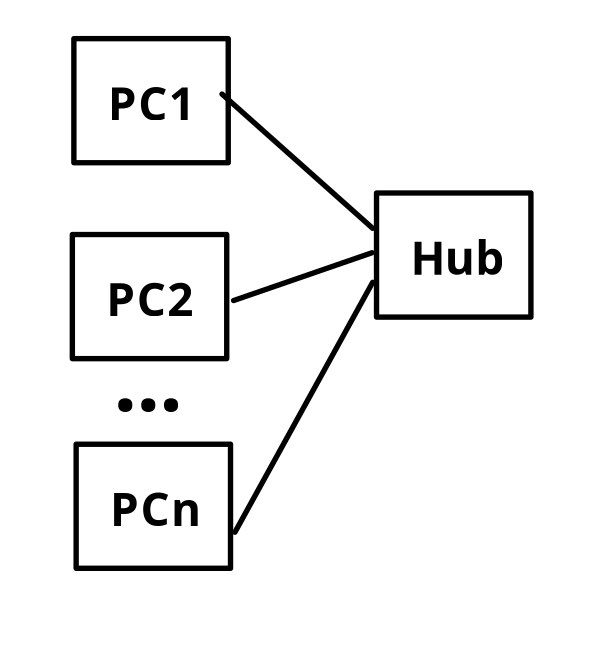
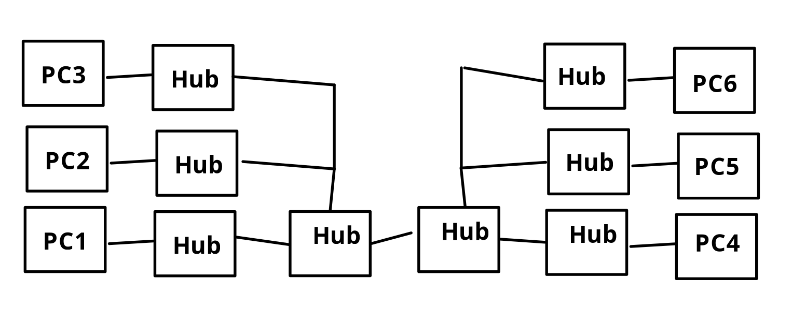
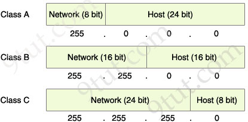
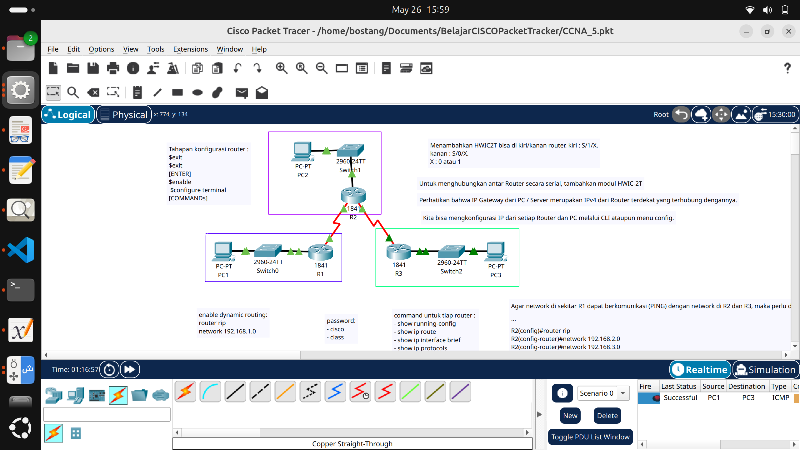
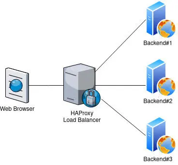
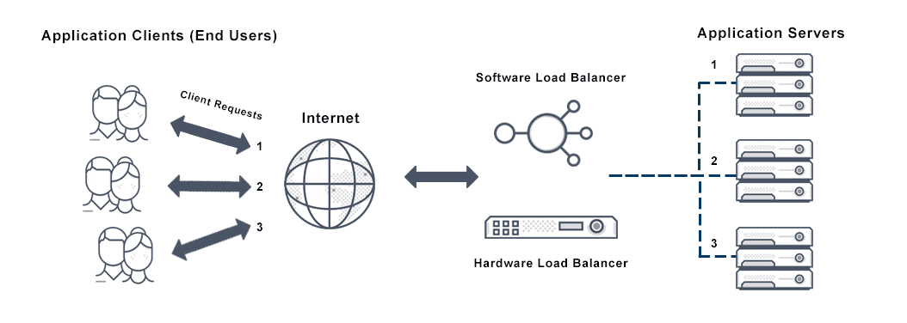

# Networking

## Repeater
- secara fisik sama dengan _switch_
- selalu broadcast
- sekarang dipakai hanya untuk _troubleshooting_



Zaman dulu:



## OSI Layer
- Application → ranah developer → HTTP
- Presentation 
- Session
- Transport     → ranah network engineer
- Network
- Data Link         → MAC
- Physical

## LAN Addressing
- MAC
- Ethernet address
- Burned-in address
- Unicast address
- Broadcast address
- multicast address

dalam 1 network, tiap device memiliki IP yang berbeda.


## IP Subnetting


`127.0.0.0 - 127.255.255.255` → localhost (diri sendiri)

### Private IP
`A` : `1.0.0/18` - `10.255.255.255` 
`B` : `172.16.0/` - `172.31.255.255`
`C` : `192.168.0.0` - `192.168.0.255`

Beli IP untuk _hosting_ sendiri → melalui ISP supaya seluruh dunia bisa akses komputer kita.

## Broadcast address, Jumlah Host, dan Subnet-mask

contoh:
`10.0.0.0/8`
- Network address : `10.0.0.0`
- subnet mask : `/8` (model prefix)
    - dalam model segmen:
    `11111111.00000000.00000000.00000000` → `255.0.0.0`

- jumlah host:`00000000.11111111.11111111.11111111` → $$256 * 256 * 256 = 2^{24}$$
- broadcast address: 
    network address + subnetmask
    `10.0.0.0` + `0.255.255.255` = `10.255.255.255`

alternatif:
gunakan tools **Subnet mask calculator**

# Cisco Packet Tracer
→ Untuk simulasi

download di : [https://www.netacad.com/dashboard](netacad)



# HAProxy
→ The Reliable, High Performance TCP/HTTP Load Balancer


mekanisme : _Round robbin_

A client request is forwarded to each server in turn. The algorithm instructs the load balancer to go back to the top of the list and repeats again.




## Docker
- menampilkan volume yang tersedia
```bash
docker volume ls
```

- membuat volume docker untuk di-mount ke node-js
```bash
docker volume create [nama_volume]
```
contoh:
```bash
docker volume create nodevol
```

- menghapus volume docker
```bash
docker volume rm [nama_volume]
```

- menjalankan mapping
```bash
docker run -it -d --network=host -v [nama_volume]:/[nama_direktori] [link_docker_images]:tag
```
contoh :
```bash
docker run -it -d --network=host -v nodevol:/nodevol ghcr.io/hendram/node:bookworm-slim
    #-d : daemon (run on background)
    #--network = host (berapapun port di host bisa diakses)
    # -p = 90 (mapping ke port 90 → lebih aman)
```

- menampilkan docker yang sedang berjalan
```bash
docker ps # docker process
```

- memberhentikan docker process:
```bash
docker stop [nama_docker]
```

- menghapus docker
```bash
rocker rm [nama_docker]
```

- masuk ke dalam docker container
```bash
docker exec -it [nama_process]
```

contoh:
```bash
docker exec -it elegant_mclean /bin/bash
```

docker → mirip virtual machine tetapi di level user space, bukan kernel space.

- apabila images belum ada sama sekali (belum siap pakai) 
```bash
docker compose
```

desain yang _secure_ : taruh di _docker_ jangan banyak di-host. Kalau yang ter-hack 1 container, maka host tidak akan terpengaruh.

yang mengetahui port backend (3030, 3031) hanya haproxy.
user hanya tahu port haproxy (8080).


## (HANDS-ON) Docker
**tujuan** : membuat beberapa `docker` yang bisa menjalankan `node` di `appsrwback-serverless` kemudian menggunakan `haproxy` untuk load-balancing terhadap request yang dibuat dengan `curl`.

`node.js` untuk _docker optimization_ → bisa menghemat biaya. Bayangkan kalau mau menginstall 100 docker _instances_ → berapa banyak space yang dibutuhkan.

Pre-requisites : sudah menginstall docker di lnux.

### Langkah 0 : Install pre-requisities 
yang perlu disiapkan untuk _hands-on_:
- `bookworm-haproxy`
- `bookworm-appsrwback-serverless`
- `node`

```bash
su                                # untuk akses root
apt update                        # update package repo
apt install docker                # install docker
docker --version                  # cek versi docker yg terinstall
    # download docker images
docker pull ghcr.io/ /node
docker pull ghcr.io/hendram/bookworm-appsrwback-serverless
docker pull ghcr.io/hendram/bookworm-haproxy
docker images                     # cek docker images yang sudah terpasang 
```

### Langkah 1 : Buat volume
tempat kita menginstall `node` yang kemudian akan di-mount ke banyak `appsrwback`
```bash
docker volume create nodevol
```

### Langkah 2 : Export Node ke volume local (nodevol)
```bash
docker run -it -d --network=host -v nodevol:/nodevol ghcr.io/hendram/node:bookworm-slim

# cek nama docker image
docker ps
# masuk ke dalam docker
docker exec -it [nama_image] /bin/bash
# setelah masuk ke docker yang berjalan:
# buat folder /bin dan /lib di nodevol
mkdir -p /nodevol/bin /nodevol/lib

# salin node dan npm ke /nodevol
cp -r /usr/local/bin/* /nodevol/bin/
cp -r /usr/local/lib/node_modules /nodevol/lib/


```

### Langkah 3 : Jalankan appsrwback
#### Langkah 3.1 : Buat server 1 di Port 3000
- membuat server di sebuah port (misal 3000)
```bash
# mount nodevol yang berisi node.js ke appsrwback
docker run -it -d --network=host -v nodevol:/nodevol ghcr.io/hendram/bookworm-appsrwback-serverless bash
docker ps           # lihat apa nama docker imagesnya
docker exec -it [nama_images] /bin/bash

#### TIDAK PERLU DILAKUKAN!
### LAKUKAN INI KALAU MOUNTING /nodevol ke appsrwback gagal saja
# mengapa? karena perlu download node.js lagi -> tidak efisien kuota
# install node.js pada docker terlebih dahulu
# apt update
# apt install curl -y
# curl -fsSL https://deb.nodesource.com/setup_18.x | bash -
# apt install -y nodejs

# setelah masuk ke dalam docker :
# menambahkan nodevol ke path
export PATH=/nodevol/bin:$PATH
export NODE_PATH=/nodevol/lib/node_modules

# pindah ke folder home/appsrwback
cd ~/home/appsrwback
npx vercel dev
```

#### Langkah 3.2 : Buat server 2 di Port 3001
lakukan langkah yang sama percis dengan **Langkah 3.1**.

```bash
sudo su

docker run -it -d --network=host -v nodevol:/nodevol ghcr.io/hendram/bookworm-appsrwback-serverless bash
docker ps           # lihat apa nama docker imagesnya
docker exec -it [nama_images] /bin/bash

# setelah masuk ke dalam docker :
# menambahkan nodevol ke path
export PATH=/nodevol/bin:$PATH
export NODE_PATH=/nodevol/lib/node_modules

# pindah ke folder home/appsrwback
cd home/appsrwback
npx vercel dev
```

### Langkah 4 : Jalankah Haproxy & Pantau Log
buka tab baru:
```bash
sudo su
docker run -it -d --network=host ghcr.io/hendram/bookworm-haproxy bash
docker ps       # lihat nama_images
docker exec -it [nama_images] /bin/bash
haproxy -f /etc/haproxy/haproxy.cfg

cd /var/log     # pindah ke folder log
tail -f haproxy.log # menghasilkan 
```

### Langkah 5 : Test API
```bash
curl http://127.0.0.1:8080/api/user     # pada tab baru
```

perhatikan bahwa haproxy melakukan request ke server 1 dan 2 secara bergantian (round-robin)

# Catatan tambahan

## melihat statistik Haproxy

```bash
localhost:9000/stats
```

## menghapus volume
Misalkan kita mau menghapus volume `nodevol`. Maka kita perlu hapus semua docker yang masih menggunakan volume tersebut.
```bash
# hapus semua inactive docker yang menggunakan volume `nodevol`
docker ps -a --filter volume=nodevol -q | xargs -r docker rm -f

# hapus volume `nodevol`
docker volume rm nodevol
```

# Referensi
- [Haproxy](https://github.com/users/hendram/packages/container/package/bookworm-haproxy)
- [appsrwback-serverless](https://github.com/users/hendram/packages/container/package/bookworm-appsrwback-serverless)
- [node](https://github.com/users/hendram/packages/container/package/node)